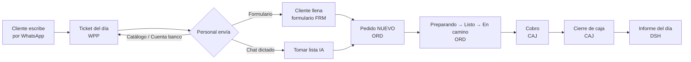
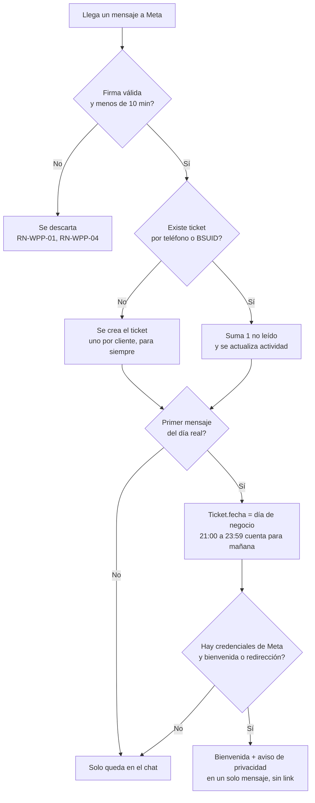
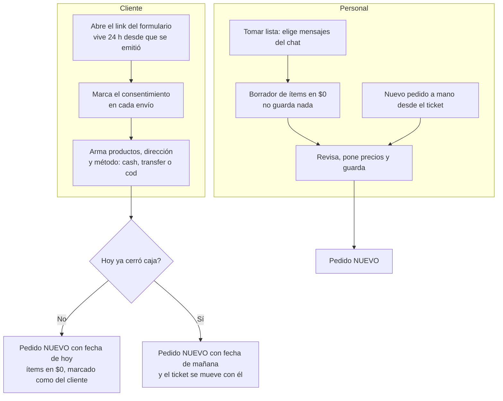
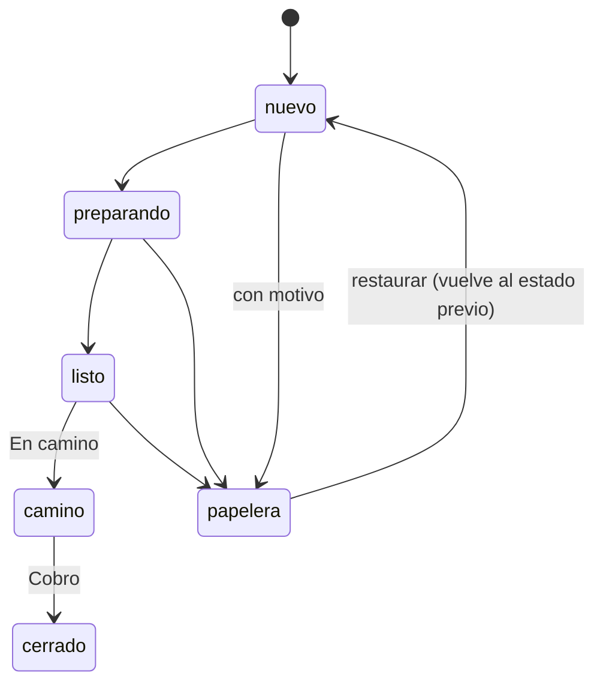
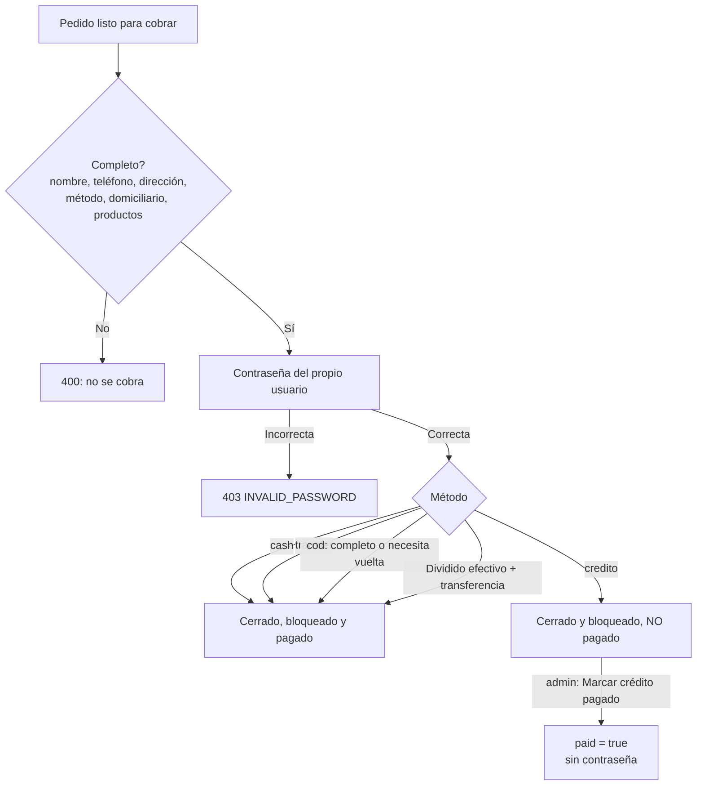
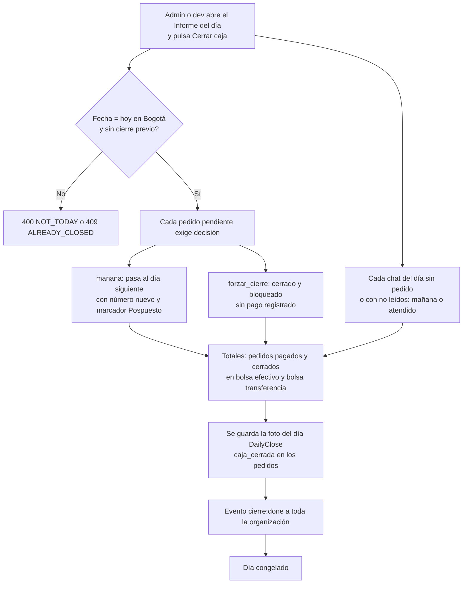

# Ciclo diario

Recorrido de un día de negocio, de punta a punta. Esta spec **no define reglas nuevas**: resume las de los módulos y enlaza al dueño de cada paso. Si algo difiere, gana el módulo. Horas en Bogotá (UTC-5, sin horario de verano).

## 1. Vista general

| Paso | Módulo dueño |
|---|---|
| Mensaje entrante, ticket, día, bienvenida | `modulos/WPP.md` |
| Chat del personal, enviar formulario / catálogo / cuenta banco | `modulos/INB.md`, `modulos/CAT.md` |
| Formulario del cliente | `modulos/FRM.md` |
| Tomar lista | `modulos/IA.md` |
| Pedido, estados, tablero, papelera | `modulos/ORD.md` |
| Cobro y cierre de caja | `modulos/CAJ.md` |
| Informe | `modulos/DSH.md` |
| Recibo PDF | `modulos/FAC.md` |

## 2. El cliente escribe: ticket, día y bienvenida

Reglas que hay que tener presentes:
- **Un ticket por cliente para siempre** (teléfono o BSUID). Un cliente que vuelve semanas después continúa el mismo ticket (RN-WPP-06).
- **"Primer mensaje del día" se decide con el día calendario real** (desde las 00:00), sin corte; lo que sí tiene corte a las **21:00** es la `Ticket.fecha`: un primer mensaje entre 21:00 y 23:59 cuenta para el tablero de mañana (RN-WPP-09, RN-WPP-10). El corte **nunca** cambia la fecha de un pedido ni el día de cierre (RN-WPP-11).
- **La bienvenida** sale solo en el primer mensaje del día; el **aviso de privacidad** va una sola vez por ticket, pegado a la bienvenida. Si la organización tiene mensaje de redirección, se envía solo ese texto (RN-WPP-12 a RN-WPP-14).
- **El link del formulario nunca sale solo** (RN-WPP-15).
- Si Meta rechaza un saliente, queda guardado con `failed_reason` (la X roja del chat). Hoy hay un incidente de facturación de Meta que hace fallar todos los salientes (RN-WPP-17).
- **Zona roja:** en el tablero de hoy, un ticket sin pedido pasados 20 minutos, o con pedido abierto, se marca como urgente (RN-ORD-30).

## 3. El personal responde y conduce al pedido

Desde el ticket, el personal (cualquier rol con acceso al chat) puede, en un día no pasado ni cerrado:

| Botón | Qué envía | Regla |
|---|---|---|
| **Formulario** | Tres mensajes en orden: aviso previo, el link y el seguimiento. Genera un token nuevo que mata cualquier link anterior. | RN-WPP-26, RN-INB-18 |
| **Cuenta banco** | La plantilla `bank_account` del negocio. | RN-WPP-27 |
| **Catálogo** | Imagen o producto del catálogo con precios de referencia. | `modulos/CAT.md` |
| **Bloquear Link** | Revoca el link del cliente (y las facturas del ticket). | RN-INB-19 |

Los botones "Formulario" y "Cuenta banco" se desactivan si el día es anterior a hoy o su caja ya cerró (RN-WPP-28). Al contestar, los no leídos del chat pasan a 0; abrir un chat sin contestar no los borra (RN-INB-08, RN-INB-09).

## 4. Del chat al pedido

Hay tres caminos; todos terminan en un pedido `nuevo` en el tablero.

- **Formulario (FRM):** sin cuenta, solo para su propio ticket; sin consentimiento responde 400; todo ítem nuevo entra en **$0** (el precio lo pone el encargado); máximo **3 pedidos del formulario por ticket y día**; puede editar o borrar su pedido mientras esté `nuevo`, `preparando` o `listo` y sin bloquear. Borrar no cambia el estado: el pedido queda señalado en rojo (RN-FRM-10, 11, 18, 20, 24, 25). Si el cliente edita, el pedido queda marcado "el cliente lo tocó" de forma permanente (RN-ORD-15).
- **Tomar lista (IA):** admin y encargado, 1 a 50 mensajes de texto del cliente, hasta 15 extracciones por minuto por usuario. La IA **nunca** crea ni guarda un pedido ni pone precios (RN-IA-02, 04, 05, 06).
- **Pedido a mano (ORD):** siempre desde un ticket; solo el nombre y un ítem son obligatorios (RN-ORD-10, RN-ORD-34).
- **Numeración:** cada pedido recibe el menor número libre del día, de tres dígitos (`001`, `002`…), contando también los de papelera (RN-ORD-01, RN-ORD-02).

## 5. Preparación y reparto

- El tablero tiene una fila por ticket del día y columnas Nuevo, Preparando, Listo, En camino y Cerrado. El pedido solo se arrastra dentro de la fila de su cliente, y no si el día está cerrado, está bloqueado, en papelera o es un "fantasma" (RN-ORD-28, RN-ORD-29).
- Un pedido se puede abrir incompleto; solo se exige completo al **cobrar** (RN-ORD-10, RN-CAJ-03).
- La **papelera** exige motivo, no quita la tarjeta del tablero y se puede restaurar (RN-ORD-18 a 20). Todo cambio queda en el historial inmutable (RN-ORD-24).
- Las **observaciones** se pueden agregar siempre, incluso con el día cerrado; solo su autor las edita (RN-ORD-22, 23).
- **Recibo PDF:** se arma en el navegador desde lo que muestra la pantalla y se envía con un link de 24 h; en cuanto el pedido cambia, el link muere (RN-FAC-10, RN-FAC-12, RN-ORD-16).

## 6. Cobro

- Métodos: `sin_asignar` (no se puede cobrar), `cash` ("Pagado en tienda"), `transfer`, `cod` ("Cobro en casa") y `credito`. El cliente final solo puede elegir `cash`, `transfer` o `cod` (RN-CAJ-01).
- En **cobro en casa** el personal elige "Completo" o "Necesita vuelta" al crear o editar el pedido, para que el domiciliario sepa cuánta vuelta lleva (RN-CAJ-05). **Pago dividido:** las dos partes suman exacto el total (RN-CAJ-06).
- **Un solo cobro por pedido:** el segundo da 409 (RN-CAJ-08). Después del cobro solo admin/dev editan el pedido, hasta el cierre (RN-CAJ-11).
- **Correcciones (solo admin):** "Marcar crédito pagado" y "Cobro retroactivo" para un cerrado sin cobro que sí se cobró (RN-CAJ-09, RN-CAJ-10).
- Un crédito saldado después no suma en los totales del cierre ni del informe; la regla está pendiente de definir (`03-plan/preguntas-abiertas.md`).

## 7. Cierre de caja

- Solo se cierra **hoy**, **una vez** por día. Si falta decisión sobre algún pendiente: 400 `MISSING_DECISIONS` con la lista (RN-CAJ-12 a 14). Las decisiones sobre chats las exige la interfaz, no la API (RN-CAJ-18).
- **Pasar a mañana** renumera: sigue después del mayor número que ya tenga mañana (o `001`) y deja un "fantasma" atenuado en el día de origen con la etiqueta "Pospuesto" y su número viejo (RN-CAJ-16, RN-CAJ-17).
- **Totales:** solo cuentan pedidos de la fecha pagados y cerrados que el cliente no eliminó; `cash` y `cod` van a efectivo, `transfer` a transferencia, y el pago dividido reparte cada parte a su bolsa (RN-CAJ-19).
- **Congelamiento:** con `DailyClose` creado, crear, editar, mover y cobrar pedidos de esa fecha dan 409 `DAY_CLOSED`, admin incluido; solo se pueden agregar observaciones. Un pedido nuevo del formulario del cliente pasa a mañana (RN-CAJ-21, RN-FRM-18). Solo `dev` puede reabrir un día (RN-CAJ-24).

## 8. Informe del día

El admin ve en vivo (se refresca cada 30 s y con cada evento): conteos de pedidos y chats, recaudado por bolsa, cerrados sin cobro en rojo, papelera, créditos de todas las fechas y los últimos 300 cambios. Los números salen de los pedidos actuales, no de la foto del cierre. Con el día cerrado ofrece "Descargar CSV". El día 1 de cada mes muestra la franja de recordatorio del pago de la plataforma (RN-DSH-02, 06, 08, 11, 12, 13, 16, 17).

## 9. Línea de tiempo de un día

El cierre lo decide el personal; no hay hora fija. La tabla muestra qué pasa y cuándo, con lo que está en las reglas.

| Hora (Bogotá) | Qué ocurre | Módulo |
|---|---|---|
| 00:00 | Cambia el día calendario real: el siguiente mensaje de cada cliente cuenta como "primer mensaje del día" y dispara la bienvenida. Los pedidos nuevos toman la fecha de hoy. | WPP, ORD |
| 03:00 | Respaldo diario de la base hacia R2 (08:00 UTC). | `04-operacion/runbooks.md` |
| Mañana en adelante | Llegan mensajes; se crean tickets; el personal envía formulario, catálogo y cuenta de banco; los pedidos aparecen y pasan por Nuevo, Preparando, Listo y En camino. | WPP, INB, FRM, ORD |
| Durante el día | Cobros con contraseña; el admin mira el informe. Un ticket sin atender 20 minutos entra a zona roja. | CAJ, DSH, ORD |
| Cuando el negocio termina | Cierre de caja: decisiones de cada pendiente, totales, foto del día y congelamiento. | CAJ |
| Después del cierre | Solo observaciones sobre ese día; los pedidos nuevos del formulario caen en mañana. | CAJ, FRM |
| 21:00 a 23:59 | Un primer mensaje del día cuenta para el tablero de **mañana** (`Ticket.fecha`); el pedido que se cree de noche sigue con la fecha real de hoy. | WPP |
| 24 h después de emitidos | Mueren los links de formulario y los de factura. | INB, FAC |

El "4 a. m." que se mencionó como referencia no corresponde a ninguna regla del código; la única tarea programada que las specs registran es el respaldo de las 03:00.

## 10. Trampas del día a día

- **Chat que escribe después del cierre:** el cierre pasa un chat a mañana con `deferred_to`; si ese cliente escribe otra vez hoy, el ticket sale de "mañana" (RN-WPP-08; ver la pregunta abierta de WPP en `03-plan/preguntas-abiertas.md`).
- **Dos días distintos:** `Ticket.fecha` (con corte 21:00) no es `Order.fecha` (sin corte). Un chat de las 22:00 aparece mañana, pero su pedido de las 22:30 es de hoy y entra en el cierre de hoy.
- **Mensajes con más de 10 minutos de retraso** se descartan sin rastro salvo un aviso en el log (RN-WPP-04).
- **Pedido "Pospuesto" y su fantasma:** no se mueve ni se cuenta en el cierre del día de origen (RN-CAJ-17).
