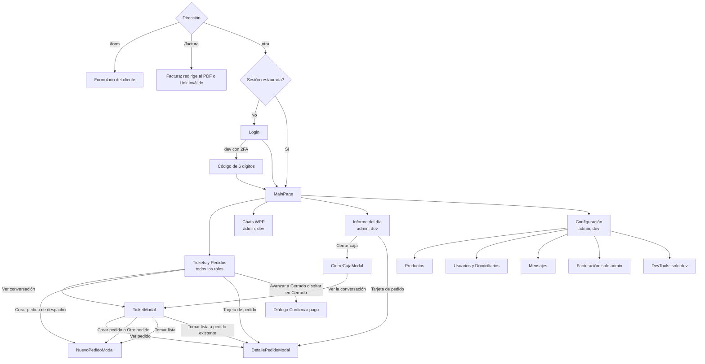

# Pantallas y navegación por rol

> **Resumen.** Catálogo de lo que cada persona ve y puede tocar en la web de 4Client: el mapa de navegación (inicio de sesión, cuatro pestañas, ventanas), qué pestañas, secciones de configuración y botones de las ventanas de chat y pedido ve cada rol y cuándo se deshabilitan, una ficha por pantalla (para qué sirve, qué muestra, acciones, módulo dueño de las reglas, estados y comportamiento en celular) y los pasos de las pantallas del cliente final (formulario y factura). Cierra con las diferencias entre lo que ofrece la interfaz y lo que permite la API, con su PREG o DT. No define reglas nuevas: resume las de los módulos y gana siempre el módulo dueño; para permisos de API gana `actores-y-permisos.md`. Lo más importante: la **API es la autoridad**; la interfaz oculta pestañas por rol, pero varios botones se muestran a quien la API luego rechaza (PREG-012).

Términos en `glosario.md`. Convención: "admin" incluye a `dev` salvo que se diga lo contrario (herencia de `dev`, `actores-y-permisos.md`).

## 1. Mapa de navegación

`App.tsx` no usa enrutador: decide por la dirección. `/form` y `/factura` son públicas y **no intentan restaurar sesión** (RN-ACC-24); cualquier otra dirección intenta restaurar la sesión y muestra `MainPage` (hay token en memoria) o `LoginPage`.

Reglas transversales del marco (`MainPage`):
- **Encabezado:** logo (hoy fijo, DT-002), insignia roja "DEV" si el entorno es de desarrollo, las pestañas que el rol puede ver, nombre y etiqueta de rol ("Dev", "Administrador", "Encargado", "Domiciliario") y "Salir".
- **Una sola lista de pestañas** alimenta la fila horizontal y el menú hamburguesa de celular: un rol sin acceso no ve la pestaña en ninguna de las dos presentaciones (RN-ACC-24 y comentario de `MainPage`).
- **Franja roja del día 1** (admin y dev, en todas las pestañas): "Hoy es día 1 - recuerda pagar la suscripción…" (RN-DSH-16).
- **Fecha:** el selector de fecha del tablero y el del informe comparten el mismo estado; cambiar de pestaña conserva el día.
- **Tiempo real:** un socket se une a la sala de la organización y a la del día; los eventos de pedidos, mensajes y cierre invalidan las consultas (RN-ORD-36, RN-ORD-37, RN-CAJ-22).
- **Sesión:** la web cierra la sesión tras 1 hora sin actividad y al salir limpia toda la caché (RN-ACC-19, RN-ACC-22).

## 2. Visibilidad por rol

### 2.1 Pestañas y secciones

| Elemento | admin | encargado | domiciliario | dev | Cliente final |
|---|:-:|:-:|:-:|:-:|:-:|
| Pestaña Tickets y Pedidos | Sí | Sí | Sí | Sí | No |
| Pestaña Chats WPP | Sí | No | No | Sí | No |
| Pestaña Informe del día | Sí | No | No | Sí | No |
| Pestaña Configuración | Sí | No | No | Sí | No |
| Config > Productos | Sí | No | No | Sí | No |
| Config > Usuarios (con Domiciliarios) | Sí | No | No | Sí | No |
| Config > Mensajes | Sí | No | No | Sí | No |
| Config > Facturación (solo lectura) | Sí | No | No | **No** (a propósito) | No |
| Config > DevTools | No | No | No | Sí | No |
| Franja del día 1 | Sí | No | No | Sí | No |
| Formulario `/form` y factura `/factura` | — | — | — | — | Sí (con link vivo) |

Al abrir Configuración, `dev` cae en DevTools (subpestaña "Base de datos"); los demás en Productos. DevTools tiene seis subpestañas: Organizaciones, Base de datos, WhatsApp, Facturación, Sistema y Links; el selector de organización objetivo solo aparece en Base de datos y Facturación (`modulos/PLT.md`).

### 2.2 Botones del encabezado de chat

`TicketModal`, `DetallePedidoModal` (cuando el pedido tiene ticket) y `NuevoPedidoModal` repiten la misma fila, en este orden (RN-INB-27). La bandeja "Chats WPP" **no** la tiene: solo responder, adjuntar y reenviar.

| Botón | Quién lo ve | Se deshabilita cuando | Efecto |
|---|---|---|---|
| Cuenta banco | admin, encargado, domiciliario, dev | `isPastDay`, plantillas aún sin cargar, envío en curso | Envía la plantilla `bank_account` (RN-WPP-27) |
| Formulario | admin, encargado, domiciliario, dev | `isPastDay`, plantillas sin cargar, envío en curso | Pide link nuevo y envía tres mensajes (RN-WPP-26) |
| Bloquear Link | admin, encargado, domiciliario, dev | `isPastDay`, bloqueo en curso | Revoca el link del cliente y sus facturas, previa confirmación (RN-INB-19) |
| Eliminar datos | **solo dev** | Solo mientras se ejecuta; **no** depende de `isPastDay` | Anonimiza al cliente, previa confirmación (RN-INB-22, D-17) |
| Enviar catálogo | admin, encargado, domiciliario, dev | `isPastDay`, envío en curso | Catálogo completo, una categoría o un producto (RN-CAT-13) |
| Tomar lista | admin, encargado, dev (**no** domiciliario) | `isPastDay` | Entra al modo de selección de mensajes (RN-IA-01, RN-IA-14) |

`isPastDay` es verdadero si el día es anterior a hoy **o** su caja ya cerró. El día que se compara es la fecha del tablero desde donde se abrió la ventana (`TicketModal`, `NuevoPedidoModal`) o la fecha del pedido (`DetallePedidoModal`). Es solo de interfaz: la API no lo exige (PREG-030, RN-ORD-33). Si la caja se cierra mientras alguien está en modo Tomar lista, la interfaz sale del modo sola (RN-IA-14). En celular la fila se vuelve un menú hamburguesa (sección 4.1).

### 2.3 Acciones del detalle de pedido por rol

| Acción | admin / dev | encargado | domiciliario | Condición |
|---|:-:|:-:|:-:|---|
| Ver el detalle y el cuadro "Pedido cerrado y cobrado" | Sí | Sí | Sí | Cualquier pedido |
| Editar campos y productos, Guardar | Sí | Sí | **Se muestra; la API da 403** | No `readOnly` (sección 3.7); Guardar deshabilitado sin cambios o con precio negativo |
| Editar un pedido bloqueado | Sí | No (mensaje "Solo el administrador…") | No | Solo si el día no cerró (RN-ORD-13, RN-CAJ-11) |
| Mover pedido (botones de estado) | Sí | Sí | **Se muestra; 403** | No `readOnly` y no bloqueado |
| Papelera / Restaurar | Sí | Sí | No se muestra | Papelera exige motivo (RN-ORD-18) |
| Agregar observación | Sí | Sí | **Se muestra; 403** | Siempre, también con día cerrado (RN-ORD-22) |
| Historial de cambios y campo "Vuelto" | Sí | Sí | No se muestra | Solo `canManage` (RN-ORD-26) |
| Marcar crédito pagado | Sí | No se muestra | No | Pedido `credito` sin pagar (RN-CAJ-09) |
| Marcar como cobrado (retroactivo) | Sí | No se muestra | No | Cerrado, bloqueado, sin pagar, no crédito (RN-CAJ-10) |
| Copiar y PDF | Sí | Sí | Sí | Con productos; deshabilitados con precio negativo |
| Enviar factura | Sí | Sí | Sí | Con productos y ticket; deshabilitado en `camino`, `entregado` o `cerrado` (RN-FAC-03) |
| Confirmar pago (cobro) | Sí | Sí | **Se muestra; 403** | Ver 3.2: se abre desde el tablero |

## 3. Pantallas, una por una

### 3.1 Inicio de sesión (`LoginPage`)
- **Para qué:** entrar con correo y contraseña. Módulo dueño: `ACC`.
- **Muestra:** logo, campos "Correo" y "Contraseña" (con ojo), botón "Ingresar al sistema"; insignia "DEV" en entornos de desarrollo.
- **Estados:** cualquier fallo (clave errónea, correo inexistente, **cuenta bloqueada 429**, red) muestra el mismo texto "Usuario o contraseña incorrectos" (RN-ACC-11, RN-ACC-13): el bloqueo no se distingue en pantalla. Con campos vacíos: "Ingresa usuario y contraseña" (aunque el campo se llama Correo, PREG-063).
- **2FA (solo dev, `REQUIRE_2FA`):** segunda pantalla con código de 6 dígitos "Vence en 5 minutos"; aquí sí se muestran mensajes específicos; si el código venció o la cuenta se bloqueó vuelve a las credenciales (RN-ACC-16). "Volver a iniciar sesión" reenvía un código nuevo.

### 3.2 Tickets y Pedidos (el tablero, `Swimlane`)
- **Para qué:** vista del día: una fila por cliente (ticket) con columnas Nuevo, Preparando, Listo, En camino y Cerrado. Dueño: `ORD` (tickets y orden: `INB`).
- **Muestra:** título con "N pedidos · M pendientes", selector de fecha, buscador (por cliente, teléfono, domiciliario, dirección, producto o monto), la zona roja, la banda "Día cerrado - vista de solo lectura" y las filas con "Ver conversación" y "Crear pedido de despacho".
- **Tarjeta de pedido:** número, cronómetro (en Nuevo), etiqueta "Formulario" o "Encargado" según el origen, "Pagado", campana roja si el cliente tocó el pedido, "Pospuesto", "Eliminado por el cliente", "Enviado a papelera por …" (RN-ORD-31).
- **Acciones:** abrir el ticket o el pedido; crear pedido; ◀ ▶ y arrastre dentro de la fila del mismo cliente (RN-ORD-29). **Avanzar a Cerrado, o soltar en Cerrado, no cambia el estado: abre el diálogo "Confirmar pago"** (no hay otro botón de cobro, tampoco dentro del detalle). Dueño del cobro: `CAJ`.
- **Diálogo Confirmar pago:** casilla "¿Pago dividido…?" (efectivo + transferencia, deben sumar el total), "¿Quién recibió el pago?" (el usuario de la sesión, no editable), contraseña propia obligatoria; lista en rojo "Falta completar antes de cerrar: …" y el botón queda deshabilitado hasta que no falte nada (RN-CAJ-02, RN-CAJ-03, RN-CAJ-06).
- **Zona roja:** solo al ver hoy. Un ticket con pedido abierto entra de inmediato; uno sin pedido, pasados 20 minutos desde que se creó el ticket (RN-ORD-30, PREG-016).
- **Estados:** día cerrado, fantasma, bloqueado, papelera o eliminado por el cliente: la tarjeta no se arrastra ni avanza y se avisa con un aviso (toast) si se intenta. Pedido en papelera sigue dibujado en su columna de origen (RN-ORD-19).
- **Celular:** la rejilla conserva un ancho mínimo (688 a 880 px según el ancho) y se desplaza horizontalmente.

### 3.3 Chats WPP (`InboxPanel`)
- **Para qué:** bandeja con todas las conversaciones de la organización, buscar y responder. Dueño: `INB`. Solo admin y dev (D-09).
- **Muestra:** a la izquierda la lista (máximo 500 chats, ordenados por última actividad) con buscador por nombre, número o texto del mensaje y filtro por fecha; a la derecha el chat con los últimos 500 mensajes, "cargar anteriores" y un botón de ir al último mensaje.
- **Acciones:** responder (Enter envía), adjuntar foto, audio, video o documento, reenviar un mensaje a 1 a 20 chats, abrir el lápiz de renombrar (apagado, `RENAME_TICKET_UI_ENABLED`, PREG-091). No tiene Formulario, Cuenta banco, catálogo ni Tomar lista: eso vive en el ticket del tablero.
- **Estados:** "Sin conversaciones", "Sin resultados". Los no leídos solo se limpian al responder, no al abrir (RN-INB-08, RN-INB-09). Mensaje con X roja: Meta rechazó el envío (3.9). Imagen, audio, video o documento que ya no se puede traer (Meta guarda 30 días) muestra "No se pudo cargar la imagen" (o el equivalente por tipo): no distingue vencido de error de red.
- **Celular (hasta 768 px):** una sola columna; al elegir un chat se oculta la lista y aparece "Volver a la lista".

### 3.4 Ticket (`TicketModal`)
- **Para qué:** conversación de un cliente más sus pedidos de la fecha del tablero. Dueño: `INB` (botones: `WPP`, `CAT`, `IA`).
- **Muestra:** dos columnas. Izquierda (660 px): encabezado verde con nombre, teléfono, número de mensajes y la fila de botones (2.2), aviso rojo si el ticket llegó sin número de WhatsApp ("no se puede responder"), mensajes con recibos, caja de respuesta. Derecha: pedidos de esa fecha (estado, total, domiciliario, pago) con "Ver pedido #N", y "Crear pedido" u "Otro pedido".
- **Acciones:** responder, adjuntar, reenviar, Tomar lista (selecciona mensajes, "Montar lista", "Deseleccionar todo", "Cancelar"; resultado en 3.8), y los botones de 2.2. Se refresca por socket y cada 30 s.
- **Estados:** sin pedidos: "Este ticket aún no tiene pedido. El cliente está esperando atención." Desde el cierre de caja se abre sin manejadores de pedido: Tomar lista se puede usar pero sus ítems se pierden (PREG-047).
- **Celular (hasta 680 px):** carrusel de dos páginas (chat y pedidos) con desplazamiento lateral y la pista "N pedidos · desliza ›"; los botones pasan a un menú hamburguesa y aparece una × propia en el chat.

### 3.5 Nuevo pedido (`NuevoPedidoModal`)
- **Para qué:** crear un pedido a mano desde un ticket (siempre desde un ticket: "El pedido debe crearse desde un ticket de WhatsApp", RN-ORD-34). Dueño: `ORD`.
- **Muestra:** chat embebido a la izquierda (con su fila de botones) y a la derecha "Crear pedido desde ticket": nombre (obligatorio), teléfono (deshabilitado, es el del ticket), dirección (opcional; solo se exige al cobrar), método de pago, "¿Cómo paga el cliente?" si es cobro en casa, domiciliario y productos con buscador (`ProductSearch`); un precio por línea que se digita (el catálogo es solo referencia, RN-ORD-05).
- **Acciones:** buscar y agregar productos, Tomar lista (puede llegar con ítems ya precargados), Crear. Botón deshabilitado con precio negativo o creación en curso.
- **Estados:** si el día cerró, la API responde 409 `DAY_CLOSED`.

### 3.6 Detalle de pedido (`DetallePedidoModal`)
- **Para qué:** ver y editar un pedido; es el único lugar de edición, observaciones, papelera, factura y correcciones. Dueño: `ORD`; cobro y correcciones: `CAJ`; factura: `FAC`.
- **Muestra:** con ticket, chat a la izquierda (660 px) y pedido a la derecha (ancho máximo 1420 px); sin ticket, solo el pedido (700 px). Avisos: "Pedido cerrado y cobrado" (quién, hora, total, recibido, vuelto), "Este cliente tiene un pedido a crédito no pagado", "El cliente eliminó este pedido desde el formulario" (con ventana de decisión Mantener eliminado o Restaurar), "Enviado a papelera" (por, hora, motivo), "Este día ya fue cerrado - vista de solo lectura" y "Solo el administrador puede modificar este pedido cerrado".
- **Solo lectura (`readOnly`):** pedido bloqueado y usuario sin rol admin/dev, día cerrado, papelera o eliminado por el cliente. Se deshabilitan campos y desaparecen Guardar, Mover y Papelera; las observaciones siguen (RN-ORD-32). "Mover pedido" y "Papelera" también se ocultan en cualquier pedido bloqueado, admin incluido, porque la API lo rechaza.
- **Acciones:** ver 2.3. El diálogo de papelera exige un motivo no vacío. La campana roja avisa que el cliente cambió el pedido por el formulario y no se quita al guardar (RN-ORD-15).
- **Teléfono:** editable solo si el pedido no tiene ticket o el ticket no tiene número real (RN-ORD-12).
- **Teclado:** flechas entre campos y botones (RN-ORD-35).

### 3.7 Informe del día (`ResumenTab`)
- **Para qué:** panorama en vivo del día del administrador y cierre de caja. Dueño: `DSH`; cierre: `CAJ`.
- **Muestra:** conteos de pedidos y chats, tarjetas "Recaudado efectivo", "Recaudado transferencia" y "Total recaudado" con los cerrados sin cobro en rojo, y cuatro pestañas: Pedidos, Papelera, Crédito (con subpestañas No pagados y Pagados y buscador; trae todas las fechas) y Cambios (últimos 300). Se refresca cada 30 s y con cada evento (RN-DSH-17).
- **Acciones:** "Cerrar caja" (habilitado solo si la fecha es hoy; otro día muestra el botón gris con la razón), "Bloquear todos los links" (previa confirmación; no depende de la fecha), y con el día cerrado "Caja ya cerrada" (con quién cerró) y "Descargar CSV". Tarjetas de papelera y crédito abren el detalle; restaurar desde papelera.
- **Estados:** un crédito saldado después aparece en Crédito > Pagados y no suma en los totales (D-19, RN-CAJ-19).

### 3.8 Cierre de caja (`CierreCajaModal`)
- **Para qué:** cerrar el día decidiendo qué pasa con cada pendiente. Dueño: `CAJ`.
- **Muestra:** "Resumen de ventas" (efectivo y cobro en casa, transferencia, total), "Pedidos completados", y "Pedidos y chats pendientes - decide qué hacer", con un selector por pedido (Pasar a mañana o Cerrar sin cobro) y por chat sin pedido o con no leídos (Pasar a mañana o Marcar como atendido). "Ver la conversación" abre el ticket. Un atajo pasa todos los pedidos a mañana.
- **Acciones:** Cancelar, CSV y "Cerrar caja". El CSV y el cierre quedan deshabilitados hasta decidir todo (la API no exige las decisiones de chats; la interfaz sí, RN-CAJ-18). Las decisiones elegidas se guardan como borrador local si se cierra la ventana.
- **Resultado:** pantalla "Caja cerrada correctamente. Ya no se puede modificar." con "Descargar CSV del cierre". El cierre **no pide contraseña**.
- **Error:** 400 `MISSING_DECISIONS` se muestra como "Faltan decisiones: <números>".

### 3.9 Mensajes con recibos y adjuntos
- Cada mensaje saliente lleva un recibo: una marca gris (enviado), doble gris (entregado), doble azul (leído) o un círculo rojo de advertencia con "No se pudo entregar: <motivo>" (Meta lo rechazó; RN-WPP-16, RN-WPP-17). Los recibos nunca retroceden (RN-WPP-21).
- Multimedia, ubicación y documentos tienen visor propio (`ChatImage`, `ChatAudio`, `ChatVideo`, `ChatDocument`, `ChatLocation`); se piden en vivo a Meta con el token de la sesión (RN-INB-17, RN-INB-31).

### 3.10 Configuración
Pestaña de admin y dev (`ConfigTab`). Las reglas están en el módulo indicado.

| Sección | Qué muestra y permite | Módulo |
|---|---|---|
| Productos | Lista por categoría con buscador; crear, editar, desactivar, interruptor de existencia, precio de referencia; botones "Excel" (descarga) y "Subir precios" (solo `.xlsx`; avisa cuántas filas se ignoraron) | `CAT` |
| Usuarios | Crear usuario (el formulario ofrece Encargado y Domiciliario), editar, restablecer contraseña, desactivar o reactivar; la lista no incluye cuentas `dev` | `ACC` |
| Domiciliarios (bajo Usuarios) | Personas sin login para asignar a pedidos: nuevo, editar, desactivar; "No hay domiciliarios registrados." | `ACC` (RN-ACC-23) |
| Mensajes | Bienvenida ("Vacío = desactivado") y tres plantillas (aviso al enviar el formulario, seguimiento, cuenta bancaria); cada una se guarda por separado y no deja guardar un texto vacío | `WPP` (RN-WPP-23 a 25) |
| Facturación | Cobros de plataforma de su organización, más reciente primero, con PDF; solo lectura. "Todavía no hay facturas registradas." | `PLT` (RN-PLT-15) |
| DevTools | Seis subpestañas (2.1): visor de base de datos de cualquier organización, altas de organización, WhatsApp de la propia organización, cobros de plataforma, sistema y enlaces | `PLT` |

### 3.11 Formulario del cliente final (`/form?t=<token>`)
Pantalla pública y sin cuenta, hecha para celular. Dueño: `FRM`. Pasos:

1. **Carga y validación del link.** Mientras consulta muestra "Cargando". Un link vencido (24 h desde su emisión, se haya abierto o no), revocado, reemplazado por uno más nuevo o bloqueado por la organización muestra el mismo "Link inválido" con el motivo genérico, sin decir cuál fue (RN-FRM-01, RN-FRM-02). Sin conexión: "No se pudo conectar. Verifica tu internet e intenta de nuevo."
2. **Consentimiento primero.** Una pantalla "Antes de continuar" con la casilla "Leí y acepto la Política de Privacidad de <negocio>" y enlace a la política. Marcarla revela el formulario; **se pide otra vez en cada envío**, también al editar un pedido ya hecho, porque se desmarca tras enviar (RN-FRM-26, RN-FRM-27). Sin consentimiento la API responde 400 `CONSENT_REQUIRED`.
3. **Encabezado y aviso.** Nombre del negocio y "Hola, <nombre>"; franja fija: este link es solo para hacer y seguir pedidos y nunca se piden dinero, datos bancarios ni información confidencial. Si edita, "Editando tu pedido #N".
4. **Pedido objetivo.** La página apunta al **primer pedido editable** del día (estado nuevo, preparando o listo, creado por formulario, sin bloquear y no eliminado) y precarga sus productos, dirección y método; si no hay, empieza uno nuevo (RN-FRM-29). Un pedido que armó el personal solo se ve, no se edita.
5. **Dirección** (obligatoria) y **método de pago** (opcional): Transferencia, En tienda o Cobro en casa. El cliente no elige completo ni vuelta; eso lo define el personal (RN-CAJ-05).
6. **Productos.** Catálogo por categoría con buscador; cada producto se agrega con cantidad y unidad (Kilo por defecto; Libra, Unidad, Paquete, Bulto, Bandeja, Canasta, "Pesos $"; RN-FRM-28). También puede escribir un producto que no está en el catálogo, que queda marcado para revisión. **No ve precios**: todo ítem nuevo entra en $0 y el personal lo pone después (RN-FRM-11).
7. **Repetir mi último pedido.** Solo en un pedido nuevo y vacío, si hay un pedido anterior con productos aún disponibles: carga los productos sin precios (RN-FRM-07).
8. **Borrador local.** Cada cambio se guarda en el navegador por token y se descarta pasadas 24 h o al enviar; sin almacenamiento local (modo privado) funciona sin persistir (RN-FRM-30).
9. **Sondeo cada 5 s.** Actualiza el catálogo y el estado de sus pedidos sin tocar lo que escribe; si su pedido deja de ser editable (por ejemplo pasó a "En camino") muestra una advertencia roja y deshabilita el envío (RN-FRM-31).
10. **Barra inferior fija.** "Debe haber al menos un producto" si está vacío; contador de productos; "Eliminar pedido" (confirma; en un pedido real lo marca eliminado por el cliente, en un borrador solo limpia lo local); "Enviar pedido" (protegido contra doble toque). Errores propios: límite de 3 pedidos por día ("Alcanzaste el límite…"), demasiados envíos por minuto, link caducado, pedido que ya no se puede modificar (RN-FRM-13, RN-FRM-20).
11. **Pantallas finales.** "¡Pedido enviado!" con "Ver mi pedido", o "Pedido eliminado correctamente" con "Hacer un pedido". Si el día ya cerró, el pedido nuevo cae en mañana sin que el cliente lo note (RN-FRM-18). Por WhatsApp recibe la confirmación (RN-FRM-22).

### 3.12 Factura del cliente (`/factura?f=<archivo>`)
Pantalla pública. Consulta el estado del link y, si está vivo, **redirige al PDF** para que lo abra el visor del navegador. Si no: tarjeta roja "Link inválido" con el motivo del servidor (bloqueado, vencido a las 24 h, no encontrado) o "Link inválido." sin parámetro. Se muere al editar el pedido, bloquear el link o pasadas 24 h (RN-FAC-10, RN-FAC-12). Dueño: `FAC`.

### 3.13 Piezas comunes
- **Aviso (toast):** mensaje verde o rojo durante unos 3 segundos.
- **Banner de actualización (PWA):** avisa de una versión nueva; en el formulario del cliente recarga de inmediato (`UpdateBanner`, RN-ACC-26).
- **Confirmaciones:** ventanas Sí/No para acciones destructivas (bloquear link, eliminar datos, desactivar, bloquear todos).

## 4. Reglas de presentación

### 4.1 Celular
| Ancho | Qué cambia |
|---|---|
| hasta 1180 y 900 px | El tablero reduce columnas y paddings; mantiene scroll horizontal |
| hasta 768 px | Chats WPP pasa a una columna (lista o chat con "Volver") |
| hasta 680 px | `TicketModal` se vuelve carrusel de dos páginas (chat y pedidos) con pista "desliza ›", × propia y botones en menú hamburguesa; el detalle y el nuevo pedido usan el mismo menú para su fila de botones |
| hasta 560 px | La fila de pestañas se reemplaza por un **menú hamburguesa** (con punto rojo si hay chats sin leer), mismos ítems y mismo filtro por rol; la etiqueta de rol se oculta; las ventanas pasan a una columna y los botones de acción a ancho completo |

### 4.2 Ventanas y tipografía (RN-INB-27)
- **Columna de chat de 660 px** en las tres ventanas con chat; la ventana de ticket completa mide hasta 1110 px, la del detalle con chat hasta 1420 px, una ventana simple (`.mwin`) hasta 640 px.
- **Título de ventana 16 px** (`.mtit`), subtítulo 12 px, **campos y etiquetas de las ventanas 13 px** (`.mwin .fi`, `.fi2`); el campo de formulario simple es 15 px fuera de ventanas.
- Encabezado verde del chat con la fila de botones en el orden de 2.2; cerrar con × o tocando fuera de la ventana.
- Colores de estado fijos: rojo para urgente, eliminado y error; verde para completado y pagado; azul para "Pospuesto".

## 5. Interfaz frente a API

Gana la API (`actores-y-permisos.md`). Diferencias verificadas, con su pendiente:

| Caso | La interfaz | La API | Pendiente |
|---|---|---|---|
| Domiciliario en pedidos | Muestra Guardar, Mover, observaciones, ◀ ▶, arrastre y Confirmar pago | 403 | PREG-012 (`modulos/ORD.md`) |
| Encargado y cierre de caja | Sin botón (vive en el Informe, que no ve) | Lo permite | PREG-008 |
| Encargado y Chats WPP | Sin pestaña; sí abre el chat desde el ticket, lee 500 mensajes, reenvía a cualquier chat y bloquea links | 403 solo en `GET /inbox` | PREG-040 |
| Días pasados o caja cerrada | Deshabilita Formulario, Cuenta banco, Bloquear Link, catálogo y Tomar lista | Acepta enviar siempre | PREG-030 |
| Renombrar ticket | Botón apagado | Admin y dev pueden | PREG-091 |
| Crear admin | El formulario solo ofrece encargado y domiciliario | Acepta `admin` | `modulos/ACC.md` (RN-ACC-04) |
| Desactivarse a sí mismo | El botón aparece en la fila propia | 400 `SELF_DEACTIVATE` | PREG-062 |
| Nombre de usuario | Se captura y se muestra | No sirve para entrar; el login es por correo | PREG-063 |
| Enviar factura | Oculto o deshabilitado en `camino`, `cerrado`, sin ticket o sin productos | `POST /invoice` acepta todo | PREG-080 |
| Cobrar papelera o eliminado por el cliente | No se puede abrir el cobro | La API cobra | PREG-010 |
| Tomar lista en pedido de solo lectura | Botón activo, sin Guardar | Solo extrae, no escribe | PREG-049 |
| Tomar lista desde el cierre de caja | Botón activo; los ítems se pierden | — | PREG-047 |
| WhatsApp de la organización | Solo `dev` en DevTools; el admin edita solo la bienvenida y plantillas | `/config/wpp` abierto a admin | PREG-127 |
| Decisiones de chats en el cierre | Obligatorias | Opcionales | RN-CAJ-18 (`modulos/CAJ.md`) |
| Logo fijo del primer cliente en el encabezado | Siempre el mismo logo | — | DT-002 |
| Multimedia vencida | "No se pudo cargar…" genérico | 404 `MEDIA_EXPIRED` | RN-INB-17 / RN-INB-31 |

## 6. Pendientes

Todos viven en `03-plan/`: PREG-008, PREG-010, PREG-012, PREG-016, PREG-030, PREG-040, PREG-047, PREG-049, PREG-062, PREG-063, PREG-080, PREG-091, PREG-127, DT-002.
