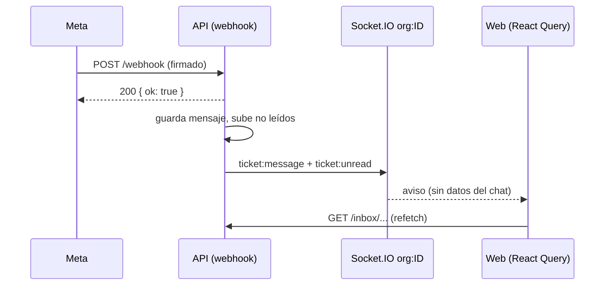

# API y eventos

> **Resumen.** La API es REST bajo `/api/v1` (87 endpoints, 5 niveles de acceso) más Socket.IO para avisar a las pantallas abiertas. Los eventos son solo avisos: la web invalida su caché y vuelve a pedir los datos por HTTP.

Catálogo completo de endpoints HTTP y eventos Socket.IO. Los parámetros y cuerpos de cada ruta están en su código (`apps/api/src/routes/<archivo>.ts`); aquí va quién puede llamarla, a qué módulo pertenece y para qué existe. Los códigos de error que devuelven están en `codigos-de-error.md`.

## 1. Endpoints HTTP

**Total: 87 endpoints.** Son 85 registros `fastify.get|post|put|patch|delete(...)` en los 15 archivos de `apps/api/src/routes/` más 2 rutas en línea en `apps/api/src/server.ts` (`/health` y `/api/v1/wpp/status`). No se cuenta `OPTIONS *` de `public.ts`, que solo responde 204 al preflight CORS.

Reparto por módulo: ACC 13 · WPP 7 · INB 20 · FRM 6 · ORD 9 · CAJ 6 · DSH 1 · CAT 5 · FAC 3 · PLT 17.

**Notación de roles** (`middleware/auth.ts`; `dev` pasa toda verificación de rol):

| Notación | Quién | En el código |
|---|---|---|
| `public` | Sin sesión de personal (puede exigir token de link, firma de Meta o cookie) | sin `authenticate` |
| `auth` | Cualquier rol con sesión: admin, encargado, domiciliario, dev | `authenticate` |
| `gestión` | admin + encargado + domiciliario + dev (el domiciliario pasa donde pasa el encargado, `middleware/auth.ts › requireRole`; decisión de José 2026-10-10) | `requireRole('admin', 'encargado')` |
| `admin` | admin + dev | `requireRole('admin')` o `requireRole('admin', 'dev')` |
| `dev` | solo dev | `requireRole('dev')` |

**Límites:** el rate limit global es 300/min por usuario autenticado (o por IP sin sesión); la columna "Límite" solo muestra lo que difiere. El cuerpo máximo por defecto de Fastify es 1 MiB; se indica cuando una ruta lo sube.

### ACC — Cuentas y acceso

| Método | Ruta | Rol | Límite | Para qué |
|---|---|---|---|---|
| POST | `/api/v1/auth/login` | public | 10/min | Correo + contraseña. Entrega access token y cookie `rf`, o pide el código 2FA si el usuario es `dev` y `REQUIRE_2FA` está activo. |
| POST | `/api/v1/auth/login/verify-code` | public | 20/min | Segundo paso del 2FA con el código enviado por correo. |
| POST | `/api/v1/auth/refresh` | public (cookie `rf` + `X-Requested-With`) | 20/min | Rota el refresh token y entrega un access token nuevo. Detecta reutilización (`TOKEN_REUSE_DETECTED`). |
| POST | `/api/v1/auth/logout` | auth | — | Revoca el refresh token y borra la cookie. |
| GET | `/api/v1/auth/me` | auth | — | Perfil del usuario en sesión. |
| GET | `/api/v1/users` | admin | — | Usuarios del negocio (un admin no ve cuentas `dev`). |
| POST | `/api/v1/users` | admin | — | Crea un usuario en el negocio. |
| PATCH | `/api/v1/users/:id` | admin | — | Cambia nombre, rol o activo; desactivar revoca sesiones y corta sus sockets. |
| POST | `/api/v1/users/:id/reset-password` | admin | — | Fija una contraseña nueva; revoca sesiones y sockets. |
| GET | `/api/v1/employees` | auth | — | Domiciliarios (empleados sin login) para asignar. |
| POST | `/api/v1/employees` | admin | — | Crea un domiciliario. |
| PATCH | `/api/v1/employees/:id` | admin | — | Edita un domiciliario. |
| DELETE | `/api/v1/employees/:id` | admin | — | Borrado suave (`active = false`). |

### WPP — WhatsApp y configuración

| Método | Ruta | Rol | Límite | Para qué |
|---|---|---|---|---|
| GET | `/api/v1/webhook` | public | — | Handshake de verificación de Meta (`hub.verify_token`). |
| POST | `/api/v1/webhook` | public (firma HMAC si hay `META_APP_SECRET`) | 2000/min | Mensajes y estados de entrega entrantes. Responde 200 antes de procesar. |
| GET | `/api/v1/config/message-templates` | auth | — | Textos efectivos de los botones del chat (personalizados o por defecto). |
| PUT | `/api/v1/config/message-templates` | admin | — | Edita las plantillas del negocio. |
| GET | `/api/v1/config/org` | admin | — | Configuración del negocio (sin secretos). |
| PATCH | `/api/v1/config/wpp` | admin | — | Credenciales de Meta, teléfono, bienvenida y mensaje de número redirigido. `409 PHONE_ID_ALREADY_IN_USE` si el número ya es de otro negocio. |
| GET | `/api/v1/wpp/status` | auth | — | Si el negocio tiene credenciales de Meta (`connected` / `not_configured`). En línea en `server.ts`. |

### INB — Chats y tickets

| Método | Ruta | Rol | Límite | Para qué |
|---|---|---|---|---|
| GET | `/api/v1/tickets` | auth | — | Tickets del día para el tablero (por `fecha` o `deferred_to`). |
| POST | `/api/v1/tickets` | auth | — | Crea un ticket manual o reactiva hoy el existente con ese teléfono. |
| PATCH | `/api/v1/tickets/:id` | admin | — | Corrige nombre o teléfono del ticket y lo propaga a sus pedidos. |
| GET | `/api/v1/inbox` | admin | — | Bandeja completa de Chats WPP. |
| GET | `/api/v1/inbox/forward-targets` | auth | — | Lista mínima de chats para elegir destino de un reenvío. |
| GET | `/api/v1/inbox/search` | admin | — | Búsqueda en todo el historial (texto, nombre, teléfono). |
| GET | `/api/v1/inbox/:ticketId/messages` | auth | — | Chat de un ticket y sus pedidos (del día, si se pasa `fecha`). |
| GET | `/api/v1/inbox/:ticketId/messages/older` | auth | — | Página anterior del chat (cursor). |
| POST | `/api/v1/inbox/:ticketId/reply` | auth | — | Responde texto. El envío a Meta ocurre después de responder; el resultado llega por `ticket:message-status`. |
| POST | `/api/v1/inbox/messages/:messageId/forward` | auth | 20/min | Reenvía un mensaje a 1–20 chats. |
| POST | `/api/v1/inbox/:ticketId/send-image` | auth | 60/min; JPEG/PNG/WebP hasta 5 MB | Envía una foto. |
| POST | `/api/v1/inbox/:ticketId/send-audio` | auth | 60/min; hasta 16 MB | Envía un audio. |
| POST | `/api/v1/inbox/:ticketId/send-video` | auth | 60/min; hasta 16 MB | Envía un video. |
| POST | `/api/v1/inbox/:ticketId/send-document` | auth | 60/min; PDF hasta 100 MB | Envía un documento. |
| GET | `/api/v1/inbox/media/:token` | auth | — | Trae en vivo de Meta la multimedia de un mensaje (`MEDIA_EXPIRED` tras 30 días). |
| GET | `/api/v1/inbox/:ticketId/form-link` | auth | — | Genera el link del formulario e invalida el anterior. |
| POST | `/api/v1/inbox/:ticketId/form-link/revoke` | auth | — | "Bloquear link" del ticket. |
| POST | `/api/v1/inbox/form-links/block-all` | admin | — | "Bloquear todos" los links del negocio. |
| POST | `/api/v1/inbox/:ticketId/erase-data` | dev | — | Borrado de datos del cliente (Ley 1581): anonimiza ticket y pedidos, borra mensajes. |
| POST | `/api/v1/inbox/:ticketId/parse-messages` | gestión | 15/min | "Tomar lista": la IA extrae productos de mensajes elegidos. No escribe en la base. |

Los tamaños de multimedia son del archivo decodificado; el `bodyLimit` de cada ruta es ese tamaño × 1,4 + 100 000 bytes (base64 dentro de JSON).

### FRM — Formulario público del cliente

Todas `public`, con token de link (`t`) obligatorio (el `device_token` que mandaban las páginas anteriores se ignora). Responden con `Access-Control-Allow-Origin: *`.

| Método | Ruta | Rol | Límite | Para qué |
|---|---|---|---|---|
| GET | `/api/v1/public/link-status` | public | — | Dice si el link sirve antes de mostrar nada (bloqueado, vencido, agotado). |
| GET | `/api/v1/public/form-info` | public | — | Datos del cliente y sus pedidos activos del día del link (el día calendario de Bogotá en que se envió). |
| GET | `/api/v1/public/products` | public | — | Catálogo sin precios, con `in_stock` (el formulario marca "NO HAY" en los agotados). |
| GET | `/api/v1/public/last-order` | public | — | Último pedido anterior al día del link o cerrado de ese día, para "repetir". |
| POST | `/api/v1/public/submit` | public | 15/min por IP | Crea un pedido (con `fecha` = día calendario de Bogotá en que se envió el link, pasando al siguiente si ese día ya cerró) o lo fusiona con el activo editable; exige consentimiento. La fusión con un pedido de un día cerrado responde `409 DAY_CLOSED`; un pedido nuevo en día cerrado pasa a mañana. |
| POST | `/api/v1/public/order/:orderId/delete` | public | 15/min por IP | El cliente elimina su pedido: queda `client_deleted`, sin cambiar `status` (`409 DAY_CLOSED` si su día ya cerró caja). |

### ORD — Pedidos

| Método | Ruta | Rol | Límite | Para qué |
|---|---|---|---|---|
| GET | `/api/v1/orders` | auth | — | Pedidos de un día, incluidos los pospuestos desde ese día. |
| POST | `/api/v1/orders` | gestión | — | Crea un pedido (rechaza un día cerrado). |
| GET | `/api/v1/orders/:id` | auth | — | Pedido con ítems, historial y observaciones. |
| PATCH | `/api/v1/orders/:id` | gestión | — | Edita datos e ítems (reemplaza todas las líneas); un pedido bloqueado solo lo edita admin. En un pedido ya cobrado acepta `payment_breakdown: { cash, transfer }` (solo admin), obligatorio si cambian el método o el total (RN-CAJ-26 a RN-CAJ-28). |
| POST | `/api/v1/orders/:id/observations` | gestión | — | Agrega una observación (también con día cerrado). |
| PATCH | `/api/v1/orders/:id/observations/:obsId` | gestión | — | Edita una observación propia (`403 NOT_AUTHOR` si no). |
| DELETE | `/api/v1/orders/:id/observations/:obsId` | gestión | — | Borra una observación propia. |
| PATCH | `/api/v1/orders/:id/status` | gestión | — | Mueve el estado en el tablero o lo manda a papelera con motivo. |
| PATCH | `/api/v1/orders/:id/restore` | gestión | — | Restaura desde papelera o desde "eliminado por el cliente" (`409 DAY_CLOSED` con el día cerrado). |

Todas las rutas de esta tabla y de la de CAJ que modifican un pedido responden `409 DAY_CLOSED` si su día tiene caja cerrada, salvo las observaciones y `credito-pagado` (RN-CAJ-21, `lib/dayClose.ts`).

### CAJ — Cobro, crédito y cierre

| Método | Ruta | Rol | Límite | Para qué |
|---|---|---|---|---|
| POST | `/api/v1/orders/:id/cobro` | gestión | — | Cobra con la contraseña del usuario; cierra y bloquea el pedido (`409 ORDER_LOCKED` si ya estaba; `409 ORDER_IN_PAPELERA` / `ORDER_CLIENT_DELETED` si está eliminado). |
| PATCH | `/api/v1/orders/:id/credito-pagado` | admin | — | Marca pagado un crédito y guarda cuándo (`credit_paid_at`); no toca `paid_at`/`paid_by`. También con el día cerrado. |
| PATCH | `/api/v1/orders/:id/cobro-retroactivo` | admin | — | Marca pagado un pedido cerrado sin cobro por error (solo con el día abierto, es decir, reabierto por `dev`). |
| GET | `/api/v1/cierre/status` | auth | — | Si un día está cerrado. |
| GET | `/api/v1/cierre/preview` | admin | — | Vista previa de solo lectura del cierre: totales por bolsa y cada pedido del día con su clase, con la misma regla que `POST /cierre` y `GET /dashboard` (`lib/cierreTotals.ts`). La usa el modal de cierre. |
| POST | `/api/v1/cierre` | admin | — | Cierre de caja: exige decisión por pedido pendiente, guarda `DailyClose` y congela el día. Solo admin/dev (PREG-008, 2026-10-10). |

### DSH — Informe

| Método | Ruta | Rol | Límite | Para qué |
|---|---|---|---|---|
| GET | `/api/v1/dashboard` | admin | — | Informe del día: totales, chats, papelera, créditos, historial. |

### CAT — Catálogo

| Método | Ruta | Rol | Límite | Para qué |
|---|---|---|---|---|
| GET | `/api/v1/products` | auth | — | Catálogo del negocio. |
| POST | `/api/v1/products` | admin | — | Crea un producto. |
| PATCH | `/api/v1/products/bulk-price` | admin | — | Actualiza precios en lote (importación de Excel). |
| PATCH | `/api/v1/products/:id` | admin | — | Edita un producto (incluye existencias). |
| DELETE | `/api/v1/products/:id` | admin | — | Borrado suave. |

### FAC — Facturas

| Método | Ruta | Rol | Límite | Para qué |
|---|---|---|---|---|
| POST | `/api/v1/files/invoice` | auth | 20/min; cuerpo hasta 29 MB | Guarda el PDF de la factura (base64) y devuelve el link para el cliente. |
| GET | `/api/v1/files/:filename/status` | public | — | Si el link de factura sigue vivo, antes de mostrar la descarga. |
| GET | `/api/v1/files/:filename` | public | — | Descarga la factura (el nombre no adivinable es la llave). |

### PLT — Plataforma (consola dev y facturación)

Todo `/api/v1/dev/*` pasa por `authenticate` + `requireRole('dev')` en un hook del archivo, y puede actuar sobre **cualquier** organización (`orgId` explícito).

| Método | Ruta | Rol | Límite | Para qué |
|---|---|---|---|---|
| GET | `/api/v1/dev/db` | dev | — | Visor de tablas permitidas, por organización. |
| POST | `/api/v1/dev/seed` | dev | — | Carga datos base. Prohibido si `APP_ENVIRONMENT_NAME=production`. |
| GET | `/api/v1/dev/env-status` | dev | — | Qué variables opcionales están definidas (solo sí/no). |
| GET | `/api/v1/dev/storage-test` | dev | — | Prueba real de subida a R2. |
| GET | `/api/v1/dev/health` | dev | — | Salud extendida con ping a la base. |
| GET | `/api/v1/dev/organizations` | dev | — | Todas las organizaciones. |
| POST | `/api/v1/dev/organizations` | dev | — | Alta de un negocio nuevo con su admin. |
| POST | `/api/v1/dev/actions/reopen-cierre` | dev | — | Reabre un día borrando su `DailyClose` (queda foto en `audit_logs`). |
| POST | `/api/v1/dev/actions/create-test-ticket` | dev | — | Crea un ticket con mensajes de prueba, sin enviar nada por WhatsApp. |
| GET | `/api/v1/dev/charges` | dev | — | Cobros de plataforma (filtros opcionales). |
| POST | `/api/v1/dev/charges` | dev | — | Crea un cobro pendiente. |
| POST | `/api/v1/dev/charges/:id/pdf` | dev | cuerpo hasta 6 MB | Adjunta el PDF del cobro. |
| PUT | `/api/v1/dev/charges/:id` | dev | — | Edita conceptos, mes, valores y notas. |
| DELETE | `/api/v1/dev/charges/:id` | dev | — | Borra un cobro. |
| PATCH | `/api/v1/dev/charges/:id` | dev | — | Marca pagado o pendiente. |
| GET | `/api/v1/billing/charges` | admin | — | Cobros de plataforma del propio negocio (solo lectura). |
| GET | `/health` | public | — | Healthcheck sin prefijo, sin base; exento de HTTPS obligatorio. En línea en `server.ts`. |

### Rate limits que difieren del global

| Ruta | Límite | Clave |
|---|---|---|
| `POST /auth/login` | 10/min | IP |
| `POST /auth/login/verify-code`, `POST /auth/refresh` | 20/min | IP |
| `POST /files/invoice`, `POST /inbox/messages/:messageId/forward` | 20/min | usuario |
| `POST /inbox/:ticketId/send-image|audio|video|document` | 60/min | usuario |
| `POST /inbox/:ticketId/parse-messages` | 15/min | usuario |
| `POST /public/submit`, `POST /public/order/:orderId/delete` | 15/min | IP explícita (`keyGenerator: req.ip`, `hook: 'preHandler'`) |
| `POST /webhook` | 2000/min | IP |

La clave "usuario" es el `userId` del JWT verificado (`server.ts › keyGenerator`); sin sesión válida cae a la IP.

### Cómo regenerar esta tabla

```sh
# 85 rutas de archivos (método, ruta relativa al prefijo, preHandler en línea)
grep -nE "fastify\.(get|post|put|patch|delete)\(" apps/api/src/routes/*.ts | sed -E 's/async.*//'
grep -nE "fastify\.(get|post|put|patch|delete)\(" apps/api/src/routes/*.ts | wc -l
# prefijos por archivo y rutas en línea
grep -n "register(.*Routes\|fastify\.get(" apps/api/src/server.ts
# roles puestos por hook a todo un archivo (dev.ts, billing.ts)
grep -n "addHook('preHandler'" apps/api/src/routes/*.ts
# rutas con opciones en varias líneas: revisar preHandler/config/bodyLimit a mano
grep -nE "rateLimit|bodyLimit" apps/api/src/routes/*.ts
```

## 2. Socket.IO

### Conexión y salas (`apps/api/src/plugins/socket.ts`)

- El servidor Socket.IO comparte el puerto HTTP de Fastify. CORS: los orígenes de `FRONTEND_URL`, métodos GET/POST. El cliente solo usa transporte `websocket` (`apps/web/src/lib/socket.ts`).
- **Autenticación en el handshake:** token en `handshake.auth.token` (o cabecera `Authorization: Bearer`), verificado con `fastify.jwt.verify`. Sin token → "No autorizado". Token inválido o **sin `userId`/`role`** (token de link de formulario) → "Token inválido".
- **Vencimiento:** al conectar se programa una desconexión para el instante `exp` del JWT (15 min). El cliente refresca y reconecta en `connect_error`.
- **Revocación:** cada socket entra solo a `user:<userId>`; `fastify.disconnectUserSockets(userId)` lo corta cuando se desactiva el usuario o se le cambia la contraseña (`routes/users.ts`).

| Sala | Cómo se entra | Uso |
|---|---|---|
| `user:<userId>` | Automática al conectar | Solo para desconectar al usuario. |
| `org:<orgId>` | Evento `join:org` con el `orgId` propio; otro `orgId` se ignora en silencio | **Todos** los eventos de servidor se emiten aquí. |
| `org:<orgId>:date:<fecha>` | Evento `join:date` (el `orgId` sale del token) | Nadie emite a esta sala hoy. |

Eventos cliente → servidor: `join:org(orgId)` y `join:date(fecha)`. `MainPage` los emite al montar, en cada `connect` (reconexión) y al cambiar la fecha. No hay acuse de recibo.

### Eventos servidor → cliente (`packages/shared/src/types/socket.types.ts › ServerToClientEvents`)

| Evento | Payload | Emite (API) | Escucha (web) |
|---|---|---|---|
| `order:created` | `Order` | `orders.ts › POST /`; `public.ts › POST /submit` (pedido nuevo) | `MainPage` |
| `order:updated` | `Order` (+ banderas de cambio del cliente) | `orders.ts › PATCH /:id`, `POST/PATCH/DELETE /:id/observations…`, `PATCH /:id/status`, `PATCH /:id/restore`; `public.ts › POST /submit` (fusión) y `POST /order/:orderId/delete`; `tickets.ts › PATCH /:id` (solo `{ id }`) | `MainPage`, `InboxPanel`, `TicketModal`, `DetallePedidoModal` |
| `order:moved` | `{ orderId, newStatus }` | `orders.ts › PATCH /:id/status`, `PATCH /:id/restore` (solo si venía de papelera) | `MainPage`, `InboxPanel`, `TicketModal`, `DetallePedidoModal` |
| `order:paid` | `{ orderId }` | `orders.ts › POST /:id/cobro`, `PATCH /:id/credito-pagado`, `PATCH /:id/cobro-retroactivo` | `MainPage`, `InboxPanel`, `TicketModal`, `DetallePedidoModal` |
| `ticket:message` | `{ ticketId, message: TicketMessage }` | `webhook.ts` (entrantes y respuestas automáticas); `inbox.ts › reply`, `forward`, `send-image|audio|video|document`; `public.ts › POST /submit` (mensajes automáticos del pedido) | `MainPage`, `InboxPanel`, `TicketModal`, `NuevoPedidoModal`, `DetallePedidoModal` |
| `ticket:message-status` | `{ ticketId, messageId, delivered, read_by_client, failed_reason }` | `webhook.ts › statuses` de Meta; `inbox.ts` tras el envío en segundo plano (id de Meta guardado o fallo) | `InboxPanel`, `TicketModal`, `NuevoPedidoModal`, `DetallePedidoModal` |
| `ticket:unread` | `{ ticketId, count }` | `webhook.ts` (sube el contador); `inbox.ts` al responder, reenviar o enviar multimedia, solo si había no leídos (`count: 0`; abrir el chat no los borra) | `MainPage` |
| `cierre:done` | `{ fecha }` | `cierre.ts › POST /` | `MainPage` (invalida todas las fechas) |
| `product:changed` | `{ id }` o `{ bulk: true }` | `products.ts › POST /`, `PATCH /:id`, `DELETE /:id`, `PATCH /bulk-price` | `useProducts` |
| `message-templates:changed` | sin payload | `config.ts › PUT /message-templates` | `useMessageTemplates` |

Flujo típico (mensaje entrante de WhatsApp):



Reglas de uso:
- **Los eventos son avisos, no datos.** Todos los oyentes solo invalidan consultas de React Query y vuelven a pedir por HTTP (claves en `arquitectura.md` §8). Por eso `tickets.ts` puede emitir `order:updated` con solo `{ id }` aunque el tipo diga `Order`. *(código)*
- Un evento perdido (socket caído) no se reenvía; la vista se corrige en el siguiente refetch (`staleTime` 30 s) o al reconectar. *(código)*
- Una ruta nueva que cambie pedidos, tickets, productos o plantillas **debe emitir** el evento que corresponda a `org:<orgId>`, o las otras pantallas abiertas no se enteran. *(código)*
- Los eventos de pago no tienen equivalente de "ticket": `TicketModal` y `DetallePedidoModal` escuchan `order:*` directamente para refrescar el pedido abierto. *(código)*

## 3. Pendientes

- **PREG-093 — Sala por fecha sin uso.** `join:date` une a `org:<orgId>:date:<fecha>`, pero ningún emisor la usa: todo va a `org:<orgId>` y cada pantalla filtra al refrescar. ¿Se elimina o se planea usarla?
- **PREG-094 — `order:updated` con payload incompleto** desde `tickets.ts › PATCH /:id` (`{ id }` con `as any`). Hoy no rompe nada porque nadie lee el payload; ¿se ajusta el tipo o el emisor?
