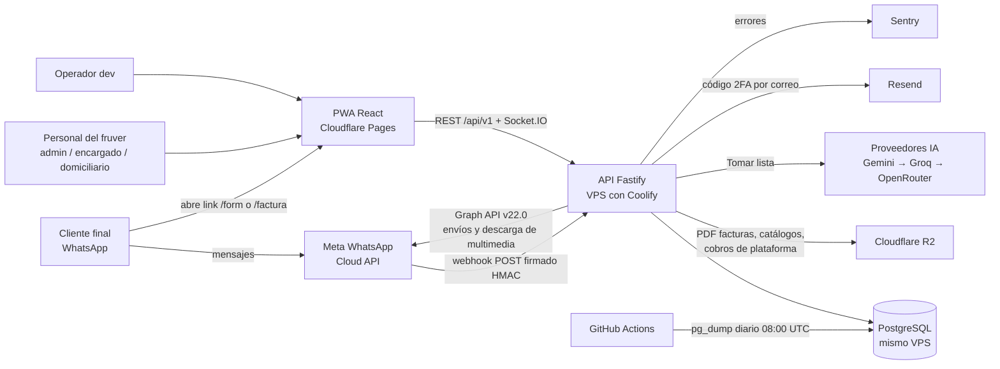
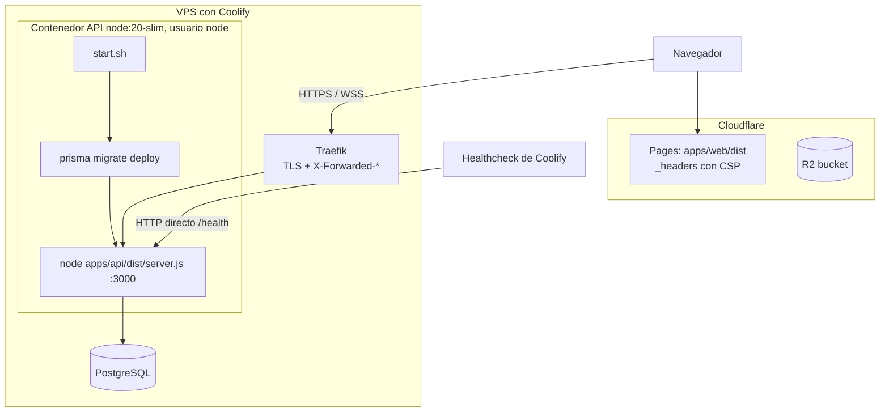

# Arquitectura

> **Resumen.** 4Client es un monolito: una API Fastify (Node 20, un solo contenedor en un VPS con Coolify) con PostgreSQL y Socket.IO, más una PWA React publicada en Cloudflare Pages. Los servicios externos son Meta (WhatsApp), Cloudflare R2, proveedores de IA, Resend y Sentry. Sin colas, sin microservicios ni caché externa: la simplicidad es deliberada (`00-horizonte.md`).

Cómo está armado el sistema, qué corre dónde y las convenciones que no se ven leyendo un solo archivo. El detalle de endpoints y eventos está en `api-y-eventos.md`; el modelo de datos en `datos-y-migraciones.md` y `modelo-de-datos.md` (diagramas); la observabilidad y continuidad en `04-operacion/observabilidad-y-continuidad.md`; el despliegue paso a paso en `04-operacion/`.

## 1. Contexto del sistema (C4 nivel 1)

Actores: el cliente final (solo WhatsApp y los links `/form` y `/factura`), el personal del negocio y el operador `dev`. Todo lo demás son sistemas externos.

Notas que no salen del diagrama:
- **El webhook responde 200 antes de procesar.** `apps/api/src/routes/webhook.ts › POST /` valida la firma, envía `{ ok: true }` y recién entonces recorre `entry[].changes[]`. Un error en el procesamiento no hace que Meta reintente. *(código)*
- **La multimedia del chat no se guarda**: la API pide los bytes a Meta en vivo cada vez (`inbox.ts › GET /media/:token`). Meta la retiene 30 días; después responde `MEDIA_EXPIRED`. *(código)*
- **R2 es opcional.** Si faltan `R2_ACCOUNT_ID`/`R2_ACCESS_KEY_ID`/`R2_SECRET_ACCESS_KEY`, `services/storage.ts › storage.isConfigured` es falso y `files.ts` escribe en `apps/api/uploads/` (disco del contenedor, se pierde en cada deploy). *(código)*
- **IA:** `services/ai/index.ts › PROVIDERS` encadena Gemini → Groq → OpenRouter y salta el que no tenga clave. Cerebras está comentado (respondía 402). Sin ninguna clave, "Tomar lista" falla con error claro sin tumbar el servidor. *(código)*
- **Correo:** Resend solo se usa para el código de verificación del login `dev` (`services/email.ts`). *(código)*
- **Backup:** `.github/workflows/backup-prod-db.yml` hace `pg_dump` diario fuera del VPS, a propósito independiente de la infraestructura. *(código)*

## 2. Contenedores y red (C4 nivel 2)

Cuatro piezas propias: la PWA (estática, en el borde de Cloudflare), el contenedor de la API, PostgreSQL y el bucket R2. Un solo proceso de API atiende REST y WebSocket; por eso Socket.IO no usa adaptador. Con más de una réplica de la API las salas dejarían de verse entre procesos (hoy no se prevé; el horizonte no lo exige).

- **Imagen** (`Dockerfile`): `node:20-slim` + `openssl`, `pnpm@10` vía corepack, `pnpm install --frozen-lockfile`, `prisma generate`, `tsc` de la API. Corre como el usuario no-root `node`. Solo se construye la API; la web la construye Cloudflare Pages. *(código)*
- **Arranque** (`start.sh`): `prisma migrate deploy` y luego `exec node`. **Cada arranque aplica las migraciones pendientes**, también en producción (ver principio 1 y `datos-y-migraciones.md`). Si una migración falla, el contenedor no arranca. *(código)*
- **Ambientes:** dev y prod son despliegues separados (API + base aislada cada uno). La web elige a cuál hablar por el hostname (ver §7). *(código, inferido de `apiBase.ts` y README)*

## 3. Monorepo

| Ruta | Qué es |
|---|---|
| `apps/api` | API Fastify + Prisma. `src/routes` (un archivo por recurso), `src/plugins` (prisma, socket), `src/middleware/auth.ts`, `src/lib` (reglas compartidas: fechas, numeración, links, cifrado), `src/services` (Meta, IA, R2, correo), `prisma/` (schema + migraciones), `test/` (Vitest contra Postgres real). |
| `apps/api/src/seed*.ts`, `update-org-wpp.ts`, `reencrypt-wpp-tokens.ts` | Scripts sueltos que se corren a mano con `tsx`; no forman parte del servidor. |
| `apps/web` | PWA React. `src/pages` (4 pantallas), `src/components/<área>`, `src/hooks`, `src/lib`, `src/store`. |
| `packages/shared` | Solo tipos TypeScript (`src/types/*.types.ts`): payload del JWT, roles, eventos Socket.IO. Se consume como fuente (`main: ./src/index.ts`), sin build. |
| `pnpm-workspace.yaml` | `apps/*`, `packages/*`. |

**Scripts de mantenimiento** (`apps/api/src`, se corren a mano con `tsx` desde `apps/api`; nada los ejecuta solo ni el despliegue) *(código)*:

| Script | Qué hace | Trampas |
|---|---|---|
| `seed.ts` (`pnpm db:seed`) | Crea o actualiza (upsert) la organización de ejemplo, un admin, un dev y productos. Exige `SEED_ADMIN_PASS` y `SEED_DEV_PASS`; sin ellas termina | Usa datos del cliente real; solo para bases locales. Nunca en producción (allí `POST /dev/seed` responde 403). |
| `seed-chats.ts` | Crea chats de ejemplo | Fecha fija 2026-06-27 (PREG-110). |
| `seed-wpp.ts` | Copia `META_PHONE_NUMBER_ID`, `META_ACCESS_TOKEN` y `META_APP_SECRET` a la primera organización, cifrados con `encryptSecret` | Toma `findFirst()` sin orden: depende de qué organización exista. Teléfono de prueba fijo. |
| `update-org-wpp.ts` | Actualiza `wpp_meta_phone_id` y `wpp_meta_token` de la organización con slug del primer cliente, leyendo el token de la variable `META_TOKEN` | `META_TOKEN` no está en `config.ts` (la lee directo de `process.env`); el slug y el `phone_id` están fijos en el código (DT-001). |
| `reencrypt-wpp-tokens.ts` | Migración única: re-cifra con el formato actual (`enc:v2:`, clave derivada por organización) los `wpp_meta_token` y `wpp_meta_app_secret` que sigan en claro o en `enc:v1:`. Exige `WPP_TOKEN_ENC_KEY` | Idempotente: lo que ya es `enc:v2:` no se toca. |
| `test-prisma.ts`, `test-wpp-save.ts` (en `apps/api/`, fuera de `src`) | Pruebas manuales sueltas; no son parte de la suite de Vitest | No se ejecutan en CI. |

## 4. Stack (versiones resueltas en `pnpm-lock.yaml`)

| Capa | Paquete | Versión |
|---|---|---|
| Runtime | Node (imagen y CI) | 20 |
| Gestor | pnpm | 10 |
| API | `fastify` | 5.12.5 |
| | `@fastify/cookie` / `cors` / `helmet` / `jwt` / `rate-limit` | 11.1.1 / 11.3.0 / 13.1.1 / 10.2.0 / 11.1.0 |
| | `fastify-plugin` | 6.0.0 |
| | `@prisma/client` y `prisma` | 5.22.0 |
| | `socket.io` | 4.8.3 |
| | `zod` | 3.25.76 |
| | `bcrypt` | 5.1.1 |
| | `@aws-sdk/client-s3` (R2) | 3.1075.0 |
| | `@sentry/node` | 10.62.0 |
| | `typescript` / `tsx` / `vitest` | 5.9.3 / 4.22.4 / 4.1.11 |
| Web | `react` / `react-dom` | 18.3.1 |
| | `@tanstack/react-query` | 5.101.0 |
| | `zustand` | 5.0.14 |
| | `socket.io-client` | 4.8.3 |
| | `vite` / `@vitejs/plugin-react` | 6.4.3 / 4.7.0 |
| | `vite-plugin-pwa` / `workbox-window` | 0.21.2 / 7.4.1 |
| | `jspdf` | 4.2.1 |
| | `xlsx` (tarball de cdn.sheetjs.com, no npm) | 0.20.3 |
| | `lucide-react` | 1.18.0 |
| Base | PostgreSQL | ver PREG-092 |

`package.json › pnpm.overrides` fuerza versiones mínimas de dependencias transitivas por avisos de seguridad (`ws`, `tar`, `find-my-way`, `fast-uri`, `socket.io-parser`, `engine.io`, `dompurify`, `postcss`, `nanoid`, `browserslist`, `brace-expansion`). `onlyBuiltDependencies` limita los scripts de instalación a Prisma, bcrypt y esbuild. Quitar un override sin revisar el aviso que lo motivó reabre el hallazgo. *(código)*

## 5. API: arranque, plugins y hooks globales

Orden en `apps/api/src/server.ts › start` (importa: cada plugin ve lo registrado antes):

1. `Sentry.init` (solo si hay `SENTRY_DSN`, `tracesSampleRate` 0.2) — antes de crear Fastify.
2. `Fastify({ logger, trustProxy })`: log `warn` en producción, `info` en el resto, `pino-pretty` solo en development.
3. Hook `onRequest` de HTTPS, hook `onSend` de HSTS y `setErrorHandler` (detalle abajo).
4. `@fastify/cookie` → `@fastify/helmet` (defaults) → `@fastify/cors` → `@fastify/jwt` → `@fastify/rate-limit`.
5. `plugins/prisma.ts` (un `PrismaClient`, `$disconnect` en `onClose`) → `plugins/socket.ts` (Socket.IO sobre el mismo servidor HTTP).
6. Las 15 familias de rutas con prefijo `/api/v1/<recurso>` y luego las dos rutas en línea (`/health`, `/api/v1/wpp/status`).

Comportamientos globales:

| Qué | Regla | Por qué / trampa |
|---|---|---|
| `trustProxy` | `(_address, hop) => hop === 0`: solo se confía en la entrada de `X-Forwarded-For`/`-Proto` que pone quien está conectado al socket (Traefik). | Con `true`, cualquiera falsificaba `X-Forwarded-For` y obtenía un balde de rate limit nuevo por petición. Si algún día se pone otro proxy delante de Traefik (p. ej. Cloudflare proxy), `req.ip` pasará a ser la IP de ese proxy. *(código)* |
| HTTPS obligatorio | Si `NODE_ENV=production` y `req.protocol !== 'https'` → 400 `HTTPS_REQUIRED`, **excepto `/health`** (el healthcheck de Coolify entra por HTTP directo al contenedor). | `req.protocol` sale de `X-Forwarded-Proto` gracias a `trustProxy`. *(código)* |
| HSTS | `onSend` agrega `Strict-Transport-Security: max-age=31536000; includeSubDomains; preload` a toda respuesta. | *(código)* |
| Errores no controlados | Responden `{ error, code }` con `code = error.code ?? 'SERVER_ERROR'`. En producción, si el status es ≥ 500, el mensaje se reemplaza por "Error interno del servidor". Se reportan a Sentry si está configurado. | Un `z.parse` (no `safeParse`) que falla no trae `statusCode` y termina en 500 enmascarado. *(código)* |
| CORS | Orígenes = `FRONTEND_URL` separado por comas. Cabeceras permitidas: `Content-Type`, `Authorization`, `X-Requested-With`; `credentials: true`. | `X-Requested-With` es la defensa CSRF de `/auth/refresh`. Las rutas `/api/v1/public/*` sobrescriben con `Access-Control-Allow-Origin: *` y responden `OPTIONS *` con 204 (`public.ts › onRequest`). *(código)* |
| JWT | HS256 fijo en firma y verificación, secreto `JWT_SECRET`. Access token 15 min; refresh en cookie HttpOnly `rf` de 7 días con `path: /api/v1/auth` (`routes/auth.ts`). | El mismo secreto firma los tokens viejos de link de formulario; por eso `authenticate` y el socket rechazan cualquier token sin `userId` y `role`. *(código)* |
| Rate limit global | 300 peticiones por minuto. Clave: `userId` del JWT **verificado** (`req.jwtVerify()`); si no hay token válido o no trae `userId`, la IP. | Antes usaba `jwt.decode()` sin verificar firma y se podía elegir balde con un token falso. Los límites por ruta están en `api-y-eventos.md`. *(código)* |
| Roles | `middleware/auth.ts › requireRole`: `dev` pasa cualquier verificación de rol. | *(código)* |

## 6. Variables de entorno (`apps/api/src/config.ts › envSchema`)

Solo nombres; los valores viven en Coolify. Si el esquema no valida, el proceso termina con código 1 al arrancar.

| Variable | Obligatoria | Uso |
|---|---|---|
| `DATABASE_URL` | Sí | Prisma. |
| `JWT_SECRET` | Sí, mínimo 32 caracteres | Firma de JWT. |
| `NODE_ENV` | No (`development`) | `development` / `production` / `test`. Controla logs, HTTPS obligatorio y enmascarado de errores. |
| `APP_ENVIRONMENT_NAME` | Sí si `NODE_ENV=production` | Valores permitidos: `production`, `staging`, `dev`, `test`; otro valor → no arranca. Solo el literal `production` activa el modo estricto. |
| `PORT` | No (3000) | Puerto de escucha. |
| `FRONTEND_URL` | No (`http://localhost:5173`) | Lista de orígenes CORS (API y Socket.IO), separada por comas. |
| `META_WEBHOOK_VERIFY_TOKEN` | Estricto | Handshake GET del webhook. |
| `META_APP_SECRET` | Estricto | Verificación HMAC del webhook. Sin él (fuera de prod) el webhook acepta peticiones sin firma. |
| `META_PHONE_NUMBER_ID`, `META_ACCESS_TOKEN` | No | Solo los usa `seed-wpp.ts` y `/dev/env-status`. Las credenciales reales son por organización, en la base. |
| `WPP_TOKEN_ENC_KEY` | Estricto | 64 hex (32 bytes). Cifra `Organization.wpp_meta_token`; sin ella, `lib/crypto.ts › encryptSecret` guarda en claro. |
| `R2_ACCOUNT_ID`, `R2_ACCESS_KEY_ID`, `R2_SECRET_ACCESS_KEY`, `R2_BUCKET_NAME`, `R2_PUBLIC_URL` | No | R2; bucket por defecto `4client-files`. |
| `SENTRY_DSN` | No | Errores. |
| `SEED_ADMIN_PASS`, `SEED_DEV_PASS` | No (mín. 8 si se definen) | Solo `POST /dev/seed` y `seed.ts`, que las exigen ellos mismos. |
| `RESEND_API_KEY` | No | Correo del código 2FA. |
| `REQUIRE_2FA` | No (`false`) | Activa el segundo paso del login, solo para el rol `dev`. Ver trampa abajo. |
| `GEMINI_API_KEY`, `GROQ_API_KEY`, `CEREBRAS_API_KEY`, `OPENROUTER_API_KEY` | No | Proveedores de "Tomar lista". `CEREBRAS_API_KEY` se valida pero hoy no se usa. |

**Modo estricto (`APP_ENVIRONMENT_NAME=production`)** — el servidor no arranca si falta:
- `WPP_TOKEN_ENC_KEY` (`config.ts`, al cargar);
- `META_APP_SECRET` o `META_WEBHOOK_VERIFY_TOKEN` (`webhook.ts`, al registrar la ruta: lanza error y `start` termina el proceso);

y además `POST /dev/seed` queda prohibido. `NODE_ENV=production` sin `APP_ENVIRONMENT_NAME` también impide arrancar: obliga a decidir explícitamente. *(código)*

**Trampa `REQUIRE_2FA`:** se valida con `z.coerce.boolean()`, que convierte con `Boolean(valor)`. Cualquier texto no vacío es `true`: `REQUIRE_2FA=false` o `REQUIRE_2FA=0` **activan** el 2FA. Para apagarlo hay que dejar la variable sin definir o vacía. *(código)* → PREG-064.

**Variables fuera de `config.ts`:** `META_TOKEN` (solo `update-org-wpp.ts`); `VITE_API_URL` (web, ver abajo); en GitHub Actions, la variable de repositorio `VITE_API_URL` (build de CI) y los secretos del respaldo `PROD_DATABASE_BACKUP_URL`, `BACKUP_R2_ACCESS_KEY_ID`, `BACKUP_R2_SECRET_ACCESS_KEY`, `BACKUP_R2_BUCKET_NAME` y `BACKUP_R2_ACCOUNT_ID` (`calidad-y-pruebas.md` §6). El `Dockerfile` y `start.sh` no declaran variables: todo llega por el entorno del contenedor en Coolify. Quién las lee: `config.ts` (todas las del servidor; el resto del código importa `config`), salvo `seed.ts` (`SEED_*`) y `update-org-wpp.ts` (`META_TOKEN`), que leen `process.env` directo. *(código)*

**Web:** `VITE_API_URL` (opcional, se fija en build). Debe quedar **sin definir** en Cloudflare Pages para que funcione la selección en tiempo de ejecución; sirve para desarrollo local (`apps/web/.env.local`).

## 7. Web: build, PWA y cabeceras

- **Build:** `tsc && vite build` → `apps/web/dist`, publicado por Cloudflare Pages. En desarrollo, Vite (puerto 5173) hace proxy de `/api` y `/socket.io` a `localhost:3000`. Alias `@` → `/src`.
- **URL de la API en tiempo de ejecución** (`lib/apiBase.ts › resolveApiBase`): `VITE_API_URL` si se fijó en el build; `localhost`/`127.0.0.1` → `http://localhost:3000`; host `dev.*.pages.dev` → API de dev; **cualquier otro host → API de producción** (incluidos los previews de otras ramas). `isDevEnvironment` usa la misma regla para mostrar la franja roja "DEV". *(código)*
- **PWA** (`vite.config.ts › VitePWA`): `registerType: 'prompt'`, no `autoUpdate` (este recargaba la pestaña en mitad del trabajo). `navigateFallbackDenylist: [/^\/legal\//]` para que las páginas legales estáticas de `public/legal/` no las reemplace la app. *(código)*
- **Actualización** (`components/ui/UpdateBanner.tsx`): busca versión nueva cada 30 min y cada vez que la pestaña vuelve a ser visible. En el formulario del cliente recarga de inmediato (el borrador está en `localStorage`). En la app del personal espera a que no haya ningún modal abierto (selector `.moverlay`, revisado cada 3 s) y mientras tanto muestra el aviso "Hay una nueva versión…". Un modal nuevo que no use la clase `moverlay` puede perder datos en una recarga. *(código)*
- **Cabeceras** (`apps/web/public/_headers`, aplicadas por Cloudflare): `X-Frame-Options: DENY`, `nosniff`, `Referrer-Policy`, `Permissions-Policy` sin cámara/micrófono/ubicación, y CSP con `script-src 'self'` (sin scripts en línea ni CDNs), estilos y fuentes solo de Google Fonts, `img-src` con `https: data: blob:`, `media-src 'self' blob:` y `connect-src 'self' wss: https:`. Agregar un script externo o un `<script>` en línea exige tocar la CSP. *(código)*

## 8. Web: arquitectura del frontend

Mapa de carpetas, componentes, hooks y utilidades: `frontend.md`. Catálogo de `code` de error de la API: `codigos-de-error.md`.

**Enrutamiento sin librería** (`App.tsx`): se mira `window.location.pathname` una vez.

| Ruta | Pantalla | Sesión |
|---|---|---|
| `/form` | `ClientFormPage` (cliente final, token en `?t=`) | No intenta restaurar sesión. |
| `/factura` | `FacturaPage` (descarga de factura) | No intenta restaurar sesión. |
| cualquier otra | `LoginPage` o `MainPage` según haya `accessToken` | Primero `tryRestoreSession`. |

**`MainPage`** maneja todo con estado local: pestañas `swimlane` (Tickets & Pedidos, todos los roles), `inbox` (Chats WPP), `resumen` (Informe del día) y `config` (Configuración), estas tres solo para `admin`/`dev`. La lista `tabItems` es la única fuente para la barra y el menú hamburguesa. La `fecha` elegida en el selector manda sobre tablero, tickets, informe y estado de cierre. Los modales (`TicketModal`, `NuevoPedidoModal`, `DetallePedidoModal`, `CierreCajaModal`) se abren desde aquí. `useIdleLogout` cierra sesión tras 60 min sin interacción. *(código)*

**Sesión** (`store/auth.ts`, Zustand + `persist`):
- Se guarda en `sessionStorage` (clave `4client-auth`) **solo `user`**; el `accessToken` vive en memoria. Al recargar, `tryRestoreSession` usa la cookie `rf` para pedir un token nuevo, pero solo si hay un `user` guardado.
- Al cerrar sesión (manual o por inactividad) se llama `/auth/logout`, se desconecta el socket, se limpia el store y **se vacía la caché de React Query** (`qc.clear()`), para que otro usuario en el mismo computador no vea datos del anterior. *(código)*

**Cliente HTTP** (`lib/api.ts`):
- `Content-Type: application/json` solo si hay cuerpo (Fastify rechaza JSON vacío con 400 `FST_ERR_CTP_EMPTY_JSON_BODY`).
- Un 401 **con token** dispara un refresh; uno sin token (login fallido) no.
- **Refresh single-flight:** `tryRefresh` comparte una sola promesa `refreshPromise` entre todos los 401 simultáneos y el socket. `doRefresh` envía `X-Requested-With: XMLHttpRequest`, sin cuerpo, y vuelve a escribir `user` con lo que devuelve el servidor (la cookie es la fuente de verdad de la identidad).
- Los errores se lanzan como `Error` con `code` y `data` (el cuerpo completo), que algunos llamadores usan (p. ej. la lista de pedidos sin decisión del cierre). *(código)*

**Socket** (`lib/socket.ts`): una sola conexión por pestaña, solo transporte `websocket`, token leído del store en cada intento de conexión. En `connect_error` intenta refresh y reconecta; al volver a la pestaña reconecta si estaba caída. `MainPage` vuelve a emitir `join:org` y `join:date` en cada `connect`, porque Socket.IO no repite las salas solo. *(código)*

**Hooks** (`apps/web/src/hooks`): `useOrders` (+ `useCreateOrder`, `usePatchOrder`, `useMoveOrder`, `useCobroOrder`), `useDashboard`, `useCierre › useDiaCerrado`, `useProducts`, `useEmployees`, `useMessageTemplates`, `useTomarLista`, `useSendChatMedia`, `useChatMediaBlob`, `useChatScroll`, `useIdleLogout`.

**React Query:** defaults `retry: 1`, `staleTime: 30_000` (`main.tsx`). Claves principales y quién las invalida:

| Clave | Contenido | Se invalida con |
|---|---|---|
| `['orders', fecha]`, `['order', id]` | Tablero del día / un pedido | `order:*`, `cierre:done` (todas las fechas) |
| `['tickets', fecha]`, `['ticket', id]` | Tickets del día / uno | `order:created/updated`, `ticket:message`, `ticket:unread`, `cierre:done` |
| `['dashboard', fecha]` | Informe del día | `order:*`, `ticket:*`, `cierre:done` |
| `['cierre-status', fecha]` | Día cerrado o no | `cierre:done` |
| `['inbox']`, `['inbox-convo', ticketId]`, `['inbox-search', …]`, `['inbox-forward-targets']` | Chats WPP | `ticket:message`, `ticket:unread` |
| `['products']`, `['employees']`, `['message-templates']` | Catálogo, domiciliarios, plantillas | `product:changed`, `message-templates:changed` |
| `['config-org']`, `['users-admin']`, `['billing-charges']`, `['dev-*']` | Configuración y consola dev | Solo mutaciones locales |

## 9. Convenciones de código

- **Respuestas:** éxito `{ data: … }`; error `{ error: '<mensaje en español>', code: 'SCREAMING_SNAKE' }`. Validación con `zod.safeParse` → 400 `VALIDATION_ERROR`; recurso de otra organización → 404 `NOT_FOUND`, porque se busca filtrando por `org_id` (403 se reserva para rol insuficiente, contraseña incorrecta, autor distinto o firma inválida). Excepciones: `/health` (`{ status, timestamp }`) y el webhook (`{ ok: true }`). *(código)*
- **Tenant:** `org_id` siempre de `req.user.orgId`; las búsquedas por id usan `findFirst({ where: { id, org_id } })`. Solo `routes/dev.ts` acepta un `orgId` explícito. *(código)*
- **Fechas de Bogotá (UTC-5 fijo, sin horario de verano):**
  - En la API, el día de hoy se calcula como `new Date(new Date(Date.now() - 5 * 3600000).toISOString().split('T')[0])`, lo que da un `Date` a medianoche UTC que Prisma guarda como columna `@db.Date`. Se repite en línea en `cierre.ts`, `tickets.ts`, `public.ts`, `files.ts` y `webhook.ts`; no hay helper común salvo `lib/businessDate.ts › businessDateForInstant` (día del ticket con corte a las 21:00).
  - En la web, `lib/format.ts › colombiaDateStr` / `todayStr` hacen lo mismo sin depender de la zona horaria del dispositivo; para mostrar se usa `timeZone: 'America/Bogota'`.
  - Las fechas de día viajan como texto `YYYY-MM-DD` y se convierten con `new Date('YYYY-MM-DD')` (medianoche UTC).
  - Trampa: `orders.ts › GET /` y `POST /` sin `fecha` usan la fecha **UTC**, no la de Bogotá (ver PREG-015).
- **Dinero:** pesos colombianos. En la base, `Decimal(12,2)`; en la API se suma con `Number(...)` (p. ej. `cierre.ts`); en zod, `z.number().min(0).max(9_999_999)` para el precio de una línea. En pantalla, `fmtCOP` (`$` + `toLocaleString('es-CO')`). No hay redondeo explícito ni tipo decimal en JavaScript: los montos se tratan como enteros en la práctica. *(código)*
- **Concurrencia:** las escrituras sensibles usan guardas atómicas en el `WHERE` (`updateMany` con `locked: false` y la `fecha` esperada, 0 filas → 409) y `pg_advisory_xact_lock` por organización y día para numerar pedidos (`lib/orderNumbering.ts`). *(código)*
- **Comentarios:** largos y del porqué, mezclando inglés y español; muchos empiezan con "Security-audit finding" y cuentan el incidente o el hallazgo que motivó la línea. Antes de "simplificar" algo raro, lee el comentario de encima: casi siempre documenta un error real. *(código)*
- **Identificadores** en inglés, textos de la interfaz y mensajes de error en español (principio 12).

## 10. Pendientes

- **PREG-092 — ¿Qué versión de PostgreSQL corre en producción?** El README dice 15, el entorno local y de tests usa 16, y el workflow de backup instala `postgresql-client-18` "para coincidir con el servidor". *(inferido)*
- **PREG-064 — `REQUIRE_2FA` con `z.coerce.boolean()`.** `REQUIRE_2FA=false` activa el 2FA. ¿Se cambia a un parseo explícito (`'true'`/`'false'`) o se documenta solo en la operación?
- **PREG-015 — Fecha por defecto en UTC en `orders.ts`.** `GET /orders` y `POST /orders` sin `fecha` usan `new Date().toISOString()` (UTC); entre 19:00 y 23:59 de Bogotá eso ya es "mañana". La web siempre envía `fecha`, así que hoy no se nota. ¿Se alinea con el resto (Bogotá)?
- **DT-002 — Logo fijo en `MainPage`.** El encabezado muestra siempre `/fruver-san-gabriel.jpeg`, sea cual sea la organización. Es una excepción multi-tenant registrada (principio 2); se trata junto con el resto del hardcoding de un solo cliente.
