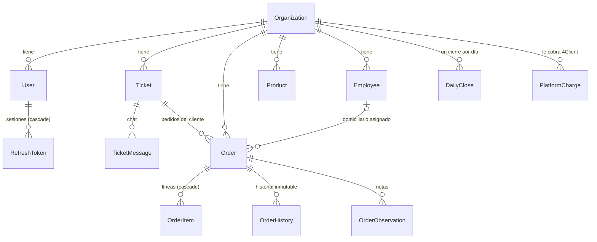

# Datos y migraciones

> **Resumen.** El modelo es multi-tenant por `org_id`, sin total de pedido guardado y con dos conceptos de día. Hay lógica que vive en la base (reglas de historial inmutable, trigger, índices trigram) que Prisma no ve. Las migraciones se aplican solas al arrancar, también en producción: deben ser aditivas (§9).

Qué **significa** el modelo de datos y qué hace la base por su cuenta. Los campos están en `apps/api/prisma/schema.prisma`, que además tiene comentarios largos por columna: este archivo no los repite, explica lo que cruza varias tablas.

## 1. Mapa del modelo

Tablas auxiliares: `LoginVerificationCode` (2FA), `RevokedFormToken` (link bloqueado por ticket), `InvoiceLink` (link de factura), `AuditLog` (acciones sensibles de cuentas y configuración), `FormLinkSession` (en desuso, ver §8).

## 2. Dinero

- Todo monto es `Decimal(12,2)` en pesos colombianos: `OrderItem.price`, `Order.amount_received`, `change_amount`, `split_cash`, `split_transfer`, `DailyClose.total_*`, `PlatformCharge.amount`, `Product.price_per_unit`. *(código)*
- **No hay total de pedido guardado** (principio 3). El total es siempre `SUM(OrderItem.price)` del pedido, y `OrderItem.price` es **el total de la línea**, no el precio unitario: "2 libras de tomate, $6.000" se guarda como una línea con `price = 6000`. *(código)*
- Un ítem en `price = 0` es legítimo: "agotado" en el pedido, o un ítem traído por "Tomar lista" que todavía no tiene precio. *(código)*
- La cantidad es **texto libre** en `OrderItem.quantity_label` ("2 lb", "media docena"). `quantity_value` y `quantity_unit` existen desde el esquema inicial pero ningún código los lee ni los escribe. No se puede sumar cantidades por producto. *(código)*
- `Product.price_per_unit` + `unit_type` son el precio de catálogo (Configuración > Productos, la imagen del catálogo y el envío de un producto por el chat). No alimentan las líneas del pedido: el personal escribe el total de cada línea. El formulario público recibe el catálogo **sin precios**. *(código)*
- Las únicas fotos de totales son `DailyClose` (al cerrar la caja) y `PlatformCharge.amount` (suma de `amounts`, calculada por el backend). *(código)*
- `split_cash` + `split_transfer` se llenan juntos solo en un pago dividido; `payment_method` no cambia por eso. `cierre.ts` y `dashboard.ts` usan el desglose para repartir entre efectivo y transferencia. *(código)*

## 3. Multi-tenant

- Toda tabla de negocio tiene `org_id` (directo, o heredado: `OrderItem` por `Order`, `TicketMessage` por `Ticket`, tokens por `User`). *(código)*
- Restricciones únicas que sostienen reglas de negocio:

| Restricción | Qué garantiza |
|---|---|
| `Ticket (org_id, phone)` | Un ticket por cliente y negocio, para siempre (principio 8). Reemplazó en `20260713000000_ticket_unique_per_phone` a la antigua `(org_id, phone, fecha)`; esa migración fusionó los tickets duplicados. |
| `Ticket (org_id, bsuid)` | El mismo cliente identificado por BSUID no se duplica. Era global hasta `20260919000000_ticket_bsuid_org_scoped_unique`: un cliente que escribía a dos negocios rompía la ingesta del segundo. Varios `NULL` no chocan. |
| `Order (org_id, num, fecha)` | El número de pedido se repite cada día, nunca dentro del mismo día del mismo negocio. |
| `User (email)` global, además de `(org_id, email)` | Un correo inicia sesión en una sola organización. El login busca por correo sin filtrar por organización. El compuesto se mantiene porque los seeds lo usan para `upsert`. `username` también es único global (preparado, aún no se usa para entrar). |
| `DailyClose (org_id, fecha)` | Un cierre por día. **La existencia de esta fila es lo que hace que un día esté cerrado** (`lib/dayClose.ts › findDayClose`). |
| `Organization.wpp_meta_phone_id` | Un número de WhatsApp enruta a una sola organización. El webhook enruta solo por este valor; sin la restricción, un admin podía apuntar su organización al número de otra y recibir sus mensajes. |
| `TicketMessage.wpp_message_id` | Deduplicación de reintentos de Meta (junto con la transacción del webhook). |
| `Ticket.form_link_token`, `InvoiceLink.filename` | Un token o archivo vivo solo pertenece a una fila; sobrescribir el token mata el link anterior. |

## 4. Identidad del cliente: qué hay en `Ticket.phone`

`phone` (`VarChar(150)`) no siempre es un teléfono:

| Contenido | Cuándo |
|---|---|
| Número en formato de Meta (`573000000000`) | Caso normal. |
| BSUID (`CC.<hasta 128 alfanuméricos>`) | El cliente usa nombre de usuario de WhatsApp y Meta no envió teléfono. `meta-cloud.ts` detecta la forma y envía con `recipient` en vez de `to`. |
| `no-<16 hex>` | Meta envió el mensaje sin remitente. `no_wpp_number = true`; no se puede responder. |
| `eliminado-<16 hex>` | El `dev` ejecutó el borrado de datos (`inbox.ts › POST /:ticketId/erase-data`). |

- `bsuid` es un identificador **secundario**: solo se guarda cuando un mismo mensaje trajo teléfono y BSUID, y nunca se sobrescribe. El webhook busca el ticket por `phone`, por `bsuid = phone` o por el BSUID del contacto, para no partir a un cliente en dos tickets. *(código)*
- `Order.customer_phone` es una copia de `Ticket.phone` hecha por el servidor (nunca lo que escriba el formulario), por eso tiene el mismo tamaño. *(código)*
- El borrado de datos **anonimiza, no borra**: el ticket queda con nombre "Cliente eliminado", los pedidos pierden nombre, teléfono y dirección, los mensajes se borran y `consent_given_at` se conserva como prueba. El texto de `order_history` no se puede limpiar (§6). *(código)*

## 5. Dos conceptos de día

| | `Ticket.fecha` | `Order.fecha` |
|---|---|---|
| Qué es | Último día de negocio en que el chat estuvo activo (o al que quedó en cola). | Día de negocio del pedido: define el tablero, la numeración y el cierre. |
| Corte de las 21:00 | **Sí**, pero solo para el **primer mensaje del día**: si llega entre 21:00 y 23:59 de Bogotá, el ticket pasa a mañana (`lib/businessDate.ts › businessDateForInstant`, `NIGHT_CUTOFF_HOUR = 21`). Un mensaje posterior del mismo día no lo mueve. | **No.** Día calendario de Bogotá. |
| Quién lo cambia | Cada mensaje entrante (`webhook.ts`), la creación manual (`tickets.ts › POST /`) y un pedido del formulario que se pasa a mañana. | La creación; el cierre al "pasar a mañana" (se renumera y queda `pasado_manana:<fecha>:<num viejo>` en `notes`); el formulario si el día ya está cerrado (se crea en el día siguiente). |
| Auxiliares | `deferred_to` (día al que el cierre lo pospuso; se borra con el siguiente mensaje), `first_message_today_at` (orden del tablero), `last_message_at` (solo mensajes entrantes), `last_activity_at` (en ambas direcciones, lo mantiene un trigger). | `order_hour` (`@db.Time`, hora de creación), `created_at`. |

Ambas columnas son `@db.Date` y el código las construye con `new Date('YYYY-MM-DD')` (medianoche UTC). Sumar o restar horas a esos valores corre el día. *(código)*

**Numeración:** `num` es texto de 3 dígitos (`'001'`). `lib/orderNumbering.ts › createOrderWithRetryNum` toma un `pg_advisory_xact_lock` por organización y día, y usa el **menor entero positivo libre** de ese día. Si un pedido se pasa a mañana, su número queda libre y un pedido nuevo del mismo día puede reutilizarlo. Tiene hasta 5 reintentos ante `P2002`. *(código)*

## 6. Comportamientos que viven en la base

| Qué | Dónde | Efecto |
|---|---|---|
| `order_history` solo-añadir | `20260628023857_add_order_history_immutability`: `RULE no_update_order_history` y `no_delete_order_history` `DO INSTEAD NOTHING` | Un UPDATE o DELETE **no falla, no hace nada**. `updateMany`/`deleteMany` devuelven 0. Junto con la FK `RESTRICT` de `order_history.order_id`, **un pedido con historial no se puede borrar**. Prisma no ve las reglas: no aparecen en `schema.prisma` ni en los diffs. *(código)* |
| `last_activity_at` | `20260802000000_ticket_last_activity`: función `bump_ticket_last_activity()` + trigger `trg_bump_ticket_last_activity AFTER INSERT ON ticket_messages` | Cada mensaje insertado (de entrada o de salida) adelanta `tickets.last_activity_at` a `GREATEST(actual, NEW.created_at)`, nunca hacia atrás. Lo usa el orden de Chats WPP. No hay que actualizarlo desde la aplicación. *(código)* |
| Búsqueda de chats | `20260802050000_chat_search_trgm`: extensiones `pg_trgm` y `unaccent`, función `immutable_unaccent(text)` e índices GIN `ticket_messages_text_trgm_idx`, `tickets_customer_name_trgm_idx`, `tickets_phone_trgm_idx` | Búsqueda `ILIKE` sin tildes en todo el historial. La consulta debe usar **exactamente** la misma expresión (`immutable_unaccent(lower(col))`) o el índice no se usa. *(código)* |
| Consecutivo de cobros | `PlatformCharge.number` `autoincrement` | Secuencia global entre organizaciones. No es numeración DIAN. *(código)* |

**Trampa recurrente — `DROP INDEX tickets_phone_trgm_idx`:** los índices trigram se crearon con SQL a mano y `schema.prisma` no puede declararlos. Cada `prisma migrate dev` / `migrate diff` detecta una deriva falsa y **agrega un `DROP INDEX "tickets_phone_trgm_idx"`** a la migración generada. Hay que **borrar esa línea a mano** antes de hacer commit (ya pasó en `20260829044711_add_order_item_ai_unmatched`, `20260830042938_add_product_in_stock`, `20260901025312_platform_charge_multi_types_period`, `20260903043134_wpp_redirect_message` y `20260903150000_unique_user_email`, que lo dejan anotado). Si se cuela, se rompe la búsqueda por teléfono y se aplica sola en el siguiente arranque. *(código)*

## 7. Borrado y llaves foráneas

- **Borrado suave:** `Product.active` (y aparte `in_stock`, que significa "hoy no hay"), `Employee.active`, `User.active` (desactivación; además revoca sesiones y corta sockets), `Organization.active`. Un pedido nunca se borra: va a `status = 'papelera'` (con `papelera_reason`, `papelera_by`, `status_before_papelera` para restaurar) o queda `client_deleted = true` sin cambiar `status`. Los tickets se anonimizan. *(código)*
- **Borrado físico existente:** `OrderItem` (al editar un pedido se borran todas sus líneas y se crean de nuevo, así que **los id de línea no son estables**), `OrderObservation`, `TicketMessage` (solo el borrado de datos), `DailyClose` (solo `POST /dev/actions/reopen-cierre`), `PlatformCharge`, `RefreshToken`, `RevokedFormToken`. *(código)*
- **`onDelete`:** `CASCADE` solo en `OrderItem → Order`, `RefreshToken → User` y `LoginVerificationCode → User`. `SET NULL` en las relaciones opcionales de `Order` (`ticket_id`, `employee_id`, `paid_by`, `papelera_by`) y en `TicketMessage.sent_by`. Todo lo demás es `RESTRICT`: borrar una organización, un usuario con actividad o un ticket con mensajes falla. `InvoiceLink.ticket_id` y `order_id` **no tienen FK** (son referencias sueltas). *(código)*
- **Tamaños que importan:** `Ticket.phone`, `Ticket.bsuid` y `Order.customer_phone` son `VarChar(150)` por el BSUID; `Order.num` `VarChar(10)`; `OrderObservation.text` 1000; `papelera_reason` 500; `InvoiceLink.phone_last4` 4 (se anonimiza como `****`). *(código)*
- **Banderas de cierre:** `Order.locked` = pedido cerrado (cobrado o "cerrar sin cobro"); `Order.caja_cerrada` = el cierre marcó todo el día. Ninguna pantalla lee `caja_cerrada` y la API decide "día cerrado" por la fila de `DailyClose`; reabrir un cierre desde `dev` borra esa fila pero deja `caja_cerrada` y `locked` como estaban. *(código)* → PREG-005.

## 8. Columnas y tablas heredadas o sin uso

| Elemento | Estado |
|---|---|
| `FormLinkSession` | Se creó para atar el link a un dispositivo (`device_token`). **Obsoleta**: ningún código inserta filas (solo el borrado de datos hace un `deleteMany` inofensivo) y, desde 2026-10-10, las rutas públicas ya no piden `device_token`. Se conserva para que las migraciones sean solo aditivas; **deuda:** borrar la tabla en un release posterior, cuando ningún contenedor viejo pueda referenciarla (PREG-035) |
| `Organization.wpp_meta_app_secret` | Solo lo escriben `seed-wpp.ts` y `reencrypt-wpp-tokens.ts`. El webhook verifica la firma con la variable global `META_APP_SECRET`, no con esta columna. |
| `OrderItem.quantity_value`, `quantity_unit` | Sin uso (§2). |
| `Ticket.wpp_thread_id` | Sin uso; solo aparece en el visor de base de `dev`. |
| `RevokedFormToken` | Sigue en uso (botón "bloquear link"), aunque nació para los links JWT. Desde `form_link_short_token`, generar un link nuevo ya invalida el anterior por sobrescritura; la fila de revocación se borra al emitir uno nuevo (`lib/formLink.ts`). |
| `Order.status = 'entregado'` | Valor heredado: pedidos viejos lo conservan, pero ya no se puede asignar. |
| Comentarios del schema sobre links | Corregidos el 2026-10-10 los de `Ticket.form_token_min_iat`, `form_link_opened_at`, `link_failed_attempts/total` y `FormLinkSession`. Pendiente el de `InvoiceLink`, que habla de ventana de 10 min y verificación de los últimos 4 dígitos (ver `modulos/FAC.md`). → DT-040 |

## 9. Política de migraciones

1. **Se aplican solas al arrancar** (`start.sh` → `prisma migrate deploy`) en cada ambiente, producción incluida. Mergear a `main` una migración es aplicarla en producción en el siguiente arranque.
2. **Aditivas y compatibles con el código anterior**, porque durante el deploy el contenedor viejo sigue atendiendo con el esquema nuevo (principio 1): columnas nuevas nulas o con default, índices nuevos. Quitar o renombrar va en dos pasos (primero el código deja de usarlo, después la migración). El historial tiene excepciones hechas antes de esta regla: `DROP TABLE order_trash`, `DROP COLUMN orders.observacion` (con copia previa a `order_observations`), `invoice_links.failed_attempts` y `platform_charges.due_date`/`type`.
3. **Nunca editar una migración ya aplicada.** Prisma guarda su checksum en `_prisma_migrations`; si cambia, `migrate deploy` se niega y el contenedor no arranca. Para corregir se escribe una migración nueva (ejemplo: `20260802020000_fix_last_activity_backfill`).
4. **Revisar el SQL generado** antes de hacer commit: quitar el `DROP INDEX tickets_phone_trgm_idx` (§6) y cualquier cosa que toque reglas o triggers.
5. SQL a mano (reglas, triggers, extensiones, índices de expresión, `DO $$` de fusión) va en la migración con un comentario del porqué; Prisma no lo ve.
6. Toda migración de esquema es cambio clase C: CH aprobado antes (principio 10).

## 10. Historia de migraciones (58, por hito)

| Hito | Fechas (2026) | Migraciones | Qué introdujo |
|---|---|---|---|
| Base | 16–29 jun | `init`, `add_ticket_deferred_to`, `add_wpp_meta_app_secret`, `add_order_history_immutability`, `add_welcome_message_and_dev_role`, `add_order_source` | Esquema inicial, "pasar a mañana", historial inmutable, mensaje de bienvenida, rol `dev`, origen del pedido. |
| Limpieza y ticket único | 11–13 jul | `drop_unused_order_trash`, `add_performance_indexes`, `ticket_unique_per_phone`, `add_form_token_revocation`, `add_audit_log` | Papelera por `status`, índices, un ticket por teléfono (con fusión), revocación de link, auditoría. |
| Endurecimiento de links | 14–24 jul | `form_link_hardening_order_edit`, `auto_invalidate_form_links`, `org_block_all_form_links`, `add_form_link_opened_at`, `add_invoice_links`, `invoice_link_ticket_revoke`, `message_failed_reason`, `invoice_link_order_id`, `link_abuse_lockout`, `link_lockout_ticket_wide`, `products_employees_org_index`, `form_link_short_token` | Edición del cliente marcada, bloqueo por negocio, links de factura, bloqueo por intentos, token corto opaco, fallo de entrega de mensajes. |
| Pedidos y cobro | 24–27 jul | `order_cod_choice`, `order_observacion`, `order_observations_multi`, `order_client_contact_name`, `order_client_deleted`, `ticket_message_created_at`, `order_split_payment` | Cobro en casa completo/vuelta, observaciones múltiples, nombre de contacto fijo, borrado por el cliente, orden del chat por `created_at`, pago dividido. |
| Identidad WhatsApp y chats | 31 jul–2 ago | `ticket_no_wpp_number`, `ticket_raw_payload`, `bsuid_widen_phone`, `papelera_and_bsuid_secondary`, `ticket_last_activity`, `fix_last_activity_backfill`, `login_verification_code`, `ticket_first_message_today`, `chat_search_trgm` | Mensajes sin remitente, payload crudo, BSUID, papelera con motivo, trigger de actividad, 2FA, orden del tablero, búsqueda trigram. |
| Catálogo e IA | 29–30 ago | `add_order_item_ai_unmatched`, `add_product_in_stock` | Marca "revisar" de Tomar lista, existencias. |
| Cobros de plataforma | 31 ago–2 sep | `add_platform_charge`, `platform_charge_multi_types_period`, `platform_charge_number`, `platform_charge_amounts_breakdown` | `PlatformCharge` con conceptos, mes, consecutivo y desglose. |
| Cuentas y redirección | 3 sep | `wpp_redirect_message`, `account_lockout`, `unique_user_email`, `user_username` | Mensaje de número retirado, bloqueo por fuerza bruta, correo único global, `username`. |
| Ley 1581 | 3–29 sep | `ticket_consent`, `privacy_notice_sent_at`, `order_consent_confirmed`, `privacy_policy_version` | Consentimiento por ticket y por pedido, aviso único, versión de la política. |
| Aislamiento entre negocios | 9–19 sep | `wpp_meta_phone_id_unique`, `ticket_bsuid_org_scoped_unique` | Número de WhatsApp único, BSUID por organización. |
| Plantillas | 6 oct | `org_message_templates` | Textos editables por organización. |
| Fechas del crédito | 10 oct | `order_credit_paid_at` | `orders.credit_paid_at` (nullable, aditiva): cuándo se saldó un crédito. Rellena los créditos ya saldados con la hora del asiento "Crédito pagado." del historial. |
| Sesión única | 11 oct | `user_session_id` | `users.session_id` (`VARCHAR(40)`, nullable, aditiva): id de la sesión vigente de admin y dev; nulo = aún sin sesión única aplicada. |

Cada carpeta lleva el prefijo de fecha y hora `AAAAMMDDhhmmss_`. Contar: `ls apps/api/prisma/migrations | grep -c '^2'` (58).

## 11. Pendientes

- **PREG-005 — `caja_cerrada` tras reabrir un cierre.** `POST /dev/actions/reopen-cierre` borra el `DailyClose` pero no limpia `Order.caja_cerrada` ni `locked`. Hoy nada lee `caja_cerrada`. ¿Se deja así, se limpia al reabrir o se elimina la columna?
- **PREG-035 — `device_token` y `FormLinkSession`.** Resuelta por José (2026-10-10): se quitó el parámetro. Queda por hacer borrar la tabla `FormLinkSession` en un release posterior (DT-049) (migración que elimina la tabla, solo cuando el contenedor anterior ya no la use).
- **DT-040 — Comentarios del schema desactualizados.** Corregidos los del formulario (2026-10-10); queda el de `InvoiceLink` (10 min y `phone_last4`).
