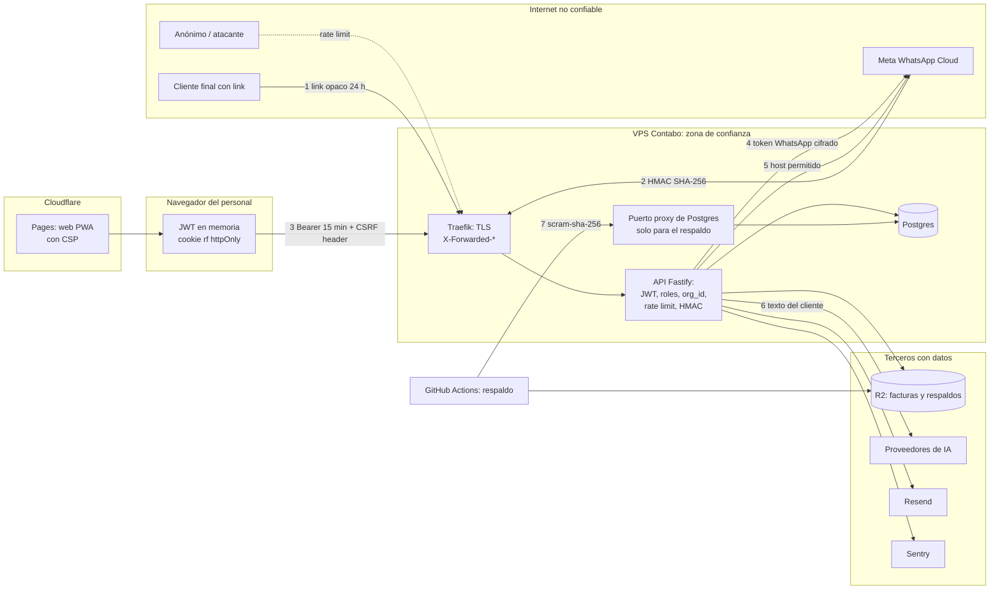

# Modelo de amenazas

> **Resumen.** Modelo STRIDE de 4Client con 34 amenazas (AM-01 a AM-34). Las defensas más sólidas están en el aislamiento por `org_id`, los links opacos, la firma del webhook y el cifrado del token de WhatsApp. Los riesgos residuales que más pesan son operativos y de datos personales, no de código: puerto de base expuesto, retención sin límite, supresión incompleta, `dev` con acceso total y sesión viva hasta 15 min tras desactivar (§ 6).

Documento de análisis, no de procedimiento. Describe **qué se protege, de quién y con qué**, y deja honesto lo que falta. Complementa `seguridad-y-privacidad.md` (cómo funciona cada control), `integraciones.md` (terceros), `modelo-de-datos.md` (dónde viven los datos) y `04-operacion/entornos-y-despliegue.md`. No contiene instrucciones de explotación, secretos ni datos reales. Los PREG/DT citados viven en `03-plan/`.

Convenciones: *(código)* = comprobado leyendo el código en `1edb809`; *(sin test)* = el control existe pero ningún test lo cubre; *(no verificable)* = depende de configuración de infraestructura que el repo no muestra. Riesgo residual: **Alto** (puede exponer datos de varios clientes o dinero), **Medio**, **Bajo**.

## 1. Activos

| Activo | Por qué importa | Dónde vive |
|---|---|---|
| **Datos personales de clientes finales** (teléfono/BSUID, nombre, dirección, mensajes, `raw_payload` de Meta) | Ley 1581; el producto vive de la confianza del negocio | `Ticket`, `TicketMessage`, `Order`, `OrderHistory`, PDF de factura en R2, respaldos |
| **Credenciales de WhatsApp** (`wpp_meta_token` por organización) | Quien lo tenga habla como el negocio ante sus clientes | `Organization` (AES-256-GCM `enc:v2:`); clave maestra `WPP_TOKEN_ENC_KEY` en variables de entorno |
| **Integridad de dinero y pedidos** | Cobros, vueltas, cierre de caja, crédito | `OrderItem`, columnas de cobro de `Order`, `DailyClose` |
| **Historial y auditoría** | Prueba de quién cambió qué | `OrderHistory` (inmutable por reglas), `AuditLog` (sin regla) |
| **Disponibilidad del flujo de pedidos** | Mensaje de WhatsApp → ticket → pedido en tiempo real; el negocio opera todos los días | API, Postgres, webhook de Meta, sockets |
| **Secretos de plataforma** | `JWT_SECRET`, `META_APP_SECRET`, claves R2, claves de IA, credencial del respaldo | Variables de entorno de Coolify y secretos de GitHub |
| **Cuentas del personal** | Una cuenta admin ve todo el negocio | `User` (bcrypt costo 12), `RefreshToken` (SHA-256) |

## 2. Actores

| Actor | Capacidad / motivación | Confianza |
|---|---|---|
| Internet anónimo | Cualquier petición HTTP; sondeo, fuerza bruta, scraping | Ninguna |
| Cliente final con link | Posee un link de formulario o factura de **su** chat; puede reenviarlo | Mínima, acotada al ticket del link |
| Cliente malicioso | El anterior, o un número que escribe al WhatsApp del negocio; controla el texto que entra | Ninguna: todo su texto es dato no confiable |
| Personal por rol (`domiciliario`, `encargado`, `admin`) | Autenticado, acotado a su organización por el JWT | Parcial, por rol (`01-funcional/actores-y-permisos.md`) |
| Admin de **otro** negocio | Autenticado en un tenant vecino; quiere ver o afectar al nuestro | Ninguna sobre datos ajenos |
| Operador `dev` (José) | Superset de roles, lee cualquier organización, único que suprime datos | Alta, **y por eso es un activo a proteger** (cuenta comprometida = todo) |
| Proveedor de IA / tercero comprometido | Recibe texto de clientes (IA), correos (Resend), errores (Sentry), PDF y respaldos (R2) | Se confía en su contrato, no en su seguridad |
| Meta | Origen de todos los mensajes entrantes y entrega de los salientes | Alta pero verificable (firma HMAC) |
| Insider con acceso a infraestructura | Acceso a Coolify, GitHub o la base | Fuera del alcance del código; ver AM-29 a AM-34 |

## 3. Fronteras de confianza

Cada número es una frontera donde se valida algo: (1) token de link, (2) firma del cuerpo crudo, (3) JWT + rol + `org_id`, (4) credenciales por organización, (5) lista cerrada de hosts de descarga, (6) frontera de **egreso** sin control del contenido, (7) credencial de la conexión. La API (`api.4client.shop`) está **sin el proxy de Cloudflare** (DNS-only), así que Traefik es el único borde delante de ella *(código y `entornos-y-despliegue.md`)*.

## 4. Tabla de amenazas

STRIDE: **S** suplantación · **T** manipulación · **R** repudio · **I** divulgación de información · **D** denegación de servicio · **E** elevación de privilegios.

### 4.1 Aislamiento entre negocios

| ID | Frontera / activo | Amenaza | Mitigación existente | Residual | Relacionado |
|---|---|---|---|---|---|
| AM-01 | API › datos de otro tenant | **I/E** Una consulta olvida el filtro `org_id` y devuelve filas de otra organización | `org_id` siempre del JWT (`req.user.orgId`); `findFirst({ id, org_id })` y 404 (no 403) si no coincide; tests de aislamiento en pedidos, multimedia, reenvío, Tomar lista, facturas, precios y facturación (p. ej. `orders.test.ts › "GET /orders?fecha=X only returns orders for the requesting user org (multi-tenant isolation)"`) | **Medio**: es una convención, no una restricción de la base; `users.ts`/`employees.ts` sin tests (DT-023) y webhook sin tests de tenant (DT-010) | Principio 2, DT-023, DT-010 |
| AM-02 | API › ids en el cuerpo (IDOR) | **T/E** El cuerpo trae `ticket_id`, `employee_id` u `order_id` de otro tenant para asociar o leer datos ajenos | Se re-buscan por `org_id` antes de usarse: `orders.ts › POST /` y `PATCH /:id` (ticket y empleado), `files.ts › POST /invoice` (pedido); `public.ts › POST /order/:orderId/delete` exige `ticket_id` del token *(código)* | **Bajo**; `InvoiceLink.ticket_id/order_id` y `AuditLog.target_id` no tienen FK (`modelo-de-datos.md` § 3.1) | AM-01 |
| AM-03 | Webhook › ruteo | **S/I** Un admin configura el `wpp_meta_phone_id` de otro negocio para recibir sus mensajes | `Organization.wpp_meta_phone_id` **único**; el segundo recibe 409 `PHONE_ID_ALREADY_IN_USE` (`config.test.ts › "rejects a second org claiming the SAME wpp_meta_phone_id with 409 PHONE_ID_ALREADY_IN_USE, not a raw 500"`) | **Bajo**. Todas las organizaciones comparten un solo `META_APP_SECRET` (el campo por organización no se usa) | PREG-033 |
| AM-04 | Sockets | **I** Un socket escucha eventos de otra organización o de un día ajeno | JWT verificado al conectar; `join:org` solo une a la organización del token; `join:date` arma la sala con la organización **del token**; desconexión al vencer el token o al desactivar al usuario *(código, sin test)* | **Bajo** | PREG-093 |
| AM-05 | Cuenta admin ajena | **E** Un admin lista, edita o resetea cuentas `dev` u otras organizaciones | Listar/editar/resetear filtran `org_id` del JWT y excluyen `role='dev'` con 404; el enum de creación no incluye `dev` (`users.ts`) *(código, sin test)* | **Bajo**; falta test (DT-023) | DT-023 |

### 4.2 Autenticación y sesión

| ID | Frontera / activo | Amenaza | Mitigación existente | Residual | Relacionado |
|---|---|---|---|---|---|
| AM-06 | `POST /auth/login` | **S** Fuerza bruta y relleno de credenciales | Límite de 10/min por IP; bloqueo por cuenta (5 fallos → 5 min, 10 → 15 min, 15+ → 1 h) independiente de la IP; `bcrypt` siempre ejecutado (también con email inexistente) y mismo `INVALID_CREDENTIALS` para email inexistente, clave mala y organización inactiva; bcrypt costo 12 (`auth.test.ts`) | **Medio**: el contador no decae con el tiempo; contraseñas heredadas pueden ser débiles porque el login no aplica la política | PREG-056 |
| AM-07 | Bloqueo de cuenta | **D** Un anónimo bloquea a propósito la cuenta de un admin conociendo su email | Cada bloqueo envía correo al dueño; no hay otra defensa: durante el bloqueo **incluso la contraseña correcta** recibe 429 `ACCOUNT_LOCKED` | **Medio**: cualquiera con el email deja a un admin fuera hasta 1 h; el escalado es acumulativo | — |
| AM-08 | 2FA | **S** Adivinar o reusar el código de correo | 6 dígitos con `crypto.randomInt`, HMAC en base, 5 min, 5 intentos con `updateMany` atómico, tope de 5 códigos por 15 min (`auth-2fa.test.ts`) | **Medio**: 2FA **solo para `dev`** y solo con `REQUIRE_2FA`; `REQUIRE_2FA=false` lo **enciende**; `verify-code` ignora `locked_until`; admins sin 2FA por decisión | D-10, PREG-064, PREG-066, PREG-102 |
| AM-09 | Access/refresh token | **S/I** Robo de sesión | Access JWT HS256 de 15 min **en memoria**; refresh de 40 bytes aleatorios, solo su SHA-256 en base, cookie `httpOnly` `Secure`, rotación con `SELECT … FOR UPDATE`, **detección de reutilización** que revoca toda la familia (`auth.test.ts › "detects refresh-token reuse: …"`) | **Medio**: JWT de 15 min no revocable; un token sigue válido tras desactivar o cambiar el rol; cambiar el email no revoca sesiones | PREG-065, PREG-060 |
| AM-10 | `POST /auth/refresh` | **T** CSRF sobre el endpoint que usa cookie | Exige `X-Requested-With`; CORS con lista de orígenes de `FRONTEND_URL`; el resto de rutas usa `Authorization: Bearer` (`auth.test.ts › "rejects refresh with no X-Requested-With header -> 403 CSRF_CHECK_FAILED, …"`) | **Bajo**. `SameSite=None` es necesario (web y API en dominios distintos) | — |
| AM-11 | Firma del JWT | **S** Forjar un token | `@fastify/jwt` fijado a HS256 en firma y verificación; `JWT_SECRET` ≥ 32 caracteres o la API no arranca; el rate limit global verifica la firma antes de elegir su bucket; `authenticate` rechaza tokens sin `userId` o `role` | **Bajo**: un único secreto simétrico; su fuga permite acuñar un `dev` | PREG-112 |
| AM-12 | Escalada por rol | **E** Un rol bajo ejecuta acciones de uno alto | `requireRole` por ruta; el rol sale del JWT y se relee de la base en `/refresh`; el `domiciliario` recibe 403 en escritura de pedidos | **Medio**: `POST /tickets` (cualquier rol) sobrescribe `customer_name`; un admin puede cambiarse el rol o dejar el negocio sin admin; la interfaz muestra acciones que la API rechaza | PREG-067, PREG-058, PREG-012 |

### 4.3 Entradas públicas: links y webhook

| ID | Frontera / activo | Amenaza | Mitigación existente | Residual | Relacionado |
|---|---|---|---|---|---|
| AM-13 | Link del formulario | **S** Adivinar un token de link | Token opaco de 20 bytes aleatorios (160 bits), único; ante un link muerto responde un mensaje genérico `INVALID_TOKEN` (no revela el motivo) *(inferido: inviable por fuerza bruta)* | **Bajo** por entropía; los `GET` públicos sólo tienen el límite global de 300/min por IP | D-07 |
| AM-14 | Link del formulario o factura | **I/T** Un link filtrado o reenviado se usa por un tercero | Vence a las 24 h fijas (`public.test.ts › "a link dies past the flat 24h cap, whether or not it was ever opened"`); emitir uno nuevo mata el anterior; "Bloquear link" y "Bloquear todos"; facturas se revocan al editar, borrar el pedido o bloquear | **Medio**: se quitó el PIN de 4 dígitos y la atadura al dispositivo (D-07); el link **es** la única barrera; una factura sigue abriéndose 24 h aunque se cobre o se archive el pedido | D-07, D-08, PREG-082, PREG-035 |
| AM-15 | `POST /public/submit` | **D/T** Spam de pedidos o mensajes por un link válido | Máx. 3 pedidos nuevos por ticket y día; 15/min por IP; confirmaciones automáticas topadas a 30 por 24 h; validación zod (máx. 100 ítems, 200 caracteres por producto, 500 por dirección); sin precios del cliente (`price: 0` y marca `added_by_client`) | **Medio**: el tope de 30 mensajes casi no limita; la IP compartida (CGNAT) puede agotar el límite de 15/min de clientes legítimos | PREG-054 |
| AM-16 | Consentimiento (Ley 1581) | **R** El cliente niega haber aceptado el tratamiento | `consent: true` obligatorio en cada envío (`CONSENT_REQUIRED`), sellado con versión de política en `Order` y `Ticket`; `consent_given_at` se conserva al anonimizar | **Medio**: pedidos creados a mano no registran consentimiento; el aviso de privacidad depende de que exista `welcome_message` | PREG-022 |
| AM-17 | `POST /webhook` | **S** Un tercero envía mensajes falsos como si fueran de Meta | HMAC-SHA256 del **cuerpo crudo** con `crypto.timingSafeEqual`; obligatorio en producción (sin `META_APP_SECRET` la API no arranca); sólo fuera de producción se acepta sin firma | **Medio**: **sin test con firma** *(sin test)*; un `APP_ENVIRONMENT_NAME` mal puesto relaja el modo, mitigado porque sólo admite `production`, `staging`, `dev` o `test` | DT-010, PREG-033 |
| AM-18 | `POST /webhook` | **T** Reproducir un mensaje legítimo capturado | Descarte de mensajes con más de 10 min; `wpp_message_id` único (deduplicación) | **Bajo**; el descarte no deja rastro en la base | PREG-032 |
| AM-19 | Webhook y cola de IA | **D** Inundar el webhook o gastar la cuota de IA | Webhook: 2000/min por IP (la firma se valida antes de procesar); `parse-messages`: 15/min por usuario, máx. 50 ids, array de salida ≤ 200; envíos de multimedia: 60/min | **Medio**: sin tope de gasto por organización ni medición de uso de IA; cooldown solo en memoria | PREG-048, PREG-044, PREG-045 |
| AM-20 | Límites por IP | **T** Falsear `X-Forwarded-For` para saltar rate limits | `trustProxy` confía solo en el salto 0 (Traefik, único que toca el contenedor); el bucket del límite global usa un JWT **verificado** | **Bajo** hoy; **si algún día se pone Cloudflare delante**, todas las IP serían las del proxy y los límites por IP se volverían globales (revisar `trustProxy`) | `integraciones.md` |

### 4.4 Entradas de datos, archivos y contenido

| ID | Frontera / activo | Amenaza | Mitigación existente | Residual | Relacionado |
|---|---|---|---|---|---|
| AM-21 | Web › React | **T/I** XSS desde nombres de cliente, productos o mensajes | React escapa por defecto y no hay `dangerouslySetInnerHTML` ni `innerHTML` en `apps/web/src`; CSP `script-src 'self'`, `object-src 'none'`, `frame-ancestors 'none'` | **Medio**: `connect-src` admite cualquier `https:`/`wss:` (un XSS podría exfiltrar), `style-src 'unsafe-inline'`; las cabeceras son una capa más, no la causa raíz | — |
| AM-22 | Exportación | **T** Inyección de fórmulas en CSV/Excel | `csvField` antepone `'` a campos que empiezan con `= + - @`, tabulador o retorno de carro (`apps/web/src/lib/csv.ts`) | **Bajo**: la exportación de productos a Excel no tiene la guarda (datos escritos por el admin) | — |
| AM-23 | Mensajes salientes | **T** Texto del cliente rompe el formato de WhatsApp o cuela enlaces en confirmaciones | `lib/sanitize.ts › sanitizeForWhatsApp` quita controles, escapa `* _ ~ \``, aplana saltos y corta a 200 | **Bajo**; el texto del staff y las plantillas no se sanean (confiables) | — |
| AM-24 | Carga de archivos | **T/D** Subir un ejecutable disfrazado, o archivos enormes para agotar memoria | Firma real de bytes para imágenes y PDF/MP4/OGG; listas cerradas de tipo; tamaños máx. (imagen 5 MB, audio/video 16 MB, documento 100 MB, factura 20 MB); `bodyLimit` por ruta; 60/min y 20/min por usuario | **Medio**: base64 completo en memoria del proceso (hasta ~28 MB por petición); mp3/amr/3gpp se aceptan por tipo declarado | DT-016, DT-035 |
| AM-25 | PDF de factura | **T/I** Un PDF arbitrario enviado al cliente como "factura", o servido con contenido activo | El servidor exige `%PDF`; nombre `Factura_*.pdf` validado con regex; se sirve `application/pdf`, `nosniff`, `inline`; en disco se comprueba `realpath` dentro de `uploads/` | **Medio**: el PDF lo genera el navegador (D-12) y el servidor no valida su contenido: cualquier cuenta autenticada puede subir un PDF cualquiera y mandarlo por el chat | D-12, PREG-083, PREG-080 |
| AM-26 | Descarga de multimedia de Meta | **I/D** SSRF: forzar que el servidor pida una URL interna | `assertMetaHostname` con lista cerrada (`fbcdn.net`, `fbsbx.com`, `facebook.com`, `whatsapp.net`); `media_id` validado con `^[0-9]{5,40}$`; no hay otra petición a URLs derivadas de datos externos | **Bajo**: la lista se comprueba sobre la URL inicial; `fetch` sigue redirecciones sin revalidar el host *(no verificado en runtime)* | `integraciones.md` § 1.3 |
| AM-27 | `Tomar lista` (IA) | **T** Inyección de instrucciones en el texto del cliente para alterar el pedido | La IA solo ve texto del cliente que el staff **selecciona**; salida validada con zod (≤ 200 ítems, longitudes máximas); `price` siempre 0; la línea no calzada se marca `ai_unmatched` ("revisar"); nada se guarda hasta que el staff pulsa Guardar | **Bajo** para integridad; el modelo no tiene herramientas ni acceso a datos; sin medición de omisiones | PREG-046 |

### 4.5 Datos personales, terceros y auditoría

| ID | Frontera / activo | Amenaza | Mitigación existente | Residual | Relacionado |
|---|---|---|---|---|---|
| AM-28 | Egreso a terceros | **I** Datos personales salen a proveedores sin base clara | Multimedia nunca se guarda (solo id de Meta, 30 días); IA solo recibe texto elegido por el staff; correo de bloqueo/2FA no lleva datos de clientes | **Alto (legal)**: el texto de clientes va a proveedores de IA gratuitos fuera de Colombia que la política no menciona; Sentry recibe excepciones y *no se verificó* si trae datos personales | PREG-051, PREG-096 |
| AM-29 | Retención y supresión | **I** Datos que no deberían existir siguen disponibles | Supresión por `dev` (D-17): anonimiza pedidos y ticket, borra mensajes, revoca facturas | **Alto**: no borra `order_history`, `OrderObservation`, `Order.notes` ni el PDF en R2; no hay **ninguna** purga automática; sólo alcanza la organización del `dev` | PREG-037, PREG-042, PREG-097, PREG-084 |
| AM-30 | Secretos en reposo | **I** Fuga de tokens por un volcado de la base | `wpp_meta_token` AES-256-GCM con clave por organización derivada; clave obligatoria en producción; refresh solo en SHA-256; 2FA en HMAC; contraseñas bcrypt; `/dev/db` excluye hashes y tokens | **Medio**: `wpp_meta_app_secret` (sin uso) no queda cifrado según el comentario del visor; sin clave el token se guarda plano fuera de producción; no hay rotación de `WPP_TOKEN_ENC_KEY` | PREG-126, PREG-113 |
| AM-31 | Rastro de auditoría | **R/T** Alterar o negar acciones | `order_history` inmutable por reglas de base; `AuditLog` de 16 acciones; ningún código actualiza ni borra `AuditLog` | **Medio**: `AuditLog` se escribe *best-effort*, **sin regla de inmutabilidad en la base**; no se auditan bloqueos de links, catálogo, precios, empleados ni reabrir cierres; `dev.db_read` no guarda el contenido | PREG-098, PREG-090, PREG-085 |
| AM-32 | Operador `dev` | **E/I** Cuenta `dev` comprometida o uso indebido | Rol `dev` no se crea por API; cada lectura de `/dev/db` queda auditada; 2FA disponible (`REQUIRE_2FA`); `password_hash` y tokens no se exponen | **Alto**: superset de todo, lee datos personales de cualquier negocio sin motivo ni tope; el 2FA depende de una variable mal parseada y de su valor por ambiente | PREG-085, PREG-064, PREG-102, PREG-057 |

### 4.6 Infraestructura y cadena de suministro

| ID | Frontera / activo | Amenaza | Mitigación existente | Residual | Relacionado |
|---|---|---|---|---|---|
| AM-33 | Puerto proxy de Postgres | **I/E** Acceso directo a la base desde internet | Autenticación `scram-sha-256`; la credencial vive como secreto de GitHub; el contenedor de la API no es accesible sin Traefik *(no verificable: reglas de firewall y alcance del puerto)* | **Alto**: riesgo aceptado por José; una fuga de la credencial entrega **todos** los datos; no hay WAF ni lista de IP en el repo | `seguridad-y-privacidad.md` § 13 |
| AM-34 | Respaldos y cadena de suministro | **I/T** Exposición del volcado, o dependencia/acción comprometida | Respaldo diario `pg_dump` al bucket R2 con ciclo de vida; CI ejecuta `pnpm audit --prod` e instala con `--frozen-lockfile`; secretos nunca en el repo | **Alto/Medio**: el volcado contiene **todos** los datos personales y el procedimiento de restauración nunca se probó; las GitHub Actions se fijan por etiqueta (`@v4`), no por SHA; no hay Dependabot; el resultado de `pnpm audit` no gobierna el deploy *(no verificable)* | PREG-099, PREG-111, PREG-095, PREG-106 |

## 5. Lo que ya funciona bien

- **Sin sorpresas en el borde:** HTTPS obligatorio en producción (400 `HTTPS_REQUIRED`, salvo `/health`), HSTS, `helmet`, CORS con lista y cabeceras de la web.
- **Fallar cerrado:** sin `META_APP_SECRET`, sin `WPP_TOKEN_ENC_KEY` o con `APP_ENVIRONMENT_NAME` inválida, la API no arranca en producción.
- **Menos superficie:** sin total de pedido guardado; multimedia sin almacenar; precios fuera del formulario público; `dev.ts` y `billing.ts` protegidos por `addHook('preHandler')` en bloque.
- **Defensa en profundidad en links:** 160 bits, vencimiento duro, sobrescritura al emitir, bloqueo individual y global, revocación de facturas ligada al pedido.

## 6. Prioridades

Ranking de los **8 riesgos residuales** que más importan, por impacto × probabilidad para un negocio con un cliente real y datos de ciudadanos.

| # | Amenaza | Por qué es prioritaria | Acción sugerida (decisión de José) |
|---|---|---|---|
| 1 | **AM-33 / AM-34** Base expuesta y respaldos | Una sola credencial da acceso a todo; el volcado contiene todo y nunca se probó restaurar | Restringir el puerto por origen o pasar a túnel; probar la restauración; confirmar plazo del ciclo de vida del bucket |
| 2 | **AM-32** Cuenta `dev` | Superset sin tope; 2FA depende de `REQUIRE_2FA`, que se activa con cualquier texto | Corregir el parseo (PREG-064), confirmar 2FA en prod (PREG-102), definir qué datos enmascarar (PREG-085) |
| 3 | **AM-29** Retención y supresión incompleta | Obligación legal; hoy los datos no se vencen y la supresión deja datos en `order_history` y R2 | Definir plazo de retención y qué se redacta (PREG-097, PREG-037) |
| 4 | **AM-28** Egreso a proveedores de IA | Texto de clientes sale del país sin mención en la política | Mencionarlo en la política o desactivar proveedores gratuitos (PREG-051) |
| 5 | **AM-14** Link como única barrera | Quitar el PIN dejó un link filtrado utilizable 24 h, incluida la factura aunque el pedido cambie | Decidir si se acepta (D-07) o se restablece un freno ligero (PREG-035, PREG-082) |
| 6 | **AM-09 / AM-12** Token vivo tras desactivar y rol obsoleto | Un empleado despedido conserva acceso hasta 15 min; cambiar el email no revoca | Consultar `active`/`role` en `authenticate` o aceptar por escrito (PREG-065, PREG-060) |
| 7 | **AM-07 / AM-08** Bloqueo de cuenta usado para denegar y 2FA solo `dev` | Cualquiera con un email bloquea a un admin; los admins (que ven todo el negocio) entran sin segundo factor | Planificado para el segundo cliente (D-10); mientras tanto, avisar al bloqueado y vigilar |
| 8 | **AM-31** Auditoría débil | `AuditLog` sin inmutabilidad y con huecos: ante un incidente no habría rastro completo | Regla de solo-añadir como en `order_history` y ampliar acciones (PREG-098) |

## 7. Cómo mantener este documento

Se actualiza cuando cambia una frontera (nuevo proveedor, nueva ruta pública, nuevo rol), cuando se responde un PREG citado aquí, o cuando se corrige un control. Cada amenaza nueva lleva ID `AM-nn` siguiente (nunca se reutiliza). Una mitigación que deja de existir sube el riesgo residual en la misma rama (principio 13).

## Pendientes

Sin PREG nuevos propios; las dudas están en los ya registrados. Cuestiones por confirmar con José, aún sin PREG: (a) si la API acepta conexiones directas al contenedor que salten Traefik; (b) si `fetch` de Node revalida el host en redirecciones de la descarga de multimedia; (c) si Sentry recibe datos personales en las excepciones; (d) si el resultado de `pnpm audit` bloquea el despliegue de `main`.
