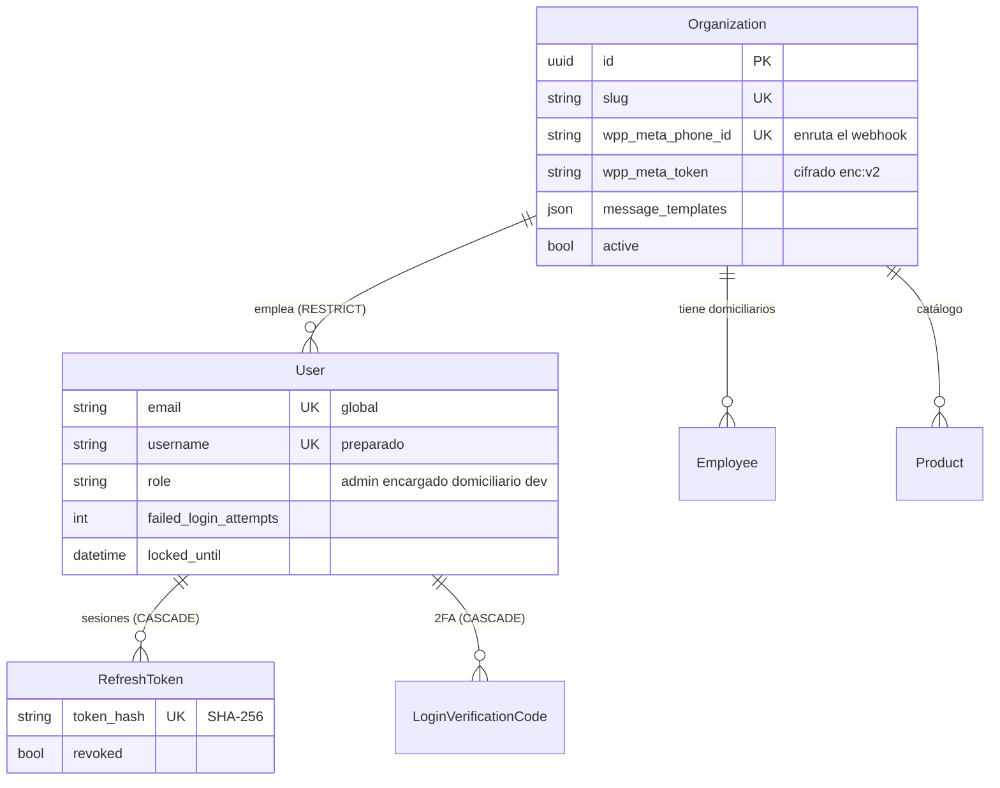
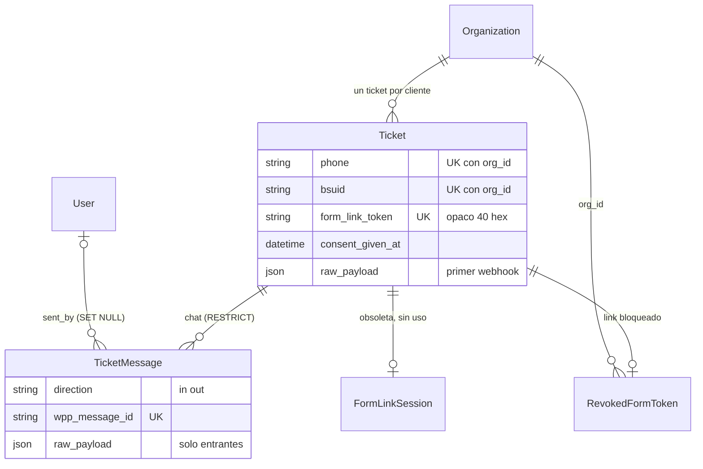
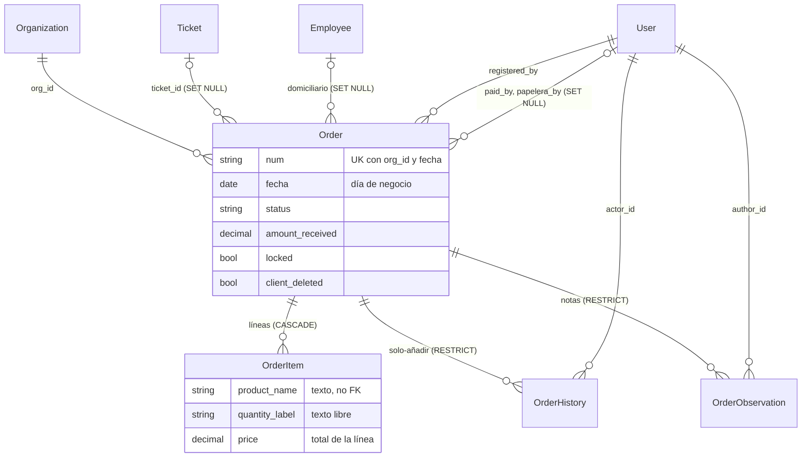
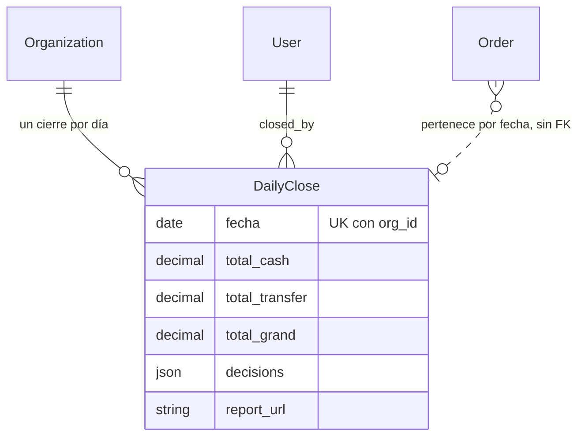
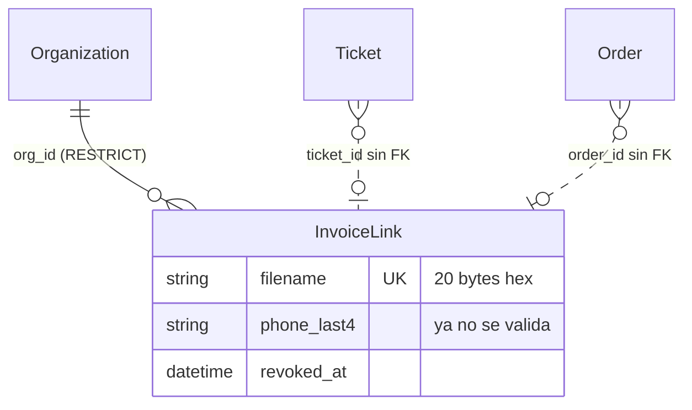
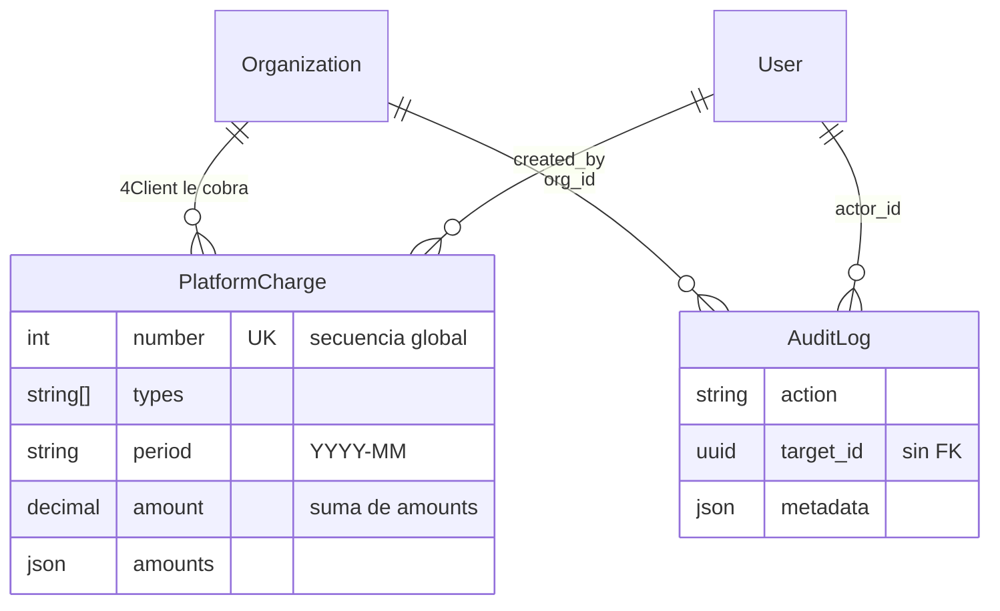

# Modelo de datos

> **Resumen.** 18 modelos en seis dominios. Todo cuelga de `Organization` (`org_id`); el dinero vive solo en líneas, cobros y fotos de cierre; el historial es solo-añadir; los datos personales están concentrados en `Ticket`, `TicketMessage`, `Order` y sus derivados, y se **anonimizan** (no se borran) al ejercer la supresión.

Referencia de **estructura y ciclo de vida**: quién crea cada cosa, cuánto vive, qué invariantes la sostienen y dónde hay datos personales. Complementa `datos-y-migraciones.md` (significado de los campos, trampas, política de migraciones), que no se repite aquí. Las columnas exactas están en `apps/api/prisma/schema.prisma`; los permisos, en `01-funcional/actores-y-permisos.md`; la amenaza asociada a cada dato, en `modelo-de-amenazas.md`.

Convenciones de lectura: *(código)* = verificado leyendo el código; `ruta › símbolo` sin números de línea; "módulo" = código de `modulos/<MOD>.md`.

## 1. Diagramas por dominio

Las cardinalidades salen de `schema.prisma`. `onDelete` por defecto de Prisma: relación obligatoria = `RESTRICT`, opcional = `SET NULL`; solo hay tres `CASCADE` (§ 4).

### 1.1 Organización y cuentas

### 1.2 Chats y mensajes

### 1.3 Pedidos e ítems

### 1.4 Caja y cobros

El cobro **no es una tabla**: son columnas de `Order` (`paid`, `paid_at`, `paid_by`, `credit_paid_at`, `amount_received`, `change_amount`, `cod_choice`, `split_cash`, `split_transfer`, `payment_method`). La única tabla de caja es la foto del cierre.

### 1.5 Enlaces y facturas

El link del formulario no tiene tabla propia: es `Ticket.form_link_token` (+ `form_token_min_iat`, `form_link_opened_at`) y, si se bloquea, `RevokedFormToken`.

### 1.6 Plataforma y auditoría

## 2. Diccionario de datos

Columnas: **Propósito** · **Quién escribe** (módulo, ruta) · **Ciclo de vida** · **Invariantes** · **Datos personales** (Sí/No y campos). "Staff" = personal del negocio.

### 2.1 Organización y cuentas

| Modelo | Propósito | Quién escribe | Ciclo de vida | Invariantes | Datos personales |
|---|---|---|---|---|---|
| `Organization` | Un negocio cliente (tenant) y su configuración de WhatsApp, plantillas y kill switch de links | Alta: PLT `dev.ts › POST /organizations`. WhatsApp y plantillas: WPP `config.ts › PATCH /wpp`, `PUT /message-templates`. Bloqueo global de links: INB `inbox.ts › POST /form-links/block-all` | Creada por `dev` → editada → `active=false` (login rechazado) . **Nunca se borra** (hay FKs `RESTRICT` desde casi todo) | `slug` único; `wpp_meta_phone_id` único (un número, un negocio); `wpp_meta_token` siempre `enc:v2:` en producción; el token nunca sale por la API | No directos. Contiene **secreto**: `wpp_meta_token`, `wpp_meta_app_secret` (sin uso) |
| `User` | Cuenta del staff (y `dev`) | ACC `users.ts › POST /`; `dev` por `dev.ts › POST /seed` y `POST /organizations` (primer admin). Login: `auth.ts` (contadores, `last_login`) | Creada → activa → `active=false` (revoca sesiones, corta sockets). **Sin borrado físico** en el código | `email` único **global** y `(org_id, email)`; `username` único; un admin no ve ni edita `role='dev'`; el rol `dev` no se crea por API | Sí: `email`, `name` |
| `RefreshToken` | Sesión larga rotativa (hash SHA-256) | ACC `auth.ts › issueSession`, `/refresh`, `/logout`; `users.ts` (revoca) | Emitido (7 días) → rotado/revocado → **borrado** en el siguiente login exitoso del usuario | `token_hash` único; reutilización de uno revocado revoca toda la familia; `CASCADE` desde `User` | No (hash opaco) |
| `LoginVerificationCode` | Código 2FA por correo (solo `dev` con `REQUIRE_2FA`) | ACC `auth.ts › POST /login`, `/login/verify-code` | Emitido (5 min) → consumido o agotado (5 intentos). **No hay limpieza**: las filas se acumulan | Se guarda HMAC, nunca el código; `CASCADE` desde `User` | No |
| `Employee` | Domiciliario o empleado asignable a un pedido | ACC `employees.ts › POST /`, `DELETE /:id` (borrado suave con `updateMany`) | Creado → `active=false`. No se reactiva ni se ve (PREG-061) | Siempre filtrado por `org_id`; asignar uno de otra organización responde 404 (`orders.ts › POST /`, `PATCH /:id`) | Sí: `name`, `phone` (del personal, no de clientes finales) |
| `Product` | Producto del catálogo (nombre, categoría, precio de referencia, existencia) | CAT `products.ts` (alta, edición, lote, Excel) | Creado → `active=false` (borrado suave) ; `in_stock` aparte ("hoy no hay") | **No hay `product.delete`**. Los pedidos no lo referencian por FK (§ 3.4); `price_per_unit` es solo referencia | No |

### 2.2 Chats y mensajes

| Modelo | Propósito | Quién escribe | Ciclo de vida | Invariantes | Datos personales |
|---|---|---|---|---|---|
| `Ticket` | La conversación y la identidad del cliente final, **para siempre** (principio 8). Contiene el estado del link del formulario, los contadores anti-abuso y la prueba de consentimiento | Alta: WPP `webhook.ts` (primer mensaje), `tickets.ts › POST /` (upsert), `dev.ts › POST /actions/create-test-ticket`. Link: `lib/formLink.ts`, INB `inbox.ts`. Día: `webhook.ts`, `cierre.ts` (`deferred_to`) | Creado con el primer mensaje → se reactiva con cada mensaje (`fecha`) → **anonimizado** por `inbox.ts › POST /:ticketId/erase-data` (nombre "Cliente eliminado", `phone` = `eliminado-<hex>`, `bsuid` y `raw_payload` en nulo). No se borra | `(org_id, phone)` y `(org_id, bsuid)` únicos; `form_link_token` único (sobrescribirlo mata el link anterior); `consent_given_at` solo la primera vez y **se conserva** al anonimizar | **Sí**: `phone`, `bsuid`, `customer_name`, `raw_payload` (JSON crudo de Meta con nombre y teléfono) |
| `TicketMessage` | Cada mensaje del chat, entrante o saliente, con estado de entrega | WPP `webhook.ts` (entrantes y recibos de estado); INB `inbox.ts` (salientes); FRM `public.ts` (confirmaciones automáticas); `dev.ts` (datos de prueba) | Insertado → actualizado (`delivered`, `read_by_client`, `failed_reason`) → **borrado físico** solo por la supresión de datos. El trigger `trg_bump_ticket_last_activity` adelanta el ticket | `wpp_message_id` único (dedup de reintentos de Meta); el orden de listados es por `created_at`, no `sent_at`; la multimedia **no se guarda**, solo `media_url` = id de Meta (30 días) | **Sí**: `text`, `media_caption`, `raw_payload` |
| `RevokedFormToken` | Marca "este link se bloqueó a mano" | INB `inbox.ts › POST /:ticketId/form-link/revoke` (upsert); se borra al emitir uno nuevo (`lib/formLink.ts`) | Creada → borrada al emitir link nuevo, o por la supresión | Una fila por ticket (`ticket_id` único) | No |
| `FormLinkSession` | Atadura del link a un dispositivo. **Obsoleta, sin uso** (las rutas ya no usan `device_token`); se borrará en un release posterior: nada la escribe | Solo `inbox.ts › erase-data` borra sus filas | Vacía en la práctica (PREG-035 resuelta; borrar la tabla: DT-049) | `ticket_id` único | No (`device_token` es aleatorio del navegador) |

### 2.3 Pedidos e ítems

| Modelo | Propósito | Quién escribe | Ciclo de vida | Invariantes | Datos personales |
|---|---|---|---|---|---|
| `Order` | El pedido: destino, canal, método de pago, estado, banderas, y **las columnas del cobro** | Staff: ORD `orders.ts › POST /`, `PATCH /:id`, `PATCH /:id/status`. Cliente: FRM `public.ts › POST /submit`, `POST /order/:orderId/delete`. Cobro: CAJ en `orders.ts`. Cierre: CAJ `cierre.ts` (`locked`, `caja_cerrada`, pasar a mañana) | `nuevo` → … → cerrado (`locked`) → o `papelera` (con motivo, restaurable) / `client_deleted`. **Nunca se borra**: con historial es indestructible. La supresión **anonimiza** sus campos personales | `(org_id, num, fecha)` único; **sin total guardado** (principio 3); `ticket_id` y `employee_id` se validan contra el `org_id` del JWT; un día con `DailyClose` no admite altas, ediciones, movimientos, restauraciones ni cobros (solo observaciones y marcar un crédito pagado) | **Sí**: `customer_name`, `client_contact_name`, `customer_phone`, `address`, `notes` (puede traer texto del cliente) |
| `OrderItem` | Línea del pedido: texto del producto, cantidad en texto y **total de la línea** | ORD `orders.ts` (al editar se **borran y recrean todas** las líneas); FRM `public.ts` (alta y merge del cliente) | Creada con el pedido → reemplazada en cada edición → `CASCADE` si se borra el pedido (en la práctica no ocurre) | `price` = total de la línea en `Decimal(12,2)`, `0` es válido; **los id de línea no son estables**; no hay FK al producto | Indirecto: el texto del producto no identifica a nadie |
| `OrderHistory` | Rastro de cada cambio de un pedido (quién, qué campo, antes y después) | ORD `orders.ts`, FRM `public.ts`, CAJ `cierre.ts`, `tickets.ts` (`createMany`/`create`) | Solo se **inserta**. Inmutable | Reglas `no_update_order_history` / `no_delete_order_history` (`DO INSTEAD NOTHING`): un UPDATE o DELETE no falla, se ignora; FK `RESTRICT` ⇒ un pedido con historial no se borra | **Sí, sin remedio**: `value_before`/`value_after`/`notes` pueden traer nombre, teléfono o dirección anteriores (PREG-037) |
| `OrderObservation` | Nota anexada a un pedido, también cuando está cerrado | ORD `orders.ts` (`create`, `update`, `delete` de observaciones) | Creada → editada solo por su autor → borrada físicamente por su autor | Una nota solo la edita quien la escribió; cada cambio deja fila en `OrderHistory`; 1000 caracteres | Posible: texto libre del staff |

### 2.4 Caja y cobros

| Modelo | Propósito | Quién escribe | Ciclo de vida | Invariantes | Datos personales |
|---|---|---|---|---|---|
| `DailyClose` | Foto de los totales del día al cerrar la caja y de las decisiones tomadas con los pedidos abiertos | CAJ `cierre.ts › POST /` (`upsert`). Borrado: PLT `dev.ts › POST /actions/reopen-cierre` | Creada al cerrar → (excepcional) borrada al reabrir | `(org_id, fecha)` único. **Su existencia es lo que congela el día** (`lib/dayClose.ts › findDayClose` y `› dayClosedError`). Única foto de totales de pedidos (principio 3) | No (`decisions` guarda ids de pedido, no personas) |
| Cobro (columnas de `Order`) | Pago en efectivo, transferencia, crédito o dividido | CAJ, rutas de `orders.ts` | Ver `Order` | `split_cash` + `split_transfer` se llenan juntos y solo en pago dividido; `cod_choice` guarda explícita la elección | Ver `Order` |

### 2.5 Enlaces y facturas

| Modelo | Propósito | Quién escribe | Ciclo de vida | Invariantes | Datos personales |
|---|---|---|---|---|---|
| `InvoiceLink` | Control de acceso del PDF de factura enviado por WhatsApp (el PDF vive en R2/disco, sin identidad en la base) | FAC `files.ts › POST /invoice` (alta, revoca anteriores del mismo pedido); revocan también `orders.ts`, `inbox.ts`, `public.ts` | Creada → abierta (`opened_at`) → vencida a las 24 h o revocada (`revoked_at`). No se purga; la supresión la revoca y enmascara `phone_last4` como `****` | `filename` único (20 bytes aleatorios); `ticket_id` y `order_id` **sin FK** (referencias sueltas); el PDF en R2 **no se borra** | Indirecto: `phone_last4` (4 dígitos) y el PDF, que sí trae nombre, dirección y teléfono |

### 2.6 Plataforma y auditoría

| Modelo | Propósito | Quién escribe | Ciclo de vida | Invariantes | Datos personales |
|---|---|---|---|---|---|
| `PlatformCharge` | Comprobante interno de lo que 4Client le cobra a un negocio | PLT `dev.ts › POST/PUT/PATCH/DELETE /charges`, `/charges/:id/pdf`; lectura del admin: `billing.ts › GET /charges` | `pendiente` → `pagado` ; borrable por `dev` (también el ya pagado, PREG-087) | `number` es secuencia global (no numeración DIAN); `amount` = suma de `amounts`, calculada por el backend | No |
| `AuditLog` | Rastro de acciones sensibles (cuentas, configuración, `dev`) | `lib/audit.ts › audit` desde `auth.ts`, `users.ts`, `config.ts`, `inbox.ts`, `dev.ts` | Solo se inserta, *best-effort* (si falla, solo `console.error`). **Sin purga** | Ningún código actualiza ni borra filas, **pero la base no lo impide** (a diferencia de `order_history`, sin regla); `target_id` sin FK | Posible: `metadata` guarda el cuerpo recibido en algunas acciones (PREG-060) |

## 3. Reglas transversales

### 3.1 Multi-tenant

- Todo registro de negocio es alcanzable desde una `Organization`: `org_id` directo en `Ticket`, `Order`, `OrderHistory`, `OrderObservation`, `DailyClose`, `RevokedFormToken`, `InvoiceLink`, `AuditLog`, `PlatformCharge`, `User`, `Employee`, `Product`; heredado en `OrderItem` (por `Order`), `TicketMessage` (por `Ticket`) y los tokens (por `User`). *(código)*
- El `org_id` sale **siempre del JWT** (`req.user.orgId`), nunca del cuerpo: los ids que llegan en el cuerpo (`ticket_id`, `employee_id`, `order_id`) se re-buscan con `findFirst({ id, org_id })` antes de usarse (`orders.ts › POST /`, `PATCH /:id`; `files.ts › POST /invoice`). *(código)*
- Las rutas públicas derivan el `org_id` del ticket que resuelve el token (`public.ts › loadTicketByFormToken`); el webhook, de `wpp_meta_phone_id`. Excepción deliberada: `dev.ts` acepta `orgId` explícito. Ver `seguridad-y-privacidad.md` § 4.
- **Referencias sin FK** que el motor no protege: `InvoiceLink.ticket_id`, `InvoiceLink.order_id`, `AuditLog.target_id`, `Ticket.form_link_sent_by`. La coherencia de tenant de estas filas depende del código, no de la base. *(código)*

### 3.2 Fechas de Colombia

- Dos conceptos de día separados (`Ticket.fecha` con corte a las 21:00 sobre el primer mensaje del día; `Order.fecha` y `DailyClose.fecha` sin corte). Detalle y trampa de medianoche UTC en `datos-y-migraciones.md` § 5.
- `fecha` es `@db.Date`; los instantes (`created_at`, `paid_at`, `closed_at`, `expires_at`) son `Timestamptz` en UTC. `Order.order_hour` es `@db.Time` (hora de creación). Nunca se guarda la hora de Bogotá como si fuera UTC. *(código)*

### 3.3 Dinero

- `Decimal(12,2)` en pesos para todo monto; los campos de cantidad `quantity_value`/`quantity_unit` existen pero **nadie los lee ni escribe** (DT-007). El total de un pedido no se guarda: se calcula sumando `OrderItem.price`.
- Las únicas "fotos" de dinero: `DailyClose` (`total_cash`, `total_transfer`, `total_grand`) y `PlatformCharge.amount`. Un cierre ya hecho no se recalcula si el pedido cambia después; por eso, con el día cerrado ya no se edita, mueve, restaura ni cobra nada (`DAY_CLOSED`, RN-CAJ-21; PREG-004 y PREG-011 respondidas), salvo marcar un crédito pagado, que no suma en ningún total (`credit_paid_at`, D-19).
- El cobro dividido reparte entre efectivo y transferencia con `split_cash`/`split_transfer`; `payment_method` queda como estaba. Reglas completas: `modulos/CAJ.md`.

### 3.4 Ítems como texto, no FK

`OrderItem.product_name` es **copia textual** del nombre, sin FK a `Product`. Consecuencias *(código)*: renombrar o desactivar un producto no altera pedidos viejos (bueno para el historial); no se puede agregar por producto ni cruzar con el catálogo por id; el historial identifica una línea por su nombre (PREG-013). La cantidad es texto libre (`quantity_label`). La báscula conectada del horizonte exigirá llenar `price` por línea sin cambiar esta regla.

### 3.5 Historial solo-añadir

`order_history` es inmutable por reglas de PostgreSQL (D-03), y sin pedido borrable no hay cascada que lo arrastre. Es la **única** tabla con esta protección: `AuditLog` y `DailyClose` se podrían alterar con acceso directo a la base. El texto de `order_history` no se puede redactar al anonimizar.

### 3.6 Anonimización al borrar datos de un cliente

Operación de `dev` (D-17), en una transacción: pedidos del ticket sin nombre, teléfono ni dirección; mensajes borrados; link y revocación borrados; facturas revocadas y `phone_last4` enmascarado; ticket anonimizado conservando `consent_given_at` como prueba. **Persisten**: `order_history`, `OrderObservation`, `Order.notes`, PDF de factura en R2, respaldos y lo que tenga Meta (PREG-037). Solo alcanza tickets de la organización del propio `dev` (PREG-042). Detalle: `seguridad-y-privacidad.md` § 11.

### 3.7 Borrado: resumen por tabla

| Tipo | Tablas |
|---|---|
| Sin borrado nunca | `Organization`, `User`, `Ticket`, `Order`, `OrderHistory`, `Product`, `AuditLog` |
| Borrado suave (`active`) | `Organization`, `User`, `Employee`, `Product` |
| Borrado lógico (estado) | `Order` (`papelera`, `client_deleted`), `InvoiceLink` (`revoked_at`) |
| Borrado físico existente | `OrderItem` (en cada edición), `OrderObservation`, `TicketMessage` (supresión), `DailyClose` (reabrir), `PlatformCharge`, `RefreshToken`, `RevokedFormToken`, `FormLinkSession` |
| Sin limpieza (crece) | `LoginVerificationCode`, `AuditLog`, `TicketMessage` y `raw_payload` de clientes no suprimidos (PREG-097) |

## 4. Integridad referencial resumida

- `CASCADE`: `OrderItem → Order`, `RefreshToken → User`, `LoginVerificationCode → User`. Nada más.
- `SET NULL` (relaciones opcionales): `Order.ticket_id`, `employee_id`, `paid_by`, `papelera_by`; `TicketMessage.sent_by`.
- `RESTRICT` (todo lo demás): borrar una organización, un usuario con actividad o un ticket con mensajes o pedidos con historial falla por diseño.
- Únicos que sostienen reglas de negocio: ver `datos-y-migraciones.md` § 3.

## Pendientes

Sin PREG nuevos en este archivo; los que lo tocan viven en `03-plan/preguntas-abiertas.md`: PREG-005 (`caja_cerrada`), PREG-013 (ítems por nombre), DT-049 (`FormLinkSession`, PREG-035 resuelta), PREG-037 y PREG-042 (supresión), PREG-060 (auditoría guarda cuerpos), PREG-097 (retención) y DT-007 (campos de cantidad sin uso).
