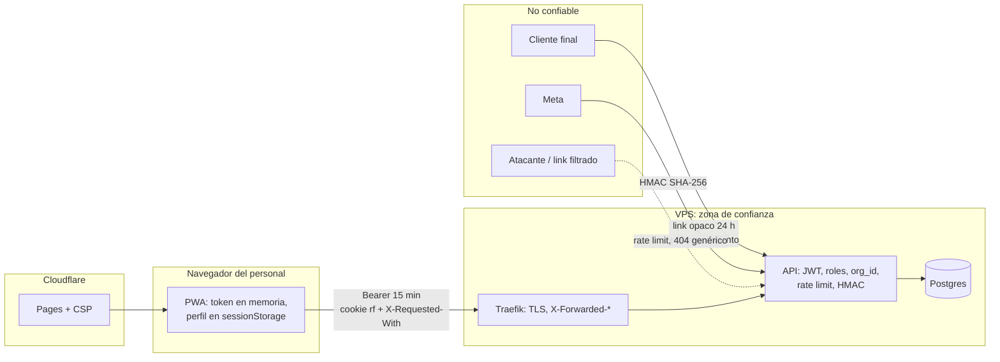

> Ver también: `modelo-de-amenazas.md` (amenazas AM-nn), `datos-personales.md` (inventario, derechos, brechas) y `03-plan/riesgos.md` (RK-nn).

# Seguridad y privacidad

> **Resumen.** Sesión de 15 min con refresh rotativo en cookie, bloqueo por cuenta, 2FA solo para `dev`, aislamiento por `org_id` del JWT (404 y no 403), credenciales de Meta cifradas por organización, links públicos de 24 h con token opaco, y cumplimiento de la Ley 1581 con supresión solo por `dev`. Los puntos débiles conocidos están como PREG al final (§13).

### Fronteras de confianza

Cada flecha entrante cruza una frontera donde la API valida: firma (Meta), token de link (cliente), JWT y rol (personal). Nada se confía por venir de la web propia.

Cómo se autentica, se autoriza, se aísla cada organización y se protegen los datos personales. Complementa `01-funcional/actores-y-permisos.md` (qué rol puede qué) y `integraciones.md` (servicios externos). Nada aquí incluye claves, secretos ni datos reales.

## 1. Sesión del personal

| Pieza | Valor | Dónde |
|---|---|---|
| Access token | JWT **HS256** (firma y verificación fijadas a ese algoritmo), **15 min**, payload `{ userId, orgId, role }` | `routes/auth.ts › issueSession`, `server.ts` (registro de `@fastify/jwt`) |
| Secreto JWT | `JWT_SECRET`, mínimo 32 caracteres o la API no arranca | `config.ts › envSchema` |
| Refresh token | 40 bytes aleatorios en hex; en la base solo su **SHA-256** (`RefreshToken.token_hash`, único); vence a los **7 días** | `issueSession` |
| Cookie | `rf`, `httpOnly`, `path=/api/v1/auth`, `maxAge` 7 días. Con HTTPS: `Secure` + `SameSite=None` (web y API son orígenes distintos); con HTTP (local): `SameSite=Lax` | `auth.ts › cookieOpts` |
| En el navegador | Access token solo en memoria; en `sessionStorage` solo el perfil del usuario | `apps/web/src/store/auth.ts` |

- **Rotación:** cada `POST /auth/refresh` revoca el token presentado y emite uno nuevo con otros 7 días, así que la sesión se extiende mientras se use al menos una vez por semana *(código)*.
- **Rotación bajo bloqueo:** el reclamo del token viejo y la creación del nuevo van en una transacción que primero toma `SELECT … FOR UPDATE` sobre la fila del usuario. Si dos peticiones presentan la misma cookie a la vez, solo una gana; la otra se trata como reutilización *(código)*.
- **Detección de reutilización:** presentar un token ya revocado revoca **todos** los refresh tokens activos del usuario y responde 401 `TOKEN_REUSE_DETECTED` *(código; test `auth.test.ts › "detects refresh-token reuse: replaying a rotated-away cookie returns 401 TOKEN_REUSE_DETECTED and revokes the whole family"`)*.
- **CSRF:** `/refresh` es la única ruta que se autentica por cookie; exige `X-Requested-With: XMLHttpRequest` (403 `CSRF_CHECK_FAILED` si falta). Un sitio ajeno no puede poner esa cabecera sin una preflight CORS que la lista de orígenes rechaza *(código; test `auth.test.ts › "rejects refresh with no X-Requested-With header -> 403 CSRF_CHECK_FAILED, even with a valid cookie"`)*. El resto de rutas usa `Authorization: Bearer`, que no es vulnerable a CSRF.
- **Refresh con usuario u organización inactivos:** revoca ese token y responde 401. El refresh relee el rol desde la base *(código)*.
- **Revocación activa:** el reset de contraseña por un admin y la desactivación de un usuario revocan todos sus refresh tokens y desconectan sus sockets (`users.ts`). Cambiar el rol desconecta los sockets del usuario pero no revoca sus refresh tokens. **`authenticate` consulta la base en cada petición** (`active`, `role`, `org_id` por clave primaria): un usuario desactivado, inexistente, o cuyo rol ya no es el del token recibe 401 al instante, sin esperar los 15 min. Tras un cambio de rol, la web renueva con `/auth/refresh` y sigue con el rol nuevo; con una cuenta desactivada el refresh falla *(código; `access-immediate.test.ts`; PREG-065 resuelta)*.
- Los refresh tokens revocados o vencidos de un usuario se borran en su siguiente login exitoso; no hay otra limpieza *(código)*.
- `POST /auth/logout` exige un access token válido y revoca el refresh token de la cookie *(código)*.

## 2. Login, bloqueo y 2FA (`routes/auth.ts`)

**Defensas contra ataques de tiempo** *(código)*:
- `bcrypt.compare` se ejecuta siempre: contra el hash real o contra `DUMMY_HASH` si el email no existe.
- Una contraseña incorrecta contra una cuenta real escribe el contador; contra un email inexistente se hace un `updateMany` de igual costo sobre un id ficticio (`DUMMY_USER_ID`). El registro de auditoría `auth.login_failed` no se espera, para no alargar esa rama.
- Email inexistente, contraseña incorrecta y organización inactiva responden igual: 401 `INVALID_CREDENTIALS` *(test `auth.test.ts › "rejects login with a nonexistent email using the SAME error code (timing-attack protection)"`)*.

**Bloqueo por cuenta** (independiente del límite por IP) *(código; test `auth.test.ts › "locks the account after 5 wrong passwords, notifies the owner by email, and rejects further attempts (even the RIGHT password) with 429 ACCOUNT_…"`)*:

| Fallos acumulados | Bloqueo |
|---|---|
| 5 | 5 min |
| 10 | 15 min |
| 15, 20, 25… | 1 h cada vez |

- El contador sube con `{ increment: 1 }` atómico y solo se reinicia con un login completo, un código 2FA correcto o un reset de contraseña por el admin. No decae con el tiempo.
- Durante el bloqueo, incluso la contraseña correcta recibe 429 `ACCOUNT_LOCKED` con un mensaje genérico (sin minutos restantes, para no revelar cuántos ciclos lleva la cuenta).
- Cada vez que se aplica un bloqueo se envía un correo al dueño de la cuenta (Resend, sin esperar la respuesta).
- Una contraseña correcta con la organización inactiva **no** cuenta como fallo *(test `auth.test.ts › "a correct password does NOT count as a failed attempt, even when the account's organization is inactive"`)*.

**2FA por correo** — solo si `REQUIRE_2FA` está activo **y** el rol es `dev`; admin, encargado y domiciliario nunca lo ven *(código; tests en `auth-2fa.test.ts`)*:

| Regla | Valor |
|---|---|
| Código | 6 dígitos con `crypto.randomInt`; en la base, HMAC-SHA256 con `JWT_SECRET` como pimienta |
| Vigencia | 5 min |
| Intentos por código | 5, reclamados con un `updateMany` atómico (`attempts < 5` en el WHERE) |
| Reenvío | Si hay un código vigente de menos de 30 s, se reutiliza y no se manda otro correo |
| Tope de emisión | 5 códigos por cuenta en 15 min, luego 429 `CODES_RATE_LIMITED` |
| Código incorrecto | También suma al contador de bloqueo de la cuenta |

- `REQUIRE_2FA` se lee con `lib/envBool.ts › parseEnvBool`: `true`/`1`/`yes`/`on` encienden; `false`/`0`/`no`/`off`, vacío o ausente apagan (sin distinguir mayúsculas); un valor desconocido enciende (falla cerrado) *(código; `envBool.test.ts`; PREG-064 resuelta)*.
- `/login/verify-code` no mira `locked_until`: una cuenta bloqueada puede seguir gastando los intentos que le quedan al código vigente (como máximo 5) *(código)*. Ver PREG-066.

**Política de contraseñas** (`lib/password.ts › passwordSchema`): mínimo 12 caracteres, con al menos una mayúscula, una minúscula y un número. Se aplica al crear usuarios, al resetear contraseñas y al crear una organización desde DevTools; **el login no la aplica**, para que sigan entrando cuentas anteriores a la política. Hash bcrypt de costo 12. No existe cambio de contraseña por el propio usuario: solo el reset que hace un admin o un dev *(código)*.

## 3. Roles

- `middleware/auth.ts › authenticate` verifica el JWT y además **rechaza** cualquier token sin `userId` o sin `role`. Hoy los links de formulario son tokens opacos (ya no JWT), así que esta comprobación es defensa en profundidad *(código)*.
- `requireRole(...roles)`: `dev` pasa **todas** las verificaciones de rol *(código)*.
- Un admin nunca ve ni toca cuentas `dev`: listar, editar y resetear filtran `role != 'dev'` y responden 404 como si no existieran. Ni siquiera un dev puede crear otra cuenta `dev` por la API (el enum de creación no incluye `dev`) *(código)*.
- **Brecha observada:** `tickets.ts › POST /` solo pide `authenticate` y hace *upsert* por `(org_id, phone)`. Con un teléfono que ya existe, **sobrescribe `customer_name`** del ticket, aunque renombrar un ticket con `PATCH /tickets/:id` es solo para admin. Cualquier rol, domiciliario incluido, puede hacerlo *(código, sin test)*. Ver PREG-067.

## 4. Aislamiento entre organizaciones

Regla general (principio 2): toda consulta filtra por `org_id` tomado del JWT (`req.user.orgId`), normalmente con `findFirst({ where: { id, org_id } })`. Si no coincide, la respuesta es 404, no 403, para no revelar que el recurso existe en otra organización *(código)*.

| Entrada sin JWT de personal | Cómo resuelve la organización |
|---|---|
| Webhook de Meta | `metadata.phone_number_id` → `Organization.wpp_meta_phone_id` (único, ver `config.test.ts › "rejects a second org claiming the SAME wpp_meta_phone_id with 409 PHONE_ID_ALREADY_IN_USE, not a raw 500"`) |
| Recibos de estado de Meta | `wpp_message_id` (único en toda la base) |
| Formulario público | Token → ticket → `org_id` del ticket |
| Factura pública | `filename` → fila `InvoiceLink` |

- **Excepción deliberada:** las rutas de `dev.ts` aceptan un `orgId` explícito (`/dev/db`, `/dev/charges`, `/dev/actions/*`, `/dev/organizations`), porque `dev` es el operador de la plataforma y no un tenant *(código; test `dev-centro-mando.test.ts › "permite al dev consultar una organización distinta a la propia"`)*. Cada lectura de `/dev/db` queda auditada (`dev.db_read`).
- Pero `inbox.ts › POST /:ticketId/erase-data` filtra por el `org_id` **del JWT del dev**, así que un dev solo puede borrar datos de tickets de su propia organización *(código)*. Ver PREG-042.
- Hay tests de aislamiento en pedidos, multimedia, reenvío, Tomar lista, facturas, precios masivos y facturación (p. ej. `orders.test.ts › "GET /orders?fecha=X only returns orders for the requesting user org (multi-tenant isolation)"`).

## 5. Cifrado de credenciales de WhatsApp (`lib/crypto.ts`)

- `Organization.wpp_meta_token` se guarda con **AES-256-GCM** (IV de 12 bytes, etiqueta de 16) usando una **clave derivada por organización**: HMAC-SHA256(clave maestra, `org.id`). La clave maestra es `WPP_TOKEN_ENC_KEY` (64 caracteres hex) *(código)*.
- **Formatos que se leen:** `enc:v2:` (actual, clave por organización), `enc:v1:` (heredado, clave maestra directa) y texto plano (heredado). Solo se escribe `v2`. El script `src/reencrypt-wpp-tokens.ts` pasa filas viejas a `v2` *(código)*.
- **Sin clave:** `encryptSecret` guarda en texto plano (con un warning una sola vez) y `decryptSecret` devuelve el valor guardado sin descifrar; Meta lo rechazará, que es el fallo seguro. Un descifrado que falla devuelve `null` *(código)*.
- **En producción la API no arranca sin la clave** (`config.ts`, si `APP_ENVIRONMENT_NAME=production`). Esa variable solo admite `production`, `staging`, `dev` o `test`, y con `NODE_ENV=production` es obligatoria, para que un error de escritura no apague el modo estricto en silencio *(código)*.
- El token nunca se devuelve por la API: `GET /config/org` y el visor `/dev/db` lo excluyen, y la auditoría de `config.wpp_update` registra solo qué campos cambiaron *(código)*.

## 6. Webhook

Verificación HMAC-SHA256 con el `META_APP_SECRET` global y comparación de tiempo constante; obligatoria en producción (sin el secreto, la API no arranca), opcional fuera de ella. Ventana de reproducción de 10 min y deduplicación por id de mensaje. Detalle en `integraciones.md` §1.2. **Sin test con firma:** los tests corren sin `META_APP_SECRET` *(código)*.

## 7. Links públicos (formulario y factura)

| Aspecto | Formulario (`public.ts`, `lib/formLink.ts`) | Factura (`files.ts`) |
|---|---|---|
| Secreto del link | Token opaco de 20 bytes = **40 hex** (`form_link_token`, único) | Nombre de archivo con 20 bytes aleatorios en hex (`InvoiceLink.filename`) |
| Vigencia | **24 h fijas** desde la emisión (`form_token_min_iat`), abierto o no | **24 h fijas** desde `created_at` |
| Reemplazo automático | Emitir un link nuevo sobrescribe el token: el anterior deja de existir | Una factura nueva del **mismo pedido** revoca las anteriores de ese pedido (no las de otros pedidos del chat) |
| "Bloquear link" | `POST /inbox/:ticketId/form-link/revoke` (cualquier rol); también revoca las facturas del ticket | Muere con el bloqueo del formulario del ticket |
| "Bloquear todos" | `POST /inbox/form-links/block-all` (admin): sella `form_links_blocked_at`; los links emitidos después funcionan | Igual, comparando `created_at` |
| Respuesta a un link muerto | Mensaje genérico `INVALID_TOKEN` (no revela el motivo) | 404/410 con mensaje "pide que te reenvíen" |

*(código; tests `public.test.ts › "a link dies past the flat 24h cap, whether or not it was ever opened"`, `› "sending a fresh form-link automatically supersedes (kills) every earlier still-unexpired link for the same ticket …"`, `files.test.ts › "expires at 24h absolute, even if it was opened in time"`, `› "the org-wide \"Bloquear todos los links\" also kills every outstanding factura …"`)*

- Ya no se pide confirmar los últimos 4 dígitos del teléfono: el link es la única barrera. Las rutas que todavía reciben `phone_last4` lo ignoran *(código; test `public.test.ts › "phone_last4 is no longer checked at all …"`)*.
- **Topes contra el abuso de un link filtrado:** como máximo 3 pedidos nuevos por ticket y día desde el formulario (`MAX_FORM_ORDERS_PER_TICKET`), y 30 mensajes automáticos por ticket en 24 h (`MAX_AUTOMATED_FORM_MSGS_PER_DAY`). Pasado ese tope, la confirmación se guarda con `failed_reason` y no se envía *(código)*.
- **Endurecimiento muerto** *(código)*:
  - ~~`device_token`~~: quitado el 2026-10-10. Las rutas públicas ya no lo exigen ni lo guardan (una página vieja que lo mande se ignora) y la página no lo envía. El link no está atado a un dispositivo *(tests `public.test.ts › "the link is not locked to whichever device opened/submitted it first …"`, `"an old client still sending device_token is accepted and it is ignored; omitting it also works"`)*. La tabla `FormLinkSession` sigue en el esquema, sin uso (solo `erase-data` hace un `deleteMany` inofensivo); se borrará en un release posterior.
  - `lib/linkSecurity.ts › registerFailedLinkAttempt` **no tiene llamadores**: la escalera de bloqueo (10 intentos = links muertos, 30 = chat bloqueado 24 h) nunca se dispara, aunque `loadTicketByFormToken` y `loadLiveInvoiceLink` siguen comprobando esos contadores. Código dormido a propósito (DT-012).
- Las rutas `GET` públicas no tienen límite propio (300/min por IP); con 160 bits de entropía en el token, adivinarlo no es viable *(inferido)*.

## 8. Validación y saneamiento de entradas

- **Mensajes salientes armados con texto del cliente** (`lib/sanitize.ts › sanitizeForWhatsApp`): quita caracteres de control, escapa `* _ ~ \``, cambia saltos de línea por espacios y corta a 200 puntos de código. Se usa en las confirmaciones del formulario (producto, cantidad, dirección), solo en `public.ts`. El texto del personal y las plantillas de la organización no se sanean: se consideran confiables *(código)*.
- **Firma real de archivos** (`lib/media.ts`): las imágenes que sube el personal deben coincidir en bytes con JPEG, PNG o WebP **y** con el tipo declarado. Audio, video y documento se comprueban por firma cuando el formato la tiene (`%PDF`, `ftyp`, `OggS`); mp3, amr y 3gpp se aceptan por tipo declarado dentro de una lista cerrada. Las vistas de multimedia de Meta se revalidan en cada petición. Las facturas exigen `%PDF` *(código; test `inbox.test.ts › "POST /:ticketId/send-image rejects a file whose real bytes don't match the declared mime_type …"`)*.
- **Tamaños:** cuerpo por defecto de 1 MB; imagen 5 MB, audio y video 16 MB, documento 100 MB (más el sobrecosto de base64); factura 20 MB; PDF de cobro de plataforma 6 MB *(código)*.
- **SSRF:** lista cerrada de hosts para descargar multimedia de Meta (`integraciones.md` §1.3). No hay otras peticiones a URLs que provengan de datos externos *(código)*.
- **Inyección de fórmulas en CSV** (`apps/web/src/lib/csv.ts › csvField`): el CSV del cierre antepone `'` a todo campo que empiece con `= + - @`, tabulador o retorno de carro, y duplica las comillas. Es el único CSV que se genera; la exportación de productos a Excel no tiene esa guarda (sus datos los escribe el admin) *(código)*.
- **Rutas de archivos locales:** el nombre de factura debe cumplir `^Factura[_-][a-zA-Z0-9_-]+\.pdf$`, y antes de servir desde disco se comprueba con `realpath` que el archivo esté dentro de `uploads/` *(código)*.

## 9. Auditoría (`lib/audit.ts`)

Escritura *best-effort*: si falla, deja un `console.error` y la acción sigue. Se guarda en `AuditLog` (organización, actor, acción, objetivo, metadata). Hay **16 acciones**:

| Acción | Dónde |
|---|---|
| `auth.login_success`, `auth.login_failed` | `routes/auth.ts` |
| `user.create`, `user.update`, `user.reset_password` | `routes/users.ts` |
| `config.wpp_update` (solo nombres de campos), `config.message_templates_update` | `routes/config.ts` |
| `ticket.erase_customer_data` | `routes/inbox.ts › POST /:ticketId/erase-data` |
| `dev.db_read`, `dev.org_created`, `dev.cierre_reopened`, `dev.test_ticket_created`, `dev.charge_created`, `dev.charge_updated`, `dev.charge_deleted`, `dev.charge_status_changed` | `routes/dev.ts` |

*(código)*. **No se auditan:** logout, bloquear o revocar links, "bloquear todos", cambios de productos y precios, empleados y `POST /dev/seed` (este solo deja un `warn` en el log). Los cambios de pedidos van a `order_history`, que es inmutable. Ver PREG-098.

## 10. Transporte, cabeceras y sockets

- **HTTPS obligatorio en la API:** con `NODE_ENV=production`, toda petición que no llegue por HTTPS (según `X-Forwarded-Proto` de Traefik) recibe 400 `HTTPS_REQUIRED`, salvo `/health` *(código, `server.ts`)*.
- **`trustProxy`** confía solo en el salto 0 (Traefik), para que un cliente no pueda elegir su IP con `X-Forwarded-For` y saltarse los límites *(código)*.
- **Cabeceras de la API:** `Strict-Transport-Security: max-age=31536000; includeSubDomains; preload` en toda respuesta, más los valores por defecto de `@fastify/helmet` (nosniff, anti-frame, CSP para respuestas JSON/PDF). CORS solo para los orígenes de `FRONTEND_URL` (lista separada por comas) con credenciales; las rutas `/api/v1/public/*` responden además `Access-Control-Allow-Origin: *` *(código)*.
- **Cabeceras de la web** (`apps/web/public/_headers`, Cloudflare Pages): `X-Frame-Options: DENY`, `nosniff`, `Referrer-Policy: strict-origin-when-cross-origin`, CSP (`script-src 'self'`, estilos propios más Google Fonts, `frame-ancestors 'none'`, `object-src 'none'`; `connect-src` permite cualquier `https:` y `wss:`) y `Permissions-Policy` que niega cámara, micrófono, geolocalización, pagos y USB *(código)*.
- **Socket.io** (`plugins/socket.ts`): el JWT se verifica al conectar y se rechazan tokens sin `userId`/`role`. El handshake además contrasta `active`, `role` y `org_id` contra la base (rechaza a un desactivado o con rol cambiado). El socket se **desconecta solo al vencer el token** (temporizador hasta `exp`) y también cuando se resetea la contraseña, se desactiva al usuario o se le cambia el rol (sala `user:<id>`). `join:org` solo une a la organización del token; `join:date` crea la sala `org:<orgDelToken>:date:<fecha>` *(código, sin test)*.

## 11. Ley 1581 de 2012 (datos personales)

| Requisito | Cómo se cumple | Fuente |
|---|---|---|
| Aviso de privacidad | Se pega al mensaje de bienvenida **una sola vez por ticket**; `privacy_notice_sent_at` se sella solo si el envío a Meta tuvo éxito. Enlaza a `/legal/politica-privacidad` en la propia web | `webhook.ts`, `formLink.ts › buildPrivacyNoticeMessage` *(test `webhook.test.ts › "a SECOND message from the same ticket … does NOT repeat the privacy notice …"`)* |
| Consentimiento | Casilla obligatoria en **cada** envío del formulario (también al editar): sin `consent: true` → 400 `CONSENT_REQUIRED`. Se sella `Order.consent_confirmed_at` y `privacy_policy_version` (hoy `v2`; los consentimientos anteriores conservan `v1`); `Ticket.consent_given_at` solo la primera vez | `public.ts › POST /submit` *(tests en `public.test.ts`, bloque "consentimiento de tratamiento de datos")* |
| Versión de la política | `PRIVACY_POLICY_VERSION` se sube a mano cuando cambia el texto de `apps/web/public/legal/politica-privacidad.html` (`v2` desde 2026-10-10: agrega el uso de IA sobre productos y cantidades) | `formLink.ts` |
| Multimedia del chat | Nunca se guarda; solo el id de Meta (30 días) | `integraciones.md` §1.3 |
| Supresión | Solo rol `dev`, con `POST /inbox/:ticketId/erase-data` (ver abajo) | `inbox.ts` *(test `inbox.test.ts › "anonimiza TODOS los pedidos del ticket …"`)* |

- El aviso solo sale si la organización tiene `welcome_message` y no tiene `wpp_redirect_message`. Sin mensaje de bienvenida, el aviso nunca se envía. Los pedidos que el personal crea a mano no llevan consentimiento registrado (solo existe en el formulario) *(código)*. Ver PREG-022.
- La política publicada es una sola para toda la plataforma, con los datos de un único negocio escritos en el HTML *(código)*.

**Qué hace la supresión** *(código)*: en una transacción, anonimiza **todos** los pedidos del ticket (`customer_name`, `client_contact_name`, `customer_phone`, `address`), borra los mensajes del chat, la revocación y la sesión del formulario, revoca las facturas y enmascara su `phone_last4`, y anonimiza el ticket (nombre, teléfono reemplazado por un valor aleatorio, `bsuid` y `raw_payload` en nulo, campos del link en blanco). Conserva `consent_given_at` como prueba del consentimiento previo. Deja la entrada `ticket.erase_customer_data`.

**Qué NO borra** *(código, límites documentados en la propia ruta)*:
- `order_history` (`value_before`/`value_after` con nombres, teléfonos o direcciones anteriores): es inmutable por reglas de PostgreSQL.
- `OrderObservation` (texto libre del personal).
- `Order.notes`, que puede contener texto del cliente o marcadores. Ver PREG-037.
- Los PDF de factura en R2 (solo se revocan los links).
- Lo que ya está en los respaldos diarios de la base (hasta que la regla de ciclo de vida del bucket los borre), en Meta y en los logs *(inferido)*.

**Retención:** no hay ninguna purga automática de mensajes, `raw_payload`, pedidos, `audit_logs` ni códigos 2FA. La política publicada dice "solo el tiempo necesario" *(código)*. Ver PREG-097.

## 12. Límites de peticiones (`@fastify/rate-limit`)

| Ruta | Límite | Clave |
|---|---|---|
| Global (toda ruta sin límite propio) | 300/min | `userId` de un JWT **verificado**; si no, IP |
| `POST /auth/login` | 10/min | IP (no hay JWT) |
| `POST /auth/login/verify-code` | 20/min | IP |
| `POST /auth/refresh` | 20/min | IP |
| `POST /webhook` | 2000/min | IP |
| `POST /public/submit`, `POST /public/order/:orderId/delete` | 15/min | **Solo IP** (`keyGenerator` propio; el token lo controla quien llama) |
| `POST /inbox/:ticketId/parse-messages` | 15/min | Usuario |
| `POST /inbox/messages/:messageId/forward` | 20/min | Usuario |
| `POST /inbox/:ticketId/send-image`, `/send-audio`, `/send-video`, `/send-document` | 60/min cada una | Usuario |
| `POST /files/invoice` | 20/min | Usuario |

*(código)*. Un límite por ruta **reemplaza** al global, no se suma. Hay topes fuera de HTTP en §2 (bloqueo, códigos 2FA) y §7 (pedidos y mensajes por link). En los tests el límite global es de 100/min por IP, con una IP aleatoria en cada `inject` (`test/helpers.ts`).

## 13. Riesgos aceptados y hallazgos abiertos

**Riesgos aceptados (postura conocida por la historia del proyecto)** *(inferido)*:
- **Puerto de Postgres expuesto a internet a través de un proxy**, para que el respaldo diario en GitHub Actions pueda conectarse. La protección es la credencial de la conexión (guardada como secreto de GitHub), no la red.
- **Servicios del VPS fuera del proxy de Cloudflare:** no tienen WAF ni mitigación DDoS de Cloudflare delante; dependen de Traefik y de los límites de la propia API. Si se ponen detrás de Cloudflare, revisar `trustProxy` (ver `integraciones.md`, "Si tocas X").
- **Fuera de producción** (`APP_ENVIRONMENT_NAME` distinto de `production`) se relajan a propósito: webhook sin HMAC, tokens de WhatsApp sin cifrar si falta la clave, y `/dev/seed` habilitado.
- **Pérdida de multimedia a los 30 días** (decisión de negocio, `lib/media.ts`).
- **2FA solo para `dev`:** las cuentas admin, que pueden resetear contraseñas y ver todo el negocio, entran solo con contraseña (decisión explícita, comentada en `auth.ts`).

**Hallazgos de esta lectura** (ver Pendientes): (resueltos: el access token tras desactivar o cambiar el rol, y `REQUIRE_2FA="false"`); cualquier rol puede renombrar un ticket por `POST /tickets`; el endurecimiento de links está muerto (escalera de bloqueos; el `device_token` ya se quitó); la supresión no alcanza otras organizaciones ni `Order.notes`; no hay retención automática; la auditoría tiene huecos; el CSP de la web permite conexiones a cualquier `https:`/`wss:`.

## Pendientes

- **PREG-067** — `POST /tickets` (cualquier rol) sobrescribe el `customer_name` de un ticket existente, lo que esquiva el `PATCH` que es solo de admin. ¿Es intencional?
- **PREG-035** — Resuelta en parte (2026-10-10): `device_token` se quitó. Quedan `FormLinkSession` (tabla sin uso, a borrar en un release posterior) y `registerFailedLinkAttempt` (sin llamadores, DT-012).
- **PREG-042** — `erase-data` filtra por la organización del dev, no por la del ticket. ¿Cómo se atiende una solicitud de supresión de un cliente de otra organización?
- **PREG-037** — `erase-data` no limpia `Order.notes` (y no puede tocar `order_history`). ¿Se acepta, o hay que redactar las notas?
- **PREG-097** — No hay purga automática de datos personales (mensajes, `raw_payload`, pedidos, `audit_logs`). ¿Cuál es el plazo de retención según la política?
- **PREG-098** — La auditoría no registra bloqueos de links, "bloquear todos", cambios de catálogo y precios, empleados ni `/dev/seed`. ¿Hace falta?
- **PREG-022** — El aviso de privacidad depende de que exista `welcome_message` (y de que no haya `wpp_redirect_message`), y los pedidos creados a mano no registran consentimiento. ¿Basta para la Ley 1581?
- **PREG-066** — `/login/verify-code` no respeta `locked_until`. ¿Debe cortar también durante el bloqueo?
