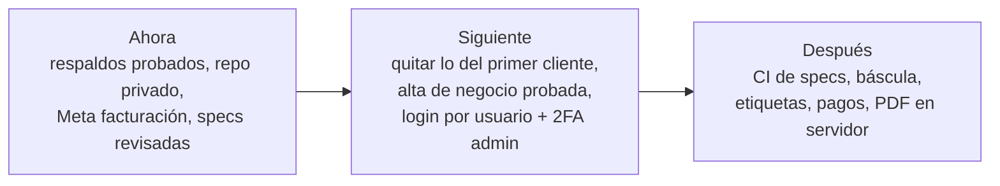

# Roadmap

> **Resumen.** Ordenación propuesta en tres franjas (Ahora, Siguiente, Después) de 22 ítems numerados de forma estable. "Ahora" protege el dinero y la producción del cliente actual; "Siguiente" prepara al segundo cliente; "Después" son mejoras e ideas sin compromiso. La dirección de fondo (báscula, pagos, multi-negocio) está en `00-horizonte.md`.

> **Todo propuesto, a confirmar con José.** Es una ordenación sugerida a partir de `00-estado-actual.md` y de los pendientes que se ven en los módulos; no hay compromisos de fecha. Los textos completos de cada pregunta, bug o deuda viven en `preguntas-abiertas.md` y `problemas-conocidos.md`, y los cambios grandes necesitan su `CH-nnnn` antes de programar (principio 10).

## Ahora

Lo que protege el dinero del cliente actual o la producción.

| # | Item | Por qué | Módulo / área |
|---|---|---|---|
| 1 | ~~Decidir la regla de créditos pagados en cierre e informe~~ → **decidido (D-19):** no se acomodan por ahora; se retoma si el cliente lo pide. | Ver `05-historia/decisiones.md`. | CAJ, DSH |
| 2 | Responder `preguntas-abiertas.md` y promover a bug lo que José confirme. | Desbloquea los cambios de comportamiento; mientras tanto las specs solo describen lo actual. | todos |
| 3 | **Probar la restauración de respaldos** con el simulacro de los pasos 1 a 5 del runbook. | El procedimiento está escrito pero marcado como no probado; un respaldo que nunca se restauró no es una garantía. | `04-operacion/runbooks.md` |
| 4 | Terminar el paso del repositorio a **privado** y el redeploy de prod. | Ya planeado; deja prod sobre la GitHub App y alineada con `dev`. | `04-operacion/entornos-y-despliegue.md` |
| 5 | Resolver con Meta el **problema de facturación** de la cuenta de WhatsApp. | Mientras dure, ningún mensaje saliente (bienvenida, respuestas, formulario) llega al cliente final. | WPP, INB |
| 6 | Revisión independiente de cada módulo (pasar `borrador` a `vigente`) y prueba de arranque en frío de las specs. | Es el cierre de la adopción de SDD. | `specs/` |

## Siguiente

Preparar el sistema para un segundo cliente y endurecer la operación.

| # | Item | Por qué | Módulo / área |
|---|---|---|---|
| 7 | **Limpieza de lo específico del primer cliente:** cuenta bancaria en las plantillas por defecto, logo y política de privacidad fijos. | Principio 2: nada de un cliente va fijo en el código. Es requisito antes de dar de alta a otro negocio (ver `problemas-conocidos.md`). | WPP, FAC, FRM, PLT |
| 8 | Probar el **alta de un negocio de punta a punta** con una organización de prueba. | Verifica de verdad el aislamiento por `org_id` y el flujo de PLT antes del cliente real. | PLT, ACC |
| 9 | **Ventana de reinicio del VPS** para aplicar el kernel pendiente. | Con caja cerrada, fuera de horario de pedidos y con respaldo fresco (runbook). | `04-operacion/runbooks.md` |
| 10 | **Regenerar el manual de usuario** desde `01-funcional`. | El manual actual está desactualizado; las specs ya son la fuente. | `archivo/Requerimientos/` |
| 11 | Alinear **interfaz y API** donde difieren (botones que la API rechaza, cierre de caja del encargado). | Reduce confusión del personal; cada caso necesita decisión de José. | ORD, CAJ, INB |
| 12 | Script de **detección de deriva** (drift) entre specs y código. | Las specs citan `ruta › símbolo` y tests por título; un script puede avisar cuando ya no existen. | `specs/`, `.github/` |
| 19 | **Inicio de sesión con nombre de usuario** (en vez de correo) y **2FA también para administradores**. | Plan gradual de José: hoy se mantiene lo más simple posible para el primer cliente; el campo `username` ya existe pero no sirve para entrar. | ACC |
| 21 | Que el **administrador de cada negocio** pueda borrar datos de un cliente final (hoy solo `dev`). | Decisión de José: se abrirá cuando haya más clientes (D-17). | INB, ACC |
| 22 | **Atención de solicitudes de titulares** (acceso, rectificación, supresión de datos de un cliente final): definir quién las atiende, por qué canal y dónde se registran. | Ley 1581; hoy se resuelven a mano y sin registro (PREG-134, `02-tecnico/datos-personales.md`). Decisión de José 2026-10-10: va a la lista, se define después. | PLT, INB |
| 23 | **Cifrado y política de privacidad:** decidir si se cifran más datos (mensajes, teléfonos) o se ajusta el texto de la política, que hoy dice "protegidos con cifrado" y solo se cifran los tokens de Meta. | Coherencia entre lo que se promete y lo que se hace (PREG-135). José 2026-10-10: analizar cómo hacerlo bien. | PLT, WPP |
| 24 | **Bloqueo de cuenta por terceros:** hoy quien conozca el correo de un administrador puede bloquearlo hasta 1 h con intentos fallidos. Analizar una solución (por ejemplo bloqueo por origen además de por cuenta). | Riesgo de denegación a un administrador (PREG-133). José 2026-10-10: hay que solucionarlo; falta analizar cómo. | ACC |
| 25 | **Cierre de caja congela todo, sin excepciones de movimiento:** con el día cerrado no se crea, edita, mueve, restaura ni elimina ningún pedido, ni siquiera el admin. Hoy restaurar (papelera o "eliminado por el cliente") y editar un pedido ya cobrado sí pasan en día cerrado. | Decisión de José 2026-10-10 (PREG-004, PREG-011). Todo queda exactamente donde quedó al cerrar. Falta confirmar qué pasa con el cobro retroactivo y con marcar un crédito como pagado (PREG-137). | CAJ, ORD |
| 26 | **Crédito con trazabilidad de fechas:** el crédito guarda y muestra en su modal "creado el día X, pagado el día Y". Un crédito pagado sigue sin sumar en los totales del cierre ni del informe (D-19). | José 2026-10-10 (PREG-004): no se suma en ningún total, pero debe quedar la fecha en que se creó y la fecha en que se pagó. | CAJ |
| 27 | **La vista previa del cierre debe mostrar exactamente lo que el servidor guarda** (pago dividido, pedidos eliminados por el cliente, créditos sin pagar). Idealmente una sola función de cálculo para servidor, informe y modal. | José 2026-10-10 (PREG-002, DT-004): hoy la ventana puede mostrar una cifra y el cierre guardar otra; hay que resolverlo. | CAJ, DSH |
| 28 | **Retirar el requisito `device_token`** de las rutas públicas y la tabla `FormLinkSession`, tras confirmar que nada los usa y corregir los comentarios falsos. | José 2026-10-10 (PREG-035): si no hace nada, se quita. Verificado el 2026-10-10: solo se exige en la validación y nunca se compara. | FRM |
| 29 | **Desactivar un usuario corta su acceso al instante** (no esperar los 15 min del access token), y lo mismo al cambiarle el rol. | José 2026-10-10 (PREG-065): al desactivar el perfil, se cierra la sesión y ya no tiene acceso. | ACC |
| 30 | **Política de privacidad: párrafo sobre la IA**, corto y al grano: la información del pedido (productos y cantidades) se procesa con inteligencia artificial para que la toma del pedido sea rápida y efectiva, sin procesar información personal del cliente. | José 2026-10-10 (PREG-051). Verificado el 2026-10-10: "Tomar lista" envía solo el texto de los mensajes que el personal selecciona más los nombres del catálogo; nunca teléfono ni nombre. Ojo: si el cliente escribió su nombre o dirección en un mensaje seleccionado, viaja en el texto. | WPP, IA |
| 31 | **Selector de organización para `dev` y vista de administración sin chats:** el desarrollador elige a qué organización entrar y ve su administración (configuración, usuarios, catálogo, informes) sin abrir los chats ni leer datos personales. Hoy solo ve la propia organización de su sesión, y entra directo a la de Fruver San Gabriel. | José 2026-10-10 (PREG-042, PREG-085, PREG-127): reestructuración para cuando haya más clientes; sirve también para atender solicitudes de otro negocio. A planear bien antes de construir. | PLT, ACC |
| 32 | **Plazo de retención de datos según la ley:** definir cuánto tiempo se guardan mensajes, pedidos y registros y borrarlos o anonimizarlos al vencer. | José 2026-10-10 (PREG-097): por ahora los datos se acumulan sin plazo (D-23); hay que planearlo bien conforme a la Ley 1581, con asesoría legal. | PLT |
| 33 | **Borrado de datos más completo:** evaluar borrar también PDF de factura en R2, notas de pedido y lo que hoy queda en el historial. | José 2026-10-10 (PREG-037): por ahora se borra lo que se pueda (D-22). Llegar al historial implica romper la inmutabilidad (principio 4); es una decisión de fondo para más adelante. | INB, FAC |

## Después

Mejoras de proceso e ideas de producto, sin fecha. (Los items numerados no van en orden: la numeración es estable y no se reutiliza.)

| # | Item | Por qué | Módulo / área |
|---|---|---|---|
| 13 | **Revisiones de specs en CI** (frontmatter, enlaces, `verificado` al día, ausencia de secretos). | Evita que la documentación se pudra sin que nadie lo note. | CI |
| 14 | Escribir **ADRs / decisiones `D-nn`** de ahora en adelante para cada cambio de principio o de arquitectura. | Registrar el porqué mientras está fresco (`05-historia/decisiones.md`). | proceso |
| 15 | Tests o decisión sobre código latente (escalera de bloqueo por intentos de link, `domActivos`, `POST /tickets` sin uso). | Deuda objetiva: código que existe y no se ejecuta o no se muestra. | INB, FRM, DSH |
| 16 | Ideas de fases del README (panel de super-admin ampliado, onboarding automático, cobro a clientes, dominio propio por cliente). | *Ideas, no compromisos* (*inferido*): se definen con cada negocio cuando la fase actual opere bien. | PLT, ACC |
| 17 | Ideas de inteligencia de negocio: clientes frecuentes, avisos de demora por WhatsApp, catálogo automático. | Igual: *ideas, no compromisos* (*inferido*); toda feature grande necesita su `CH`. | INB, CAT |
| 18 | Tienda web pública y pasarela de pagos en línea. | Explícitamente fuera de alcance hoy (`vision-y-direccion.md`); solo si el negocio lo pide. | fuera de alcance |
| 22 | **Báscula conectada** que llene el precio de cada línea, y después impresora de etiquetas y pasarela de pagos. | Rumbo del producto (José); ver `00-horizonte.md`. Hoy el trabajador digita el precio. La báscula debe llenar el total de la línea (D-02), sin cambiar esa regla. | ORD, CAT |
| 20 | Evaluar **generar el PDF de la factura en el servidor** (hoy se genera en el navegador). | Posible mejora de consumo, eficiencia y profesionalismo; sin fecha. | FAC |

## Cómo usar este archivo

- Cada vez que José confirme, cambie o descarte un item, actualizar este archivo y `00-estado-actual.md` en el mismo commit.
- Un item que se empiece a ejecutar y sea clase C obtiene su `03-plan/cambios/CH-nnnn-*.md`; aquí queda solo la referencia.
- Esta lista no sustituye las prioridades de `00-estado-actual.md`: si difieren, manda ese archivo hasta que José decida.

## Cambios propuestos (CH) que surgen de la revisión

- **CH propuesto:** panel de WhatsApp que actúe sobre la **organización elegida** (hoy solo la de la sesión) y desactivar una organización desde DevTools, necesarios para el segundo cliente (PREG-127, PREG-128).
