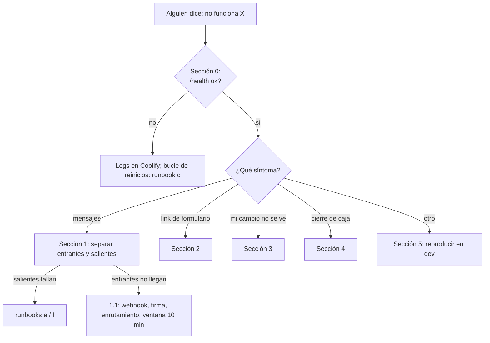

# Diagnóstico de incidentes (árbol de decisión)

> **Resumen.** Punto de entrada ante "no funciona X": primero el minuto cero (¿vive la API, qué versión, a quién le pasa), luego el árbol por síntoma (mensajes, link del formulario, deploy, cierre de caja). Diagnostica y enruta a `runbooks.md`; no repite los arreglos.



Punto de entrada cuando alguien dice "no funciona X". Este archivo **diagnostica y enruta**; los procedimientos de arreglo están en [`runbooks.md`](runbooks.md) (letras a–j) y no se repiten aquí. Reglas: en producción solo `SELECT`, con OK de José (`runbooks.md`, reglas generales); nunca pegues teléfonos ni nombres reales de clientes finales en specs, commits o chats con terceros.

## 0. Primer minuto (siempre)

| Comprobación | Cómo | Si falla |
|---|---|---|
| ¿La API vive? | `curl -s https://api.4client.shop/health` (dev: `https://dev-api.4client.shop/health`) → `{"status":"ok",...}` | Coolify › app › Logs; contenedor en bucle de reinicios → `runbooks.md` §c (rollback) |
| ¿Qué versión corre? | `docker ps` en el VPS: la imagen lleva el sha completo del commit | El sha no es el esperado → deploy pendiente o fallido (sección 3) |
| ¿Hay errores? | Logs del contenedor en Coolify (prod loguea desde nivel `warn`; busca nivel 50/60) y Sentry si `SENTRY_DSN` está puesto | Ver el mensaje exacto antes de teorizar |
| ¿A quién le pasa? | ¿A todos los clientes o a uno? ¿Desde cuándo? ¿Un negocio o todos? | Todos desde una hora exacta = infraestructura o Meta; uno solo = datos de ese ticket/pedido |

## 1. "Los mensajes dejaron de llegar / entregarse"

Primero separa la **dirección**. Consulta (prod, solo lectura):

```sql
SELECT direction, max(sent_at) AS ultimo, count(*) FILTER (WHERE failed_reason IS NOT NULL) AS fallidos
FROM ticket_messages WHERE sent_at > now() - interval '2 days' GROUP BY direction;
```

| Resultado | Diagnóstico | Ir a |
|---|---|---|
| **Salientes** con `failed_reason` y entrantes recientes | Meta rechaza lo que manda el negocio | Leer el `failed_reason`: "Business eligibility payment issue" → `runbooks.md` §e; token/sesión ("access token", código 190) → §f; ventana de 24 h vencida (el cliente no escribe hace más de 24 h) → no hay arreglo desde el sistema (no hay plantillas de Meta, PREG-034): el cliente debe escribir de nuevo |
| **Entrantes** sin movimiento (`ultimo` viejo) y salientes bien | El mensaje no llega a la API | Pasos de abajo (1.1) |
| Ambas direcciones vacías | API caída o Meta/número caído | Sección 0, luego el estado del número en Meta |
| Salientes sin `failed_reason` pero el cliente no los ve | Estado `delivered`/`read` no llega | El estado llega por el mismo webhook (`statuses`): si los entrantes llegan, revisar solo que el id del mensaje exista; si no, 1.1 |

### 1.1 Los mensajes entrantes no llegan

Orden de comprobación (cada paso descarta una causa):

1. **Meta entrega el webhook?** Meta for Developers › la App › WhatsApp › Configuración › webhook: URL y suscripción al campo `messages` activas. Cualquier cambio de dominio o de `META_WEBHOOK_VERIFY_TOKEN` exige reverificar (el GET devuelve el `hub.challenge` solo si el token coincide).
2. **Firma.** En los logs: `WPP: request sin firma X-Hub-Signature-256` o `WPP: firma HMAC inválida` → `META_APP_SECRET` del entorno no es el de la App de Meta (todas las organizaciones comparten una sola App, PREG-033).
3. **Enrutamiento.** Log `WPP: no org for phone_number_id` → el `phone_number_id` que manda Meta no está en ninguna organización **activa**: revisar `Organization.wpp_meta_phone_id` y `active` (`GET /api/v1/config/org` como admin; `GET /api/v1/dev/organizations` como dev). Típico tras un cambio de número (`runbooks.md` §f) o con un negocio nuevo sin configurar (`alta-de-negocio.md`).
4. **Ventana de 10 min.** Log `mensaje descartado por llegar con más de 10 minutos de retraso`: hubo una caída de la API y los reintentos de Meta se descartaron. Los mensajes se perdieron; avisar al personal (PREG-032).
5. **Sin fallo visible pero el cliente "no aparece".** El ticket es único por teléfono (principio 8): un cliente que vuelve continúa su ticket viejo, no uno nuevo; buscarlo ahí. Los tickets con `no_wpp_number` tienen teléfono de relleno.
6. **El chat se ve vacío pero hay tickets.** Distinguir los dos conceptos de día (principio 5): el tablero filtra por fecha del ticket (corte 21:00) y el selector de fecha.

## 2. "El link del formulario no funciona"

| Lo que ve el cliente | Causa | Qué hacer |
|---|---|---|
| "Link inválido o expirado" (401 `INVALID_TOKEN`; el mensaje no revela el motivo) | Pasaron 24 h desde que se generó; se emitió un link nuevo que reemplazó a este; el personal lo bloqueó; o hubo "Bloquear todos" después | Enviar un link nuevo desde el chat (botón "Enviar formulario"). Es el comportamiento diseñado, no un fallo (`../02-tecnico/seguridad-y-privacidad.md` §7) |
| 403 `TICKET_BLOCKED` | Chat bloqueado por intentos | Hoy el contador no se alimenta (DT-012); si ocurre, es un dato anómalo: avisar a José |
| 429 `FORM_LIMIT_REACHED` | Ya hizo 3 pedidos por formulario ese día | Pedirle que escriba por el chat; el personal crea el pedido a mano |
| `CONSENT_REQUIRED` | No marcó la aceptación de la política | Que la acepte; si el texto del formulario no la muestra, es un defecto de la web |
| La página no abre / en blanco | Web (Cloudflare Pages) o API caída, o `FRONTEND_URL` mal puesto en el entorno (los links se construyen con él) | Sección 0; comparar el dominio del link con el de `FRONTEND_URL` |
| El personal no puede enviar el link | La ventana de 24 h de WhatsApp vencida o fallo de envío | Sección 1 |

## 3. "El deploy no se disparó / no se ve mi cambio"

| Paso | Qué mirar |
|---|---|
| 1 | ¿Hiciste push a la rama correcta? `dev` → entorno dev; `main` → prod (solo con OK de José). Una rama de trabajo no despliega nada |
| 2 | Coolify › app › Deployments: ¿hay uno nuevo? No → `runbooks.md` §a. Sí pero falló → §b si es de red; si no, leer el log del build |
| 3 | `docker ps`/health: ¿la imagen tiene el sha nuevo? El contenedor viejo sigue vivo hasta que el nuevo pase el health check (~9–11 min); no hay corte |
| 4 | Contenedor nuevo en bucle de reinicios: casi siempre una variable obligatoria faltante o una migración fallida (`start.sh` corre `prisma migrate deploy`); el log al arrancar lo dice. Reglas de arranque por entorno: `entornos-y-despliegue.md` §2 |
| 5 | La web tarda aparte: Cloudflare Pages tiene su propio build; recargar sin caché |

## 4. "Problemas con el cierre de caja"

| Respuesta de la API | Significado | Qué hacer |
|---|---|---|
| 400 `NOT_TODAY` | El cierre solo acepta la fecha de hoy (Bogotá) | No se puede cerrar un día pasado desde la app (PREG-005) |
| 409 `ALREADY_CLOSED` | Ya hay cierre de ese día | Si fue por error: `runbooks.md` §h (solo el mismo día) |
| 400 `MISSING_DECISIONS` | Quedan pedidos sin cobrar ni decisión | El personal debe resolver cada pedido pendiente (cobrar, cerrar sin cobro o pasar a mañana) |
| 403 `FORBIDDEN` al cerrar la caja o abrir la vista previa | Solo el admin (y `dev`) cierra la caja; el encargado y el domiciliario reciben 403 (`GET /cierre/preview` y `POST /cierre`) | Que cierre el admin (RN-CAJ-31) |
| 409 `DAY_CLOSED` / "No me deja editar o cobrar un pedido" | Día cerrado: ese día no se crea, edita, mueve, restaura, elimina, cobra ni cobra retroactivamente (ni el admin); solo observaciones y marcar un crédito pagado. Si el día está abierto, el pedido está `cerrado` y bloqueado (solo admin/dev lo editan; el pago lo corrige solo el admin) | Confirmar con `SELECT * FROM daily_closes WHERE fecha = '<fecha>'`; excepciones en `../modulos/CAJ.md` |
| "Los totales no cuadran" | Un crédito pagado después, un `sin_asignar` o un método heredado no entran a ninguna bolsa | Es conocido y deliberado por ahora (D-19, PREG-001); no se "arregla" sin José |

## 5. Si nada de esto aplica

1. Reproduce en dev, nunca en prod.
2. Anota el síntoma, la hora, el negocio y el mensaje de error **exacto** (sin datos personales).
3. Si descubres un caso nuevo y resolviste el incidente, añade su fila aquí o un runbook en `runbooks.md` (misma rama, con asiento en el registro de cambios). Si dudas de la intención del código, regístralo como `PREG`.
