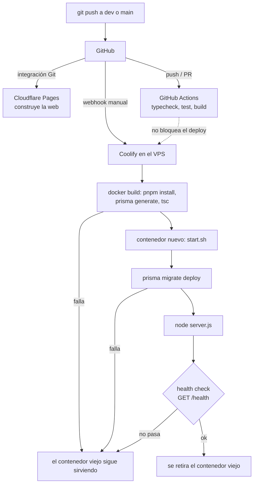

# Entornos y despliegue

> **Resumen.** Dos entornos aislados (dev y prod), cada uno con su API en un contenedor gestionado por Coolify en un VPS, su Postgres propio y su web en Cloudflare Pages. Un push a `dev` o a `main` redespliega solo (~10 min, rolling, con `prisma migrate deploy` al arrancar). No hay rollback de base: las migraciones son aditivas. Los archivos se guardan en R2 y la base de prod se respalda cada día fuera del VPS.

Qué entornos existen, cómo llega un commit a cada uno y cómo se vuelve atrás. El **proceso** (ramas, merges, quién aprueba) está en [`flujo-de-trabajo.md`](flujo-de-trabajo.md); aquí solo la infraestructura. Los procedimientos de emergencia están en [`runbooks.md`](runbooks.md).

> Nunca se escriben aquí la IP del VPS, los identificadores internos de Coolify ni valores de variables. Las cosas se nombran: "el VPS Contabo", app `4client-api-dev`, app `4client-api-prod`.

## 1. Mapa general

| Pieza | Dónde vive | Fuente |
|---|---|---|
| API (Fastify + Prisma) | Contenedor Docker en **el VPS Contabo**, gestionado con **Coolify** (proxy Traefik delante) | (José) |
| Base de datos | Un contenedor **Postgres 16** (16.15) por entorno en el mismo VPS, gestionado por Coolify. Versiones leídas el 2026-10-10: Postgres 16.15, Node 20.20.2 en las dos APIs, Docker 29.8.0 | (VPS) |
| Web (React + Vite, PWA) | **Cloudflare Pages** | (José), `apps/web/src/lib/apiBase.ts` (código) |
| DNS | Cloudflare | (José) |
| Facturas y cobros de plataforma (PDF) | **Cloudflare R2** (bucket de archivos) | (José), `config.ts › R2_*` (código) |
| Copia diaria de la base de prod | **Otro bucket R2**, solo para backups, escrito por GitHub Actions | `.github/workflows/backup-prod-db.yml` (código) |
| CI | GitHub Actions | `.github/workflows/ci.yml` (código) |

El VPS lo comparten otros proyectos ajenos a 4Client (José). Cualquier operación que reinicie Docker o el servidor los afecta también (ver `runbooks.md` › j).

## 2. Matriz de entornos

| | **dev** | **prod** | Fuente |
|---|---|---|---|
| Rama | `dev` | `main` | (José) |
| App en Coolify | `4client-api-dev` | `4client-api-prod` | (José) |
| URL de la API | `https://dev-api.4client.shop` | `https://api.4client.shop` | `apiBase.ts › DEV_API / PROD_API` (código) |
| URL de la web | `https://dev.4client.pages.dev` | `https://4client.shop` | (José), `apiBase.ts` (código) |
| Base | Postgres 16 propio (datos de prueba, migrados de Railway el 2026-09-20) | Postgres propio, datos reales del cliente (misma versión 16.15; el respaldo usa cliente 18, que es compatible) | (José), commit `9672ded` |
| `APP_ENVIRONMENT_NAME` | cualquier valor permitido distinto de `production` (se supone `dev`) | `production` | `config.ts` (código); valor de dev (inferido) |
| Banner rojo "DEV" en la web | Sí (login y cabecera) | No | `apiBase.ts › isDevEnvironment` (código) |
| Fuente del repo en Coolify | GitHub App `4client-deploy-org` | "Public GitHub" (cambio planeado, ver §6) | (José) |
| Backup diario | No | Sí, 3:00 a. m. Bogotá | `backup-prod-db.yml` (código) |

### Cómo elige la web a qué API hablar

`apiBase.ts › resolveApiBase` decide **en tiempo de ejecución por el hostname**, no por variable de build (código):
- `localhost` / `127.0.0.1` → `http://localhost:3000`.
- `dev.<proyecto>.pages.dev` → API dev.
- **Cualquier otro host** (el dominio `4client.shop`, el alias de producción `*.pages.dev`, o una vista previa con hash de otra rama) → **API de producción**.
- Si `VITE_API_URL` existe en el build, gana sobre todo lo anterior. Por eso **debe quedar sin definir en Cloudflare Pages** (`apiBase.ts`, comentario; commit `0c83b89`). Solo se usa en local (`apps/web/.env.local`, ignorado por git).

### Qué cambia `APP_ENVIRONMENT_NAME`

`NODE_ENV` vale `production` en todo contenedor desplegado (dev incluido), así que no sirve para distinguir entornos (`config.ts`, comentario). La identidad del entorno la da `APP_ENVIRONMENT_NAME`, que Coolify **no** inyecta: se pone a mano en cada app (commit `7c2945a`; antes se usaba `RAILWAY_ENVIRONMENT_NAME`, que Railway sí inyectaba).

| Regla | Efecto | Dónde |
|---|---|---|
| Valor distinto de `production`, `staging`, `dev`, `test` | La API **no arranca** (evita que un typo como `Production` relaje la seguridad sin avisar) | `config.ts` |
| `NODE_ENV=production` sin `APP_ENVIRONMENT_NAME` | La API **no arranca** | `config.ts` |
| `production` sin `WPP_TOKEN_ENC_KEY` | La API no arranca (sin la clave, el token de WhatsApp se guardaría en claro) | `config.ts` |
| `production` sin `META_APP_SECRET` | Falla el registro del webhook (sin firma HMAC se aceptarían mensajes falsos) | `routes/webhook.ts › webhookRoutes` |
| `production` sin `META_WEBHOOK_VERIFY_TOKEN` | Igual, falla al arrancar | `routes/webhook.ts › webhookRoutes` |
| `production` | `POST /api/v1/dev/seed` responde 403 | `routes/dev.ts › POST /seed` |
| Cualquier otro valor | Esas cuatro exigencias se relajan (solo avisos en el log) | — |

Lo que sí depende de `NODE_ENV=production` (en ambos entornos): log en nivel `warn`, rechazo de peticiones que no llegan por HTTPS (salvo `/health`), y mensajes de error 5xx genéricos (`server.ts`, código).

### Variables de entorno de la API (solo nombres)

Lista completa en `apps/api/src/config.ts › envSchema`. Se configuran en Coolify, en cada app por separado. Que una variable esté en dev o en prod es **(inferido)** salvo donde se indica: el repo no lo registra (ver PREG-103).

| Variable | Para qué | dev | prod |
|---|---|:-:|:-:|
| `DATABASE_URL` | Conexión Postgres (obligatoria) | ✅ | ✅ |
| `JWT_SECRET` | Firma de los access token de 15 min y del socket (obligatoria, ≥32 caracteres) | ✅ | ✅ |
| `NODE_ENV` | `production` en ambos | ✅ | ✅ |
| `APP_ENVIRONMENT_NAME` | Identidad del entorno (tabla anterior) | ✅ | ✅ `production` |
| `PORT` | 3000 por defecto (el Dockerfile expone 3000) | opc. | opc. |
| `FRONTEND_URL` | Orígenes CORS de la API y del socket, separados por coma. **El primero** se usa para armar los links que se mandan al cliente (formulario, factura, política de privacidad) | ✅ | ✅ |
| `META_APP_SECRET` | Verificación HMAC del webhook de Meta (una sola app de Meta para todas las organizaciones) | ? | ✅ obligatoria |
| `META_WEBHOOK_VERIFY_TOKEN` | Handshake GET del webhook | ? | ✅ obligatoria |
| `META_ACCESS_TOKEN`, `META_PHONE_NUMBER_ID` | Solo los usa `seed-wpp.ts` y el panel de estado; en ejecución el token sale de `Organization.wpp_meta_token` | ? | ? |
| `WPP_TOKEN_ENC_KEY` | Clave maestra (64 hex) para cifrar el token de WhatsApp de cada organización | ? | ✅ obligatoria |
| `R2_ACCOUNT_ID`, `R2_ACCESS_KEY_ID`, `R2_SECRET_ACCESS_KEY`, `R2_BUCKET_NAME`, `R2_PUBLIC_URL` | Subida de facturas y cobros. Sin ellas se usa disco local del contenedor (se pierde en cada deploy) | ? | ✅ |
| `RESEND_API_KEY` | Correo con el código de 2FA | ? | ? |
| `REQUIRE_2FA` | Activa el segundo paso por correo, **solo para el rol `dev`** | `true` (leído en el VPS, 2026-10-10) | `true` (leído en el VPS, 2026-10-10) |
| `GEMINI_API_KEY`, `GROQ_API_KEY`, `OPENROUTER_API_KEY`, `CEREBRAS_API_KEY` | Tomar lista (cadena de proveedores; Cerebras desactivado en código) | ? | ? |
| `SENTRY_DSN` | Errores a Sentry | ? | ? |
| `SEED_ADMIN_PASS`, `SEED_DEV_PASS` | Solo para sembrar datos; no deberían existir en prod | opc. | ✗ |

La web no tiene variables en Cloudflare Pages (ver arriba).

## 3. Pipeline de despliegue de la API

- **Webhook:** GitHub → endpoint `/webhooks/source/github/events/manual` de Coolify, en el puerto publicado de Coolify en el VPS (José). Si ese puerto no es alcanzable desde internet, el deploy simplemente no se dispara (incidente del 2026-10-09, `runbooks.md` › a).
- **Build** (`Dockerfile`, código): `node:20-slim` + openssl, pnpm 10 vía corepack, `COPY . .`, `pnpm install --frozen-lockfile`, `prisma generate`, `tsc`. El proceso corre como usuario `node`, no root. El `.dockerignore` excluye `node_modules`, `dist`, `.git` y los `.env` (salvo `.env.example`).
- **Duración:** ~9–11 min por deploy (José).
- **Rolling** (José): el contenedor viejo sigue sirviendo hasta que el nuevo pasa el health check. Si el build falla o el nuevo no queda sano, el viejo sigue vivo. Consecuencia para migraciones: durante unos minutos el **código viejo corre contra el esquema nuevo**, por eso toda migración debe ser aditiva (principio 1 de [`00-principios.md`](../00-principios.md)).
- **Health check:** `GET /health` responde `{"status":"ok","timestamp":…}` sin tocar la base (`server.ts`, código). Está excluido de la exigencia de HTTPS porque el chequeo de la plataforma entra directo al contenedor por HTTP. Que Coolify use exactamente esa ruta es (inferido) → PREG-101.
- **Migraciones en cada arranque:** `start.sh` usa `set -e`; si `prisma migrate deploy` falla, el contenedor nuevo muere y el viejo sigue sirviendo.

### Cualquier push redespliega, aunque solo toque documentación

Ni Coolify ni Cloudflare Pages filtran por ruta (José; el Dockerfile copia todo el repo). Un push a `dev` que solo cambia `specs/` provoca un build completo de ~10 min de la API, un build de la web y una corrida de CI. En `main` eso es un deploy de producción con su rolling y su `migrate deploy`. Por eso la documentación pura viaja a `main` junto con el siguiente release real (`flujo-de-trabajo.md` §5).

## 4. Pipeline de la web (Cloudflare Pages)

- Cloudflare Pages construye en cada push: `main` → producción (`4client.shop`), `dev` → alias estable `dev.4client.pages.dev` (José). El comando y el directorio de salida están configurados en el panel de Cloudflare, no en el repo.
- Cabeceras de seguridad (CSP, `X-Frame-Options: DENY`, etc.) en `apps/web/public/_headers` (código). La CSP permite `connect-src https: wss:` y `img-src/media-src blob:` (el chat necesita `blob:`; commit `3b32c5b`).
- PWA con `registerType: 'prompt'`: un deploy nuevo **no** recarga las pestañas abiertas; se activa en la siguiente carga natural (`vite.config.ts`, código). Las páginas de `public/legal/` quedan fuera del fallback del service worker.
- **Política de privacidad:** desde el commit `21017f3` (en `dev`, 2026-10-09) se sirve en `/legal/politica-privacidad` de la propia web, sin `.html` (Cloudflare redirige `/x.html` → `/x`). La API arma la URL con el primer origen de `FRONTEND_URL` (`lib/formLink.ts › privacyPolicyUrl`), así cada entorno apunta a su copia. **`main` todavía apunta a la copia vieja** en GitHub Pages de otro repo hasta el próximo release.
- Vistas previas de otras ramas: si Cloudflare las construye, su hostname `*.pages.dev` cae en "cualquier otro host" y hablaría con la **API de producción** (CORS la bloquearía si su origen no está en `FRONTEND_URL`). PREG-105.

## 5. CI (GitHub Actions)

`.github/workflows/ci.yml`, en cada push y PR a `main` y `dev` (código):
1. **typecheck**: `tsc --noEmit` de api y web + `pnpm audit --prod`.
2. **test**: Postgres 16 como servicio, `prisma migrate deploy` y `vitest`.
3. **build**: API y web.

La CI **no bloquea** el deploy: Coolify y Cloudflare construyen en paralelo con el webhook, pase o no la CI (inferido: no hay ninguna dependencia configurada en el repo). Revisarla igual.

Backup: `.github/workflows/backup-prod-db.yml` corre a las 08:00 UTC (3:00 a. m. Bogotá) y a mano (`workflow_dispatch`). Usa `pg_dump` **v18** en formato custom y sube `db-backups/backup-<UTC>.dump` al bucket de backups. La retención es una regla de ciclo de vida del bucket, no un script (código, comentarios). Secretos que usa (nombres): `PROD_DATABASE_BACKUP_URL`, `BACKUP_R2_ACCOUNT_ID`, `BACKUP_R2_ACCESS_KEY_ID`, `BACKUP_R2_SECRET_ACCESS_KEY`, `BACKUP_R2_BUCKET_NAME`. Para que GitHub alcance la base de prod, el Postgres de prod está expuesto por un puerto proxy con autenticación `scram-sha-256` (riesgo aceptado, José). Restauración: `runbooks.md` › d.

## 6. Fuente del repo y paso a privado (2026-10-09)

- El repo es `4Client-org/4client`. Público hasta el paso a privado planeado.
- `4client-api-dev` ya usa como fuente la **GitHub App `4client-deploy-org`**, instalada en la organización `4Client-org` (José).
- `4client-api-prod` todavía usa la fuente "Public GitHub", que deja de funcionar cuando el repo sea privado (Coolify no podría clonar). **Plan para la noche del 2026-10-09** (José; si ya se ejecutó, `00-estado-actual.md` lo dice y esta sección debe actualizarse): hacer privado el repo y cambiar la fuente de `4client-api-prod` a la GitHub App.
- Checklist sugerido para el cambio (inferido):
  1. Cambiar la fuente de `4client-api-prod` a la GitHub App y confirmar que la app tiene acceso al repo.
  2. Lanzar un deploy manual de prod y confirmar que clona y construye (el contenedor viejo sigue sirviendo si falla).
  3. Confirmar que Cloudflare Pages sigue teniendo acceso al repo privado (su propia integración con GitHub).
  4. Hacer un push de prueba inocuo a `dev` y verificar el auto-deploy (webhook → Coolify).
  5. Lanzar a mano el workflow de backup y confirmar que sube el dump.
- En repos privados, los minutos de GitHub Actions tienen cupo (CI en cada push + backup diario). PREG-106.

## 7. DNS y dominios

| Nombre | Apunta a | Modo | Fuente |
|---|---|---|---|
| `api.4client.shop` | VPS Contabo (Traefik → `4client-api-prod`) | DNS-only (sin proxy de Cloudflare) | (José) |
| `dev-api.4client.shop` | VPS Contabo (Traefik → `4client-api-dev`) | DNS-only | (José) |
| `4client.shop` | Cloudflare Pages (producción) | — | (José) |
| `dev.4client.pages.dev` | Cloudflare Pages (alias de la rama `dev`) | — | (José) |

Al ser DNS-only, el certificado TLS de la API lo emite Traefik en el VPS, y la API ve la IP real del cliente; `trustProxy` solo confía en el salto 0, que siempre es Traefik (`server.ts`, código). El correo de 2FA sale desde el dominio verificado `4client.shop` (commit `ed86eaf`).

## 8. Volver atrás (rollback)

| Qué | Cómo | Tiempo |
|---|---|---|
| API | En Coolify, volver a desplegar el commit o la imagen anterior; o `git revert` del merge en `main` y push (con OK de José) | Imagen existente: minutos. Revert: ~10 min de build |
| Web | Cloudflare Pages › Deployments › desplegar de nuevo el deploy anterior | Inmediato |
| Base | **No hay rollback de migraciones.** Por eso son aditivas: el código anterior funciona con el esquema nuevo | — |

Pasos detallados y verificación: `runbooks.md` › c.

## 9. Preguntas abiertas

| ID | Pregunta |
|---|---|
| PREG-101 | ¿El health check de Coolify usa `GET /health`? Esa ruta no toca la base: un contenedor sin conexión a Postgres pasaría el chequeo (aunque `migrate deploy` ya habría fallado antes). |
| PREG-102 | ¿En qué entorno está `REQUIRE_2FA=true`? El commit `28832e1` habla de prod; `LoginPage.tsx` dice "currently dev-only". |
| PREG-103 | ¿Qué variables opcionales (Meta, R2, IA, Resend, Sentry) tiene cada app? ¿dev y prod usan buckets R2 de archivos distintos? |
| PREG-104 | Con la GitHub App como fuente, ¿el auto-deploy de dev sigue llegando por el webhook manual o por el webhook de la App? ¿Se elimina el webhook manual de prod tras el cambio? |
| PREG-105 | ¿Cloudflare Pages construye vistas previas para ramas distintas de `dev`? Hablarían con la API de prod. |
| PREG-106 | ¿Alcanza el cupo de minutos de Actions del plan de `4Client-org` con el repo privado? |
| PREG-107 | El `README.md` lista `JWT_REFRESH_SECRET` (no existe en `config.ts`) y recomienda `VITE_API_URL` en Cloudflare Pages (contradice `apiBase.ts`). ¿Se corrige el README? |
