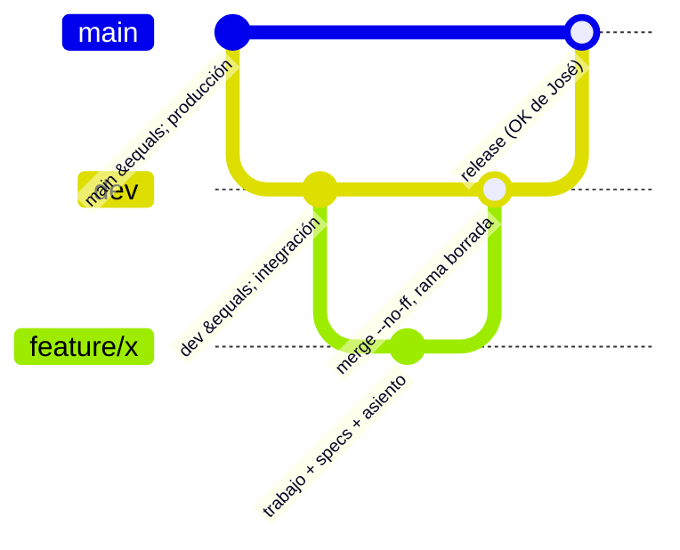

# Flujo de trabajo (git, deploys, verificación)

> **Resumen.** Dos ramas permanentes (`dev` y `main`); cada trabajo vive en una rama corta desde `dev`, se verifica, se integra con merge a `dev` y se borra. `main` es producción con un cliente real: solo se toca con OK explícito de José. Todo cambio cierra con spec, asiento `R-nnnn` y estado actual en la misma rama.



Aplica a cualquier persona o agente que modifique el repo. Solo existen dos ramas permanentes: **`dev`** (integración y entorno dev) y **`main`** (producción).

## 1. Una rama por trabajo

```bash
git checkout dev && git pull --ff-only origin dev
git checkout -b feature/<slug>        # o fix/<slug>, chore/<slug>, docs/<slug>
```

Una rama = un tema. Nunca se trabaja directo sobre `dev` ni sobre `main`. La rama **no se prueba**: se integra a `dev` y ahí se revisa (D-20). Si hace falta un ajuste, se hace en una rama nueva desde `dev` y se integra otra vez. Las vistas previas de rama de Cloudflare Pages existen pero apuntan a la API de producción, así que nadie las usa para probar.

## 2. Commits

- Español, formato `tipo: descripción` (`feat`, `fix`, `chore`, `docs`, `refactor`, `test`). Cuerpo opcional con el porqué.
- Termina con la línea de atribución que indique la sesión de trabajo (el entorno la provee).
- Nunca se commitean secretos, `.env`, ni archivos de `apps/api/uploads/`.

## 3. Verificar antes de integrar

Desde la raíz del repo:

```bash
cd apps/api && npx tsc --noEmit          # tipos API
cd ../web   && npx tsc --noEmit          # tipos web
cd ../api   && npx vitest run            # tests (necesita Postgres local, ver desarrollo-local.md)
cd ../web   && npx vite build            # build web
```

Si tocaste el esquema de Prisma: migración nueva, **aditiva** (columna nullable o con default; nada de borrar o renombrar en el mismo release). Ver principio 1.

## 4. Integrar a `dev`

```bash
git checkout dev && git merge --no-ff <rama> -m "Merge <rama> into dev"
git push origin dev
git branch -d <rama>                      # borrar la rama local
git push origin --delete <rama>           # borrar la rama en GitHub (si llegó a subirse)
```

El push a `dev` dispara dos despliegues automáticos:
- **API dev** (Coolify, ~9–11 min): contenedor nuevo, health check, y recién ahí se retira el viejo.
- **Web dev** (Cloudflare Pages).

Verificar: `curl -s https://dev-api.4client.shop/health` responde `{"status":"ok"}` y `docker ps` en el VPS muestra la imagen con el sha nuevo (`<uuid-app>:<sha completo>`). Si el build falla (por ejemplo un corte de red al descargar paquetes) el contenedor anterior sigue sirviendo: reintentar el deploy desde Coolify.

## 5. Pasar a producción (`main`)

**Solo con OK explícito de José, cada vez.** Lista de comprobación previa:

1. `dev` desplegado, `/health` ok y el cambio probado ahí (idealmente con datos de prueba de la fecha de hoy).
2. `git log main..dev --oneline`: revisa **todo** lo que viajará (un release lleva todo `dev`, no solo tu cambio). Si hay trabajo de `dev` sin probar o sin OK, pregunta a José.
3. Migraciones nuevas (`git diff main..dev --stat -- apps/api/prisma/migrations`): deben ser aditivas y compatibles con el código anterior (principio 1). Considera un respaldo fresco (`runbooks.md` §d).
4. Ventana tranquila (después del cierre de caja).

```bash
git checkout main && git pull --ff-only origin main
git merge --no-ff dev -m "Merge dev into main: <resumen>"
git push origin main
```

Dispara el deploy de la API prod (Coolify) y de la web prod (Cloudflare Pages). La API ejecuta `prisma migrate deploy` al arrancar. Verificar: contenedor nuevo con el sha, 0 reinicios, `GET https://api.4client.shop/health` ok, `https://4client.shop/` responde 200, y cero errores nivel 50/60 en los logs de los primeros minutos. Si algo falla: rollback en `runbooks.md` §c y avisar a José.

Hotfix urgente con `dev` lleno de cambios sin probar: no hay camino automático; **pregunta a José** cómo aislarlo (PREG pendiente). Una documentación pura (`specs/`, `*.md`) puede viajar a `main` junto con el siguiente release real, no sola. Después del release: ver §7 (anotaciones).

## 6. Si un deploy falla

| Síntoma | Qué hacer |
|---|---|
| `ECONNRESET` o error de red en `pnpm install` / descarga de Prisma | Reintentar el deploy en Coolify; el contenedor viejo sigue vivo |
| El deploy automático no se dispara | Revisar el webhook de GitHub (Recent Deliveries) y que el puerto 8000 del VPS responda a GitHub; ver `runbooks.md` |
| Contenedor nuevo reinicia en bucle | Mirar logs; la versión anterior sigue sirviendo hasta que el health check del nuevo pase |

## 7. Al terminar el trabajo (antes de integrar a `dev`)

Todo esto va **en la misma rama del cambio**. Qué archivos tocar según el tipo de cambio: [`../_plantillas/checklist.md`](../_plantillas/checklist.md).

1. **Specs.** Actualizar la spec del módulo tocado y su `verificado`. Si el cambio deja falsa cualquier parte de las specs, corregirla en el mismo cambio (todos los archivos afectados). Si no toca ninguna spec (clase A), no hay nada que corregir, pero el paso 2 sigue siendo obligatorio.
2. **Asiento.** Agregar `R-nnnn` al principio de `05-historia/registro-de-cambios.md` (sirve también para cambios solo de documentación y para reversas; reglas completas en ese archivo). `Commit: (al integrar)`, `Prod: pendiente`.
3. Si el trabajo era clase C, actualizar su `CH-nnnn` (estado, sha).
4. Anotar sospechas nuevas como `PREG` en `03-plan/preguntas-abiertas.md`.
5. **Actualizar `00-estado-actual.md`** (qué hay en prod, qué en dev, qué sigue) y, si algo de `00-horizonte.md` o `03-plan/roadmap.md` ya se cumplió o cambió de rumbo, corregirlo.
6. Verificar (§3), integrar (§4).

**Después de un release a producción (§5):** una rama `docs/` desde `dev` completa el campo "Prod" (sha del merge a `main`) en los asientos incluidos, agrega la línea en `05-historia/changelog.md` y actualiza `00-estado-actual.md`. Esas anotaciones no generan asiento propio.

## 8. Clases de cambio

| Clase | Qué es | Qué exige |
|---|---|---|
| **A** | Trivial: texto, estilo, refactor sin cambio de comportamiento, dependencias | Nada de specs |
| **B** | Fix o cambio acotado a un módulo, sin esquema ni API nueva | Actualizar la spec del módulo en el mismo commit |
| **C** | Feature, esquema, API, dinero o privacidad | `CH-nnnn` aprobado por José **antes** de programar |
