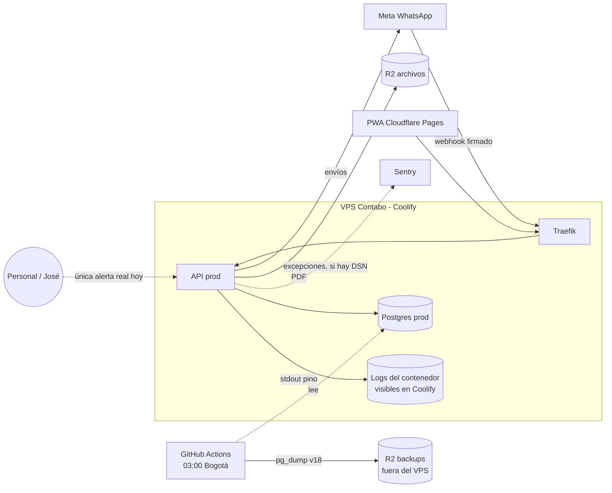

# Observabilidad y continuidad

> **Resumen.** Hoy 4Client se entera de que algo falla casi siempre porque **alguien se lo dice** (el personal del negocio o José mirando): hay logs de contenedor, Sentry solo en la API, un `/health` que no toca la base y la auditoría de negocio, pero **ningún monitor externo, alerta ni agregación de logs**. En continuidad, la única red de seguridad probada en producción es el volcado diario de la base a un bucket R2 fuera del VPS (RPO observado ≈ 24 h); **el tiempo de recuperación (RTO) es desconocido porque la restauración nunca se ha ejecutado** (PREG-111). Este archivo inventaría lo que existe, lista los huecos con arreglos mínimos ordenados por valor/costo, recorre qué pasa si cada pieza muere y deja un plan de simulacro **aún no realizado**. Los comandos están en [`runbooks.md`](runbooks.md); el diagnóstico por síntoma, en [`diagnostico-de-incidentes.md`](diagnostico-de-incidentes.md).

Nada aquí cambia el código: describe lo verificado y propone. Lo que no se puede comprobar desde el repo (paneles de Coolify, Cloudflare, GitHub, Meta, Sentry) se marca **no verificable desde el repo** y proviene de lo que José ha dicho o de otras specs.

## 1. Observabilidad: lo que existe

### 1.1 Mapa

Líneas punteadas: canales que existen pero no avisan solos. No hay ningún monitor externo ni destino de alertas.

### 1.2 Logs (pino)

| Aspecto | Hoy | Fuente |
|---|---|---|
| Biblioteca | pino, el logger integrado de Fastify; salida a stdout/stderr del contenedor | `server.ts` *(código)* |
| Nivel | `warn` si `NODE_ENV=production` (**dev y prod por igual**, porque ambos contenedores son `production`); `info` en el resto; `pino-pretty` solo con `NODE_ENV=development` | `server.ts` *(código)* |
| Qué se ve en prod | Nivel `warn` y superior: errores de ingesta del webhook (`WPP: error ingiriendo …`), fallo de bienvenida automática, firma ausente o inválida, `no org for phone_number_id`, mensaje descartado por más de 10 min, colisión de ticket concurrente, payload recibido (solo nombres de campos). Todo error no controlado pasa por `setErrorHandler` y se loguea en `error` | `server.ts`, `routes/webhook.ts` *(código)* |
| Qué **no** se ve en prod | Nivel `info`: la línea "mensaje entrante ingresado" y "webhook verificado" no salen. **Tampoco hay log de acceso por petición** (el nivel `info` de Fastify las emite; `warn` no): no se puede reconstruir quién llamó a qué | *(código)* |
| Qué **nunca** se loguea | Cuerpos de webhook, texto de mensajes, teléfonos en el payload bruto; del payload de Meta solo `Object.keys(...)`. Los 5xx devuelven al cliente un mensaje genérico, pero el error real sí queda en el log | `routes/webhook.ts`, `server.ts` *(código)* |
| Retención | La que tenga Docker/Coolify en el VPS (rotación de `json-file`): **no verificable desde el repo**. No hay agregación ni búsqueda histórica | — |
| Fallos de auditoría | `audit()` es *best-effort*: si falla escribe un `console.error` y la acción sigue | `lib/audit.ts` *(código)* |

Consecuencia: ante "ayer a las 4 p. m. no entró un mensaje" solo hay logs si el contenedor no se redesplegó desde entonces (un deploy crea contenedor nuevo y los logs del viejo se pierden con él; inferido del modelo Docker).

### 1.3 Sentry

- Solo la **API**: `Sentry.init` si existe `SENTRY_DSN`, con `tracesSampleRate: 0.2` y `environment = NODE_ENV` (`server.ts`, `config.ts`). La web no tiene SDK.
- Captura únicamente lo que llega a `setErrorHandler` (`captureException`). **No** captura rechazos de promesas sueltas (los `.catch` del webhook solo loguean) ni hay manejadores `unhandledRejection`/`uncaughtException` en el código: en Node 20 un rechazo sin manejar termina el proceso, y `unless-stopped` lo reinicia (política de reinicio según `runbooks.md` › j, José).
- `environment` vale `production` en dev y prod, así que **no se distingue un entorno de otro** en Sentry (PREG-096). Si dev y prod comparten proyecto/DSN, los errores de pruebas se mezclan con los reales (no verificable desde el repo; PREG-103).
- Todo error de Fastify se reporta, incluidos los 4xx de validación: ruido probable. Reglas de alerta, destinatarios y retención de Sentry: **no verificables desde el repo**.

### 1.4 Salud: `/health`

| Pregunta | Respuesta |
|---|---|
| ¿Qué hace? | `GET /health` → `{"status":"ok","timestamp":…}` (`server.ts`) *(código)* |
| ¿Toca la base, R2, Meta? | **No.** Un contenedor con Postgres caído responde "ok" mientras el proceso viva |
| ¿Exige HTTPS? | No: está exceptuado para que el chequeo de la plataforma entre por HTTP al contenedor |
| ¿Quién lo consulta? | Coolify, para decidir el cambio rolling (`entornos-y-despliegue.md` §3). Que use exactamente esa ruta es inferido (PREG-101). El `Dockerfile` **no declara `HEALTHCHECK`**: el chequeo, si existe, está en la configuración de Coolify (no verificable desde el repo) |
| ¿Algún monitor externo? | No hay |

El arranque sí valida lo grave antes de aceptar tráfico: `start.sh` (`set -e`) corre `prisma migrate deploy` y, si falla, el contenedor muere y el viejo sigue sirviendo; `config.ts` aborta con variables obligatorias o un `APP_ENVIRONMENT_NAME` inválido. Esto cubre el momento del deploy, **no** el funcionamiento posterior.

### 1.5 Reinicio automático

Los contenedores tienen política `unless-stopped` (José, `runbooks.md` › j): un proceso que muere vuelve solo. Un **bucle de reinicios** no avisa a nadie. Un reinicio de Docker o del servidor levanta todo en minutos, incluidos los demás proyectos del VPS.

### 1.6 Observabilidad de negocio (la que sí es rica)

| Fuente | Qué responde | Límite |
|---|---|---|
| `audit_logs` (16 acciones: login, usuarios, configuración de WhatsApp y plantillas, cierres reabiertos, cobros de plataforma, lectura `dev.db_read`, borrado de datos de cliente) | Quién hizo qué sobre cuentas, configuración y operaciones `dev` | Escritura *best-effort*; **no** audita pedidos ni cobros del negocio; sin purga (PREG-097). Lista en `seguridad-y-privacidad.md` |
| `order_history` (solo-añadir, principio 4) | Línea de tiempo de cada pedido: cambios, estados, cobros | Un UPDATE/DELETE se ignora; no cubre tickets ni catálogo |
| `ticket_messages.failed_reason` y `delivered` | Qué envíos de WhatsApp fallaron y por qué (consulta lista en `runbooks.md` › e) | Hay que **ir a mirar**; nadie recibe aviso |
| `daily_closes` | Foto diaria de totales; su ausencia dice "no se cerró la caja" | Solo si alguien la mira |
| Tablero `/dev` (Configuración › Dev) | Estado de WhatsApp (`/api/v1/wpp/status`: solo "credenciales configuradas", no "funcionan") y enlaces a paneles externos | No prueba el envío real |

Las consultas SQL de diagnóstico viven en `diagnostico-de-incidentes.md` (§1) y `runbooks.md` (e, h); no se duplican aquí.

## 2. Observabilidad: huecos y arreglos mínimos

Ordenados por valor/costo (el primero es el que más compra por menos esfuerzo). Todos son propuestas: ninguno está aprobado ni registrado como CH.

| # | Hueco hoy | Riesgo concreto | Arreglo mínimo viable | Costo |
|---|---|---|---|---|
| 1 | **Sin monitor externo de disponibilidad.** Nadie sabe que la API cayó hasta que el personal llama | Caída nocturna o de madrugada sin enterarse; la API descarta mensajes con más de 10 min de retraso (PREG-032) | Monitor gratuito de HTTP (ping cada 1–5 min a `https://api.4client.shop/health`, y al dev) con aviso a correo o Telegram de José | Muy bajo (sin código) |
| 2 | **El job de backup puede fallar en silencio.** No hay paso de notificación ni verificación del tamaño del dump | Se descubre que no hay copia el día que se necesita (PREG-111) | (a) Confirmar que GitHub avisa por correo de workflows fallidos; (b) paso final que falle si el objeto no aparece en el bucket (`aws s3 ls`); (c) "dead-man switch": un monitor que alerte si no hay ping diario | Bajo |
| 3 | **`/health` no verifica la base** | Postgres caído = API "sana" pero inservible; el rolling puede dar por bueno un contenedor roto (PREG-101) | Ruta adicional (p. ej. `/health/ready`) con `SELECT 1` para el monitor externo; dejar `/health` como está para Coolify. Cambio clase C (API) → CH antes del código | Bajo |
| 4 | **Sentry sin distinción de entorno** y sin reglas de alerta conocidas | Errores de dev tapan los de prod; nadie recibe correo | Usar `APP_ENVIRONMENT_NAME` como `environment` (PREG-096) y definir una alerta por proyecto nuevo/regresión | Bajo |
| 5 | **Fallos de envío de WhatsApp sin aviso** (incidente real 2026-10-07: el negocio no pudo contestar sin que nadie lo notara a tiempo) | El cliente final queda sin respuesta; el personal cree que se mandó | Consulta programada o job que cuente `ticket_messages` salientes con `failed_reason` en la última hora y avise si supera un umbral; o `captureMessage` a Sentry al marcar un fallo | Medio |
| 6 | **Sin agregación ni retención de logs**; nivel `warn` sin log de acceso | Imposible reconstruir un incidente de hace días | Enviar stdout a un destino gratuito con retención de 7–30 días; evaluar subir a `info` solo con ese destino. Cuidar la Ley 1581: no loguear cuerpos | Medio |
| 7 | **La web no reporta errores** (sin SDK) | Un fallo de JavaScript en el celular del personal es invisible | SDK de Sentry en la web con su propio proyecto y `environment` por host | Medio |
| 8 | **Sin métricas** (latencia, uso de CPU/RAM/disco del VPS, conexiones a Postgres, sockets) | Disco lleno rompe builds y base (`runbooks.md` › b) sin aviso previo | Alerta de disco/RAM del VPS (panel de Contabo o agente ligero); no hace falta Prometheus | Medio |
| 9 | **Sin alerta de certificado/DNS** | Un certificado Traefik caducado o un registro borrado deja la API inalcanzable | El monitor del hueco 1 ya vigila HTTPS; añadir aviso de caducidad (la mayoría lo trae) | Muy bajo |

## 3. Continuidad: objetivos observados

| Objetivo | Valor | Cómo se sabe |
|---|---|---|
| **RPO** (cuánto dato se pierde) | **≈ 24 h** en el peor caso: el volcado corre a las 08:00 UTC = 3:00 a. m. Bogotá, así que se pierde todo lo escrito desde esa hora | `backup-prod-db.yml` *(código)* |
| **RPO real de los mensajes de chat** | Peor que el de pedidos: el número del negocio opera solo por API y Meta **no reenvía** webhooks viejos (`runbooks.md` › d) | *(código, runbook)* |
| **RTO** (cuánto tarda en volver) | **Desconocido.** El runbook › d nunca se ejecutó de punta a punta; no se sabe cuánto pesa un dump, cuánto tarda `pg_restore` ni cuánto toma reconstruir un VPS | PREG-111 |
| Retención de dumps | La fija una regla de ciclo de vida del bucket; **el número de días es desconocido** | PREG-111, no verificable desde el repo |
| Independencia del respaldo | Diseñada: GitHub Actions + R2 aparte, sin depender del VPS ni del bucket de archivos | comentario del workflow *(código)* |
| Ventana de mantenimiento aceptable | Fuera del horario de pedidos y con la caja cerrada | `runbooks.md` › j |

Lo que **no** respalda el volcado: variables de entorno y secretos (viven en Coolify/GitHub/Meta/Cloudflare), configuración de Coolify y Traefik, reglas de firewall del VPS, los PDF de R2 de archivos, la base de dev (datos de prueba, sin backup por diseño).

## 4. Continuidad: recuperación pieza por pieza

| Pieza | Si muere, se pierde | Cómo se recupera | Dónde está la copia | ¿Probado? |
|---|---|---|---|---|
| **Contenedor de la API** | Nada de datos; corte hasta el reinicio | `unless-stopped` lo levanta; si el deploy es el problema, rollback (`runbooks.md` › c) | Imagen anterior en el VPS; el código en GitHub | Reinicio y rollback: **no probados**; el deploy normal sí |
| **Postgres de prod** | Todo desde el último dump (≤ 24 h) | Runbook › d (restaurar en base nueva, cambiar `DATABASE_URL`) | Dump diario en el bucket R2 de backups | **No** |
| **Facturas/cobros PDF en R2** | PDF ya emitidos; los datos de pedidos siguen en la base | Los PDF se generan en el navegador (D-12) y quedan en la base como datos: se pueden **regenerar** abriendo el pedido; los links de factura publicados se rompen | Ninguna copia propia; confiar en la durabilidad de R2 (no hay *versioning* conocido, no verificable desde el repo) | **No** |
| **DNS / Cloudflare** | Dominios `4client.shop` y `api.4client.shop`; la web | Recrear registros (la API es DNS-only hacia el VPS, `entornos-y-despliegue.md` §7); redesplegar Pages desde GitHub | Tabla de DNS en esa spec (sin IP); el panel de Cloudflare es la fuente única | **No** |
| **Coolify mismo** | La capacidad de desplegar y la configuración de las apps (variables, fuente, dominios) | Reinstalar Coolify, recrear apps y variables, reapuntar fuentes. **Las variables no están respaldadas fuera de Coolify** (no verificable desde el repo) | Solo en el propio Coolify (inferido) | **No** |
| **Repositorio GitHub** | Código, specs, workflows y los secretos del backup | Clones locales de José; los secretos de Actions hay que recrearlos | Clones locales + GitHub | Parcial (clones, sí; secretos, no) |
| **Secretos** | Acceso a Meta, R2, IA, Resend, JWT | Rotar y recargar (`runbooks.md` › g); `WPP_TOKEN_ENC_KEY` perdida = tokens de WhatsApp ilegibles, hay que volver a cargarlos desde Meta | No hay inventario/gestor documentado: **dónde guarda José los valores originales es desconocido** | **No** |
| **Credenciales de Meta/WhatsApp** | Envío y recepción | Token: runbook › f; número o cuenta suspendida: ver §5.5 | La cuenta de Meta Business; el token cifrado en la base | Token vencido: inferido; cambio de número: usado en septiembre |

Punto único de fallo (declarado): **un solo VPS** aloja API de dev y prod, ambas bases, Traefik, Coolify y proyectos ajenos. Si cae, todo cae a la vez, y la web (Cloudflare) queda sin API.

## 5. Escenarios de desastre

Cada uno lista decisiones y orden; los comandos están en `runbooks.md`. En todos: avisar al negocio y registrar la hora de inicio y de fin (alimenta el RTO real).

### 5.1 Se pierde el VPS (disco, proveedor, borrado)

1. Confirmar con el monitor/Contabo que no es una caída pasajera; si hay reinicio posible, runbook › j.
2. Si el VPS no vuelve: contratar/levantar otro, instalar Docker y Coolify, restaurar la fuente de GitHub (App) y los **dos** Postgres (la base de dev es prescindible).
3. Recrear `4client-api-prod` con todas sus variables (lista de nombres en `entornos-y-despliegue.md` §2; los valores salen de la bóveda de José y de Meta/Cloudflare, ver §4).
4. Restaurar la base del último dump (runbook › d, paso 6b: base nueva y `DATABASE_URL`); `start.sh` aplica las migraciones posteriores.
5. Actualizar el registro DNS de `api.4client.shop` a la IP nueva (Cloudflare, sin proxy) y esperar el certificado de Traefik.
6. Reaplicar la regla de firewall del dashboard de Traefik y el webhook de GitHub → Coolify (`runbooks.md` › a, j).
7. Verificar con la lista de "Verificar" del runbook › d. Perdido: lo posterior al dump y los chats de ese intervalo.

### 5.2 Base de prod corrupta o borrada

1. Detener `4client-api-prod` para frenar escrituras.
2. Sacar un dump del estado actual aunque esté roto (evidencia).
3. Si el daño es parcial: runbook › d, **paso 6a** (extraer filas del dump a una base de pruebas). Si es total: paso 6b.
4. Recordar que `order_history` ignora UPDATE/DELETE (principio 4) y que no hay totales guardados (principio 3): al reinsertar pedidos, los totales se recalculan.
5. Cerrar con el procedimiento "Verificar" y dejar un asiento en `registro-de-cambios.md`.

### 5.3 Deploy o migración defectuosos

1. El contenedor viejo sigue sirviendo si el nuevo muere en `migrate deploy` o no pasa el health check: **no hay corte**; no hacer nada urgente.
2. Si el nuevo pasó el health check pero rompe algo: rollback de API **y** web (runbook › c). El código anterior funciona con el esquema nuevo (principio 1).
3. Migración fallida marcada en `_prisma_migrations`: pasos manuales en runbook › c (apartado "Migración fallida"), con OK de José.
4. Un `/health` que no toca la base significa que un fallo de base posterior al arranque **no** frena el cambio rolling (hueco 3).

### 5.4 Se filtra un secreto

1. Identificar cuál (`JWT_SECRET`, token de R2, token de WhatsApp, clave de Resend, `DATABASE_URL`…) y dónde se expuso (repo, log, mensaje).
2. Rotar con la tabla de `runbooks.md` › g (cada fila dice qué se rompe al rotar; ojo con `WPP_TOKEN_ENC_KEY`, PREG-113, y `JWT_SECRET`, PREG-112).
3. Si el secreto estuvo en el repo: limpiarlo del historial de git es costoso y el repo fue público hasta el paso a privado; **asumir comprometido y rotar siempre**. Hay PDF de facturas versionados con posibles datos personales (DT-033).
4. Revisar `audit_logs` (`auth.login_*`, `dev.*`) del periodo expuesto.
5. Si se filtró dato personal: valorar aviso a la Superintendencia de Industria y Comercio (Ley 1581) con asesoría; la spec no define el procedimiento (**no especificado**).

### 5.5 Meta suspende la cuenta o el número de WhatsApp

1. Distinguir: ¿entrada y salida fallan (cuenta suspendida) o solo salida (pago, `runbooks.md` › e)?
2. Entradas: el negocio no puede cambiar a WhatsApp personal sin salir de la API (el número está dedicado a la Cloud API, D-05).
3. Apelar desde el administrador de Meta Business; entre tanto el negocio atiende por otro canal (teléfono, número alterno).
4. Si se consigue un número nuevo: runbook › f (cambio de número); los tickets son por teléfono del cliente y no cambian. El número viejo puede dejar un aviso con `wpp_redirect_message` (PREG-023).
5. El formulario público sigue vivo si el cliente ya tiene el link (24 h), pero sin WhatsApp no hay forma de enviarlo: **el producto no tiene canal alterno** (supuesto del horizonte: dependencia total de Meta).

### 5.6 Problema con la cuenta de Cloudflare

Cloudflare concentra **web, DNS y los dos buckets R2** (archivos y backups). Una suspensión, un cobro fallido o un borrado accidental los afecta a la vez.
1. Web caída pero API viva: el personal no puede entrar. Alterno: servir la build estática en otro host de Pages y apuntar un dominio (la API resuelve la API por hostname, `apiBase.ts`; no hay variable que cambiar).
2. DNS: recrear los registros desde `entornos-y-despliegue.md` §7.
3. Backups: **el respaldo vive en el mismo proveedor que la web y el DNS**. El workflow se diseñó independiente del VPS y de Cloudflare "si uno falla" (comentario del workflow), pero R2 sigue siendo Cloudflare: un problema de cuenta puede dejar sin copia. Mitigación propuesta: copia semanal a un segundo proveedor (§7).

### 5.7 Se pierden datos de R2 de archivos

1. Las facturas se regeneran desde los datos del pedido (jsPDF en el navegador, D-12); los links ya enviados al cliente dejan de abrir y hay que reemitirlos.
2. Los PDF de cobros de plataforma (`billing`) se regeneran igual desde sus datos (inferido).
3. Si la API cayó al disco local por falta de variables `R2_*`, esos archivos se pierden en cada deploy (`entornos-y-despliegue.md` §2).
4. Verificar con una factura de prueba. No hay PDF críticos que solo existan en R2 (inferido; confirmar con José, FAC).

## 6. Plan de simulacro de respaldo y restauración — **AÚN NO REALIZADO**

Objetivo: convertir "dump que existe" en "dump que sirve" y medir el RTO. Frecuencia propuesta: **trimestral** y siempre tras cambiar de versión de Postgres, de cliente `pg_dump` o de proveedor.

| Paso | Qué hacer | Evidencia |
|---|---|---|
| 1 | Elegir el dump más reciente y otro de hace más de 7 días (prueba también la retención) | Nombres de objeto y tamaño |
| 2 | Restaurar en un Postgres 16 desechable, en la máquina de José, con los pasos 1–5 de `runbooks.md` › d (cliente 18, sin publicar puertos) | Hora de inicio y fin, conteo de errores de `pg_restore` |
| 3 | Comparar: `count(*)` de `organizations`, `orders`, `order_items`, `ticket_messages`, `daily_closes`; `max(created_at)` de `orders` cerca de las 03:00; migraciones contra `apps/api/prisma/migrations`; reglas de `order_history` y los índices trigram | Tabla antes/después |
| 4 | Contrastar con la base viva (solo `SELECT`, con OK de José) para estimar cuánto cambió en 24 h | Diferencia de conteos |
| 5 | Levantar la API local contra la copia y entrar con un usuario de prueba (opcional, trimestral alterno) | Captura del tablero |
| 6 | Borrar el contenedor y el dump descargado (contienen datos reales) | — |
| 7 | Escribir el resultado: RTO medido, tamaño, retención observada, errores y qué se corrigió en el runbook | **Asiento `R-nnnn` en `05-historia/registro-de-cambios.md`** y actualización de PREG-111 |

Resultados a registrar la primera vez: tamaño del dump, tiempo de descarga/restauración, días reales de retención, si el aviso de fallo del workflow llega (hueco 2).

## 7. Capacidad y límites estructurales

| Hecho | Consecuencia | Fuente |
|---|---|---|
| **Un solo VPS** compartido con proyectos ajenos | Punto único de fallo; un reinicio de Docker afecta a todos | `entornos-y-despliegue.md` §1, `runbooks.md` › j |
| **Un solo proceso de API**; Socket.IO sin adaptador y con salas en memoria (`org:<id>`, `user:<id>`, `org:<id>:date:<fecha>`) | No se puede escalar a varias réplicas sin añadir un adaptador (p. ej. Redis): los eventos solo llegarían a los sockets de la réplica que los emite | `arquitectura.md`, `plugins/socket.ts` *(código)* |
| Rolling deploy con contenedor viejo y nuevo vivos a la vez (unos minutos) | Durante ese lapso hay dos procesos; los sockets conectados al viejo se reconectan (la web lo hace) | `entornos-y-despliegue.md` §3 |
| Rate limits: global 300/min por usuario o IP; login 10/min; webhook 2000/min; formulario 15/min por IP | Una oficina con muchas personas comparte IP solo en rutas públicas; el webhook aguanta ráfagas de Meta. `DT-011` registra comentarios viejos sobre el tope del webhook | `limites-y-tiempos.md`, `server.ts` |
| El límite del limitador es **en memoria** por proceso | Se reinicia con cada deploy y no se comparte entre réplicas | `@fastify/rate-limit` por defecto *(inferido: no se configura almacén)* |
| Un cliente real hoy | La carga no es un riesgo medido; no hay pruebas de carga ni métricas que lo demuestren (hueco 8) | — |
| Sin retención ni purga de datos | La base crece sin tope (PREG-097) y con ella el tamaño y el tiempo del dump | `seguridad-y-privacidad.md` |

El horizonte (segundo cliente, báscula, pagos) aumenta la superficie de fallo: ningún punto de este archivo lo bloquea, pero un segundo cliente convierte los huecos 1, 2 y 5 de §2 de "deseables" en necesarios, y haría insuficiente el VPS único si se quiere un SLA.

## 8. Siguientes pasos (priorizados)

1. **Monitor externo de `/health` (prod y dev) con aviso a José** (§2 #1). Sin código, el cambio de mayor valor.
2. **Hacer el simulacro de restauración** (§6) y registrar el RTO real; responder los días de retención del bucket (PREG-111).
3. **Aviso de fallo del backup** (§2 #2): confirmar el correo de GitHub, añadir verificación del objeto subido y un monitor de "no hubo copia hoy".
4. **Inventario de secretos y de variables por app** guardado fuera de Coolify (gestor de contraseñas), sin escribir valores en el repo; cierra el vacío de §4 y PREG-103.
5. **Sentry:** separar entorno con `APP_ENVIRONMENT_NAME` (PREG-096) y crear una alerta; decidir si la web tendrá SDK.
6. **`/health/ready` con `SELECT 1`** para el monitor (CH aparte, clase C).
7. **Alerta de fallos de envío de WhatsApp** (§2 #5), vistos los incidentes del 2026-10-07.
8. **Copia semanal del dump a un segundo proveedor** independiente de Cloudflare (§5.6).
9. **Alertas de disco/RAM del VPS** y política documentada de rotación de logs.
10. **Decidir con José el RTO/RPO deseados**; si 24 h de RPO es demasiado, evaluar volcados más frecuentes o *WAL archiving* (hoy fuera del alcance).

## 9. Pendientes

| ID | Línea |
|---|---|
| PREG-111 | La restauración nunca se probó; días de retención del bucket desconocidos. |
| PREG-101 | ¿Coolify usa `GET /health`? No toca la base. |
| PREG-096 | Sentry no distingue dev de prod (`environment = NODE_ENV`). |
| PREG-103 | ¿Qué variables opcionales (Sentry, R2…) tiene cada app? |
| PREG-097 | Sin purga ni retención automática de datos. |
