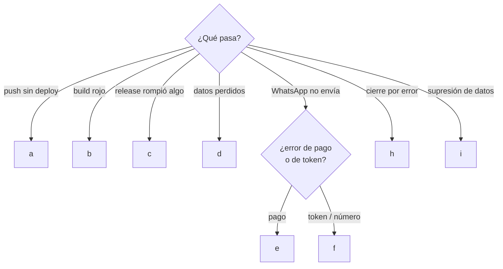

# Runbooks

> **Resumen.** Diez procedimientos (a–j) para incidentes y operaciones delicadas. Todos siguen **síntoma → causa → pasos → verificar** y declaran su estado de prueba: solo (a) y (e) nacieron de incidentes reales, y (d), la restauración del respaldo, **nunca se ha ejecutado**. Producción tiene un cliente real: toda acción sobre ella va con OK de José.

Procedimientos paso a paso para incidentes y operaciones delicadas. Formato: **síntoma → causa probable → pasos → verificar**. Infraestructura de fondo: [`entornos-y-despliegue.md`](entornos-y-despliegue.md). Proceso de git: [`flujo-de-trabajo.md`](flujo-de-trabajo.md).

Reglas para todos:
- Producción tiene un cliente real trabajando. Toda acción sobre `4client-api-prod` o su base va con OK de José, y si se puede, después del cierre de caja.
- Consultas a la base de prod: **solo `SELECT`** salvo que el runbook diga otra cosa. Acceso: Coolify › recurso Postgres de prod › Terminal › `psql -U "$POSTGRES_USER" -d "$POSTGRES_DB"`.
- Aquí no se escriben IPs, valores de secretos ni identificadores internos de Coolify.

## Índice y estado de prueba

| | Runbook | Cuándo | Estado de prueba | Riesgo |
|---|---|---|---|---|
| a | El deploy automático no se dispara | Push sin deployment nuevo | Nació del incidente real del 2026-10-09; diagnóstico y corrección aplicados | Bajo |
| b | El build falla por red | Deployment en rojo por descarga | *Inferido*: no hay incidente documentado más allá del caso general | Bajo |
| c | Rollback de API y web | Un release rompe producción | **No probado**; el rollback de migración fallida es *inferido* de Prisma | Alto |
| d | Restaurar el backup de la base desde R2 | Pérdida o corrupción de datos | **NO PROBADO** nunca de punta a punta (PREG-111) | Alto |
| e | WhatsApp: "Business eligibility payment issue" | Salientes fallan, entrantes llegan | Nació del incidente real del 2026-10-07; la consulta SQL no se ha re-ejecutado | Medio |
| f | WhatsApp: token vencido o cambio de número | Salientes con error de autenticación, o número nuevo | Cambio de número usado en septiembre (commit `7de543c`); token vencido *inferido* | Medio |
| g | Rotar secretos | Filtración, salida de una persona, rotación | **No probado**; hay discrepancia sobre `JWT_SECRET` (PREG-112) | Alto |
| h | Reabrir un cierre de caja | Cierre hecho por error | Acción `dev` con test (`dev-centro-mando.test.ts`) | Medio |
| i | Borrar los datos de un cliente (Ley 1581) | Solicitud de supresión | Ruta con test (`inbox.test.ts`); el flujo humano no se ha ejecutado | Medio |
| j | VPS: reiniciar servicios | Kernel pendiente o mantenimiento | **No ejecutado todavía** | Alto |



---

## a. El deploy automático no se dispara

**Síntoma:** se hizo push a `dev` (o `main`) y en Coolify no aparece ningún deployment nuevo; `docker ps` sigue mostrando la imagen con el sha anterior.

**Causas probables:**
1. GitHub no logra entregar el webhook a Coolify (puerto de Coolify inalcanzable desde internet). **Incidente real del 2026-10-09:** la primera versión de la regla de firewall que bloquea el dashboard de Traefik (cadena `DOCKER-USER`) también bloqueaba el puerto de Coolify por donde entra el webhook. Se corrigió filtrando por puerto de destino original (`conntrack --ctorigdstport`), de modo que solo se bloquea el dashboard de Traefik (José).
2. El secreto del webhook no coincide (GitHub entrega pero Coolify responde 401/403).
3. La app de Coolify escucha otra rama, o la fuente del repo perdió acceso (por ejemplo, tras pasar el repo a privado sin cambiar la fuente; en ese caso sí aparece el deployment pero falla al clonar).
4. Coolify mismo está caído.

**Pasos:**
1. GitHub › repo › Settings › Webhooks › el webhook de Coolify › **Recent Deliveries**. Mirar el último push:
   - *timeout / connection refused* → causa 1, seguir al paso 2.
   - *401/403* → causa 2: copiar de nuevo el secreto del webhook manual desde Coolify a GitHub.
   - *200* pero sin deployment → causa 3: revisar rama y fuente en la app de Coolify.
2. Desde **fuera** del VPS (tu máquina), comprobar que el puerto de Coolify responde: `curl -sS -o /dev/null -w '%{http_code}\n' http://<ip-del-vps>:8000/`. Cualquier código HTTP sirve; un timeout no.
3. En el VPS, revisar la regla y sus contadores:
   ```bash
   sudo iptables -S DOCKER-USER
   sudo iptables -L DOCKER-USER -v -n --line-numbers
   ```
   La regla de bloqueo debe filtrar **solo** el puerto del dashboard de Traefik, con `-m conntrack --ctorigdstport`. Si filtra otro puerto o todo el tráfico entrante, corregirla en el script que aplica la unidad systemd (no a mano: se perdería en el próximo reinicio de Docker) y reiniciar esa unidad.
4. Mientras tanto, desplegar a mano: Coolify › app › **Deploy**.
5. En GitHub, **Redeliver** el último evento para confirmar la corrección.

**Verificar:** la entrega nueva responde 200; aparece el deployment en Coolify; a los ~10 min `curl -s https://dev-api.4client.shop/health` responde `{"status":"ok",...}` y `docker ps` muestra la imagen con el sha completo del commit. Desde fuera, el dashboard de Traefik **sigue sin responder**.

---

## b. El build falla por red

**Síntoma:** deployment en rojo en Coolify; el log muestra `ECONNRESET`, `ETIMEDOUT`, `EAI_AGAIN` o errores al descargar en `pnpm install`, al bajar los binarios de Prisma (`prisma generate`) o en `apt-get`.

**Causa probable:** corte de red pasajero del VPS o del registro de paquetes. No es un problema del código. El contenedor viejo **sigue sirviendo** (rolling).

**Pasos:**
1. Confirmar en el log que el fallo es de descarga, no de `tsc` (un error de tipos se reproduce igual en local y en la CI).
2. Reintentar: Coolify › app › **Redeploy**.
3. Si falla repetidamente:
   - Espacio en disco: `df -h` y `docker system df`. Un disco lleno también rompe builds. Para liberar, `docker builder prune` (caché de build; no toca contenedores en marcha). **No** usar `docker image prune -a` ni `docker system prune -a` sin pensar: borra imágenes de otros proyectos del VPS y las imágenes anteriores que sirven para rollback.
   - DNS y salida del VPS: `getent hosts registry.npmjs.org` y `curl -sI https://registry.npmjs.org/`.
4. Si es un corte largo del proveedor, esperar: producción no está caída.

**Verificar:** el redeploy termina en verde, el health check pasa y `docker ps` muestra el sha nuevo.

---

## c. Rollback de API y web

**Síntoma:** un release recién desplegado rompe algo importante en producción.

**Antes de empezar:** el rollback de código **no deshace migraciones**. Como toda migración es aditiva (principio 1), el código anterior funciona con el esquema nuevo. Si el release tocó API y web a la vez, volver atrás **las dos**.

### API

1. Opción rápida, sin build (si la imagen anterior todavía existe en el VPS): Coolify › `4client-api-prod` › Deployments/Rollback › elegir la imagen del commit anterior › desplegar.
2. Opción duradera (recomendada después de la rápida, con OK de José): revertir el merge en `main` para que el próximo push no vuelva a traer el error:
   ```bash
   git checkout main && git pull --ff-only origin main
   git revert -m 1 <sha-del-merge-malo>
   git push origin main          # dispara el deploy normal, ~10 min
   ```
   Llevar el mismo revert a `dev` (o corregir allí) para que `dev` y `main` no diverjan.
3. Si se fijó un commit concreto en la configuración de la app de Coolify para hacer el rollback, **quitarlo al terminar**: si no, los pushes siguientes desplegarían siempre ese commit (inferido).
4. **Migración fallida** (el contenedor nuevo muere en `prisma migrate deploy`): el viejo sigue sirviendo, pero Prisma deja la migración marcada como fallida y bloquea los arranques siguientes. Revisar el estado en la base (`SELECT migration_name, finished_at, rolled_back_at FROM _prisma_migrations ORDER BY started_at DESC LIMIT 5;`), deshacer a mano lo que haya quedado a medias y marcarla con `prisma migrate resolve --rolled-back <nombre>` antes de reintentar (inferido, comportamiento de Prisma).

### Web

1. Cloudflare › Pages › proyecto › **Deployments** › el deploy de producción anterior › *Rollback to this deployment*. Es inmediato.
2. La PWA usa `registerType: 'prompt'`: las pestañas abiertas no se recargan solas; el personal ve la versión restaurada al recargar.

**Verificar:** `docker ps` muestra la imagen del commit restaurado con 0 reinicios; `curl -s https://api.4client.shop/health` ok; `https://4client.shop/` responde 200; el flujo que estaba roto funciona; sin errores nivel 50/60 en los logs de los primeros minutos.

---

## d. Restaurar el backup de la base desde R2

> **NO PROBADO.** Este procedimiento se escribió a partir de cómo funcionan `pg_dump`/`pg_restore` y del workflow de backup; nunca se ha ejecutado de punta a punta contra estos dumps. Antes de necesitarlo de verdad, hacer un simulacro con los pasos 1–5 (PREG-111). **Nunca restaurar directamente sobre la base de producción.**

**Síntoma:** pérdida o corrupción de datos en prod (borrado accidental, migración destructiva, base caída sin recuperación).

**Qué hay:** un dump diario `db-backups/backup-<AAAAMMDD-HHMMSS>.dump` (hora UTC; 08:00 UTC = 3:00 a. m. Bogotá) en el bucket R2 de backups, formato custom de `pg_dump`, generado con un cliente **v18** contra el Postgres 16 de prod (`backup-prod-db.yml`). La retención la fija una regla de ciclo de vida del bucket.

**Lo que se pierde siempre:** todo lo escrito después de las 3:00 a. m. del dump. Ojo: el número de WhatsApp del negocio solo funciona por API, así que los **mensajes de chat de ese intervalo solo existían en la base**; Meta no reenvía webhooks viejos. Los PDF de R2 no se tocan (los subidos después del dump quedan huérfanos).

### Pasos 1–5: restaurar en una base de pruebas (siempre)

1. **Descargar el dump.** Cloudflare › R2 › bucket de backups › `db-backups/` › el archivo del día elegido. O con la CLI de S3, usando un token R2 temporal de **solo lectura** (no reutilizar las credenciales del workflow):
   ```bash
   aws s3 cp "s3://<bucket-backups>/db-backups/backup-<fecha>.dump" . \
     --endpoint-url "https://<account-id>.r2.cloudflarestorage.com"
   ```
2. **Levantar un Postgres 16 desechable**, en tu máquina (preferible) o en el VPS **sin publicar puertos**:
   ```bash
   docker run -d --name pg-restore-scratch -e POSTGRES_USER=fourclient \
     -e POSTGRES_PASSWORD='<temporal>' -e POSTGRES_DB=restore_check postgres:16
   ```
3. **Inspeccionar el dump con un `pg_restore` 18** (uno más viejo falla con "unsupported version in file header" porque el dump es de un cliente v18):
   ```bash
   docker run --rm -v "$PWD":/b postgres:18 pg_restore --list /b/backup-<fecha>.dump | head -40
   ```
4. **Restaurar** con el cliente 18 contra el servidor 16 desechable:
   ```bash
   docker run --rm --network container:pg-restore-scratch -v "$PWD":/b \
     -e PGPASSWORD='<temporal>' postgres:18 \
     pg_restore -h localhost -U fourclient -d restore_check \
       --no-owner --no-privileges --verbose /b/backup-<fecha>.dump
   ```
   - Sin `--single-transaction` ni `--exit-on-error` en el primer intento: un dump de cliente 17+ emite `SET transaction_timeout`, que Postgres 16 no conoce. Ese error es esperable e inocuo; con `--single-transaction` abortaría todo (inferido).
   - Al final, leer el conteo de errores: cualquier error distinto de ese hay que entenderlo antes de seguir.
5. **Validar** en `restore_check`:
   ```sql
   SELECT count(*) FROM organizations;  SELECT count(*) FROM orders;  SELECT count(*) FROM ticket_messages;
   SELECT max(created_at) FROM orders;                                    -- cerca de la hora del dump
   SELECT migration_name FROM _prisma_migrations ORDER BY finished_at DESC LIMIT 3;  -- comparar con apps/api/prisma/migrations
   SELECT rulename FROM pg_rules WHERE tablename = 'order_history';      -- no_update_order_history, no_delete_order_history
   SELECT indexname FROM pg_indexes WHERE indexname LIKE '%trgm%';        -- índices de búsqueda
   ```

### Paso 6a: recuperar solo algunos datos (lo más común)

Extraer de `restore_check` las filas necesarias (`COPY (SELECT ...) TO STDOUT WITH CSV HEADER`) y preparar un SQL de inserción revisado por José. Recordar: `order_history` acepta `INSERT` pero ignora en silencio `UPDATE`/`DELETE` (principio 4); los totales de un pedido no se guardan, se recalculan de `order_items`.

### Paso 6b: restauración completa de prod (solo desastre, con José presente)

1. Avisar al cliente; idealmente con la caja cerrada.
2. Detener `4client-api-prod` en Coolify (que nadie escriba y que no corra `migrate deploy` a medias).
3. Sacar un dump del estado actual de prod, aunque esté roto (evidencia y vuelta atrás).
4. En el Postgres de prod, crear una base **nueva** (p. ej. `fourclient_restored`) y restaurar allí con los mismos comandos del paso 4. No borrar ni sobrescribir la base actual.
5. Cambiar `DATABASE_URL` de `4client-api-prod` a la base nueva y desplegar. `start.sh` aplicará las migraciones posteriores al dump.
6. Rehacer a mano lo perdido desde las 3:00 a. m. (pedidos que el personal recuerde, etc.).

**Verificar:** login de un admin; tablero de hoy y de ayer con los pedidos esperados; informe del día cuadra con el último cierre (`daily_closes`); un mensaje de prueba entra y sale por WhatsApp; el backup de la noche siguiente corre (si cambió la base, actualizar el secreto `PROD_DATABASE_BACKUP_URL`). Al terminar, borrar el contenedor desechable y el dump descargado.

---

## e. WhatsApp: mensajes salientes fallan con "Business eligibility payment issue"

**Síntoma:** los clientes siguen escribiendo y sus mensajes entran, pero **todo lo que manda el negocio falla** (bienvenida, links, respuestas del chat): en el chat aparecen con estado de error. **Incidente real del 2026-10-07** (José).

**Causa probable:** problema con el método de pago de la cuenta de Meta Business. Meta deja de aceptar envíos del negocio mientras la recepción sigue funcionando. El código de error de Meta para este caso es 131042 (inferido).

**Pasos:**
1. Confirmar en la base de prod:
   ```sql
   SELECT date_trunc('hour', tm.sent_at) AS hora, tm.failed_reason, count(*)
   FROM ticket_messages tm
   WHERE tm.direction = 'out'
     AND tm.failed_reason IS NOT NULL
     AND tm.sent_at > now() - interval '2 days'
   GROUP BY 1, 2 ORDER BY 1 DESC;
   ```
   `failed_reason` llega de dos formas: el título del error que Meta manda después por el webhook de estados (`routes/webhook.ts`, p. ej. "Business eligibility payment issue") o el error inmediato de la API (`Meta API sendText failed (4xx): {...}`). Para filtrar: `AND tm.failed_reason ILIKE '%eligibility%'`.
2. Confirmar que la entrada sigue viva: `SELECT max(sent_at) FROM ticket_messages WHERE direction = 'in';` es reciente.
3. Meta Business (Business Suite / WhatsApp Manager) › facturación y métodos de pago: corregir la tarjeta o el saldo pendiente.
4. Avisar al personal: los mensajes fallidos **no se reenvían solos**. Hay que mandarlos de nuevo desde el chat; si pasaron más de 24 h desde el último mensaje del cliente, Meta puede rechazarlos por la ventana de 24 h.

**Verificar:** responder desde Chats WPP a un ticket de prueba (el número de José): el mensaje queda entregado y la consulta del paso 1 no muestra fallos nuevos.

---

## f. WhatsApp: token de Meta vencido o cambio de número

**Síntoma (token):** todos los envíos fallan con un `failed_reason` de autenticación (típicamente "Error validating access token" o "Session has expired", código 190, inferido) y no cargan las fotos ni audios del chat (también se piden a Meta con el token). La entrada de mensajes sigue funcionando (el webhook solo usa `META_APP_SECRET`).

**Causa:** el token guardado en `Organization.wpp_meta_token` (cifrado) venció o se revocó. En ejecución **no** se usa `META_ACCESS_TOKEN` del entorno.

**Pasos (token):**
1. Meta Business › Configuración del negocio › Usuarios del sistema › generar un token permanente con permisos de WhatsApp (`whatsapp_business_messaging`, `whatsapp_business_management`).
2. Entrar a la web de prod con el usuario `dev` › Configuración › Dev › **WhatsApp** › pegar el token en "Access Token" › Guardar. Llama a `PATCH /api/v1/config/wpp`, que lo cifra con la clave del servidor (`routes/config.ts`). Aplica a la organización del usuario que inició sesión.
3. **Evitar `apps/api/src/update-org-wpp.ts`** para prod: tiene fijos el slug de la organización y el phone id, lee el token de la variable `META_TOKEN` y cifra con el `WPP_TOKEN_ENC_KEY` de *tu* entorno: si no es exactamente el de prod, deja el token en claro o ilegible para el servidor.

**Pasos (cambio de número):**
1. Registrar el número nuevo en la misma cuenta de WhatsApp Business (si es otra cuenta, suscribir la app de Meta a ella, inferido) y anotar su **phone number id**.
2. Configuración › Dev › WhatsApp › "Phone Number ID" (y token si cambió). El phone id es único entre organizaciones: si responde 409 `PHONE_ID_ALREADY_IN_USE`, ese número ya está en otra organización.
3. El webhook enruta por phone id: desde ese momento lo que llegue al número viejo ya no entra a esta organización. Patrón usado en septiembre (commit `7de543c`): el número viejo queda en otra organización con `wpp_redirect_message` definido, que reemplaza toda la bienvenida por un único aviso ("este número cambió…") sin generar links. **No hay campo en la interfaz** para ese mensaje: se define con `PATCH /api/v1/config/wpp` (`{"wpp_redirect_message": "..."}`) autenticado en esa organización (PREG-023).
4. Los tickets de los clientes no cambian (son por teléfono del cliente).

**Verificar:** mensaje de prueba desde el número de José → entra al tablero, llega la bienvenida, la respuesta desde el chat queda entregada y una foto del chat carga.

---

## g. Rotar secretos

**Síntoma / cuándo:** sospecha de filtración, salida de alguien con acceso, o rotación periódica (no hay síntoma visible). **Causa:** higiene de seguridad. **Estado:** no probado.

Los valores viven en Coolify (por app), en GitHub (secretos de Actions) y en Meta/Cloudflare. Un cambio de variable en Coolify requiere **redeploy** de la app para tomar efecto (inferido).

| Secreto (nombre) | Dónde | Qué depende | Al rotar |
|---|---|---|---|
| `JWT_SECRET` | Coolify, por app | Access token (15 min) y autenticación del socket | Los access token vigentes dejan de valer, pero la web pide uno nuevo con el refresh token, que es un valor aleatorio guardado en `refresh_tokens`, no un JWT (`routes/auth.ts › issueSession`). **En la práctica nadie queda deslogueado** (PREG-112). Para forzar cierre de sesión de todos: `DELETE FROM refresh_tokens;` (**escritura destructiva en prod**: solo con OK explícito de José, en una transacción y sabiendo que desloguea también al personal en turno; no probado) |
| `WPP_TOKEN_ENC_KEY` | Coolify, por app | Descifrar el token de WhatsApp de cada organización (`lib/crypto.ts`) | Con la clave nueva, los tokens `enc:v2:` existentes no se pueden descifrar y **todo envío falla** hasta re-cargarlos. `reencrypt-wpp-tokens.ts` **no sirve para rotar**: solo convierte filas en claro o `enc:v1:` usando la clave actual y salta las `enc:v2:`. Procedimiento: cambiar la clave, redeploy e inmediatamente volver a pegar el token de cada organización (runbook f, paso 2). PREG-113 |
| `META_APP_SECRET` | Coolify + app de Meta | Firma HMAC de cada webhook | Cambiarlo en Meta y en Coolify casi a la vez: mientras difieran, todos los webhooks se rechazan y no entran mensajes |
| `META_WEBHOOK_VERIFY_TOKEN` | Coolify + configuración del webhook en Meta | Solo el handshake de verificación (GET) | Cambiar ambos y re-verificar el webhook en Meta |
| Token de WhatsApp de cada organización | Base (cifrado), se carga por la interfaz | Envíos y multimedia | Runbook f |
| `R2_ACCESS_KEY_ID`, `R2_SECRET_ACCESS_KEY` | Coolify + Cloudflare R2 | Subir y servir facturas y cobros | Crear token nuevo, actualizar, redeploy, revocar el viejo |
| `RESEND_API_KEY` | Coolify | Correo del código 2FA | Si queda mal, la cuenta `dev` no puede entrar donde `REQUIRE_2FA` está activo: mantener una sesión abierta mientras se rota |
| `GEMINI_API_KEY`, `GROQ_API_KEY`, `OPENROUTER_API_KEY`, `CEREBRAS_API_KEY` | Coolify | Tomar lista | Sin riesgo para el resto |
| `SENTRY_DSN` | Coolify | Reporte de errores | Sin riesgo |
| Contraseña de Postgres (`DATABASE_URL`) | Postgres + Coolify + GitHub (`PROD_DATABASE_BACKUP_URL`) | API y backup | `ALTER USER ... PASSWORD`, actualizar Coolify y el secreto de GitHub, redeploy. Si se olvida el secreto de GitHub, el backup de esa noche falla |
| `BACKUP_R2_ACCESS_KEY_ID`, `BACKUP_R2_SECRET_ACCESS_KEY` (+ `BACKUP_R2_ACCOUNT_ID`, `BACKUP_R2_BUCKET_NAME`) | GitHub Actions | Subida del backup | Correr el workflow a mano después |
| `SEED_ADMIN_PASS`, `SEED_DEV_PASS` | Solo local | Seed | No deberían existir en prod |

**Verificar:** la API arranca (el log dice "modo estricto activado" en prod); login funciona; un mensaje de WhatsApp entra y otro sale; subir una factura de prueba funciona; correr a mano el workflow de backup termina en verde.

---

## h. Reabrir un cierre de caja

**Síntoma:** el personal cerró la caja por error (o antes de tiempo) y necesita seguir trabajando ese día.

**Causa:** error humano (cierre antes de tiempo). **Herramienta:** acción dev `POST /api/v1/dev/actions/reopen-cierre` (`{orgId, fecha}`), en la web: Configuración › Dev › **Base de datos** › elegir organización › "Reabrir cierre de una fecha". Solo rol `dev`.

**Qué hace:** borra la fila `daily_closes` de esa fecha y guarda una foto completa de ella en `audit_logs` (`dev.cierre_reopened`). La app vuelve a considerar el día abierto (`routes/dev.ts`).

**Qué NO deshace** (código):
- Pedidos cobrados o "cerrados sin cobro" en el cierre: siguen `cerrado` y bloqueados (solo admin/dev los edita).
- Pedidos "pasados a mañana": siguen en el día siguiente, renumerados.
- Tickets diferidos y la marca `caja_cerrada` de los pedidos.

**Límite importante:** el cierre normal (`POST /api/v1/cierre`) solo acepta **la fecha de hoy** (`NOT_TODAY`). Reabrir un día pasado lo deja abierto **sin forma de volver a cerrarlo** desde la app. Usar esta acción solo el mismo día (PREG-005).

**Pasos:** confirmar con el admin del negocio qué día y por qué; ejecutar la acción; avisar que deben volver a hacer el cierre al final del día.

**Verificar:** el tablero de ese día permite crear y editar pedidos; `SELECT * FROM daily_closes WHERE fecha = '<fecha>'` no devuelve filas; existe el registro en `audit_logs`; al final del día el nuevo cierre queda guardado.

---

## i. Borrar los datos de un cliente (Ley 1581)

**Síntoma:** un cliente final pide que se elimine su información (derecho de supresión).

**Causa:** derecho de supresión de la Ley 1581. **Herramienta:** botón **Eliminar datos** en el chat del ticket o del pedido, visible y permitido solo para el rol `dev` (`POST /api/v1/inbox/:ticketId/erase-data`, `routes/inbox.ts`). Decisión: commit `1dce1d6`.

**Qué hace, en una transacción:**
- Pedidos del ticket: se **anonimizan** (nombre "Cliente eliminado", sin contacto ni teléfono, dirección reemplazada). Número, productos y precios se conservan como soporte de la venta.
- Mensajes del chat, sesiones de formulario y revocaciones: se **borran**.
- Links de factura: se revocan y su `phone_last4` pasa a `****`.
- El ticket: se anonimiza (nombre, teléfono reemplazado por `eliminado-<aleatorio>`, sin BSUID, sin payload crudo, sin link). **Nunca se borra.**
- Registro en `audit_logs` (`ticket.erase_customer_data`).

**Qué queda** (documentado en el propio código o inferido):
- `order_history` con valores anteriores de nombre, teléfono o dirección: es inmutable por diseño (principio 4).
- Observaciones del personal (`order_observations`) y notas en texto libre que mencionen al cliente.
- Los PDF de facturas en R2 (no se borran).
- `consent_given_at` (prueba de que hubo consentimiento).
- Las copias diarias de la base en el bucket de backups, hasta que las elimine la regla de retención.
- Lo que tenga Meta (la multimedia 30 días) y el teléfono del propio cliente.
- Si el mismo número vuelve a escribir, se crea un **ticket nuevo** (el teléfono original ya no está en el ticket anonimizado).

**Pasos:** verificar la identidad del solicitante por el propio chat de WhatsApp; abrir su ticket como `dev`; Eliminar datos; responderle confirmando la eliminación.

**Verificar:** el ticket muestra "Cliente eliminado" y el chat vacío; sus pedidos aparecen anonimizados en el tablero e informe; existe la fila en `audit_logs`.

---

## j. VPS: reiniciar servicios sin tumbar las apps

**Síntoma / cuándo:** kernel pendiente de aplicar (`/var/run/reboot-required`) o mantenimiento del servidor. **Causa:** actualización de sistema. **Estado:** nunca ejecutado.

**Contexto (José, octubre 2026):** SSH solo con llave (`PasswordAuthentication no`, root solo con llave). El dashboard de Traefik está bloqueado desde fuera por una regla en `DOCKER-USER` (con `conntrack --ctorigdstport`) que re-aplica una unidad systemd después de `docker.service`. El dashboard de Coolify es público por HTTP (hay planes de restringirlo). Los contenedores tienen política de reinicio `unless-stopped`. El VPS lo comparten otros proyectos.

| Acción | Impacto |
|---|---|
| Restart de **una** app desde Coolify | Solo esa app, corte breve. Preferir **Redeploy** si se puede (rolling, sin corte) |
| `systemctl restart docker` | Reinicia **todos** los contenedores del VPS (4Client dev y prod, sus bases, Traefik, Coolify y los otros proyectos). Corte de minutos |
| Reinicio del servidor | Igual que lo anterior, más largo |
| Editar SSH | Riesgo de quedarse fuera |

**Pasos para un reinicio programado** (p. ej. kernel pendiente: existe `/var/run/reboot-required`):
1. Agendarlo **con la caja del día cerrada** y fuera de horario de pedidos.
2. Sacar un backup fresco: GitHub › Actions › *Backup Production Database* › **Run workflow**, y esperar a que termine en verde.
3. Avisar a los dueños de los otros proyectos del VPS.
4. `sudo reboot` (o `sudo systemctl restart docker`).
5. Al volver, revisar todo lo de "Verificar".

**SSH:** nunca reactivar el login por contraseña para "arreglar" un acceso. Al editar `sshd_config`, mantener otra sesión abierta, validar con `sudo sshd -t` y recién ahí recargar.

**Verificar:**
- `docker ps`: contenedores de 4Client (API y Postgres de dev y prod), Traefik y Coolify arriba y sin reinicios en bucle.
- `sudo iptables -S DOCKER-USER` muestra la regla del dashboard de Traefik (la re-aplicó la unidad systemd).
- `curl -s https://api.4client.shop/health` y `https://dev-api.4client.shop/health` responden ok.
- Desde fuera: el dashboard de Traefik **no** responde; el puerto de Coolify **sí** (si no, ver runbook a).
- GitHub › Webhooks › Redeliver del último evento → 200.

---

## Preguntas abiertas

| ID | Pregunta |
|---|---|
| PREG-111 | El procedimiento de restauración (d) nunca se probó. ¿Se agenda un simulacro? ¿Cuántos días retiene la regla de ciclo de vida del bucket de backups? |
| PREG-023 | El commit `7de543c` dice que `wpp_redirect_message` se puede editar "desde la UI de Configuración", pero la web no tiene ese campo. ¿Se agrega o queda solo por API? |
| PREG-112 | José indicó que rotar `JWT_SECRET` desloguea a todos; el código sugiere que no (el refresh token es opaco y vive en la base). ¿Cuál es el comportamiento deseado? |
| PREG-113 | No hay script para rotar `WPP_TOKEN_ENC_KEY` (descifrar con la vieja, cifrar con la nueva). ¿Se crea uno o el procedimiento manual del runbook g es suficiente? |
| PREG-005 | Reabrir un cierre de un día pasado lo deja abierto sin poder cerrarlo de nuevo (`NOT_TODAY`) y no desbloquea pedidos. ¿Es intencional? |
