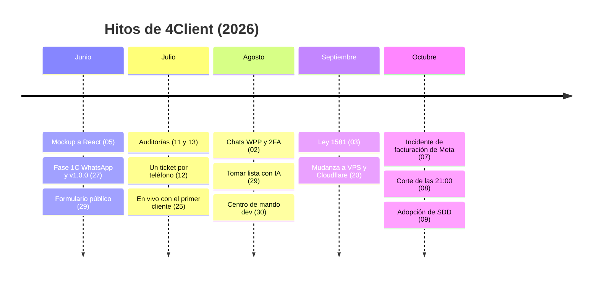

# Cronología del proyecto (abril a octubre 2026)

> **Resumen.** En seis meses el proyecto pasó de un mockup HTML (junio) a un cliente real en producción (2026-07-25), con rondas de auditoría, cumplimiento de la Ley 1581 (septiembre) y mudanza de Railway/Vercel a un VPS con Coolify y Cloudflare (2026-09-20). Hitos abajo; el detalle por mes sigue, con el sha de cada commit clave.

Línea de tiempo mes a mes, reconstruida con `git log`. Cada viñeta lleva el sha corto del commit clave; `git show <sha>` da el cuerpo completo (muchos commits explican el porqué). Las fechas son las del commit (fecha de autor). Lo que no tiene commit que lo pruebe se marca *(inferido)* o *(José)*.

Commits por mes: abril 2, junio 131, julio 244, agosto 126, septiembre 58, octubre (hasta el 9) 19. **No hay commits en mayo.**

Los releases a producción (merges a `main`) están en [`changelog.md`](changelog.md). Las decisiones que no se deben deshacer están en [`decisiones.md`](decisiones.md).

## Abril 2026 — el primer commit

- 2026-04-11 `12a21e1` "first commit" (y `36dba10`, mismo día): repositorio creado; no hay más actividad hasta junio.

## Junio 2026 — del mockup a la v1.0.0

- 2026-06-05 `22d6e59`: arquitectura base (React + Node). Ese día se migra el mockup HTML a componentes React: tablero Kanban, `TicketModal`, `CierreModal`, `ResumenDia` (`5fb0155`, `bd1d058`, `618155b`). **Era del mockup.**
- 2026-06-15 `6655ab7`: se escribe el plan de implementación (hoy `archivo/RoadMap/PLAN_IMPLEMENTACION_ORIGINAL.md`; renombrado en `da7567c`). Fija "Meta Cloud API oficial para todos los clientes, con número dedicado".
- 2026-06-15 `6294727`: "fase 1a implementada" (backend). `18689b1`: andamio del frontend (fase 1B).
- 2026-06-16 `9f9afb6`…`ee62e38`: primeros PR #1 a #4 en GitHub (UI, plan, fase 1a).
- 2026-06-27 `0caa543`: **Fase 1C**, integración WhatsApp Meta Cloud API (webhook con HMAC, envío, verificación).
- 2026-06-27 `6f46ef6`: `order_history` inmutable a nivel de base (RULE de PostgreSQL) y límite de login (10/min por IP).
- 2026-06-27 `d3dee40`: infraestructura inicial (Cloudflare R2, Railway, Vercel, CI en GitHub Actions).
- 2026-06-27 `9e6a809`: **release v1.0.0, "Fase 1 completa"** (backend, frontend, WPP, infra de despliegue).
- 2026-06-28 `86c366c`, `75d288e`: endurecimiento de seguridad y parches de vulnerabilidades; `49e708e`: respuesta automática WPP, pantalla de configuración y rol `dev`; `2d4af1c`: Sentry.
- 2026-06-28 `de5a220`…`3aaabfe`: varias correcciones de despliegue en Railway (Dockerfile, `start.sh` como arranque).
- 2026-06-29 `455d395`, `838055a`: **formulario público del cliente** con link firmado y creación de pedidos.

## Julio 2026 — auditorías, endurecimiento y paso a producción

- 2026-07-11 `fb1bd8a`: se crea el plan de mejoramiento (`IMPROVE.md`); `d939a75`: se resuelve la auditoría completa (seguridad, Fastify 5, tests). **Auditoría técnica del 2026-07-11** (`archivo/RoadMap/AUDITORIA_TECNICA_2026-07-11.md`).
- 2026-07-11 `f783b15`: causa raíz de que el refresh de sesión fallara siempre (400 por cuerpo JSON vacío). `96df7ea`: 24 arreglos de UX con feedback del cliente en campo.
- 2026-07-12 `954e134`: **un ticket por teléfono, para siempre** (antes era por día). `3d284cb`: colisión de numeración de pedidos y fragmentación de chats entre días, ambas vistas en producción real *(inferido: "producción" aquí era el entorno `main` de pruebas con el cliente)*.
- 2026-07-12: ráfaga de merges `dev` → `test` → `main` (ver changelog; son anteriores a la puesta en vivo).
- 2026-07-13: **auditoría de seguridad del 2026-07-13** (`archivo/RoadMap/AUDITORIA_SEGURIDAD_2026-07-13.md`, visible en el repo desde `da7567c`). `20260713000000_ticket_unique_per_phone` aplica la unicidad por teléfono.
- 2026-07-14 `dfdbc7e`: links del formulario atados al dispositivo, pedidos en camino/cerrados de solo lectura, seguimiento de cambios del cliente.
- 2026-07-19 `1121436`: trazabilidad completa (audit trail) y ventana 4 a. m. a 8 p. m. del formulario (retirada el 07-24); `91b0c10`: manual de usuario para Fruver San Gabriel.
- 2026-07-22 `89c4f88`: banner rojo "DEV" en el entorno de desarrollo; `32c445a`: logo del cliente en el encabezado.
- 2026-07-23 `6a24aa8`, `4557787`: verificación de los últimos 4 dígitos del teléfono y bloqueo por intentos fallidos en los links; `1daf3a1`: **backup diario automático** de la base de producción.
- 2026-07-24 `089ddc3`: se quita el PIN de los links (el token firmado es el único límite), campo `observación` y bloqueo de pedidos cerrados a admin/dev.
- 2026-07-25 `bd897e8`: se elimina el bloqueo por dispositivo de los links; TTL plano de 24 h. **Puesta en vivo en producción con Fruver San Gabriel: 2026-07-25 (José, `00-estado-actual.md`); el primer merge a `main` posterior (`ad1e92f`) es del 07-26 (inferido).**
- 2026-07-31 `7c43855`: soporte completo de multimedia de WhatsApp (audio, video, documento, ubicación).

## Agosto 2026 — numeración, Chats WPP, IA y facturación de plataforma

- 2026-08-01 `4d3e41b`: se guarda el payload crudo del webhook de Meta en la base. `850bb22`: BSUID (usuario de WhatsApp sin teléfono) evita refragmentar tickets.
- 2026-08-02 (día de mucho release): `17c6952` numeración que rellena huecos con lock; `a4bbc58` el pospuesto se renumera; `0812ef7` reenviar mensajes; `f4977a0` búsqueda en Chats WPP; `9e284dc` 2FA por correo (solo `dev`); `dbc9633` Chats WPP vuelve a ser solo admin/dev. Release `6b744fe`.
- 2026-08-16 `d78e225`: el token de WhatsApp se cifra en reposo (dos scripts lo escribían en claro); hallazgo de auditoría.
- 2026-08-23 `24e6346`, `b7d3e5b`: corregir pedido cerrado "sin cobro" y mostrarlo en rojo en el informe; `9eee1cd`: el cobro en casa deja de duplicarse en el informe.
- 2026-08-28 `8012ec4`: bienvenida y aviso del link en un solo mensaje (3 mensajes en vez de 4).
- 2026-08-29 `8c28f5b`: **"Tomar lista"**, armar el pedido con IA desde el chat. Ese mismo día la cadena de proveedores cambia cuatro veces: `3c6e4fd` (sin Gemini), `e70cf92` (Gemini principal), `f67b2b2` (respaldo Groq/OpenRouter).
- 2026-08-29 `2a02337`, `fdcf690`, `047a1d3`: tabla de productos editable, precios por Excel, catálogo por WhatsApp.
- 2026-08-30 `ed641e3`: **centro de mando `dev`** (crear organizaciones, acciones curadas, facturación de plataforma).

## Septiembre 2026 — responsive, Ley 1581 y mudanza a Coolify

- 2026-09-01 `b7cd1e7`, `101af51`, `f366525`: factura de plataforma con diseño profesional, pestaña de Facturación para admin, valor por concepto.
- 2026-09-02 `7de543c`: mensaje de redirección para el número de WhatsApp retirado; `6ed88f2` (y `47429f6`, 09-03): app usable en celular (hamburguesa, carrusel chat/pedidos).
- 2026-09-03 **cumplimiento Ley 1581**: `e851ea3` consentimiento en el formulario, `80159c0` aviso de privacidad en la bienvenida, `f896648` derecho de supresión ("Eliminar datos"), `a828ba2` multimedia del chat solo en WhatsApp (nunca R2, disco ni BD), `86f0998` y `3b240a7` aviso una sola vez y consentimiento en cada pedido. Release `c87bda1`.
- 2026-09-03 `3dc2d4a`: el correo de login es único en toda la plataforma; `4ff4897`: remedia hallazgos técnicos de auditoría.
- 2026-09-08 `0d0be84` y 09-09 `d64551b`: ningún pedido queda con precio autoasignado del catálogo (ni en Tomar lista).
- 2026-09-09 `1a0cea3`, 09-17 `6761d87`, 09-18 `5a95264`: rondas de cierre de hallazgos de auditorías de seguridad.
- 2026-09-20 **mudanza Railway/Vercel → VPS con Coolify y Cloudflare**: `9672ded` mueve `dev` al VPS (base migrada 1:1); `7c2945a` reemplaza `RAILWAY_ENVIRONMENT_NAME` por `APP_ENVIRONMENT_NAME`; `53aba9a` limpia referencias a Railway. Los merges a `main` ese día (`97bfabb`, `bd6c1c7`) llevan el cambio a producción. **Fecha exacta del traslado de la base de producción: sin commit que la pruebe → PREG-114.**
- 2026-09-20 `a5d1be3`, `b356e50`, `3a55e77`: el chat siempre abre al final, botón "ir al final", cargar anteriores en todos los modales.
- 2026-09-21 `035968d`: tablero reordenado, se quita la columna Entregado, bienvenida sin link automático.
- 2026-09-28 `8dd5252`: auditoría de cumplimiento: tickets cargaban todo el historial, falla de arranque sin `APP_ENVIRONMENT_NAME`, socket se corta al vencer el JWT, auditoría de logins, versión de política en `Ticket`/`Order`.

## Octubre 2026 — hasta el día 9

- 2026-10-03 `f89ec15`: vulnerabilidades de auditoría y dependencias (fastify 5.12.5, overrides).
- 2026-10-05 `3432aec`: botón "Cuenta banco" en el chat y mensaje de domicilio (mínimo $10.000, costo $2.000; el mínimo pasó a $20.000 el 10-09, release `a072a25`).
- 2026-10-06 `024365b`: mensajes editables por organización (Configuración > Mensajes); `1dce1d6`: "Eliminar datos" pasa de admin a solo `dev`; `39d96a3`: encabezado de chat unificado.
- **2026-10-07: incidente de facturación de Meta** (José): los envíos del negocio fallaron con "Business eligibility payment issue" mientras la recepción seguía; sin commit. Procedimiento en `04-operacion/runbooks.md` § e. La fecha de resolución no está registrada → PREG-115.
- 2026-10-08 `b8f83a5`, `55de2fc`, `aec85c4`: **corte de las 21:00**: un chat cuyo primer mensaje real del día llega entre 21:00 y 23:59:59 cuenta para el día siguiente. Tres commits el mismo día: primero ticket nuevo, luego "solo al crear", y la regla final "primer mensaje real del día", tras una prueba de José con su propio número. Releases `2f98b3a`, `fed1270`.
- 2026-10-09 `21017f3`: la política de privacidad se sirve desde el dominio de 4Client (antes estaba en un repo público de GitHub Pages); `30c5271`: se quitan Vercel y Railway del repo.
- 2026-10-09 (José, `entornos-y-despliegue.md` § 6): se planea pasar el repo `4Client-org/4client` de público a privado esa noche y cambiar la fuente de `4client-api-prod` a la GitHub App (plan; el resultado no está registrado). Incidente el mismo día: la primera regla de firewall bloqueó también el puerto del webhook de Coolify (`runbooks.md` § a).
- 2026-10-09 `066c45d`: **adopción de SDD** (rama `docs/specs-sdd`): principios, glosario, permisos, plantillas y primeros módulos en `specs/`.

## Preguntas abiertas de esta cronología

| ID | Pregunta |
|---|---|
| PREG-114 | ¿Qué día exacto se movió la base y el backend de **producción** de Railway al VPS con Coolify? (el commit `9672ded` solo habla de `dev`; el cuerpo dice "prod sigue en Railway hasta que se pida ese paso"). |
| PREG-115 | ¿Cuándo y cómo se resolvió el incidente de Meta del 2026-10-07 (tarjeta, saldo)? ¿Cuántos mensajes se perdieron? |
| PREG-116 | ¿Es correcto que la puesta en vivo fue el 2026-07-25? El estado actual lo dice (José) pero el primer merge posterior a `main` es del 07-26 y hubo merges `test` → `main` desde el 07-12. |
| PREG-117 | No hay commits en mayo. ¿Hubo trabajo previo (otro repo, mockup en HTML) que deba mencionarse? |
