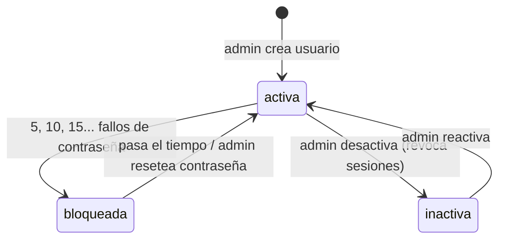

# ACC — Cuentas, roles y acceso

> Quién puede entrar a 4Client y con qué rol: organizaciones como inquilinos, usuarios con login, domiciliarios sin login (empleados), inicio y cierre de sesión, y el 2FA del operador. Lo usan el administrador (gestiona cuentas) y todo el personal (inicia sesión).

Este módulo es el **dueño funcional** de cuentas y sesión. La visión transversal de seguridad (cabeceras, cifrado, Ley 1581, límites de peticiones) está en `02-tecnico/seguridad-y-privacidad.md`; aquí se enlaza y no se repite.

## 1. Negocio

**Propósito.** Que cada negocio (fruver) tenga su propio equipo con el rol justo, y que nadie ajeno entre. El dueño crea y desactiva cuentas sin pedir ayuda; el operador de la plataforma (`dev`) queda fuera del alcance del dueño.

**Permisos.** Filas "Usuarios (crear, editar, resetear contraseña)" y "Empleados (domiciliarios sin login)" de `01-funcional/actores-y-permisos.md`; ambas: admin y dev. Leer empleados (`GET /employees`) lo puede cualquier rol con sesión. Lo que esa tabla no dice y la **interfaz difiere de la API**:
- La API acepta crear un usuario `admin`; el formulario solo ofrece Encargado y Domiciliario. Al editar, el rol `admin` de una fila existente se conserva como opción solo para no mostrar un desplegable vacío.
- El formulario valida contraseña de 6 caracteres como mínimo (alta y reset); la API exige la política de RN-ACC-08. Gana la API: el usuario ve su mensaje de error.
- El botón de desactivar aparece en todas las filas, incluida la propia; la API lo rechaza (RN-ACC-06).
- El campo "nombre de usuario" se muestra y se guarda, pero no sirve para entrar.

**Pestañas de Configuración por rol** (`ConfigTab.tsx`): admin ve Productos, Usuarios (con Domiciliarios debajo), Mensajes y Facturación; dev ve las mismas salvo Facturación (su vista es DevTools) y aterriza en DevTools; encargado y domiciliario no ven Configuración (la pestaña existe solo para admin/dev en `MainPage.tsx`). *(código, plataforma)*

**Estados / ciclo de vida de una cuenta.**

Un usuario nunca se borra: se desactiva. Un empleado tampoco: se desactiva y deja de listarse.

**Reglas.**

*Organización y usuarios*

- **RN-ACC-01 — Todo cuelga de una organización.** Siempre cada usuario y cada empleado pertenece a una organización; las rutas de usuarios y empleados filtran por el `org_id` del token, nunca por el cuerpo. Una organización inactiva no deja entrar a nadie (RN-ACC-11). *(plataforma, código)*
- **RN-ACC-02 — Email único en toda la plataforma.** Siempre un email existe una sola vez entre todas las organizaciones; crear o cambiar a un email ocupado da 409 `DUPLICATE_EMAIL`. *Por qué:* el login pide solo email y contraseña (no pregunta la organización); con el mismo email en dos negocios la cuenta "perdedora" nunca podía entrar. Decisión explícita con el usuario (commit 3dc2d4a, 2026-09-03): quien administre dos negocios usa un alias de correo. El email se guarda en minúsculas. Un usuario desactivado sigue ocupando su email. *(plataforma, código; José por el commit)*
- **RN-ACC-03 — Nombre de usuario opcional, aún sin uso.** El `username` es opcional, de 3 a 30 caracteres (minúsculas, números, punto, guion y guion bajo), único en la plataforma (409 `DUPLICATE_USERNAME`). Está preparado para un futuro login por usuario; hoy `/auth/login` solo acepta email. *(plataforma, código)*
- **RN-ACC-04 — Roles que se pueden crear.** Por la API solo `admin`, `encargado` y `domiciliario`. Nunca se crea ni se asigna `dev` por la API (ni siquiera un dev). Las cuentas `dev` nacen solo del seed del entorno (`dev.ts › POST /seed`, deshabilitado en producción). Un dev crea cada organización desde DevTools junto con su primer admin (`dev.ts`). *(plataforma, código)*
- **RN-ACC-05 — El admin no ve cuentas `dev`.** Siempre listar, editar y resetear contraseña por un admin excluye `role = dev`: responde 404 `NOT_FOUND` como si no existieran. *(plataforma, código)* *(sin test)*
- **RN-ACC-06 — Sin autodesactivación.** CUANDO un usuario intenta desactivarse a sí mismo, el sistema DEBE responder 400 `SELF_DEACTIVATE`. No hay guardas equivalentes para cambiarse el rol a sí mismo ni para dejar la organización sin admin (PREG-058). *(plataforma, código)* *(sin test)*
- **RN-ACC-07 — Desactivar corta la sesión.** CUANDO se desactiva un usuario, el sistema DEBE revocar todos sus refresh tokens y desconectar sus sockets abiertos. Su access token ya emitido sigue valiendo hasta 15 min (PREG-065). Reactivar no revive los refresh tokens viejos: debe iniciar sesión de nuevo. *(plataforma, código)* *(sin test)*
- **RN-ACC-08 — Política de contraseña.** Al crear un usuario o resetear su contraseña, esta DEBE tener mínimo 12 caracteres con al menos una mayúscula, una minúscula y un número; si no, 400 `VALIDATION_ERROR`. Hash bcrypt de costo 12. El login **no** aplica esta política, para que entren cuentas anteriores a ella. Un usuario no puede cambiar su propia contraseña: solo el reset de un admin. *(plataforma, código)* *(sin test)*
- **RN-ACC-09 — Resetear contraseña.** CUANDO un admin resetea la contraseña de un usuario, el sistema DEBE guardar el hash nuevo, borrar el contador de fallos y el bloqueo, revocar todos sus refresh tokens (cierra todos sus dispositivos) y desconectar sus sockets. *(plataforma, código)* *(sin test)*
- **RN-ACC-10 — Auditoría de cuentas.** Crear, actualizar y resetear contraseña de un usuario DEBE quedar en `AuditLog` (`user.create`, `user.update`, `user.reset_password`); el inicio de sesión exitoso y el fallido también (`auth.login_success`, `auth.login_failed`). El catálogo completo de acciones está en `02-tecnico/seguridad-y-privacidad.md` §9. Empleados no se auditan. *(plataforma, código)* *(sin test)*

*Inicio de sesión*

- **RN-ACC-11 — Credenciales incorrectas, siempre igual.** Email inexistente, usuario inactivo, contraseña incorrecta y organización inactiva DEBEN responder igual: 401 `INVALID_CREDENTIALS`, y la interfaz muestra siempre "Usuario o contraseña incorrectos", sea cual sea el fallo. Una contraseña correcta con la organización inactiva no cuenta como fallo. *(plataforma, código)*
- **RN-ACC-12 — Límite por IP.** `/auth/login` admite 10 peticiones por minuto, `/auth/login/verify-code` 20 y `/auth/refresh` 20 (por IP; ver §12 de seguridad). *(plataforma, código)* *(sin test)*
- **RN-ACC-13 — Bloqueo escalonado por cuenta.** CUANDO los fallos acumulados de una cuenta cruzan un múltiplo de 5, el sistema DEBE bloquearla: 5 fallos, 5 min; 10, 15 min; 15 o más, 1 h. Durante el bloqueo, incluso la contraseña correcta recibe 429 `ACCOUNT_LOCKED` con mensaje genérico. El contador solo se reinicia con un login completo, un 2FA correcto o un reset de un admin. Se avisa al dueño por correo solo cuando el bloqueo nace de una contraseña errónea en `/login`; el bloqueo por códigos 2FA erróneos no envía correo. *(plataforma, código)*
- **RN-ACC-14 — Sesión de 15 min renovable por 7 días.** Un login correcto entrega un access token JWT de 15 min y un refresh token de 7 días en cookie `httpOnly`. Cada refresh lo rota. Presentar un refresh ya rotado revoca todos los del usuario (401 `TOKEN_REUSE_DETECTED`). `/refresh` exige la cabecera `X-Requested-With: XMLHttpRequest` (403 `CSRF_CHECK_FAILED`). Detalle y tabla de valores: `02-tecnico/seguridad-y-privacidad.md` §1. *(plataforma, código)*
- **RN-ACC-15 — Refresh con cuenta u organización inactiva.** CUANDO se pide refresh y el usuario o su organización están inactivos, el sistema DEBE revocar ese token y responder 401 `USER_INACTIVE`. El refresh relee el rol de la base. *(plataforma, código)* *(sin test)*
- **RN-ACC-16 — 2FA solo para `dev`.** Solo si `REQUIRE_2FA` está activo **y** el rol es `dev`, el login responde `pending2fa` y envía un código de 6 dígitos al correo; vale 5 min y 5 intentos; un código vigente de menos de 30 s se reutiliza; máximo 5 códigos por cuenta en 15 min (429 `CODES_RATE_LIMITED`); un código incorrecto suma al contador de bloqueo. Errores propios: `INVALID_CODE` (401, código incorrecto), `CODE_EXPIRED`, `CODE_LOCKED`, `EMAIL_SEND_FAILED`. Admin, encargado y domiciliario nunca ven 2FA (decisión explícita comentada en `auth.ts`). *(plataforma, código)*
- **RN-ACC-17 — `authenticate` y `requireRole`.** Siempre `authenticate` rechaza (401 `UNAUTHORIZED`) un token inválido o sin `userId` o `role` (así un link de formulario no sirve de token de personal). `requireRole(...)` deja pasar a `dev` en toda verificación y devuelve 403 `FORBIDDEN` al resto. No consulta la base: un cambio de rol o desactivación se nota al renovar el token. *(plataforma, código)*
- **RN-ACC-18 — El socket sigue al token.** CUANDO un socket se conecta, el sistema DEBE verificar el JWT (rechaza tokens sin `userId`/`role`) y desconectarlo en el instante en que ese token vence; además `join:org` solo une a la organización propia. *(plataforma, código)* *(sin test)*
- **RN-ACC-19 — Cierre de sesión.** CUANDO el usuario sale (botón o inactividad), la web DEBE llamar a `POST /auth/logout` (revoca el refresh de la cookie), desconectar el socket, borrar la sesión y limpiar la caché de consultas. *(plataforma, código)*

*Navegador*

- **RN-ACC-20 — Token solo en memoria.** Siempre el access token vive en memoria; `sessionStorage` guarda solo el perfil del usuario (se pierde al cerrar la pestaña). Al recargar, con perfil guardado, la web intenta recuperar la sesión con el refresh. *(plataforma, código)*
- **RN-ACC-21 — Un solo refresh a la vez.** CUANDO varias peticiones reciben 401 a la vez, la web DEBE compartir un único refresh en vuelo (`tryRefresh`); si falla, borra la sesión. El socket reutiliza el mismo refresh al reconectar. Un 401 sin token adjunto (login fallido) no dispara refresh. *(plataforma, código)* *(sin test)*
- **RN-ACC-22 — Cierre por inactividad: 1 h.** CUANDO pasa 1 hora sin ratón, teclado, toque o scroll, la web DEBE cerrar la sesión (RN-ACC-19), aunque haya refrescos en segundo plano. *Por qué:* con cookie de 7 días, una pestaña olvidada en un equipo compartido seguiría autenticada. *(plataforma, código)* *(sin test)*

*Empleados (domiciliarios sin login)*

- **RN-ACC-23 — Empleado ≠ usuario.** Un empleado es un registro aparte sin login ni rol de acceso; solo sirve para asignar un pedido (`Order.employee_id`). Crear, editar y desactivar es solo admin (dev pasa). Desactivar es suave (`active = false`) y solo lista los activos; no hay forma de reactivar ni de listar inactivos (PREG-061). El campo `role` del empleado es texto libre con valor por defecto `domiciliario` y la interfaz no lo muestra. *(plataforma, código)* *(sin test)*

**Textos que ve el cliente final.** Ninguno. El único correo del módulo va al personal (código 2FA y aviso de bloqueo).

## 2. Técnico

**Mapa de código.**

| Parte | Dónde |
|---|---|
| API sesión | `apps/api/src/routes/auth.ts › POST /login`, `› POST /login/verify-code`, `› POST /refresh`, `› POST /logout`, `› GET /me`, `› lockoutDurationMs`, `› issueSession` |
| API usuarios | `apps/api/src/routes/users.ts › GET /`, `› POST /`, `› PATCH /:id`, `› POST /:id/reset-password` |
| API empleados | `apps/api/src/routes/employees.ts` (GET / POST / PATCH / DELETE) |
| Middleware | `apps/api/src/middleware/auth.ts › authenticate`, `› requireRole` |
| Contraseña | `apps/api/src/lib/password.ts › passwordSchema` |
| Socket | `apps/api/src/plugins/socket.ts` (`io.use`, `disconnectUserSockets`) |
| Config | `apps/api/src/config.ts › envSchema` (`REQUIRE_2FA`, `JWT_SECRET`) |
| Web | `pages/LoginPage.tsx`, `store/auth.ts › useAuthStore`, `lib/api.ts › tryRefresh`, `› tryRestoreSession`, `hooks/useIdleLogout.ts`, `components/config/UsersSection.tsx`, `EmployeesSection.tsx`, `ConfigTab.tsx` (todos bajo `apps/web/src/`) |
| Datos | `Organization`, `User` (`failed_login_attempts`, `locked_until`, `active`), `RefreshToken`, `LoginVerificationCode`, `Employee`, `AuditLog` |

**Regla → se hace cumplir en → test.** Los tests de auth están en `apps/api/test/auth.test.ts` y `auth-2fa.test.ts`.

| Regla | Se hace cumplir en | Test |
|---|---|---|
| RN-ACC-01 | `users.ts` y `employees.ts` (`where org_id`) | *(sin test)* |
| RN-ACC-02 | `users.ts › POST /`, `› PATCH /:id`; índice único en `schema.prisma › User` | *(sin test)* |
| RN-ACC-03 | `users.ts › usernameSchema` | *(sin test)* |
| RN-ACC-04 | `users.ts › createUserSchema`; `dev.ts › POST /seed` | *(sin test)* |
| RN-ACC-05 | `users.ts` (`role: { not: 'dev' }`) | *(sin test)* |
| RN-ACC-06 | `users.ts › PATCH /:id` | *(sin test)* |
| RN-ACC-07 | `users.ts › PATCH /:id`; `socket.ts › disconnectUserSockets` | *(sin test)* |
| RN-ACC-08 | `password.ts › passwordSchema` | *(sin test)* |
| RN-ACC-09 | `users.ts › POST /:id/reset-password` | *(sin test)* |
| RN-ACC-10 | `users.ts`, `auth.ts › issueSession` (vía `audit`) | *(sin test)* |
| RN-ACC-11 | `auth.ts › POST /login` | `auth.test.ts › "rejects login with wrong password -> 401 INVALID_CREDENTIALS"`; `› "rejects login with a nonexistent email using the SAME error code (timing-attack protection)"`; `› "a correct password does NOT count as a failed attempt, even when the account's organization is inactive"` |
| RN-ACC-12 | `auth.ts` (`config.rateLimit` por ruta) | *(sin test)* |
| RN-ACC-13 | `auth.ts › lockoutDurationMs`, `› POST /login` | `auth.test.ts › "locks the account after 5 wrong passwords, notifies the owner by email, and rejects further attempts (even the RIGHT password) with 429 ACCOUNT_LOCKED"` (los tramos de 15 min y 1 h, *sin test*) |
| RN-ACC-14 | `auth.ts › issueSession`, `› POST /refresh` | `auth.test.ts › "logs in with correct credentials -> 200, returns accessToken + user, sets rf cookie"`; `› "refreshes with a valid cookie -> 200, new accessToken, cookie rotated"`; `› "detects refresh-token reuse: replaying a rotated-away cookie returns 401 TOKEN_REUSE_DETECTED and revokes the whole family"`; `› "rejects refresh with no X-Requested-With header -> 403 CSRF_CHECK_FAILED, even with a valid cookie"` |
| RN-ACC-15 | `auth.ts › POST /refresh` | *(sin test)* |
| RN-ACC-16 | `auth.ts › POST /login`, `› POST /login/verify-code` | `auth-2fa.test.ts › "a \"dev\" role user gets pending2fa instead of a session, and a code email fires"`; `› "verify-code with the real code issues a real session and consumes the code"`; `› "verify-code with the wrong code is rejected and does not issue a session"`; `› "admin logs in directly, no 2FA prompt at all, even though REQUIRE_2FA is on"`; `› "encargado also logs in directly - the role gate is specifically \"dev\", not \"everyone except admin\""` (vigencia, reenvío y tope de emisión, *sin test*) |
| RN-ACC-17 | `middleware/auth.ts` | `auth.test.ts › "GET /auth/me with no token -> 401"`; el rechazo de tokens sin `userId`/`role`, *sin test* |
| RN-ACC-18 | `socket.ts › io.use` y temporizador de `exp` | *(sin test)* |
| RN-ACC-19 | `auth.ts › POST /logout`; web `useIdleLogout.ts`, `MainPage.tsx › handleLogout` | *(sin test)* |
| RN-ACC-20 | `store/auth.ts › partialize`; `lib/api.ts › tryRestoreSession` | *(sin test)* |
| RN-ACC-21 | `lib/api.ts › tryRefresh`, `› request` | *(sin test)* |
| RN-ACC-22 | `hooks/useIdleLogout.ts` (`IDLE_LIMIT_MS`) | *(sin test)* |
| RN-ACC-23 | `employees.ts`; `EmployeesSection.tsx` | *(sin test)* |

**Datos y eventos socket.** Sala `user:<id>` (para cortar a una persona) y `org:<id>` (eventos de negocio). Este módulo no emite eventos de negocio.

**Transacciones y concurrencia.** El contador de fallos sube con `increment` atómico; el intento de 2FA se reclama con `updateMany` condicionado; la rotación del refresh va en transacción con `SELECT … FOR UPDATE` sobre el usuario (detalle en seguridad §1). Crear un usuario comprueba el email y el `username` con una lectura previa y después inserta (dos altas simultáneas con el mismo email darían el error crudo de la base, no el 409).

**Códigos de error propios.**

| Código | HTTP | Cuándo |
|---|---|---|
| `INVALID_CREDENTIALS` | 401 | Login fallido (cualquier causa, RN-ACC-11) |
| `ACCOUNT_LOCKED` | 429 | Cuenta en bloqueo |
| `INVALID_CODE` / `CODE_EXPIRED` / `CODE_LOCKED` / `CODES_RATE_LIMITED` / `EMAIL_SEND_FAILED` | 401 / 401 / 401 / 429 / 500 | 2FA |
| `INVALID_REFRESH_TOKEN` / `TOKEN_REUSE_DETECTED` / `USER_INACTIVE` | 401 | Refresh |
| `CSRF_CHECK_FAILED` | 403 | Refresh sin `X-Requested-With` |
| `UNAUTHORIZED` / `FORBIDDEN` | 401 / 403 | Sin sesión / rol insuficiente |
| `DUPLICATE_EMAIL` / `DUPLICATE_USERNAME` | 409 | Alta o edición |
| `SELF_DEACTIVATE` | 400 | Autodesactivación |
| `VALIDATION_ERROR` / `NOT_FOUND` | 400 / 404 | Datos inválidos; usuario o empleado inexistente (o `dev` visto por un admin) |

**Si tocas X, revisa Y.**
- **`passwordSchema`:** la validación de 6 caracteres de `UsersSection.tsx` es independiente y ya diverge; y `dev.ts` (crear organización) también la usa.
- **El email único:** el login depende de ello (`findFirst` sin organización). Quitar el índice rompe el login de una de las dos cuentas.
- **Lista de roles:** `createUserSchema`/`updateUserSchema`, `UserRole` en `packages/shared`, `MainPage.tsx` (etiquetas y pestañas), `ConfigTab.tsx` y `actores-y-permisos.md`.
- **Una ruta que cambie el estado de sesión de un usuario** debe revocar refresh tokens y llamar a `disconnectUserSockets`, como hacen desactivar y resetear (cambiar el rol no lo hace).
- **`lockoutDurationMs`:** el aviso por correo y el borrado del contador se reparten entre `/login`, `/login/verify-code` y el reset de `users.ts`.
- **`REQUIRE_2FA`:** el cambio de entorno cambia el flujo de `LoginPage.tsx` (segunda pantalla); `vi.mock` de `sendEmail` en los tests.

## 3. Pendientes

IDs globales; resumen en `03-plan/preguntas-abiertas.md` y `03-plan/problemas-conocidos.md`. Los hallazgos de sesión ya registrados en seguridad (PREG-064 `REQUIRE_2FA="false"` lo enciende, PREG-065 access token tras desactivar, PREG-066 verify-code ignora el bloqueo) aplican a este módulo y no se repiten.

- **PREG-056 — El login no aplica la política de contraseña.** Es intencional (comentario de `password.ts`): permite entrar a cuentas anteriores. Pero nada obliga a esas cuentas a actualizarse y el usuario no puede cambiar su contraseña por sí mismo. ¿Se quiere un cambio de contraseña propio o una expiración de las viejas?
- **PREG-057 — Cuentas `dev` solo por seed.** La única vía de crear una cuenta `dev` es `POST /dev/seed`, deshabilitado en producción. ¿Cómo se crea o recupera una cuenta dev en producción (sin 2FA ni reset por un admin)? Se verificó por código; la práctica real no consta.
- **PREG-058 — Un admin puede quitarse el rol o dejar la organización sin admin.** `PATCH /users/:id` no impide que el admin se cambie su propio rol, ni exige que quede al menos un admin activo. Solo se bloquea la autodesactivación.
- **PREG-059 — El email de un usuario desactivado queda ocupado,** y no se puede reutilizar en otra organización ni en una cuenta nueva. ¿Es el comportamiento deseado?
- **PREG-060 — Cambiar el email de un usuario no revoca sus sesiones** (tampoco el rol, ver PREG-065), y `user.update` guarda en la auditoría el cuerpo recibido tal cual.
- **PREG-061 — Empleados desactivados no se pueden reactivar** (la API de edición no acepta `active` y la lista solo trae activos). ¿Se necesita reactivar? Un pedido ya asignado conserva su domiciliario inactivo.
- **PREG-062 — El botón de desactivar aparece en la fila propia** aunque la API responde 400 `SELF_DEACTIVATE`. ¿Se oculta?
- **PREG-063 — Nombre de usuario sin login.** Se muestra y se guarda desde hace semanas pero no sirve para entrar. ¿Se activa el login por usuario o se oculta el campo?
- **DT-023 — `users.ts` y `employees.ts` no tienen tests** (permisos por rol, 404 del `dev`, autodesactivación, revocaciones, unicidad, aislamiento por organización). El principio 11 los exige para permisos y tenant.
- **DT-024 — Validación de contraseña duplicada y distinta** en `UsersSection.tsx` (6 caracteres) y `password.ts` (12 con mayúscula, minúscula y número).
- **DT-025 — Sin tests** de los tramos de bloqueo de 15 min y 1 h, de la cuenta inactiva en login/refresh, de la desconexión de sockets al vencer el token ni del cierre por inactividad.
- **DT-026 — Carrera en alta de usuario:** comprobar email y luego insertar puede devolver un 500 por colisión en vez de 409.

Decisiones relacionadas: principio 2 de `00-principios.md` (multi-tenant estricto).
