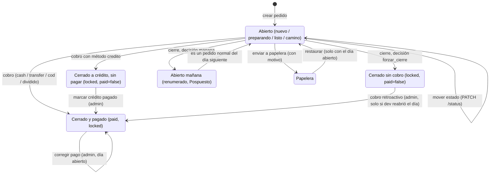

# CAJ — Cobros y cierre de caja

> Registra cómo se paga cada pedido (cobro, crédito, pago dividido, correcciones) y cierra el día del negocio: obliga a decidir cada pedido pendiente, calcula los totales de efectivo y transferencia, guarda una foto del día y lo congela. Lo usan el encargado y el administrador.

## 1. Negocio

**Propósito.** Que la plata que dice el sistema cuadre con la plata real. El cobro bloquea el pedido con la contraseña de quien lo cierra, para que nadie lo cambie después sin dejar rastro. El cierre de caja termina el día: ningún pedido queda "colgado" (cada pendiente se pasa a mañana o se cierra sin cobro), se guardan los totales y el día queda de solo lectura.

**Alcance y límites.**
- *Incluye:* cobro (contraseña, monto, vuelta, pago dividido), crédito y su saldado, cobro retroactivo, cobro en casa (completo/vuelta), corrección del pago de un pedido ya cobrado (desglose por método), cierre de caja con decisiones, totales y foto `DailyClose`, congelamiento del día (`lib/dayClose.ts`), renumerado de lo pasado a mañana, CSV del cierre y reapertura por `dev`.
- *No incluye:* crear, editar y numerar pedidos de forma normal (**ORD**); el pedido del cliente y su paso a mañana al crear (**FRM**, que enlaza aquí el congelamiento); el informe del día en vivo (**DSH**, misma regla de bolsas); la factura (**FAC**); chats y tickets (**INB**).

**Dependencias.**
- *De qué depende:* **ORD** (pedidos, estados, numeración y su candado por día), **ACC** (contraseña y roles), **INB** (el ticket se difiere y sus no leídos se ponen en 0), **PLT** (`audit_logs` y DevTools para reabrir); PostgreSQL (transacción y `pg_advisory_xact_lock`); Socket.IO (`order:paid`, `cierre:done`).
- *Quién depende de él:* **ORD** y **FRM** (consultan el día cerrado), **DSH** (replica la regla de bolsas y lee `DailyClose`), **FAC** (solo factura pedidos ya cobrados).

**Permisos.** Filas "Cobrar un pedido", "Cierre de caja", "Editar un pedido ya bloqueado", "Cambiar el método o el desglose de pago de un pedido ya cobrado" y "Marcar crédito pagado, cobro retroactivo" de `01-funcional/actores-y-permisos.md`. Lo que esa tabla no dice:
- El botón "Cerrar caja" solo existe en "Informe del día", que solo ven admin y dev. La API sí acepta al encargado (ver PREG-008).
- Reabrir un día cerrado es solo para `dev` (DevTools), no hay botón para el admin.

**Estados / ciclo de vida del pedido frente al cobro y al cierre.**

`cerrado` nunca se alcanza moviendo el estado: `PATCH /:id/status` no lo acepta y el tablero abre el diálogo de cobro al arrastrar a esa columna. Se puede cobrar desde cualquier estado abierto, no solo desde "En camino", pero no desde papelera ni si el cliente lo eliminó (RN-CAJ-29). Con el día cerrado no se recorre ninguna flecha del diagrama salvo "marcar crédito pagado" (RN-CAJ-21).

**Reglas.**

*Métodos de pago y cobro*

- **RN-CAJ-01 — Cinco métodos de pago.** Siempre `payment_method` es uno de `sin_asignar` (por defecto), `cash` ("Pagado en tienda"), `transfer`, `cod` ("Cobro en casa") o `credito`. `credito` solo lo puede poner el personal: el formulario del cliente final acepta únicamente `cash`, `transfer` y `cod`. *(plataforma, código)*
- **RN-CAJ-02 — Cobro con contraseña.** CUANDO alguien cobra un pedido, el sistema DEBE verificar la contraseña de la sesión de ese mismo usuario antes de mirar el pedido. Si no coincide: 403 `INVALID_PASSWORD` y el pedido no cambia. El diálogo muestra como "¿Quién recibió el pago?" al usuario de la sesión, no se elige. *(plataforma, código)*
- **RN-CAJ-03 — Pedido completo para cobrar.** Nunca se cobra un pedido al que le falte nombre, teléfono, dirección (vacía o igual a "Pendiente de confirmar", sin importar mayúsculas), método de pago (`sin_asignar` cuenta como falta), domiciliario o productos; en `cod` tampoco si falta el monto con que paga el cliente. Responde 400 `MISSING_FIELDS` con la lista de lo que falta. *Por qué:* los pedidos del formulario llegan con dirección provisional y sin domiciliario. *(plataforma, código)*
- **RN-CAJ-04 — Monto recibido y vuelta.** Siempre el total es la suma de los `price` de los ítems; un total de $0 es válido (todo agotado). El monto recibido debe ser ≥ 0 y ≥ total; la vuelta guardada es monto − total. La interfaz no pide el monto en el diálogo: lo deduce (total, o lo ya registrado para `cod`). *(plataforma, código)*
- **RN-CAJ-05 — Cobro en casa: completo o vuelta.** CUANDO el método es `cod`, el personal DEBE elegir "Completo" o "Necesita vuelta" (ninguna viene marcada); se guarda al crear o editar el pedido, sin contraseña, para que el domiciliario sepa cuánta vuelta llevar. Elección y monto viajan juntos; solo valen con `cod`; el monto debe ser ≥ total y, si es "completo", exactamente igual al total. La elección se guarda explícita (`cod_choice`) porque "vuelta" con monto igual al total no se distingue de "completo" por el número. Guardar sin elegir está permitido; solo el cobro lo exige (RN-CAJ-03). *(plataforma, código)*
- **RN-CAJ-06 — Pago dividido.** CUANDO el cobro se divide entre efectivo y transferencia, las dos partes DEBEN sumar exactamente el total y el monto recibido debe ser igual al total (no hay vuelta). El método de pago del pedido no cambia; solo se guarda el desglose. Se puede dividir con cualquier método, también `credito`. *(plataforma, código)*
- **RN-CAJ-07 — Qué hace el cobro.** CUANDO el cobro se acepta, el pedido DEBE quedar `cerrado`, bloqueado y pagado, salvo `credito`, que queda **sin pagar**. `paid_at`/`paid_by` guardan quién cerró y cuándo, también en crédito (es lo que muestran "Cerrado por" y "Hora cierre"). Queda una entrada en el historial. *(plataforma, código)*
- **RN-CAJ-08 — Un solo cobro por pedido.** Nunca se cobra dos veces: un pedido ya bloqueado da 409 `ORDER_LOCKED` ("Pedido ya cobrado"), y la escritura vuelve a exigir "no bloqueado" y "misma fecha" de forma atómica, así que dos cobros simultáneos, o un cobro mientras el cierre pasa el pedido a mañana, terminan en 409 `ORDER_LOCKED` para el segundo. *(plataforma, código)*
- **RN-CAJ-09 — Crédito.** CUANDO un admin marca un crédito como pagado, el sistema DEBE poner `paid = true` sin pedir contraseña ni monto y sin tocar `paid_at`/`paid_by` (quién y cuándo se saldó queda solo en el historial). Un crédito saldado después **no entra en ningún total** del cierre ni del informe; eso es lo previsto por ahora (D-19, decisión de José 2026-10-09: el cliente no ha pedido gestionarlo; se cierra y queda registrado solo en la pestaña Crédito del informe, **DSH**). Rechaza con 400 un pedido que no es crédito o que ya está pagado. El encargado no puede (403). *Por qué:* saldar una deuda pide el nivel de confianza del dueño. *(plataforma, código)*
- **RN-CAJ-10 — Cobro retroactivo.** CUANDO un admin corrige un pedido "cerrado sin cobro" que sí se cobró, el sistema DEBE marcarlo pagado con `paid_at`/`paid_by` del momento de la corrección, monto recibido = el ya registrado o, si no hay, el total, y vuelta recalculada. Solo vale para cerrado + bloqueado + sin pagar + no crédito; lo demás es 400. El encargado no puede (403). No pregunta el método de pago. Con el día cerrado responde 409 `DAY_CLOSED` (RN-CAJ-21); como "cerrar sin cobro" solo ocurre en el cierre, en la práctica la corrección solo se puede hacer después de que `dev` reabre el día (RN-CAJ-24), y el botón "Marcar como cobrado" se oculta con el día cerrado. *(plataforma, código; decisión de José 2026-10-10)*
- **RN-CAJ-11 — Pedido cobrado = solo admin.** Siempre, después del cobro, solo admin/dev pueden editar el pedido (hasta que se cierre el día); las ediciones quedan marcadas en el historial como "Editado después de cerrado". El encargado recibe 409 `ORDER_LOCKED` (o 403 `PAYMENT_CHANGE_ADMIN_ONLY` si lo que intenta cambiar es el pago, RN-CAJ-26), pero puede agregar observaciones. Sin excepción para crédito: la que existía (commit 663d51d) se quitó por instrucción explícita (commit f7cb841). Lo que el admin edita del cobro sigue RN-CAJ-26 a RN-CAJ-28. *(plataforma, código)*

*Cierre de caja*

- **RN-CAJ-12 — Solo el día de hoy.** CUANDO se pide cerrar una fecha distinta de hoy en Bogotá (UTC−5), el sistema DEBE responder 400 `NOT_TODAY`. *Por qué:* cerrar un día pasado mandaría los pendientes a un "mañana" que ya pasó; un día futuro no tiene nada que cuadrar. *(plataforma, código)*
- **RN-CAJ-13 — Una vez por día.** Nunca se cierra dos veces el mismo día de la misma organización: 409 `ALREADY_CLOSED` con la hora del cierre original. Antes se volvía a ejecutar y pisaba los totales. *(plataforma, código)*
- **RN-CAJ-14 — Todo pendiente exige decisión.** Siempre son pendientes los pedidos de la fecha sin pagar, que no están cerrados ni en papelera y que el cliente no eliminó. Cada uno DEBE traer decisión `manana` o `forzar_cierre`; si falta alguna: 400 `MISSING_DECISIONS` con número y cliente de cada uno. Las decisiones sobre pedidos fuera de esa lista se ignoran. Ya no existen "cancelar" ni "dejar activo": daban una forma de no decidir. *(plataforma, código)*
- **RN-CAJ-15 — Cerrar sin cobro.** CUANDO la decisión es `forzar_cierre`, el pedido DEBE quedar `cerrado` y bloqueado, **nunca** pagado ni con `paid_at`/`paid_by` (no entró plata). Queda en el historial. *(plataforma, código)*
- **RN-CAJ-16 — Pasar a mañana renumera.** CUANDO la decisión es `manana`, el pedido DEBE pasar a la fecha siguiente con número nuevo: se ordenan por su número original y siguen después del mayor número que ya tenga mañana (si mañana está vacío, empiezan en `001`; tres dígitos). Se agrega a sus notas el marcador `pasado_manana:<fecha>:<número viejo>`, su ticket pasa a mañana (`deferred_to`) y queda historial con el número viejo y el nuevo. Todo bajo el mismo candado del día de mañana que usa la creación de pedidos. Si el pedido se cobró mientras tanto, no se mueve y queda historial de la omisión. *Por qué:* antes conservaba el número y mañana empezaba en #24 con huecos. *(plataforma, código)*
- **RN-CAJ-17 — Fantasma del día de origen.** Siempre, al consultar los pedidos del día de origen, se devuelven también los que tienen el marcador de esa fecha; el tablero los muestra atenuados como rastro y el modal de cierre no los cuenta. El tablero muestra "Pedido #nuevo (#viejo)" con la etiqueta Pospuesto. *(plataforma, código)*
- **RN-CAJ-18 — Decisiones sobre chats.** CUANDO llega una decisión de chat, `manana` DEBE pasar el ticket a mañana y `atendido` DEBE poner sus no leídos en 0. La API no exige estas decisiones; la interfaz sí, para cada chat del día sin pedido o con mensajes sin leer, que no esté ya diferido y que no tenga un pedido pendiente (ese chat se mueve con la decisión de su pedido). *(plataforma, código)*
- **RN-CAJ-19 — Cálculo de totales.** Siempre los totales cuentan solo pedidos de la fecha **pagados y cerrados** que el cliente no eliminó. Si tienen pago dividido, cada parte va a su bolsa; si no, `cash` y `cod` van a efectivo y `transfer` a transferencia; cualquier otro método no va a ninguna. Total general = efectivo + transferencia. Por eso un `credito` saldado después (sin pago dividido) queda fuera de los totales: **comportamiento intencional por ahora (D-19)**, no un error; cambiarlo es un cambio clase C. El informe del día en vivo usa la misma regla (`modulos/DSH.md`). *(plataforma, código)*
- **RN-CAJ-20 — Foto del día.** CUANDO el cierre termina, el sistema DEBE guardar en `DailyClose` los totales, el número de pedidos del día (sin papelera ni eliminados por el cliente, contado después de pasar a mañana), los cerrados, las decisiones tal como llegaron y quién cerró; y marcar `caja_cerrada` en todos los pedidos que quedan en la fecha. Las escrituras van en una sola transacción; los totales se calculan justo antes (ver concurrencia, sección 2). *(plataforma, código)*
- **RN-CAJ-21 — Día congelado.** Siempre que exista `DailyClose` para la fecha del pedido, ningún pedido de ese día se crea, edita (admin incluido), mueve de estado (también sacarlo de papelera o mandarlo a papelera), restaura (desde papelera o desde "eliminado por el cliente"), cobra ni recibe cobro retroactivo: todo responde 409 `DAY_CLOSED`. El cliente tampoco puede editar ni eliminar desde el formulario un pedido de un día cerrado (409 `DAY_CLOSED`, revisado después de las demás condiciones de "no editable"). `DAY_CLOSED` se revisa antes que `ORDER_LOCKED`: un pedido cobrado de un día cerrado responde `DAY_CLOSED`. **Excepciones, a propósito:** agregar, editar y borrar observaciones (RN-ORD-22) y marcar un crédito como pagado (RN-CAJ-09; no suma en ningún total, D-19). Un pedido nuevo del formulario del cliente en un día cerrado pasa a mañana con su ticket. Lo que congela es la fila `DailyClose`, no el campo `caja_cerrada` (nadie lo lee). La regla vive en un solo lugar, `lib/dayClose.ts › dayClosedError` / `› findDayClose`, que llaman todas las rutas que modifican pedidos. En la web, con el día cerrado se ocultan "Restaurar pedido" y "Marcar como cobrado" del detalle (la pestaña Papelera del informe, **DSH**, todavía muestra "Restaurar" y recibe el 409). *Por qué:* restaurar en un día cerrado dejaba un pedido abierto que ya no se podía cobrar, mover ni decidir (antes PREG-004). *(plataforma, código; decisión de José 2026-10-10)*
- **RN-CAJ-22 — Aviso en vivo.** CUANDO el cierre termina, el sistema DEBE emitir `cierre:done` a toda la organización; los navegadores recargan pedidos, tickets, informe y estado de cierre de todas las fechas. *(plataforma, código)*
- **RN-CAJ-23 — CSV del cierre.** El CSV tiene columnas #, Cliente, Teléfono, Dirección, Productos, Total, Pago, Estado y Acción cierre. "Acción cierre" es "Completado" solo si el pedido está pagado; crédito sin pagar dice "Pendiente por cobrar (crédito)"; si no, la decisión ("Pasar a mañana" / "Cerrar sin cobro") o "Sin decidir". Los campos se protegen contra inyección de fórmulas. Se puede volver a descargar desde "Informe del día" con las decisiones guardadas en `DailyClose`. *(plataforma, código)*
- **RN-CAJ-24 — Reabrir un día.** Solo `dev` reabre un día cerrado: se borra la fila `DailyClose` y su contenido queda en `audit_logs`. No hay acción para "cerrar" desde DevTools, para no inventar totales. *(plataforma, código)*
- **RN-CAJ-25 — La web sabe si el día está cerrado.** `GET /cierre/status?fecha=` (cualquier rol con sesión) devuelve `cerrado` y `closedAt`; el hook `useDiaCerrado` lo consulta (y no consulta hasta tener fecha). Con día cerrado, el tablero, `TicketModal`, `NuevoPedidoModal` y `DetallePedidoModal` pasan a solo lectura/pasado, admin incluido, igual que el 409 `DAY_CLOSED` de RN-CAJ-21. La consulta se guarda 30 s, pero el evento de socket `cierre:done` la invalida (`MainPage`), así que otra pestaña conectada ve el cierre enseguida; sin socket, puede tardar hasta esos 30 s. *(plataforma, código)*

*Corregir el pago de un pedido ya cobrado (día abierto)*

Un pedido ya cobrado (`locked`) lo puede seguir editando el admin mientras el día no se cierre (RN-CAJ-11). Estas reglas mantienen coherentes los datos del cobro (`payment_method`, `amount_received`, `change_amount`, `split_cash`/`split_transfer`, `cod_choice`; su significado no cambia) cuando cambian el método o el total. Las calcula `lib/paymentEdit.ts › settleLockedOrderEdit` y las escribe `orders.ts › PATCH /:id`.

- **RN-CAJ-26 — Cambiar el pago es solo del admin.** CUANDO alguien intenta cambiar el método de pago de un pedido ya cobrado, o envía un desglose de pago (`payment_breakdown`), el sistema DEBE aceptarlo solo de admin/dev; el encargado recibe 403 `PAYMENT_CHANGE_ADMIN_ONLY` y el domiciliario 403 `FORBIDDEN` (middleware de roles). Un desglose sobre un pedido aún sin cobrar es 400 `VALIDATION_ERROR`. En la web, el método de pago y "completo/vuelta" de un pedido cobrado quedan deshabilitados para todos; el admin los corrige con el botón "Corregir pago" del recuadro "Pedido cerrado y cobrado" (no aparece para el encargado, ni en un crédito, ni con el día cerrado). *(plataforma, código; decisión de José 2026-10-10)*
- **RN-CAJ-27 — Desglose obligatorio.** CUANDO el admin cambia el método de un pedido ya cobrado, o cambia sus ítems y el total cambia, el sistema DEBE exigir `payment_breakdown: { cash, transfer }` (la misma forma que `split` del cobro) con lo que fue en efectivo y en transferencia; sin él, 400 `PAYMENT_BREAKDOWN_REQUIRED` y nada se guarda. La suma DEBE ser exactamente el total nuevo; si no, 400 `PAYMENT_BREAKDOWN_MISMATCH`. Un pedido cobrado solo puede quedar en `cash`, `transfer` o `cod`: pasarlo a `credito` o `sin_asignar`, o cambiar el método de un crédito, es 400 `PAYMENT_METHOD_NOT_ALLOWED` (el crédito se salda con RN-CAJ-09). Un crédito sin pago dividido no lleva desglose (si lo trae, `PAYMENT_METHOD_NOT_ALLOWED`): al cambiar su total, el monto acordado (`amount_received`) pasa a ser el total nuevo con vuelta 0. Si se guarda sin cambiar método ni total, el cobro no se toca: lo que la web mande en `amount_received`/`cod_choice` para un pedido cobrado se ignora (antes ese guardado del admin borraba el "Recibido"). En la web, al guardar un pedido cobrado cuyo total cambió se abre "Corregir pago" antes de enviar. *(plataforma, código; decisión de José 2026-10-10. Las restricciones de `credito` y `sin_asignar` son decisión de implementación, pendiente de confirmar: PREG-011)*
- **RN-CAJ-28 — Recalcular el cobro y el informe.** CUANDO se acepta un desglose, el sistema DEBE dejar: si todo cae en la bolsa natural del método (`cash`/`cod` → efectivo, `transfer` → transferencia), sin pago dividido (`split_*` en null), recibido = total nuevo y vuelta 0, salvo un cobro en casa "con vuelta" cuyo monto entregado aún cubre el total nuevo, que conserva ese monto y recalcula la vuelta; si usa las dos bolsas (o la contraria al método), pago dividido con esas partes, recibido = total y vuelta 0 (como RN-CAJ-06). `cod_choice` queda en null si el método ya no es `cod`. El informe del día, que calcula en vivo con RN-CAJ-19, refleja el nuevo reparto: un pedido de $50.000 en efectivo editado a $20.000 muestra $20.000 en efectivo. Todo queda en `order_history` como cualquier edición ("Método de pago", productos y una entrada "Cobro" con el antes y el después, marcadas "Editado después de cerrado"). *(plataforma, código; decisión de José 2026-10-10)*

*Cobro de pedidos eliminados*

- **RN-CAJ-29 — No se cobra lo eliminado.** Nunca se cobra un pedido en papelera (409 `ORDER_IN_PAPELERA`) ni uno que el cliente eliminó (409 `ORDER_CLIENT_DELETED`); hay que restaurarlo primero. La escritura atómica del cobro vuelve a exigir "no en papelera" y "no eliminado", así que uno que se elimina mientras se cobra también termina en ese 409. *Por qué:* antes solo lo impedía la interfaz, y un eliminado cobrado quedaba pagado pero fuera de todos los totales (antes PREG-010). *(plataforma, código; decisión de José 2026-10-10)*

**Criterios de aceptación.** Archivos de tests: `apps/api/test/orders.test.ts`, `cierre.test.ts` y `cierre-congela-y-cobrados.test.ts`.

1. *Cobro con contraseña.* Dado un pedido completo, cuando se cobra con contraseña errónea, entonces 403 `INVALID_PASSWORD` y el pedido no cambia. RN-CAJ-02. `"POST /orders/:id/cobro with wrong password -> 403 INVALID_PASSWORD, order not marked paid"`
2. *Cobro correcto y único.* Dado un pedido completo, cuando se cobra con la contraseña correcta, entonces queda `cerrado`, bloqueado y pagado; un segundo cobro da 409 `ORDER_LOCKED`. RN-CAJ-07, 08. `"POST /orders/:id/cobro with correct password -> 200, paid+locked; second cobro -> 409 ORDER_LOCKED"`
3. *Pago dividido.* Dado un total, cuando las partes efectivo y transferencia no suman exactamente el total, entonces se rechaza; si suman, se guardan sin vuelta. RN-CAJ-06. `"rejects a split that does not sum to the total"`; `"accepts a split that sums exactly to the total - stores split_cash/split_transfer, no vuelto"`
4. *Crédito.* Dado un pedido con método `credito`, cuando se cobra, entonces queda `cerrado` y bloqueado con `paid = false`; cuando un admin lo marca pagado, `paid` pasa a true sin tocar `paid_at`/`paid_by`, y el encargado recibe 403. RN-CAJ-07, 09. `"POST /orders/:id/cobro on a crédito order closes it (cerrado+locked) through the SAME password+amount flow as everyone else, but leaves paid:false"`; `"PATCH /orders/:id/credito-pagado rejects encargado - admin/dev only per business rule"`
5. *Solo hoy.* Dada una fecha pasada o futura, cuando se pide el cierre, entonces 400 `NOT_TODAY`. RN-CAJ-12. `"cierre on a date other than today -> 400 NOT_TODAY (neither future nor past can be closed)"`
6. *Decisión obligatoria.* Dado un pedido pendiente sin decisión, cuando se cierra la caja, entonces 400 `MISSING_DECISIONS` con el pedido listado. RN-CAJ-14. `"cierre without a decision for a pending order -> 400 MISSING_DECISIONS"`
7. *Cerrar sin cobro.* Dado un pendiente con decisión `forzar_cierre`, cuando se cierra la caja, entonces el pedido queda `cerrado` y bloqueado sin `paid`. RN-CAJ-15. `"GET /cierre/status reflects whether the day has been closed, and \"forzar_cierre\" (cerrar sin cobro) closes the order WITHOUT marking it paid"`
8. *Pasar a mañana renumera.* Dados los pedidos #13 y #24 pendientes con decisión `manana`, cuando se cierra, entonces mañana los tiene como `001` y `002` en ese orden. RN-CAJ-16. `"#13 and #24 both deferred the same cierre become #001 and #002 tomorrow, in that order - never keeping 13/24"`
9. *Día congelado.* Dado un día ya cerrado, cuando un admin intenta editar un pedido de ese día, entonces 409 `DAY_CLOSED`; un segundo cierre del mismo día da 409 `ALREADY_CLOSED`. RN-CAJ-13, 21. `"admin CANNOT edit a locked order once the whole day has been cerrado (caja cerrada) - DAY_CLOSED wins even for admin"`; `"closing an already-closed day again -> 409 ALREADY_CLOSED, and the day stays closed"`
10. *Crédito saldado fuera de totales.* Dado un crédito cobrado y luego saldado (sin pago dividido), cuando se calculan los totales de efectivo y transferencia, entonces no suma en ninguno (D-19). RN-CAJ-09, 19. (sin test; DT-003)
11. *Día cerrado congela todo.* Dado un día con `DailyClose`, cuando se restaura un pedido (desde papelera o desde eliminado por el cliente), se lo saca de papelera, se cobra, se cobra retroactivamente o el cliente lo elimina desde el formulario, entonces 409 `DAY_CLOSED` y el pedido no cambia; marcar un crédito pagado y agregar observaciones siguen funcionando. RN-CAJ-21. `cierre-congela-y-cobrados.test.ts › "restaurar desde papelera con el día cerrado -> 409 DAY_CLOSED y el pedido sigue en papelera"`; `› "excepciones: con el día cerrado se puede marcar un crédito como pagado y agregar observaciones"`
12. *Pedido cobrado editado a menos.* Dado un pedido de $50.000 cobrado en efectivo y el día abierto, cuando el admin lo edita a $20.000 sin desglose, entonces 400 `PAYMENT_BREAKDOWN_REQUIRED`; con desglose `{ cash: 20000, transfer: 0 }` se guarda y el informe muestra $20.000 en efectivo. RN-CAJ-27, 28. `cierre-congela-y-cobrados.test.ts › "$50.000 en efectivo editado a $20.000: sin desglose -> 400 PAYMENT_BREAKDOWN_REQUIRED; con desglose -> el informe muestra $20.000 en efectivo"`
13. *Cambio de método solo admin.* Dado un pedido cobrado, cuando el encargado intenta cambiarle el método, entonces 403 `PAYMENT_CHANGE_ADMIN_ONLY`. RN-CAJ-26. `cierre-congela-y-cobrados.test.ts › "cambiar el método de un pedido cobrado: encargado -> 403 PAYMENT_CHANGE_ADMIN_ONLY, domiciliario -> 403; admin sin desglose -> 400"`
14. *No se cobra lo eliminado.* Dado un pedido en papelera, cuando se cobra, entonces 409 `ORDER_IN_PAPELERA` y no queda pagado. RN-CAJ-29. `cierre-congela-y-cobrados.test.ts › "cobrar un pedido en papelera -> 409 ORDER_IN_PAPELERA, no queda pagado"`

Nada de este módulo es configurable por negocio: no hay reglas *(cliente)*.

**Textos que ve el cliente final.** Ninguno. Ni el cobro ni el cierre envían mensajes por WhatsApp. Un pedido pasado a mañana no avisa al cliente. La factura es otro módulo.

## 2. Técnico

**Mapa de código.**

| Parte | Dónde |
|---|---|
| API cobro | `apps/api/src/routes/orders.ts › POST /:id/cobro`, `› cobroBlockedByDeletion`, `› PATCH /:id/credito-pagado`, `› PATCH /:id/cobro-retroactivo` |
| API corregir pago | `apps/api/src/routes/orders.ts › PATCH /:id` (`payment_breakdown`); `apps/api/src/lib/paymentEdit.ts › settleLockedOrderEdit`, `› paymentSummary` (texto del historial) |
| API validación cod | `apps/api/src/routes/orders.ts › validateCodAmount`, `› codDisplay` (texto del historial), `› createOrderSchema`, `› updateOrderSchema` |
| API congelamiento | `apps/api/src/lib/dayClose.ts › dayClosedError`, `› findDayClose`; lo usan `orders.ts › POST /`, `› PATCH /:id`, `› PATCH /:id/status`, `› PATCH /:id/restore`, `› POST /:id/cobro`, `› PATCH /:id/cobro-retroactivo` y `public.ts › POST /submit` (fusión: rechaza; pedido nuevo: pasa a mañana), `› POST /order/:orderId/delete` |
| API cierre | `apps/api/src/routes/cierre.ts › POST /`, `› GET /status` |
| Numeración | `apps/api/src/lib/orderNumbering.ts › acquireDayLock`, `› dayLockKey`, `› createOrderWithRetryNum` |
| Totales en vivo | `apps/api/src/routes/dashboard.ts › GET /` (bloque de totales y `sinCobro`) |
| Reabrir | `apps/api/src/routes/dev.ts › POST /actions/reopen-cierre` |
| Web cobro | `apps/web/src/components/modals/DetallePedidoModal.tsx › cierreMissing`, `› cobroMut`, `› creditoPagadoMut`, `› cobroRetroactivoMut`, `› openPayFix` y `› triggerSave` (diálogo "Corregir pago"); `apps/web/src/components/orders/CodPaymentField.tsx › CodPaymentField`; `apps/web/src/components/orders/Swimlane.tsx › moveNext`, `› handleDrop` |
| Web cierre | `apps/web/src/components/modals/CierreCajaModal.tsx › CierreCajaModal`; `apps/web/src/components/dashboard/ResumenTab.tsx › ResumenTab` (botón), `› renderSinCobro`; `apps/web/src/lib/csv.ts › downloadCierreCSV`; `apps/web/src/hooks/useCierre.ts › useDiaCerrado`; `apps/web/src/pages/MainPage.tsx › onCierreDone` |
| Etiquetas | `apps/web/src/lib/format.ts › PAYMENT_LABEL` |
| Datos | `Order` (`payment_method`, `paid`, `paid_at`, `paid_by`, `amount_received`, `change_amount`, `cod_choice`, `split_cash`, `split_transfer`, `locked`, `caja_cerrada`, `notes`), `Ticket` (`deferred_to`, `unread_count`), `DailyClose`, `OrderHistory`, `AuditLog` |

**Regla → se hace cumplir en → test.** Rutas abreviadas al nombre de archivo; la ruta completa está en el mapa de arriba.

| Regla | Se hace cumplir en | Test |
|---|---|---|
| RN-CAJ-01 | `orders.ts › createOrderSchema`, `› updateOrderSchema`; `public.ts › POST /submit` | *(sin test)* |
| RN-CAJ-02 | `orders.ts › POST /:id/cobro` | `apps/api/test/orders.test.ts › "POST /orders/:id/cobro with wrong password -> 403 INVALID_PASSWORD, order not marked paid"` |
| RN-CAJ-03 | `orders.ts › POST /:id/cobro`; web `DetallePedidoModal.tsx › cierreMissing` | `orders.test.ts › "cobro-en-casa: POST /orders/:id/cobro is blocked until amount_received has been recorded, even with every other field filled"` (los demás campos, *sin test*) |
| RN-CAJ-04 | `orders.ts › POST /:id/cobro` | `orders.test.ts › "POST /orders/:id/cobro rejects an amount_received below the total - previously unvalidated, could record a negative change_amount"`; `› "POST /orders/:id/cobro closes an order where EVERY item is agotado (price $0) - a legitimate $0 total, not a NO_TOTAL error"` |
| RN-CAJ-05 | `orders.ts › validateCodAmount`; web `CodPaymentField.tsx › CodPaymentField` | `orders.test.ts › "cobro-en-casa: amount_received and cod_choice must travel together - one without the other is rejected"`; `› "cobro-en-casa: "completo" must equal the total exactly, not just be >= it"`; `› "cobro-en-casa: amount_received is rejected on a non-cod order (PATCH and POST)"`; `› "cobro-en-casa: "vuelta" chosen with an amount that happens to equal the total still round-trips as "vuelta", not silently shown as "completo""` |
| RN-CAJ-06 | `orders.ts › POST /:id/cobro` | `orders.test.ts › "accepts a split that sums exactly to the total - stores split_cash/split_transfer, no vuelto"`; `› "rejects a split that does not sum to the total"`; `› "rejects amount_received above the total when split is used (no vuelta allowed on a split)"` |
| RN-CAJ-07 | `orders.ts › POST /:id/cobro` | `orders.test.ts › "POST /orders/:id/cobro on a crédito order closes it (cerrado+locked) through the SAME password+amount flow as everyone else, but leaves paid:false"` |
| RN-CAJ-08 | `orders.ts › POST /:id/cobro` (`updateMany` con `locked: false` y `fecha`) | `orders.test.ts › "POST /orders/:id/cobro with correct password -> 200, paid+locked; second cobro -> 409 ORDER_LOCKED"` (la carrera, *sin test*) |
| RN-CAJ-09 | `orders.ts › PATCH /:id/credito-pagado` | `orders.test.ts › "PATCH /orders/:id/credito-pagado does NOT overwrite paid_by/paid_at - they still reflect who closed it at cobro time, not who settled it later"`; `› "PATCH /orders/:id/credito-pagado rejects encargado - admin/dev only per business rule"`; `› "PATCH /orders/:id/credito-pagado rejects a non-crédito order"` |
| RN-CAJ-10 | `orders.ts › PATCH /:id/cobro-retroactivo` | `apps/api/test/cierre.test.ts › "with the day still closed -> 409 DAY_CLOSED and the order stays unpaid (cobro retroactivo also respects the frozen day)"`; `› "marks it paid, stamps paid_at/paid_by (both null coming in), and leaves total/change consistent"` (con el día reabierto); `› "rejects an order that is NOT locked+cerrado - use the real cobro for a still-open order"`; `› "rejects a crédito order - that one goes through credito-pagado instead"` |
| RN-CAJ-11 | `orders.ts › PATCH /:id` | `orders.test.ts › "encargado (non-admin) trying to change a real field on a locked order -> 409 ORDER_LOCKED"`; `› "admin CAN fully edit a locked order (day not closed) - not just observacion"` |
| RN-CAJ-12 | `cierre.ts › POST /`; web `ResumenTab.tsx › ResumenTab` | `cierre.test.ts › "cierre on a date other than today -> 400 NOT_TODAY (neither future nor past can be closed)"` |
| RN-CAJ-13 | `cierre.ts › POST /` | `cierre.test.ts › "closing an already-closed day again -> 409 ALREADY_CLOSED, and the day stays closed"` |
| RN-CAJ-14 | `cierre.ts › POST /` | `cierre.test.ts › "cierre without a decision for a pending order -> 400 MISSING_DECISIONS"` |
| RN-CAJ-15 | `cierre.ts › POST /` | `cierre.test.ts › "GET /cierre/status reflects whether the day has been closed, and "forzar_cierre" (cerrar sin cobro) closes the order WITHOUT marking it paid"` |
| RN-CAJ-16 | `cierre.ts › POST /`; `orderNumbering.ts › acquireDayLock` | `cierre.test.ts › "#13 and #24 both deferred the same cierre become #001 and #002 tomorrow, in that order - never keeping 13/24"`; `› "deferred orders continue AFTER whatever already exists on tomorrow (e.g. an overnight form order), not always starting at 1"`; `› "moving a pending order to "manana" moves its fecha to tomorrow and PRESERVES original notes with the pasado_manana marker appended (B3 fix)"` |
| RN-CAJ-17 | `orders.ts › GET /`; web `Swimlane.tsx` (`isGhost`), `CierreCajaModal.tsx` | *(sin test)* |
| RN-CAJ-18 | `cierre.ts › POST /`; web `CierreCajaModal.tsx` (`ticketOnlyRows`) | `cierre.test.ts › "a phone can only ever have one ticket per org (@@unique(org_id, phone)) - deferring to "manana" just re-flags the same row, never forks a second one"` (solo el ticket del pedido; `atendido`, *sin test*) |
| RN-CAJ-19 | `cierre.ts › POST /`; `dashboard.ts › GET /` | *(sin test para efectivo/transferencia/dividido en el cierre)*; `apps/api/test/dashboard.test.ts › "a genuinely PAID cash order never shows up in sinCobroEfectivo, even though it is also cerrado+locked"` |
| RN-CAJ-20 | `cierre.ts › POST /` | *(sin test)* |
| RN-CAJ-21 | `dayClose.ts › dayClosedError`, `› findDayClose`; `public.ts › POST /submit`, `› POST /order/:orderId/delete` | `cierre.test.ts › "once a day is closed, EVERY order on it is frozen - even one that was never individually locked, purely because the day itself closed"`; `orders.test.ts › "admin CANNOT edit a locked order once the whole day has been cerrado (caja cerrada) - DAY_CLOSED wins even for admin"`; `apps/api/test/public.test.ts › "POST /submit rolls the new order forward to TOMORROW if today already has a DailyClose - never lands on an already-closed day"`; `apps/api/test/cierre-congela-y-cobrados.test.ts › "restaurar desde papelera con el día cerrado -> 409 DAY_CLOSED y el pedido sigue en papelera"`, `› "restaurar un pedido eliminado por el cliente con el día cerrado -> 409 DAY_CLOSED y sigue eliminado"`, `› "mover desde papelera (drag) o mandar a papelera con el día cerrado -> 409 DAY_CLOSED"`, `› "un pedido ya cobrado de un día cerrado: mover de estado da DAY_CLOSED (antes ORDER_LOCKED), editar también"`, `› "cobrar un pedido de un día cerrado -> 409 DAY_CLOSED, no queda pagado"`, `› "el cliente no puede eliminar desde el formulario un pedido de un día cerrado -> 409 DAY_CLOSED"`, `› "excepciones: con el día cerrado se puede marcar un crédito como pagado y agregar observaciones"`, `› "con el día abierto, restaurar desde papelera sigue funcionando igual"` (la edición del cliente desde el formulario en día cerrado, *sin test*) |
| RN-CAJ-22 | `cierre.ts › POST /`; web `MainPage.tsx › onCierreDone` | *(sin test)* |
| RN-CAJ-23 | `csv.ts › downloadCierreCSV` | *(sin test)* |
| RN-CAJ-24 | `dev.ts › POST /actions/reopen-cierre` | `apps/api/test/dev-centro-mando.test.ts › "borra el DailyClose de esa fecha (reabre) y deja el snapshot en audit_logs"` |
| RN-CAJ-25 | `cierre.ts › GET /status`; web `hooks/useCierre.ts › useDiaCerrado` | *(sin test)* |
| RN-CAJ-26 | `orders.ts › PATCH /:id`; web `DetallePedidoModal.tsx` (`canFixPayment`) | `cierre-congela-y-cobrados.test.ts › "cambiar el método de un pedido cobrado: encargado -> 403 PAYMENT_CHANGE_ADMIN_ONLY, domiciliario -> 403; admin sin desglose -> 400"`; `› "un desglose en un pedido aún abierto (sin cobrar) -> 400 VALIDATION_ERROR"` |
| RN-CAJ-27 | `paymentEdit.ts › settleLockedOrderEdit`; `orders.ts › PATCH /:id`; web `DetallePedidoModal.tsx › triggerSave` | `cierre-congela-y-cobrados.test.ts › "$50.000 en efectivo editado a $20.000: sin desglose -> 400 PAYMENT_BREAKDOWN_REQUIRED; con desglose -> el informe muestra $20.000 en efectivo"`; `› "un desglose que no suma el total nuevo -> 400 PAYMENT_BREAKDOWN_MISMATCH y nada cambia"`; `› "no se puede pasar un pedido cobrado a crédito ni a "sin asignar" -> 400 PAYMENT_METHOD_NOT_ALLOWED"`; `› "un pedido con pago dividido al que le bajan el total exige un desglose nuevo (el viejo ya no suma)"`; `› "un crédito cerrado sin pagar: cambiar ítems no exige desglose y el monto acordado sigue al total nuevo"`; `› "editar solo la dirección de un pedido cobrado (con el payload que manda la web) no toca el cobro: "Recibido" se conserva"` |
| RN-CAJ-28 | `paymentEdit.ts › settleLockedOrderEdit`, `› paymentSummary`; `orders.ts › PATCH /:id`; `dashboard.ts › GET /` | `cierre-congela-y-cobrados.test.ts › "admin pasa de efectivo a transferencia con desglose -> el informe mueve el total a transferencia"`; `› "admin corrige a pago dividido (mismo método) -> se guarda el desglose y cada parte va a su bolsa (RN-CAJ-19)"`; `› "cobro en casa con vuelta: si el monto que entregó el cliente aún cubre el total nuevo, se conserva y la vuelta se recalcula"` |
| RN-CAJ-29 | `orders.ts › POST /:id/cobro`, `› cobroBlockedByDeletion` | `cierre-congela-y-cobrados.test.ts › "cobrar un pedido en papelera -> 409 ORDER_IN_PAPELERA, no queda pagado"`; `› "cobrar un pedido eliminado por el cliente -> 409 ORDER_CLIENT_DELETED, no queda pagado"` |

**Datos y eventos socket.** Cobro, crédito pagado y cobro retroactivo emiten `order:paid` (`{ orderId }`); corregir el pago va por `PATCH /:id` y emite `order:updated` (**ORD**). El cierre emite `cierre:done` (`{ fecha }`). El borrador de decisiones del modal de cierre vive en `localStorage` del navegador (clave `4client_cierre_draft_<fecha>`), no se comparte entre usuarios y se borra al cerrar.

**Transacciones y concurrencia.**
- Cobro: verificación de contraseña y lecturas fuera de la transacción; la escritura usa `updateMany` con `locked: false`, la `fecha` leída, `status` distinto de `papelera` y `client_deleted: false`; si no afecta filas lanza `ORDER_LOCKED_RACE`, se relee el pedido y responde 409 `ORDER_IN_PAPELERA` / `ORDER_CLIENT_DELETED` si ese fue el motivo, o `ORDER_LOCKED`.
- Día cerrado: cada ruta consulta `DailyClose` antes de escribir, fuera de la transacción; un cierre que entra entre esa consulta y la escritura no la detiene (misma ventana que PREG-009).
- Cierre: la comprobación `ALREADY_CLOSED`, la lista de pendientes y los **totales** se calculan **antes** de abrir la transacción. Dentro van: pasar a mañana (con `acquireDayLock` sobre mañana y `updateMany` que vuelve a exigir sin pagar y estado pendiente), cerrar sin cobro, chats, `caja_cerrada` y el `upsert` de `DailyClose`. Ver PREG-009.
- Numeración: la clave del candado es `<org_id>:<AAAA-MM-DD>`, con `pg_advisory_xact_lock(hashtextextended(...))`, liberado al terminar la transacción. La creación normal toma el menor número libre del día; el cierre continúa desde el mayor + 1 (no rellena huecos).

**Códigos de error propios.**

| Código | HTTP | Cuándo |
|---|---|---|
| `INVALID_PASSWORD` | 403 | Cobro con contraseña incorrecta |
| `MISSING_FIELDS` | 400 | Cobro con datos faltantes (RN-CAJ-03) |
| `ORDER_LOCKED` | 409 | Cobro de pedido ya bloqueado o perdido en carrera |
| `DAY_CLOSED` | 409 | Crear, editar, mover, restaurar, cobrar o cobrar retroactivamente en día cerrado; también la edición y el borrado del cliente desde el formulario |
| `ORDER_IN_PAPELERA` | 409 | Cobrar un pedido en papelera (RN-CAJ-29) |
| `ORDER_CLIENT_DELETED` | 409 | Cobrar un pedido eliminado por el cliente (RN-CAJ-29) |
| `PAYMENT_CHANGE_ADMIN_ONLY` | 403 | El encargado intenta cambiar el método o el desglose de un pedido ya cobrado (RN-CAJ-26) |
| `PAYMENT_BREAKDOWN_REQUIRED` | 400 | Cambiar el método o el total de un pedido ya cobrado sin `payment_breakdown` (RN-CAJ-27) |
| `PAYMENT_BREAKDOWN_MISMATCH` | 400 | `payment_breakdown` que no suma exactamente el total nuevo (RN-CAJ-27) |
| `PAYMENT_METHOD_NOT_ALLOWED` | 400 | Pasar un pedido cobrado a `credito`/`sin_asignar`, cambiar el método de un crédito, o desglose en un crédito sin pago dividido (RN-CAJ-27) |
| `VALIDATION_ERROR` | 400 | Cuerpo o parámetros inválidos (también `GET /cierre/status` sin fecha); monto o división inválidos; crédito pagado / retroactivo sobre un pedido que no corresponde; `payment_breakdown` en un pedido sin cobrar |
| `NOT_TODAY` | 400 | Cierre de una fecha distinta de hoy |
| `ALREADY_CLOSED` | 409 | Cierre repetido (incluye `closed_at`) |
| `MISSING_DECISIONS` | 400 | Pendientes sin decisión (incluye `pending` con id, número y cliente) |
| `NOT_FOUND` | 404 | Pedido o usuario inexistente; reabrir un día que no está cerrado |

**Si tocas X, revisa Y.**
- **La regla de bolsas (RN-CAJ-19)** está copiada en tres lugares: `cierre.ts › POST /`, `dashboard.ts › GET /` y `CierreCajaModal.tsx` (vista previa, que ya diverge: PREG-002). `dashboard.ts › GET /` además arma `sinCobro` con su propio filtro de métodos.
- **Los métodos de pago** están en `orders.ts › createOrderSchema` y `› updateOrderSchema`, en el enum de `public.ts › POST /submit` (sin `credito`), en `format.ts › PAYMENT_LABEL` y en un `PAYMENT_LABELS` local de `orders.ts › PATCH /:id` para el historial, que dice "Efectivo" donde la interfaz dice "Pagado en tienda".
- **Los campos obligatorios del cobro** están duplicados entre `orders.ts › POST /:id/cobro` y `DetallePedidoModal.tsx › cierreMissing`; la validación de cobro en casa entre `orders.ts › validateCodAmount` y `CodPaymentField.tsx`.
- **El marcador `pasado_manana:`** lo escribe `cierre.ts` y lo leen `orders.ts › GET /` (búsqueda por texto), `Swimlane.tsx`, `CierreCajaModal.tsx` y `DetallePedidoModal.tsx` (expresión con número viejo opcional, para marcadores antiguos sin él).
- **Una ruta nueva que modifique pedidos** debe llamar a `lib/dayClose.ts › dayClosedError` (o `› findDayClose`), o el día deja de estar congelado (RN-CAJ-21). Hoy no lo llaman: `PATCH /:id/credito-pagado` y las observaciones (excepciones a propósito), `cierre.ts` (es el que cierra), `tickets.ts › PATCH /:id` (renombrar el chat copia nombre y teléfono a todos sus pedidos, también de días cerrados) e `inbox.ts › POST /:ticketId/erase-data` (borrado de datos por Ley 1581).
- **Los campos del cobro** (`amount_received`, `change_amount`, `split_*`, `cod_choice`) de un pedido cobrado solo los escriben el cobro, el cobro retroactivo y `paymentEdit.ts › settleLockedOrderEdit`; si cambias la regla de bolsas (RN-CAJ-19), revisa su `naturalBucket`.
- **Las decisiones de cierre** (`cierre.ts`) y `DECISION_LABEL` de `csv.ts` deben coincidir.
- **El candado del día** (`dayLockKey`) lo comparten la creación de pedidos y el cierre: cambiar el formato de la clave en un solo lado rompe la serialización.

## 3. Pendientes

IDs globales; resumen en `03-plan/preguntas-abiertas.md` y `03-plan/problemas-conocidos.md`.

- **PREG-001 — Pagos que no caen en ninguna bolsa.** *(Respondida en parte por D-19, 2026-10-09: que un crédito saldado después quede fuera de los totales es **intencional por ahora** y no se "arregla" sin petición del cliente. Sigue abierto solo lo de `sin_asignar` y los valores heredados.)* Lo que queda en duda: un pedido `sin_asignar` cerrado sin cobro y luego corregido con cobro retroactivo (que no pregunta el método) no cae en ninguna bolsa, y tampoco cualquier valor heredado fuera de los cinco (se reportó `efectivo` en datos de dev; la columna es texto libre). Esos valores heredados además hacen fallar `PATCH /:id` si la interfaz los reenvía. `sinCobro` del informe tampoco lista los `sin_asignar`. ¿Dónde deben contarse esos casos?
- **PREG-002 — Vista previa del modal de cierre ≠ cierre real.** `CierreCajaModal.tsx` suma "completados" como pagado **o** cerrado, ignora el pago dividido (todo el total va a la bolsa del método) e incluye pedidos eliminados por el cliente, que la API excluye. Lista los créditos cerrados sin pagar bajo "Pedidos completados" con la etiqueta "Completado". Además, un pedido pendiente eliminado por el cliente aparece como pendiente y la interfaz exige decidirlo, pero la API ignora esa decisión. El CSV no tiene el problema del crédito: dice "Pendiente por cobrar (crédito)". ¿Debe la vista previa usar exactamente la regla del servidor?
- **PREG-003 — El CSV descargado después de cerrar omite los pasados a mañana.** Desde "Informe del día" el CSV usa los pedidos que siguen en la fecha, y los pasados a mañana ya no están; en el modal, tras cerrar, los pedidos se recargan y esos quedan como fantasmas excluidos. Solo el CSV descargado **antes** de confirmar trae la fila "Pasar a mañana". ¿Es aceptable?
- **PREG-004 — Rutas que cambian un día cerrado.** *(Respondida, decisión de José 2026-10-10: restaurar y cobro retroactivo también responden `DAY_CLOSED`, RN-CAJ-21.)* Solo `PATCH /:id/credito-pagado` sigue permitido con el día cerrado, a propósito (D-19: no suma en ningún total, así que la foto `DailyClose` no queda vieja por él).
- **PREG-005 — Reabrir deja restos.** `POST /dev/actions/reopen-cierre` solo borra `DailyClose`: no deshace `caja_cerrada`, los bloqueos de "cerrar sin cobro", ni los pedidos y tickets pasados a mañana. Y un día pasado reabierto no se puede volver a cerrar (`NOT_TODAY`). ¿Es el uso esperado (solo para corregir y dejarlo abierto)?
- **PREG-006 — ¿A qué día cuenta un crédito pagado?** *(Respondida, D-19: por ahora no cuenta en ningún día.)* Queda como nota para cuando el cliente pida contarlo: el filtro es por `fecha` del pedido, no por el día en que entró la plata, y ese día puede estar ya cerrado (CH aparte, clase C).
- **PREG-007 — Crédito pagado sin cerrar.** `PATCH /:id/credito-pagado` no exige que el pedido esté cerrado, y el botón aparece en cualquier crédito sin pagar. Un crédito abierto marcado pagado queda `paid = true` sin bloquear: el cierre ya no lo ve como pendiente (filtra sin pagar) ni lo suma (no está cerrado), y si luego se cobra, el cobro vuelve a poner `paid = false`. El comentario de `cierre.ts` asume que esto no pasa. ¿Se exige `cerrado`?
- **PREG-008 — ¿El encargado puede cerrar caja?** La API (`requireRole('admin', 'encargado')`) y la matriz de permisos dicen que sí, y los tests cierran como encargado; la interfaz solo muestra el botón en "Informe del día", que el encargado no ve. ¿Cuál es la intención?
- **PREG-009 — Concurrencia del cierre.** Los totales y la comprobación de "ya cerrado" se hacen fuera de la transacción. Un cobro que entra entre el cálculo y el final del cierre queda pagado pero fuera de la foto. Dos cierres simultáneos podrían pasar ambos la comprobación: el segundo pisa la foto y vuelve a renumerar los pasados a mañana (el `WHERE` no vuelve a exigir la fecha original). "Cerrar sin cobro" no vuelve a exigir "sin pagar". La interfaz desactiva el botón mientras envía. ¿Vale la pena cerrar la ventana?
- **PREG-010 — La API cobra pedidos en papelera o eliminados por el cliente.** *(Respondida, decisión de José 2026-10-10: la API los rechaza, RN-CAJ-29.)*
- **PREG-011 — Editar un pedido ya cobrado.** *(Respondida, decisión de José 2026-10-10: se revalida con desglose obligatorio, RN-CAJ-26 a RN-CAJ-28.)* Quedan por confirmar dos decisiones de implementación: que un pedido cobrado no se pueda pasar a `credito` ni a `sin_asignar` (ni un crédito a otro método), y que un crédito sin pago dividido no lleve desglose (para no hacerlo contar en los totales al saldarse, D-19).
- **DT-003 — Faltan tests de dinero.** No hay test de los totales del cierre por bolsa (efectivo, transferencia, dividido) ni de los valores guardados en `DailyClose`. El principio 11 los exige. (El cobro en día cerrado y las bolsas del informe en vivo tras corregir un pago ya tienen test en `cierre-congela-y-cobrados.test.ts`.)
- **DT-004 — Regla de totales triplicada** (servidor del cierre, informe y modal). Ya divergió (PREG-002).
- **DT-005 — `caja_cerrada` se escribe y nadie lo lee;** el congelamiento depende solo de `DailyClose`.
- **DT-006 — Decisiones guardadas sin filtrar y valores viejos.** `DailyClose.decisions` guarda el objeto recibido tal cual (incluye ids ignorados). Cierres hechos cuando existían `dejar_activo` / `cancelar` (entre los commits e63244f y ae5ac64) salen como "Sin decidir" en el CSV. *(inferido)*

Decisiones relacionadas: principio 7 de `00-principios.md` (cerrar la caja congela el día).
