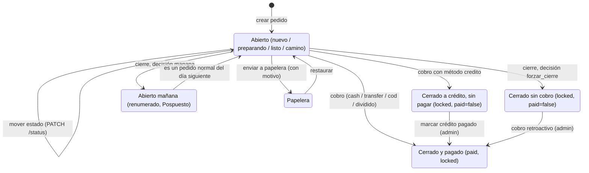

# CAJ — Cobros y cierre de caja

> Registra cómo se paga cada pedido (cobro, crédito, pago dividido, correcciones) y cierra el día del negocio: obliga a decidir cada pedido pendiente, calcula los totales de efectivo y transferencia, guarda una foto del día y lo congela. El cobro lo hacen el encargado y el administrador; el cierre de caja, solo el administrador.

## 1. Negocio

**Propósito.** Que la plata que dice el sistema cuadre con la plata real. El cobro bloquea el pedido con la contraseña de quien lo cierra, para que nadie lo cambie después sin dejar rastro. El cierre de caja termina el día: ningún pedido queda "colgado" (cada pendiente se pasa a mañana o se cierra sin cobro), se guardan los totales y el día queda de solo lectura.

**Alcance y límites.**
- *Incluye:* cobro (contraseña, monto, vuelta, pago dividido), crédito y su saldado (con su fecha de pago), cobro retroactivo, cobro en casa (completo/vuelta), cierre de caja con decisiones y vista previa, la regla única de totales (`lib/cierreTotals.ts`), totales y foto `DailyClose`, congelamiento del día (`findDayClose`), renumerado de lo pasado a mañana, CSV del cierre y reapertura por `dev`.
- *No incluye:* crear, editar y numerar pedidos de forma normal (**ORD**); el pedido del cliente y su paso a mañana al crear (**FRM**, que enlaza aquí el congelamiento); el informe del día en vivo (**DSH**, que usa la misma función de bolsas); la factura (**FAC**); chats y tickets (**INB**).

**Dependencias.**
- *De qué depende:* **ORD** (pedidos, estados, numeración y su candado por día), **ACC** (contraseña y roles), **INB** (el ticket se difiere y sus no leídos se ponen en 0), **PLT** (`audit_logs` y DevTools para reabrir); PostgreSQL (transacción y `pg_advisory_xact_lock`); Socket.IO (`order:paid`, `cierre:done`).
- *Quién depende de él:* **ORD** y **FRM** (consultan el día cerrado), **DSH** (usa la función de bolsas de este módulo y lee `DailyClose`), **FAC** (solo factura pedidos ya cobrados).

**Permisos.** Filas "Cobrar un pedido", "Cierre de caja", "Editar un pedido ya bloqueado" y "Marcar crédito pagado, cobro retroactivo" de `01-funcional/actores-y-permisos.md`. Lo que esa tabla no dice:
- Cerrar la caja y ver su vista previa es **solo admin** (y `dev`, que pasa toda verificación de rol): `POST /cierre` y `GET /cierre/preview` responden 403 `FORBIDDEN` al encargado y al domiciliario (decisión de José 2026-10-10, PREG-008). El botón "Cerrar caja" solo existe en "Informe del día", que solo ven admin y dev, y el modal solo se monta para ellos. `GET /cierre/status` sigue abierto a todo rol con sesión (el tablero lo necesita para congelar el día, RN-CAJ-25).
- Reabrir un día cerrado es solo para `dev` (DevTools), no hay botón para el admin.

**Estados / ciclo de vida del pedido frente al cobro y al cierre.**

`cerrado` nunca se alcanza moviendo el estado: `PATCH /:id/status` no lo acepta y el tablero abre el diálogo de cobro al arrastrar a esa columna. Se puede cobrar desde cualquier estado abierto, no solo desde "En camino".

**Reglas.**

*Métodos de pago y cobro*

- **RN-CAJ-01 — Cinco métodos de pago.** Siempre `payment_method` es uno de `sin_asignar` (por defecto), `cash` ("Pagado en tienda"), `transfer`, `cod` ("Cobro en casa") o `credito`. `credito` solo lo puede poner el personal: el formulario del cliente final acepta únicamente `cash`, `transfer` y `cod`. *(plataforma, código)*
- **RN-CAJ-02 — Cobro con contraseña.** CUANDO alguien cobra un pedido, el sistema DEBE verificar la contraseña de la sesión de ese mismo usuario antes de mirar el pedido. Si no coincide: 403 `INVALID_PASSWORD` y el pedido no cambia. El diálogo muestra como "¿Quién recibió el pago?" al usuario de la sesión, no se elige. *(plataforma, código)*
- **RN-CAJ-03 — Pedido completo para cobrar.** Nunca se cobra un pedido al que le falte nombre, teléfono, dirección (vacía o igual a "Pendiente de confirmar", sin importar mayúsculas), método de pago (`sin_asignar` cuenta como falta), domiciliario o productos; en `cod` tampoco si falta el monto con que paga el cliente. Responde 400 `MISSING_FIELDS` con la lista de lo que falta. *Por qué:* los pedidos del formulario llegan con dirección provisional y sin domiciliario. *(plataforma, código)*
- **RN-CAJ-04 — Monto recibido y vuelta.** Siempre el total es la suma de los `price` de los ítems; un total de $0 es válido (todo agotado). El monto recibido debe ser ≥ 0 y ≥ total; la vuelta guardada es monto − total. La interfaz no pide el monto en el diálogo: lo deduce (total, o lo ya registrado para `cod`). *(plataforma, código)*
- **RN-CAJ-05 — Cobro en casa: completo o vuelta.** CUANDO el método es `cod`, el personal DEBE elegir "Completo" o "Necesita vuelta" (ninguna viene marcada); se guarda al crear o editar el pedido, sin contraseña, para que el domiciliario sepa cuánta vuelta llevar. Elección y monto viajan juntos; solo valen con `cod`; el monto debe ser ≥ total y, si es "completo", exactamente igual al total. La elección se guarda explícita (`cod_choice`) porque "vuelta" con monto igual al total no se distingue de "completo" por el número. Guardar sin elegir está permitido; solo el cobro lo exige (RN-CAJ-03). *(plataforma, código)*
- **RN-CAJ-06 — Pago dividido.** CUANDO el cobro se divide entre efectivo y transferencia, las dos partes DEBEN sumar exactamente el total y el monto recibido debe ser igual al total (no hay vuelta). El método de pago del pedido no cambia; solo se guarda el desglose. Se puede dividir con cualquier método, también `credito`. *(plataforma, código)*
- **RN-CAJ-07 — Qué hace el cobro.** CUANDO el cobro se acepta, el pedido DEBE quedar `cerrado`, bloqueado y pagado, salvo `credito`, que queda **sin pagar**. `paid_at`/`paid_by` guardan quién cerró y cuándo, también en crédito (es lo que muestran "Cerrado por" y "Hora cierre"). Queda una entrada en el historial. *(plataforma, código)*
- **RN-CAJ-08 — Un solo cobro por pedido.** Nunca se cobra dos veces: un pedido ya bloqueado da 409 `ORDER_LOCKED` ("Pedido ya cobrado"), y la escritura vuelve a exigir "no bloqueado" y "misma fecha" de forma atómica, así que dos cobros simultáneos, o un cobro mientras el cierre pasa el pedido a mañana, terminan en 409 `ORDER_LOCKED` para el segundo. *(plataforma, código)*
- **RN-CAJ-09 — Crédito.** CUANDO un admin marca un crédito como pagado, el sistema DEBE poner `paid = true` y guardar el momento en `credit_paid_at`, sin pedir contraseña ni monto y sin tocar `paid_at`/`paid_by` (siguen diciendo quién y cuándo se cerró; quién lo saldó queda en el historial). Se puede hacer también con el día ya cerrado (RN-CAJ-28). Un crédito saldado después **no entra en ningún total** del cierre ni del informe; eso es lo previsto por ahora (D-19, decisión de José 2026-10-09: el cliente no ha pedido gestionarlo; se cierra y queda registrado solo en la pestaña Crédito del informe, **DSH**). Rechaza con 400 un pedido que no es crédito o que ya está pagado. El encargado no puede (403). *Por qué:* saldar una deuda pide el nivel de confianza del dueño. *(plataforma, código)*
- **RN-CAJ-10 — Cobro retroactivo.** CUANDO un admin corrige un pedido "cerrado sin cobro" que sí se cobró, el sistema DEBE marcarlo pagado con `paid_at`/`paid_by` del momento de la corrección, monto recibido = el ya registrado o, si no hay, el total, y vuelta recalculada. Solo vale para cerrado + bloqueado + sin pagar + no crédito; lo demás es 400. El encargado no puede (403). No pregunta el método de pago. *(plataforma, código)*
- **RN-CAJ-11 — Pedido cobrado = solo admin.** Siempre, después del cobro, solo admin/dev pueden editar el pedido (hasta que se cierre el día); las ediciones quedan marcadas en el historial como "Editado después de cerrado". El encargado recibe 409 `ORDER_LOCKED`, pero puede agregar observaciones. Sin excepción para crédito: la que existía (commit 663d51d) se quitó por instrucción explícita (commit f7cb841). *(plataforma, código)*

*Cierre de caja*

- **RN-CAJ-12 — Solo el día de hoy.** CUANDO se pide cerrar una fecha distinta de hoy en Bogotá (UTC−5), el sistema DEBE responder 400 `NOT_TODAY`. *Por qué:* cerrar un día pasado mandaría los pendientes a un "mañana" que ya pasó; un día futuro no tiene nada que cuadrar. *(plataforma, código)*
- **RN-CAJ-13 — Una vez por día.** Nunca se cierra dos veces el mismo día de la misma organización: 409 `ALREADY_CLOSED` con la hora del cierre original. Antes se volvía a ejecutar y pisaba los totales. *(plataforma, código)*
- **RN-CAJ-14 — Todo pendiente exige decisión.** Siempre son pendientes los pedidos de la fecha sin pagar, que no están cerrados ni en papelera y que el cliente no eliminó. Cada uno DEBE traer decisión `manana` o `forzar_cierre`; si falta alguna: 400 `MISSING_DECISIONS` con número y cliente de cada uno. Las decisiones sobre pedidos fuera de esa lista se ignoran. El modal pide decisión exactamente para esa lista, porque la toma de la vista previa del servidor (RN-CAJ-26): un pedido eliminado por el cliente ya no aparece como pendiente. Ya no existen "cancelar" ni "dejar activo": daban una forma de no decidir. *(plataforma, código)*
- **RN-CAJ-15 — Cerrar sin cobro.** CUANDO la decisión es `forzar_cierre`, el pedido DEBE quedar `cerrado` y bloqueado, **nunca** pagado ni con `paid_at`/`paid_by` (no entró plata). Queda en el historial. *(plataforma, código)*
- **RN-CAJ-16 — Pasar a mañana renumera.** CUANDO la decisión es `manana`, el pedido DEBE pasar a la fecha siguiente con número nuevo: se ordenan por su número original y siguen después del mayor número que ya tenga mañana (si mañana está vacío, empiezan en `001`; tres dígitos). Se agrega a sus notas el marcador `pasado_manana:<fecha>:<número viejo>`, su ticket pasa a mañana (`deferred_to`) y queda historial con el número viejo y el nuevo. Todo bajo el mismo candado del día de mañana que usa la creación de pedidos. Si el pedido se cobró mientras tanto, no se mueve y queda historial de la omisión. *Por qué:* antes conservaba el número y mañana empezaba en #24 con huecos. *(plataforma, código)*
- **RN-CAJ-17 — Fantasma del día de origen.** Siempre, al consultar los pedidos del día de origen, se devuelven también los que tienen el marcador de esa fecha; el tablero los muestra atenuados como rastro. El modal de cierre no los cuenta: su vista previa (`GET /cierre/preview`) filtra por la fecha real del pedido. El tablero muestra "Pedido #nuevo (#viejo)" con la etiqueta Pospuesto. *(plataforma, código)*
- **RN-CAJ-18 — Decisiones sobre chats.** CUANDO llega una decisión de chat, `manana` DEBE pasar el ticket a mañana y `atendido` DEBE poner sus no leídos en 0. La API no exige estas decisiones; la interfaz sí, para cada chat del día sin pedido o con mensajes sin leer, que no esté ya diferido y que no tenga un pedido pendiente (ese chat se mueve con la decisión de su pedido). *(plataforma, código)*
- **RN-CAJ-19 — Cálculo de totales.** Siempre los totales cuentan solo pedidos de la fecha **pagados y cerrados** que el cliente no eliminó. Si tienen pago dividido, cada parte va a su bolsa; si no, `cash` y `cod` van a efectivo y `transfer` a transferencia; cualquier otro método no va a ninguna. Total general = efectivo + transferencia. Ejemplo: un pedido de $50.000 pagado $30.000 en efectivo y $20.000 por transferencia suma $30.000 a efectivo, $20.000 a transferencia y $50.000 al total. Por eso un `credito` saldado después (sin pago dividido) queda fuera de los totales: **comportamiento intencional por ahora (D-19)**, no un error; cambiarlo es un cambio clase C. La regla vive en **una sola función** (`lib/cierreTotals.ts › calcularBolsas`) que usan el cierre real, su vista previa (RN-CAJ-26) y el informe del día (`modulos/DSH.md`), así que los tres dan los mismos números sobre los mismos pedidos. *(plataforma, código)*
- **RN-CAJ-20 — Foto del día.** CUANDO el cierre termina, el sistema DEBE guardar en `DailyClose` los totales, el número de pedidos del día (sin papelera ni eliminados por el cliente, contado después de pasar a mañana), los cerrados, las decisiones tal como llegaron y quién cerró; y marcar `caja_cerrada` en todos los pedidos que quedan en la fecha. Las escrituras van en una sola transacción; los totales se calculan justo antes (ver concurrencia, sección 2). *(plataforma, código)*
- **RN-CAJ-21 — Día congelado.** Siempre que exista `DailyClose` para la fecha del pedido, crear, editar, mover de estado y cobrar responden 409 `DAY_CLOSED`, admin incluido. Agregar observaciones sigue permitido. Un pedido nuevo del formulario del cliente en un día cerrado pasa a mañana con su ticket. Lo que congela es la fila `DailyClose`, no el campo `caja_cerrada` (nadie lo lee). Excepciones: PREG-004. *(plataforma, código)*
- **RN-CAJ-22 — Aviso en vivo.** CUANDO el cierre termina, el sistema DEBE emitir `cierre:done` a toda la organización; los navegadores recargan pedidos, tickets, informe y estado de cierre de todas las fechas. *(plataforma, código)*
- **RN-CAJ-23 — CSV del cierre.** El CSV tiene columnas #, Cliente, Teléfono, Dirección, Productos, Total, Pago, Estado y Acción cierre. "Acción cierre" es "Completado" solo si el pedido está pagado; crédito sin pagar dice "Pendiente por cobrar (crédito)"; si no, la decisión ("Pasar a mañana" / "Cerrar sin cobro") o "Sin decidir". Desde el modal, las filas son los pedidos de la vista previa (sin papelera ni eliminados por el cliente), los mismos que usa el CSV del informe. Los campos se protegen contra inyección de fórmulas. Se puede volver a descargar desde "Informe del día" con las decisiones guardadas en `DailyClose`. *(plataforma, código)*
- **RN-CAJ-24 — Reabrir un día.** Solo `dev` reabre un día cerrado: se borra la fila `DailyClose` y su contenido queda en `audit_logs`. No hay acción para "cerrar" desde DevTools, para no inventar totales. *(plataforma, código)*
- **RN-CAJ-25 — La web sabe si el día está cerrado.** `GET /cierre/status?fecha=` (cualquier rol con sesión) devuelve `cerrado` y `closedAt`; el hook `useDiaCerrado` lo consulta (y no consulta hasta tener fecha). Con día cerrado, el tablero, `TicketModal`, `NuevoPedidoModal` y `DetallePedidoModal` pasan a solo lectura/pasado, admin incluido, igual que el 409 `DAY_CLOSED` de RN-CAJ-21. La consulta se guarda 30 s, pero el evento de socket `cierre:done` la invalida (`MainPage`), así que otra pestaña conectada ve el cierre enseguida; sin socket, puede tardar hasta esos 30 s. *(plataforma, código)*

- **RN-CAJ-26 — La vista previa es el cierre.** CUANDO un admin abre el modal de cierre, la web DEBE pintar lo que devuelve `GET /cierre/preview?fecha=` y no calcular por su cuenta. La vista previa es de solo lectura, usa la misma función de bolsas que `POST /cierre` (RN-CAJ-19) y devuelve los totales y cada pedido del día (sin papelera ni eliminados por el cliente) con su clase: **cobrado** (con cuánto va a efectivo y a transferencia, y si fue dividido), **crédito sin pagar**, **cerrado sin cobro**, **pagado sin cerrar** (PREG-007) o **pendiente** (exige decisión, RN-CAJ-14). Los créditos sin pagar y los cerrados sin cobro salen aparte, bajo "Cerrados que no suman al total", nunca como "Completado" ni "Cobrado". Así, lo que ve quien cierra, lo que se guarda en `DailyClose` y lo que muestra el informe al día siguiente son los mismos números. La web la vuelve a pedir con los eventos de pedidos y `cierre:done` (`MainPage`) y cada 15 s como respaldo; mientras carga, los botones de cerrar y CSV están apagados. Fecha que no es `AAAA-MM-DD`: 400 `VALIDATION_ERROR`. *(plataforma, código; José 2026-10-10)*
- **RN-CAJ-27 — Solo el administrador cierra la caja.** Siempre `POST /cierre` y `GET /cierre/preview` exigen rol admin (`dev` pasa, como en toda verificación de rol); encargado y domiciliario reciben 403 `FORBIDDEN` y el día no cambia. Cobrar un pedido sigue abierto al encargado (RN-CAJ-02). *Por qué:* cerrar la caja congela el día y fija la plata; es decisión del dueño (PREG-008, José 2026-10-10). *(plataforma, código; José)*
- **RN-CAJ-28 — Crédito con fechas.** Siempre un crédito muestra "Crédito creado el <día>" (la `fecha` del pedido, día de negocio) y, si ya se pagó, ", pagado el <día>" (`credit_paid_at`, guardado por `PATCH /:id/credito-pagado`); si no, "pendiente de pago". Se ve en la pestaña Crédito del informe (**DSH**) y en el detalle del pedido, que además ya no titula "Pedido cerrado y cobrado" a un crédito sin pagar ("Pedido cerrado a crédito - pendiente de pago") ni a un cerrado sin cobro ("Pedido cerrado sin cobro"). Un crédito se puede marcar pagado aunque su día ya esté cerrado. Es solo informativo: un crédito pagado después no suma en ningún total (D-19). Los créditos saldados antes de existir la columna se rellenaron (en la migración) con la hora del asiento "Crédito pagado." del historial; uno sin ese asiento muestra "pagado (fecha no registrada)". *(plataforma, código; José 2026-10-10)*

**Criterios de aceptación.** Archivos de tests: `apps/api/test/orders.test.ts`, `cierre.test.ts` y `cierre-totales.test.ts`.

1. *Cobro con contraseña.* Dado un pedido completo, cuando se cobra con contraseña errónea, entonces 403 `INVALID_PASSWORD` y el pedido no cambia. RN-CAJ-02. `"POST /orders/:id/cobro with wrong password -> 403 INVALID_PASSWORD, order not marked paid"`
2. *Cobro correcto y único.* Dado un pedido completo, cuando se cobra con la contraseña correcta, entonces queda `cerrado`, bloqueado y pagado; un segundo cobro da 409 `ORDER_LOCKED`. RN-CAJ-07, 08. `"POST /orders/:id/cobro with correct password -> 200, paid+locked; second cobro -> 409 ORDER_LOCKED"`
3. *Pago dividido.* Dado un total, cuando las partes efectivo y transferencia no suman exactamente el total, entonces se rechaza; si suman, se guardan sin vuelta. RN-CAJ-06. `"rejects a split that does not sum to the total"`; `"accepts a split that sums exactly to the total - stores split_cash/split_transfer, no vuelto"`
4. *Crédito.* Dado un pedido con método `credito`, cuando se cobra, entonces queda `cerrado` y bloqueado con `paid = false`; cuando un admin lo marca pagado, `paid` pasa a true sin tocar `paid_at`/`paid_by`, y el encargado recibe 403. RN-CAJ-07, 09. `"POST /orders/:id/cobro on a crédito order closes it (cerrado+locked) through the SAME password+amount flow as everyone else, but leaves paid:false"`; `"PATCH /orders/:id/credito-pagado rejects encargado - admin/dev only per business rule"`
5. *Solo hoy.* Dada una fecha pasada o futura, cuando se pide el cierre, entonces 400 `NOT_TODAY`. RN-CAJ-12. `"cierre on a date other than today -> 400 NOT_TODAY (neither future nor past can be closed)"`
6. *Decisión obligatoria.* Dado un pedido pendiente sin decisión, cuando se cierra la caja, entonces 400 `MISSING_DECISIONS` con el pedido listado. RN-CAJ-14. `"cierre without a decision for a pending order -> 400 MISSING_DECISIONS"`
7. *Cerrar sin cobro.* Dado un pendiente con decisión `forzar_cierre`, cuando se cierra la caja, entonces el pedido queda `cerrado` y bloqueado sin `paid`. RN-CAJ-15. `"GET /cierre/status reflects whether the day has been closed, and \"forzar_cierre\" (cerrar sin cobro) closes the order WITHOUT marking it paid"`
8. *Pasar a mañana renumera.* Dados los pedidos #13 y #24 pendientes con decisión `manana`, cuando se cierra, entonces mañana los tiene como `001` y `002` en ese orden. RN-CAJ-16. `"#13 and #24 both deferred the same cierre become #001 and #002 tomorrow, in that order - never keeping 13/24"`
9. *Día congelado.* Dado un día ya cerrado, cuando un admin intenta editar un pedido de ese día, entonces 409 `DAY_CLOSED`; un segundo cierre del mismo día da 409 `ALREADY_CLOSED`. RN-CAJ-13, 21. `"admin CANNOT edit a locked order once the whole day has been cerrado (caja cerrada) - DAY_CLOSED wins even for admin"`; `"closing an already-closed day again -> 409 ALREADY_CLOSED, and the day stays closed"`
10. *Crédito saldado fuera de totales y con fecha.* Dado un crédito cerrado sin pagar, cuando se cierra el día y después un admin lo marca pagado, entonces queda `credit_paid_at` sin tocar `paid_at`, el informe lo lista con su fecha y la del pago, y no suma en ninguna bolsa ni cambia la foto (D-19). RN-CAJ-09, 19, 28. `apps/api/test/cierre-totales.test.ts › "crédito: guarda cuándo se pagó (credit_paid_at) sin tocar paid_at, se puede pagar con el día cerrado y no suma en ningún total (D-19)"`
11. *Pago dividido cuadra en los tres lados.* Dado un pedido de $50.000 cobrado $30.000 efectivo + $20.000 transferencia, cuando se pide la vista previa, se cierra y se pide el informe, entonces los tres dicen $30.000 / $20.000 / $50.000 y `DailyClose` guarda lo mismo. RN-CAJ-19, 20, 26. `cierre-totales.test.ts › "pago dividido $30.000 efectivo + $20.000 transferencia: vista previa, DailyClose e informe dicen lo mismo"`
12. *Día mixto, mismos números que antes.* Dado un día con efectivo, cobro en casa, transferencia, crédito sin pagar, cerrado sin cobro, eliminados por el cliente y papelera, cuando se pide la vista previa y se cierra, entonces los totales son los de la regla anterior del servidor, el crédito y el cerrado sin cobro salen con su clase y el único pendiente pedido es el mismo que exige `POST /cierre`. RN-CAJ-14, 19, 26. `cierre-totales.test.ts › "día mixto: mismos números que la regla anterior del servidor, y el crédito sin pagar y el eliminado por el cliente no suman"`
13. *Solo admin cierra.* Dado un encargado o un domiciliario, cuando pide `POST /cierre` o `GET /cierre/preview`, entonces 403 `FORBIDDEN` y el día sigue abierto; admin y dev sí. RN-CAJ-27. `cierre-totales.test.ts › "solo el admin (y dev) cierra la caja y ve la vista previa; encargado y domiciliario reciben 403; el estado del día sigue abierto a todos"`

Nada de este módulo es configurable por negocio: no hay reglas *(cliente)*.

**Textos que ve el cliente final.** Ninguno. Ni el cobro ni el cierre envían mensajes por WhatsApp. Un pedido pasado a mañana no avisa al cliente. La factura es otro módulo.

## 2. Técnico

**Mapa de código.**

| Parte | Dónde |
|---|---|
| API cobro | `apps/api/src/routes/orders.ts › POST /:id/cobro`, `› PATCH /:id/credito-pagado`, `› PATCH /:id/cobro-retroactivo` |
| API validación cod | `apps/api/src/routes/orders.ts › validateCodAmount`, `› codDisplay` (texto del historial), `› createOrderSchema`, `› updateOrderSchema` |
| API congelamiento | `apps/api/src/routes/orders.ts › findDayClose` (lo usan `POST /`, `PATCH /:id`, `PATCH /:id/status`, `POST /:id/cobro`); `apps/api/src/routes/public.ts › POST /submit` (pasa a mañana) |
| API cierre | `apps/api/src/routes/cierre.ts › POST /`, `› GET /preview`, `› GET /status` |
| Regla de totales (una sola) | `apps/api/src/lib/cierreTotals.ts › calcularBolsas`, `› bolsasDePedido`, `› cuentaEnBolsas`, `› claseCierre`, `› pendientesWhere`, `› orderTotal` |
| Numeración | `apps/api/src/lib/orderNumbering.ts › acquireDayLock`, `› dayLockKey`, `› createOrderWithRetryNum` |
| Totales en vivo | `apps/api/src/routes/dashboard.ts › GET /` (llama a `calcularBolsas`; arma `sinCobro`) |
| Reabrir | `apps/api/src/routes/dev.ts › POST /actions/reopen-cierre` |
| Web cobro | `apps/web/src/components/modals/DetallePedidoModal.tsx › cierreMissing`, `› cobroMut`, `› creditoPagadoMut`, `› cobroRetroactivoMut` (y el recuadro de fechas del crédito); `apps/web/src/components/orders/CodPaymentField.tsx › CodPaymentField`; `apps/web/src/components/orders/Swimlane.tsx › moveNext`, `› handleDrop` |
| Web cierre | `apps/web/src/components/modals/CierreCajaModal.tsx › CierreCajaModal` (consulta `['cierre-preview', fecha]`), `› detallePago`; `apps/web/src/components/dashboard/ResumenTab.tsx › ResumenTab` (botón), `› renderSinCobro`; `apps/web/src/lib/csv.ts › downloadCierreCSV`; `apps/web/src/hooks/useCierre.ts › useDiaCerrado`; `apps/web/src/pages/MainPage.tsx › onCierreDone` (y la invalidación de `cierre-preview` en los eventos de pedidos) |
| Etiquetas y fechas | `apps/web/src/lib/format.ts › PAYMENT_LABEL`, `› fmtBusinessDate` (día de negocio sin correrlo por zona horaria) |
| Datos | `Order` (`payment_method`, `paid`, `paid_at`, `paid_by`, `amount_received`, `change_amount`, `cod_choice`, `split_cash`, `split_transfer`, `credit_paid_at`, `locked`, `caja_cerrada`, `notes`), `Ticket` (`deferred_to`, `unread_count`), `DailyClose`, `OrderHistory`, `AuditLog` |

**Regla → se hace cumplir en → test.** Rutas abreviadas al nombre de archivo; la ruta completa está en el mapa de arriba.

| Regla | Se hace cumplir en | Test |
|---|---|---|
| RN-CAJ-01 | `orders.ts › createOrderSchema`, `› updateOrderSchema`; `public.ts › POST /submit` | *(sin test)* |
| RN-CAJ-02 | `orders.ts › POST /:id/cobro` | `apps/api/test/orders.test.ts › "POST /orders/:id/cobro with wrong password -> 403 INVALID_PASSWORD, order not marked paid"` |
| RN-CAJ-03 | `orders.ts › POST /:id/cobro`; web `DetallePedidoModal.tsx › cierreMissing` | `orders.test.ts › "cobro-en-casa: POST /orders/:id/cobro is blocked until amount_received has been recorded, even with every other field filled"` (los demás campos, *sin test*) |
| RN-CAJ-04 | `orders.ts › POST /:id/cobro` | `orders.test.ts › "POST /orders/:id/cobro rejects an amount_received below the total - previously unvalidated, could record a negative change_amount"`; `› "POST /orders/:id/cobro closes an order where EVERY item is agotado (price $0) - a legitimate $0 total, not a NO_TOTAL error"` |
| RN-CAJ-05 | `orders.ts › validateCodAmount`; web `CodPaymentField.tsx › CodPaymentField` | `orders.test.ts › "cobro-en-casa: amount_received and cod_choice must travel together - one without the other is rejected"`; `› "cobro-en-casa: "completo" must equal the total exactly, not just be >= it"`; `› "cobro-en-casa: amount_received is rejected on a non-cod order (PATCH and POST)"`; `› "cobro-en-casa: "vuelta" chosen with an amount that happens to equal the total still round-trips as "vuelta", not silently shown as "completo""` |
| RN-CAJ-06 | `orders.ts › POST /:id/cobro` | `orders.test.ts › "accepts a split that sums exactly to the total - stores split_cash/split_transfer, no vuelto"`; `› "rejects a split that does not sum to the total"`; `› "rejects amount_received above the total when split is used (no vuelta allowed on a split)"` |
| RN-CAJ-07 | `orders.ts › POST /:id/cobro` | `orders.test.ts › "POST /orders/:id/cobro on a crédito order closes it (cerrado+locked) through the SAME password+amount flow as everyone else, but leaves paid:false"` |
| RN-CAJ-08 | `orders.ts › POST /:id/cobro` (`updateMany` con `locked: false` y `fecha`) | `orders.test.ts › "POST /orders/:id/cobro with correct password -> 200, paid+locked; second cobro -> 409 ORDER_LOCKED"` (la carrera, *sin test*) |
| RN-CAJ-09 | `orders.ts › PATCH /:id/credito-pagado` | `cierre-totales.test.ts › "crédito: guarda cuándo se pagó (credit_paid_at) sin tocar paid_at, se puede pagar con el día cerrado y no suma en ningún total (D-19)"`; `orders.test.ts › "PATCH /orders/:id/credito-pagado does NOT overwrite paid_by/paid_at - they still reflect who closed it at cobro time, not who settled it later"`; `› "PATCH /orders/:id/credito-pagado rejects encargado - admin/dev only per business rule"`; `› "PATCH /orders/:id/credito-pagado rejects a non-crédito order"` |
| RN-CAJ-10 | `orders.ts › PATCH /:id/cobro-retroactivo` | `apps/api/test/cierre.test.ts › "marks it paid, stamps paid_at/paid_by (both null coming in), and leaves total/change consistent"`; `› "rejects an order that is NOT locked+cerrado - use the real cobro for a still-open order"`; `› "rejects a crédito order - that one goes through credito-pagado instead"` |
| RN-CAJ-11 | `orders.ts › PATCH /:id` | `orders.test.ts › "encargado (non-admin) trying to change a real field on a locked order -> 409 ORDER_LOCKED"`; `› "admin CAN fully edit a locked order (day not closed) - not just observacion"` |
| RN-CAJ-12 | `cierre.ts › POST /`; web `ResumenTab.tsx › ResumenTab` | `cierre.test.ts › "cierre on a date other than today -> 400 NOT_TODAY (neither future nor past can be closed)"` |
| RN-CAJ-13 | `cierre.ts › POST /` | `cierre.test.ts › "closing an already-closed day again -> 409 ALREADY_CLOSED, and the day stays closed"` |
| RN-CAJ-14 | `cierre.ts › POST /` (`pendientesWhere`); web `CierreCajaModal.tsx` (clase `pendiente` de la vista previa) | `cierre.test.ts › "cierre without a decision for a pending order -> 400 MISSING_DECISIONS"`; `cierre-totales.test.ts › "día mixto: mismos números que la regla anterior del servidor, y el crédito sin pagar y el eliminado por el cliente no suman"` |
| RN-CAJ-15 | `cierre.ts › POST /` | `cierre.test.ts › "GET /cierre/status reflects whether the day has been closed, and "forzar_cierre" (cerrar sin cobro) closes the order WITHOUT marking it paid"` |
| RN-CAJ-16 | `cierre.ts › POST /`; `orderNumbering.ts › acquireDayLock` | `cierre.test.ts › "#13 and #24 both deferred the same cierre become #001 and #002 tomorrow, in that order - never keeping 13/24"`; `› "deferred orders continue AFTER whatever already exists on tomorrow (e.g. an overnight form order), not always starting at 1"`; `› "moving a pending order to "manana" moves its fecha to tomorrow and PRESERVES original notes with the pasado_manana marker appended (B3 fix)"` |
| RN-CAJ-17 | `orders.ts › GET /`; web `Swimlane.tsx` (`isGhost`); `cierre.ts › GET /preview` (filtra por fecha real) | *(sin test)* |
| RN-CAJ-18 | `cierre.ts › POST /`; web `CierreCajaModal.tsx` (`ticketOnlyRows`) | `cierre.test.ts › "a phone can only ever have one ticket per org (@@unique(org_id, phone)) - deferring to "manana" just re-flags the same row, never forks a second one"` (solo el ticket del pedido; `atendido`, *sin test*) |
| RN-CAJ-19 | `cierreTotals.ts › calcularBolsas` (usada por `cierre.ts › POST /`, `› GET /preview` y `dashboard.ts › GET /`) | `apps/api/test/cierre-totales.test.ts › "pago dividido va a cada bolsa; cash/cod a efectivo; transfer a transferencia; otros a ninguna"`; `› "solo cuentan pagados Y cerrados que el cliente no eliminó"`; `› "pago dividido $30.000 efectivo + $20.000 transferencia: vista previa, DailyClose e informe dicen lo mismo"`; `› "día mixto: mismos números que la regla anterior del servidor, y el crédito sin pagar y el eliminado por el cliente no suman"` |
| RN-CAJ-20 | `cierre.ts › POST /` | `cierre-totales.test.ts › "pago dividido $30.000 efectivo + $20.000 transferencia: vista previa, DailyClose e informe dicen lo mismo"` (solo los totales; conteos y decisiones guardadas, *sin test*) |
| RN-CAJ-21 | `orders.ts › findDayClose`; `public.ts › POST /submit` | `cierre.test.ts › "once a day is closed, EVERY order on it is frozen - even one that was never individually locked, purely because the day itself closed"`; `orders.test.ts › "admin CANNOT edit a locked order once the whole day has been cerrado (caja cerrada) - DAY_CLOSED wins even for admin"`; `apps/api/test/public.test.ts › "POST /submit rolls the new order forward to TOMORROW if today already has a DailyClose - never lands on an already-closed day"` (cobro en día cerrado, *sin test*) |
| RN-CAJ-22 | `cierre.ts › POST /`; web `MainPage.tsx › onCierreDone` | *(sin test)* |
| RN-CAJ-23 | `csv.ts › downloadCierreCSV` | *(sin test)* |
| RN-CAJ-24 | `dev.ts › POST /actions/reopen-cierre` | `apps/api/test/dev-centro-mando.test.ts › "borra el DailyClose de esa fecha (reabre) y deja el snapshot en audit_logs"` |
| RN-CAJ-25 | `cierre.ts › GET /status`; web `hooks/useCierre.ts › useDiaCerrado` | *(sin test)* |
| RN-CAJ-26 | `cierre.ts › GET /preview`; `cierreTotals.ts › claseCierre`; web `CierreCajaModal.tsx › CierreCajaModal`, `MainPage.tsx` (invalidación) | `cierre-totales.test.ts › "clasifica cada pedido sin rotular créditos sin pagar como cobrados"`; `› "día mixto: mismos números que la regla anterior del servidor, y el crédito sin pagar y el eliminado por el cliente no suman"`; `› "GET /cierre/preview con fecha inválida -> 400 VALIDATION_ERROR"` (la pantalla, *sin test*) |
| RN-CAJ-27 | `cierre.ts › POST /`, `› GET /preview` (`requireRole('admin')`); web `MainPage.tsx` (modal solo con `isAdmin`) | `cierre-totales.test.ts › "solo el admin (y dev) cierra la caja y ve la vista previa; encargado y domiciliario reciben 403; el estado del día sigue abierto a todos"`; `› "dev también puede cerrar la caja (requireRole deja pasar a dev, como antes)"` |
| RN-CAJ-28 | `orders.ts › PATCH /:id/credito-pagado` (`credit_paid_at`), `› buildOrderSelect`; web `ResumenTab.tsx` (pestaña Crédito), `DetallePedidoModal.tsx` | `cierre-totales.test.ts › "crédito: guarda cuándo se pagó (credit_paid_at) sin tocar paid_at, se puede pagar con el día cerrado y no suma en ningún total (D-19)"` (la pantalla y el relleno de la migración, *sin test*) |

**Datos y eventos socket.** Cobro, crédito pagado y cobro retroactivo emiten `order:paid` (`{ orderId }`). El cierre emite `cierre:done` (`{ fecha }`). El borrador de decisiones del modal de cierre vive en `localStorage` del navegador (clave `4client_cierre_draft_<fecha>`), no se comparte entre usuarios y se borra al cerrar.

**Transacciones y concurrencia.**
- Cobro: verificación de contraseña y lecturas fuera de la transacción; la escritura usa `updateMany` con `locked: false` y la `fecha` leída, y si no afecta filas lanza `ORDER_LOCKED_RACE` → 409.
- Cierre: la comprobación `ALREADY_CLOSED`, la lista de pendientes y los **totales** se calculan **antes** de abrir la transacción. Dentro van: pasar a mañana (con `acquireDayLock` sobre mañana y `updateMany` que vuelve a exigir sin pagar y estado pendiente), cerrar sin cobro, chats, `caja_cerrada` y el `upsert` de `DailyClose`. Ver PREG-009.
- Numeración: la clave del candado es `<org_id>:<AAAA-MM-DD>`, con `pg_advisory_xact_lock(hashtextextended(...))`, liberado al terminar la transacción. La creación normal toma el menor número libre del día; el cierre continúa desde el mayor + 1 (no rellena huecos).

**Códigos de error propios.**

| Código | HTTP | Cuándo |
|---|---|---|
| `INVALID_PASSWORD` | 403 | Cobro con contraseña incorrecta |
| `MISSING_FIELDS` | 400 | Cobro con datos faltantes (RN-CAJ-03) |
| `ORDER_LOCKED` | 409 | Cobro de pedido ya bloqueado o perdido en carrera |
| `DAY_CLOSED` | 409 | Crear, editar, mover o cobrar en día cerrado |
| `VALIDATION_ERROR` | 400 | Cuerpo o parámetros inválidos (también `GET /cierre/status` sin fecha y `GET /cierre/preview` sin fecha `AAAA-MM-DD`); monto o división inválidos; crédito pagado / retroactivo sobre un pedido que no corresponde |
| `NOT_TODAY` | 400 | Cierre de una fecha distinta de hoy |
| `ALREADY_CLOSED` | 409 | Cierre repetido (incluye `closed_at`) |
| `MISSING_DECISIONS` | 400 | Pendientes sin decisión (incluye `pending` con id, número y cliente) |
| `NOT_FOUND` | 404 | Pedido o usuario inexistente; reabrir un día que no está cerrado |
| `FORBIDDEN` | 403 | `POST /cierre` o `GET /cierre/preview` con un rol que no es admin/dev (RN-CAJ-27); crédito pagado o cobro retroactivo por el encargado |

**Si tocas X, revisa Y.**
- **La regla de bolsas (RN-CAJ-19)** vive solo en `lib/cierreTotals.ts`; la usan `cierre.ts › POST /`, `› GET /preview` y `dashboard.ts › GET /`. No la copies en la web: el modal pinta la vista previa. `dashboard.ts › GET /` además arma `sinCobro` con su propio filtro de métodos (no comparte `claseCierre`).
- **Los pendientes del cierre** (`cierreTotals.ts › pendientesWhere` en `POST /`) y la clase `pendiente` de `claseCierre` (vista previa) deben coincidir, o el modal pide decidir algo distinto de lo que exige la API.
- **Los métodos de pago** están en `orders.ts › createOrderSchema` y `› updateOrderSchema`, en el enum de `public.ts › POST /submit` (sin `credito`), en `format.ts › PAYMENT_LABEL` y en un `PAYMENT_LABELS` local de `orders.ts › PATCH /:id` para el historial, que dice "Efectivo" donde la interfaz dice "Pagado en tienda".
- **Los campos obligatorios del cobro** están duplicados entre `orders.ts › POST /:id/cobro` y `DetallePedidoModal.tsx › cierreMissing`; la validación de cobro en casa entre `orders.ts › validateCodAmount` y `CodPaymentField.tsx`.
- **El marcador `pasado_manana:`** lo escribe `cierre.ts` y lo leen `orders.ts › GET /` (búsqueda por texto), `Swimlane.tsx`, `CierreCajaModal.tsx` y `DetallePedidoModal.tsx` (expresión con número viejo opcional, para marcadores antiguos sin él).
- **Una ruta nueva que modifique pedidos** debe llamar a `findDayClose`, o el día deja de estar congelado (PREG-004).
- **Las decisiones de cierre** (`cierre.ts`) y `DECISION_LABEL` de `csv.ts` deben coincidir.
- **El candado del día** (`dayLockKey`) lo comparten la creación de pedidos y el cierre: cambiar el formato de la clave en un solo lado rompe la serialización.

## 3. Pendientes

IDs globales; resumen en `03-plan/preguntas-abiertas.md` y `03-plan/problemas-conocidos.md`.

- **PREG-001 — Pagos que no caen en ninguna bolsa.** *(Respondida en parte por D-19, 2026-10-09: que un crédito saldado después quede fuera de los totales es **intencional por ahora** y no se "arregla" sin petición del cliente. Sigue abierto solo lo de `sin_asignar` y los valores heredados.)* Lo que queda en duda: un pedido `sin_asignar` cerrado sin cobro y luego corregido con cobro retroactivo (que no pregunta el método) no cae en ninguna bolsa, y tampoco cualquier valor heredado fuera de los cinco (se reportó `efectivo` en datos de dev; la columna es texto libre). Esos valores heredados además hacen fallar `PATCH /:id` si la interfaz los reenvía. `sinCobro` del informe tampoco lista los `sin_asignar`. ¿Dónde deben contarse esos casos?
- **PREG-002 — Vista previa del modal de cierre ≠ cierre real.** *(Resuelta, José 2026-10-10: la vista previa usa exactamente la regla del servidor, RN-CAJ-26.)* Antes el modal sumaba "completados" como pagado **o** cerrado, ignoraba el pago dividido, incluía pedidos eliminados por el cliente, rotulaba los créditos sin pagar "Completado" y pedía decidir pendientes eliminados por el cliente que la API ignoraba. Ahora pinta `GET /cierre/preview`.
- **PREG-003 — El CSV descargado después de cerrar omite los pasados a mañana.** Desde "Informe del día" el CSV usa los pedidos que siguen en la fecha, y los pasados a mañana ya no están; en el modal, tras cerrar, los pedidos se recargan y esos quedan como fantasmas excluidos. Solo el CSV descargado **antes** de confirmar trae la fila "Pasar a mañana". ¿Es aceptable?
- **PREG-004 — Rutas que cambian un día cerrado.** `PATCH /:id/restore`, `PATCH /:id/credito-pagado` y `PATCH /:id/cobro-retroactivo` no consultan `findDayClose`. El informe en vivo de ese día cambia y la foto `DailyClose` queda vieja (no se recalcula). En el retroactivo es intencional que funcione en día cerrado (el test cierra el día y luego corrige), pero no actualiza la foto. Restaurar desde papelera o desde "eliminado por el cliente" en un día cerrado deja un pedido abierto que no se puede cobrar ni mover (`DAY_CLOSED`) ni decidir (el día ya se cerró). ¿Se recalcula la foto? ¿Se bloquea la restauración?
- **PREG-005 — Reabrir deja restos.** `POST /dev/actions/reopen-cierre` solo borra `DailyClose`: no deshace `caja_cerrada`, los bloqueos de "cerrar sin cobro", ni los pedidos y tickets pasados a mañana. Y un día pasado reabierto no se puede volver a cerrar (`NOT_TODAY`). ¿Es el uso esperado (solo para corregir y dejarlo abierto)?
- **PREG-006 — ¿A qué día cuenta un crédito pagado?** *(Respondida, D-19: por ahora no cuenta en ningún día.)* Queda como nota para cuando el cliente pida contarlo: el filtro es por `fecha` del pedido, no por el día en que entró la plata, y ese día puede estar ya cerrado (CH aparte, clase C).
- **PREG-007 — Crédito pagado sin cerrar.** `PATCH /:id/credito-pagado` no exige que el pedido esté cerrado, y el botón aparece en cualquier crédito sin pagar. Un crédito abierto marcado pagado queda `paid = true` sin bloquear: el cierre ya no lo ve como pendiente (filtra sin pagar) ni lo suma (no está cerrado), y si luego se cobra, el cobro vuelve a poner `paid = false` (y deja puesto `credit_paid_at`; la pantalla solo muestra "pagado el" si `paid`). La vista previa del cierre lo muestra como "Pagado sin cerrar". El comentario de `cierre.ts` asume que esto no pasa. ¿Se exige `cerrado`?
- **PREG-008 — ¿El encargado puede cerrar caja?** *(Resuelta, José 2026-10-10: no; solo el administrador, RN-CAJ-27.)* Antes la API aceptaba al encargado (`requireRole('admin', 'encargado')`) aunque la interfaz no le mostraba el botón.
- **PREG-009 — Concurrencia del cierre.** Los totales y la comprobación de "ya cerrado" se hacen fuera de la transacción. Un cobro que entra entre el cálculo y el final del cierre queda pagado pero fuera de la foto. Dos cierres simultáneos podrían pasar ambos la comprobación: el segundo pisa la foto y vuelve a renumerar los pasados a mañana (el `WHERE` no vuelve a exigir la fecha original). "Cerrar sin cobro" no vuelve a exigir "sin pagar". La interfaz desactiva el botón mientras envía. ¿Vale la pena cerrar la ventana?
- **PREG-010 — La API cobra pedidos en papelera o eliminados por el cliente.** `POST /:id/cobro` solo mira `locked`; la interfaz lo impide. Un pedido eliminado por el cliente que se cobre queda fuera de los totales. ¿Debe rechazarlo la API?
- **PREG-011 — Editar un pedido ya cobrado.** El admin puede cambiar ítems o método de un pedido pagado (el mismo día) sin que se revaliden monto recibido, vuelta ni pago dividido; los totales usan las partes divididas guardadas, que pueden dejar de sumar el total, y cambiar el método a `credito` o `sin_asignar` lo saca de las bolsas. ¿Se revalida o se restringe?
- **DT-003 — Faltan tests de dinero.** *(En parte cubierta 2026-10-10: `cierre-totales.test.ts` prueba los totales por bolsa, el pago dividido y los totales guardados en `DailyClose`.)* Siguen sin test los conteos y decisiones guardados en `DailyClose` y el cobro en día cerrado. El principio 11 los exige.
- **DT-004 — Regla de totales triplicada.** *(Resuelta 2026-10-10: una sola función, `lib/cierreTotals.ts`, para cierre, vista previa e informe.)* Queda aparte el filtro propio de `sinCobro` en `dashboard.ts`.
- **DT-005 — `caja_cerrada` se escribe y nadie lo lee;** el congelamiento depende solo de `DailyClose`.
- **DT-006 — Decisiones guardadas sin filtrar y valores viejos.** `DailyClose.decisions` guarda el objeto recibido tal cual (incluye ids ignorados). Cierres hechos cuando existían `dejar_activo` / `cancelar` (entre los commits e63244f y ae5ac64) salen como "Sin decidir" en el CSV. *(inferido)*

Decisiones relacionadas: principio 7 de `00-principios.md` (cerrar la caja congela el día).
