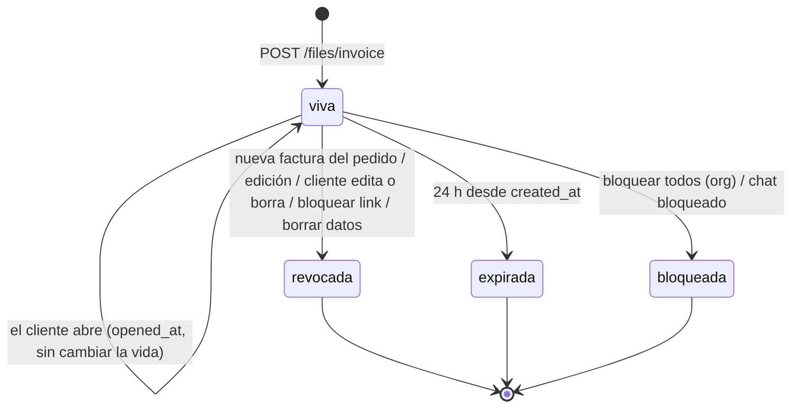

# FAC — Facturas al cliente

> Genera un PDF tipo recibo de un pedido, lo guarda y se lo manda al cliente final por WhatsApp con un link de 24 horas que el personal puede matar en cualquier momento. Lo usa todo el personal con login; lo abre el cliente final sin cuenta.

## 1. Negocio

**Propósito.** Que el cliente tenga un comprobante del pedido que le llevan, sin que el negocio tenga que armarlo a mano. La factura es una **foto fija**: el PDF se genera una vez en el navegador del personal y no se vuelve a calcular. Por eso el link muere en cuanto el pedido cambia (RN-FAC-10), para que nadie guarde un comprobante desactualizado que parezca vigente. No es factura electrónica DIAN: es un recibo informal del pedido.

**Permisos.** Fila "Subir factura (PDF) y enviarla" de `01-funcional/actores-y-permisos.md`: admin, encargado, domiciliario y dev. `POST /files/invoice` solo exige sesión (`authenticate`), sin `requireRole`. Donde la interfaz difiere de la API:
- El botón "Enviar factura" vive en el modal del pedido y respeta el estado del pedido; la API **no** mira estado ni ítems (RN-FAC-03, PREG-080).
- Para el cliente final no hay login: el link es el único control (RN-FAC-07).

**Ciclo de vida de un link de factura.**

**Reglas.**

*Contenido y envío (web)*

- **RN-FAC-01 — El total de la factura es la suma de los precios de los ítems.** Siempre el "Total" del PDF, del texto copiado y del mensaje es la suma de `price` de los ítems que la pantalla tiene en ese momento; no hay total guardado (principio 3). `price` es el total de la línea, no el precio unitario (ver ORD y CAJ-04). *(plataforma, código)*
- **RN-FAC-02 — La factura sale de la pantalla, no de la base.** CUANDO el personal pulsa "PDF", "Copiar" o "Enviar factura", el documento se arma con los ítems, el método de pago y el estado **que muestra el modal en ese momento**, aunque haya cambios sin guardar. *(plataforma, código)*
- **RN-FAC-03 — Cuándo se puede enviar.** "Enviar factura" solo aparece si el pedido tiene al menos un ítem **y** un chat (`ticket_id`), y está deshabilitado mientras se envía, si algún precio es negativo, o si el estado del pedido es `camino`, `entregado` o `cerrado`. Se vuelve a habilitar solo si el estado vuelve atrás (por el socket, sin recargar). "PDF" y "Copiar" aparecen con ítems y se deshabilitan solo con precio negativo; no dependen del estado ni del chat. La API no repite ninguna de estas condiciones. *(plataforma, código)*
- **RN-FAC-04 — Consecuencia: no hay factura nueva tras el cobro.** Como el cobro deja el pedido `cerrado` (CAJ-07) y `camino` ya lo bloquea, una vez en camino o cerrado no se puede generar un recibo nuevo desde la interfaz. Un link enviado antes sigue vivo hasta su expiración si nadie edita el pedido: cobrar, mover de estado o pasar a papelera **no** revocan (ver RN-FAC-10 y PREG-082). *(plataforma, código)*
- **RN-FAC-05 — Formato del PDF.** Ancho fijo 80 mm (estilo tiquete térmico); alto de hoja 200 mm; si hay muchos ítems, se agregan hojas del mismo tamaño con el encabezado de columnas repetido ("Producto (cont.)")), margen inferior 12 mm, y el bloque Total + Pago + "Gracias por su compra!" se mantiene siempre junto en una sola hoja. Trae nombre del negocio, número y fecha del pedido, cliente, dirección y teléfono (si hay). "PDF" abre el documento en una pestaña nueva (no lo descarga). *(plataforma, código)*
- **RN-FAC-06 — Qué recibe el cliente.** CUANDO se envía, el sistema DEBE subir el PDF y luego mandar por el chat (`POST /inbox/:ticket_id/reply`) un texto con número, fecha, cliente, total y el link `<FRONTEND_URL>/factura?f=<archivo>`. El link apunta a la **web**, no a la API; `FacturaPage` pregunta `/status` y, si está viva, redirige el navegador al PDF real. Si la subida falla, no se manda mensaje ("Error al subir la factura"). *(plataforma, código)*

*Subida (API)*

- **RN-FAC-07 — Validación de la subida.** CUANDO llega `POST /files/invoice`, el sistema DEBE exigir: cuerpo con `data` en base64 (hasta 28 000 000 caracteres), `num` de 1 a 20 caracteres `[a-zA-Z0-9_-]` y `order_id` UUID de un pedido **de la misma organización** (si no, 404 `NOT_FOUND`); que lo decodificado pese ≤ 20 MB; y que empiece por la firma `%PDF`. Cuerpo inválido, archivo grande o no-PDF responden 400. Tope de 20 peticiones por minuto. *Por qué:* nunca servir bytes arbitrarios como `application/pdf`; el tope viene de un hallazgo de auditoría de seguridad *(inferido)*. *(plataforma, código)*
- **RN-FAC-08 — Nombre de archivo no adivinable.** El nombre es `Factura-<AAAAMMDD-HHMMSS hora Bogotá>-<12 primeros caracteres del org_id sin guiones>-<num con "_" cambiado a "-">-<40 hexadecimales aleatorios>.pdf`. Los 160 bits aleatorios son la única protección del link, junto con TTL y revocación. Los guiones evitan que WhatsApp interprete `_` como cursiva y corte el link. *(plataforma, código; el porqué, inferido de comentarios)*
- **RN-FAC-09 — Una sola factura viva por pedido.** CUANDO se registra una factura nueva, el sistema DEBE revocar todas las anteriores **del mismo pedido** (no del mismo chat: otro pedido del mismo cliente conserva su factura), y poner en cero el contador blando de intentos fallidos del chat (`clearSoftLinkBlock`). *(plataforma, código)*

*Muerte del link*

- **RN-FAC-10 — Qué revoca un link.** Un link pasa a `revoked_at` cuando ocurre cualquiera de estos eventos (cada uno responde luego 410 `INVOICE_EXPIRED`):

| Evento | Alcance | Dónde |
|---|---|---|
| Nueva factura del mismo pedido | pedido | `files.ts › POST /invoice` |
| Cualquier edición del pedido por el personal (`PATCH /orders/:id`) | pedido | `orders.ts › PATCH /:id` |
| El cliente edita su pedido por el formulario (agrega ítems) | pedido | `public.ts › POST /submit` |
| El cliente elimina su pedido por el formulario | pedido | `public.ts › POST /order/:orderId/delete` |
| "Bloquear link" del ticket (revocar link de formulario) | chat | `inbox.ts › POST /:ticketId/form-link/revoke` |
| Borrar datos del cliente (Ley 1581) | chat | `inbox.ts › POST /:ticketId/erase-data` |

  Revocar no borra el PDF del almacenamiento. Las rutas que **no** revocan: mover estado, cobro, papelera, observaciones. *(plataforma, código)*
- **RN-FAC-11 — Cuándo está viva una factura.** CUANDO alguien pide `/:filename/status` o `/:filename`, el sistema DEBE comprobar en este orden y fallar en el primero que aplique: (1) nombre de forma `Factura[_-]….pdf` sin separadores de ruta, si no 400 "Archivo inválido"; (2) fila en `invoice_links`, si no 404 `NOT_FOUND`; (3) no revocada, si no 410 `INVOICE_EXPIRED`; (4) creada **después** del último "Bloquear todos los links" de la organización (`form_links_blocked_at`), si no 410 `INVOICE_EXPIRED`; (5) si tiene chat: que el chat no esté bloqueado temporalmente (`link_blocked_until` futuro, 403 `TICKET_BLOCKED`) ni tenga 10 o más intentos fallidos (403 `LINK_ATTEMPTS_EXCEEDED`); (6) que hayan pasado como máximo 24 h desde la creación, si no 410 `INVOICE_EXPIRED`. Una factura sin chat omite el paso 5. *(plataforma, código)*
- **RN-FAC-12 — 24 horas planas.** La vida es de 24 h desde `created_at`, abierta o no. La regla anterior de "10 minutos / 4 horas sin abrir" ya no existe (el test lo confirma; un comentario de `files.ts` aún menciona "4 horas"). `/status` existe para que la web muestre "Link inválido" sin pedir nada al visitante. *(plataforma, código)*
- **RN-FAC-13 — Servir el PDF.** CUANDO la factura está viva, `GET /:filename` DEBE marcar `opened_at` la primera vez (solo informativo: no cambia la vida) y entregar el PDF con `Content-Type: application/pdf`, `Content-Disposition: inline` y `X-Content-Type-Options: nosniff`. Sin sesión de personal. En almacenamiento local verifica además que la ruta real quede dentro de `uploads/` (contra enlaces simbólicos). *(plataforma, código)*

*Almacenamiento*

- **RN-FAC-14 — Dónde se guarda.** Con R2 configurado (`storage.isConfigured()`), el PDF va a `invoices/<archivo>` y se lee de ahí. Sin R2, va a la carpeta local `uploads/` del proceso (desarrollo o producción antes de R2). Fallo de R2: 502 `STORAGE_UPLOAD_FAILED` con el nombre del error de AWS/R2 (solo lo ve personal); fallo local: 502 `STORAGE_WRITE_FAILED`. *(plataforma, código)*
- **RN-FAC-15 — `phone_last4` es solo metadato.** Siempre se guarda en la fila (los últimos 4 dígitos del teléfono del pedido, o `0000` si no hay 4 dígitos, p. ej. BSUID) pero ya no se exige para descargar; se pone `****` al borrar los datos del cliente. *Por qué:* los clientes se confundían con pedir los dígitos *(inferido de comentarios de `files.ts`)*. *(plataforma, código)*

**Textos que ve el cliente final.** El mensaje de WhatsApp con el link (RN-FAC-06); el PDF; y, si el link está muerto, la pantalla "Link inválido" de `FacturaPage` con el mensaje del servidor ("Este link de factura fue bloqueado / ya expiró (válido 24 horas). Pide que te reenvíen la factura.", "Archivo no encontrado…") o "No se pudo conectar…".

## 2. Técnico

**Mapa de código.**

| Parte | Dónde |
|---|---|
| API | `apps/api/src/routes/files.ts › POST /invoice`, `› loadLiveInvoiceLink`, `› GET /:filename/status`, `› GET /:filename` |
| Candados del chat | `apps/api/src/lib/linkSecurity.ts › clearSoftLinkBlock`, `MAX_ATTEMPTS_SOFT`, `registerFailedLinkAttempt` |
| Almacenamiento | `apps/api/src/services/storage.ts › storage` (R2) |
| Web (generar/enviar) | `DetallePedidoModal.tsx › buildPDFDoc`, `generatePDF`, `copyInvoice`, `sendInvoiceToChat`, `invoiceMut` |
| Web (cliente) | `apps/web/src/pages/FacturaPage.tsx` |
| Datos | `InvoiceLink` (`filename` único, `order_id`, `ticket_id` nulos permitidos, `phone_last4`, `opened_at`, `revoked_at`) |

**Regla → dónde se hace cumplir → test.**

| Regla | Se hace cumplir en | Test |
|---|---|---|
| RN-FAC-01/02 | `DetallePedidoModal.tsx › buildPDFDoc` | *(sin test)* |
| RN-FAC-03 | `DetallePedidoModal.tsx` (botón "Enviar factura", `enRuta`) | *(sin test)* |
| RN-FAC-05 | `buildPDFDoc › newItemsPage / ensureSpace` | *(sin test)* |
| RN-FAC-06 | `sendInvoiceToChat` | `files.test.ts › "POST /invoice stores the PDF and returns a URL pointing at the frontend /factura page, not the raw API"` (solo el URL) |
| RN-FAC-07 | `files.ts › POST /invoice` | `files.test.ts › "POST /invoice for an order belonging to a different org is rejected"` (firma `%PDF`, tamaño, `num`, 502: *sin test*) |
| RN-FAC-08 | `files.ts › POST /invoice` | *(sin test del formato)* |
| RN-FAC-09 | `files.ts › POST /invoice` | `files.test.ts › "sending a fresh factura for the same ORDER auto-supersedes every earlier one for it, no manual block needed"`; `› "resending a factura for one order does NOT touch a different order's still-accurate factura, even in the same conversation"` |
| RN-FAC-10 | `files.ts`, `orders.ts › PATCH /:id`, `public.ts › POST /submit` y `POST /order/:orderId/delete`, `inbox.ts › POST /:ticketId/form-link/revoke`, `› POST /:ticketId/erase-data` | `files.test.ts › "editing an order (PATCH /orders/:id) invalidates its own outstanding factura - a stale PDF must not keep looking current"`; `› ""Bloquear link" on a ticket also kills any factura already sent to that same conversation"`; `inbox.test.ts` (borrado de datos: revoca la factura, ver la prueba "anonimiza TODOS los pedidos del ticket…"). Edición/borrado del cliente por formulario: *sin test* |
| RN-FAC-11 | `files.ts › loadLiveInvoiceLink` | `files.test.ts › "a filename with no matching invoice_links row (bogus, or predates this protection) is a plain 404, not a crash"`; `› "the org-wide "Bloquear todos los links" also kills every outstanding factura, and a fresh one issued afterward still works"`; `› "GET /:filename/status answers "is this link alive"…"`. `TICKET_BLOCKED` / `LINK_ATTEMPTS_EXCEEDED` y nombre inválido: *sin test* |
| RN-FAC-12 | `loadLiveInvoiceLink` | `files.test.ts › "a link survives past the old 4-hour unopened mark whether or not it was ever opened - flat 24h cap either way"`; `› "expires at 24h absolute, even if it was opened in time"` |
| RN-FAC-13 | `files.ts › GET /:filename` | `files.test.ts › "GET serves the PDF on the link alone - no phone_last4 needed, and a wrong one in the querystring is silently ignored"` (cabeceras y símbolos: *sin test*) |
| RN-FAC-14 | `files.ts`, `storage.ts` | *(sin test; los tests corren con almacenamiento local)* |
| RN-FAC-15 | `files.ts › POST /invoice`; `inbox.ts › erase-data` | *(sin test)* |

**Datos y eventos socket.** Lee `Order` (teléfono y chat), lee/escribe `InvoiceLink`, escribe `Ticket.link_failed_attempts` (a 0). No emite eventos socket. El mensaje al chat sale por el flujo de respuesta de `inbox.ts` (fuera de este módulo, ver WPP).

**Transacciones y concurrencia.** `POST /invoice` **no** es transaccional: crea la fila, revoca las anteriores, resetea el contador del chat y recién entonces sube el PDF (PREG-081). Dos facturas simultáneas del mismo pedido se revocan entre sí por el `filename: { not: … }`, pero cada una puede dejar viva a la otra según el orden. La revocación por edición (`PATCH /:id`) ocurre **después** de la transacción del pedido.

**Códigos de error propios.**

| Código | HTTP | Cuándo |
|---|---|---|
| `NOT_FOUND` | 404 | Pedido de otra organización o inexistente; factura sin fila |
| `INVOICE_EXPIRED` | 410 | Revocada, anterior al bloqueo total, o pasadas 24 h |
| `TICKET_BLOCKED` | 403 | Chat bloqueado por límite duro |
| `LINK_ATTEMPTS_EXCEEDED` | 403 | 10 o más intentos fallidos blandos en el chat |
| `STORAGE_UPLOAD_FAILED` | 502 | Fallo al subir a R2 |
| `STORAGE_WRITE_FAILED` | 502 | Fallo al escribir en `uploads/` |

Los 400 de validación (cuerpo, tamaño, firma, nombre inválido) no llevan código.

**Si tocas X, revisa Y.**
- **Cualquier ruta nueva que cambie lo que dice la factura** (ítems, dirección, método de pago, fecha) debe revocar `InvoiceLink` del pedido, como `orders.ts › PATCH /:id`; hoy mover estado, cobro y papelera no lo hacen.
- **El formato del nombre** lo asumen `POST /invoice` (lo genera) y `loadLiveInvoiceLink` (acepta cualquier forma `Factura[_-]….pdf`, a propósito, para que los nombres viejos sigan abriendo) y `FacturaPage` (lo recibe en `?f=`).
- **El tope de 24 h** está en `loadLiveInvoiceLink` y en el texto de error; el texto del link de formulario vive aparte (`public.ts`, FRM).
- **Borrar datos de un cliente** (`inbox.ts › erase-data`) revoca y anonimiza `phone_last4`, pero no borra el PDF de R2 (PREG-037); si cambias el borrado, revisa esto.
- **La carpeta `uploads/`** y el prefijo `invoices/` de R2 deben coincidir con lo que la limpieza futura espere.
- **`registerFailedLinkAttempt`**: ver PREG-035 antes de apoyarte en los contadores.

## 3. Pendientes

IDs globales; resumen en `03-plan/preguntas-abiertas.md` y `03-plan/problemas-conocidos.md`.

- **PREG-080 — La API no valida estado ni ítems.** `POST /invoice` acepta cualquier pedido de la organización, también `cerrado`, en papelera, sin ítems o ya cobrado; solo la interfaz lo impide. ¿Debe la API repetir las condiciones de RN-FAC-03?
- **PREG-081 — Subida fallida deja sin factura viva.** La fila nueva y la revocación de las anteriores se hacen antes de subir el PDF. Si R2 falla (502), el pedido queda sin ninguna factura válida y la fila nueva apunta a un archivo que no existe (404 al abrirla). Tampoco se puede reintentar el mensaje al chat si falla solo `reply` (el PDF ya está subido). ¿Se reordena (subir primero) o se acepta?
- **PREG-082 — Recibo vivo después del cobro o de pasar a papelera.** Una factura enviada mientras el pedido estaba en preparando/listo sigue abriéndose hasta 24 h aunque el pedido se cobre, se mueva a camino o se mande a papelera, porque solo la edición del pedido revoca. ¿Debe revocar también el cobro, la papelera o el cierre?
- **PREG-037 — El PDF sobrevive a "Borrar datos del cliente".** La factura contiene nombre, dirección y teléfono del cliente. `erase-data` revoca el link y anonimiza `phone_last4`, pero el archivo queda en R2 (o en `uploads/`) indefinidamente y nada lo borra tras las 24 h. ¿Se borran los PDF (Ley 1581) y se limpian los vencidos?
- **PREG-035 — Candados por intentos fallidos sin uso.** Nadie llama ya a `registerFailedLinkAttempt` (comentario en `public.ts`: se dejó de pedir los dígitos), así que `LINK_ATTEMPTS_EXCEEDED` y `TICKET_BLOCKED` solo pueden activarse con contadores heredados. Y `phone_last4` ya no sirve para nada salvo metadato. ¿Se eliminan columna y chequeos, o se piensa reactivar una defensa?
- **PREG-083 — La factura se arma con la pantalla sin guardar.** RN-FAC-02: se puede enviar al cliente un PDF con ítems o precios que aún no se guardaron (y el envío no revoca porque no hay edición). ¿Se exige guardar antes de enviar?
- **PREG-084 — Sin límite de uso por pedido ni limpieza.** Cada reenvío crea otro PDF permanente (solo el último queda vivo). Sin tarea que borre los archivos vencidos o revocados. ¿Hace falta política de retención?
- **DT-033 — PDF de prueba versionados.** Hay 6 PDF de facturas (`Factura_003_*`, `Factura_004_*`) rastreados en git bajo `apps/api/uploads/` (commit `ec3a5e8`), aunque `.gitignore` excluye `apps/api/uploads/`. Su contenido no se revisó aquí; podrían traer datos de clientes: conviene revisarlos y sacarlos del índice (`git rm --cached`). *(datos)*
- **DT-034 — Comentarios desactualizados** en `files.ts` (la regla de 4 h sin abrir y el chequeo de `phone_last4`, ya retirados).
- **DT-035 — Faltan tests:** firma `%PDF`, tope de tamaño y de `num`, formato del nombre, 502 de almacenamiento, `TICKET_BLOCKED`/`LINK_ATTEMPTS_EXCEEDED`, revocación por edición o borrado del cliente en el formulario, y todo el PDF/`buildPDFDoc` (total, paginación).
- **DT-036 — Total de la factura recalculado en tres sitios** (`buildPDFDoc`, `copyInvoice`, `sendInvoiceToChat`) con la misma suma.

Relacionadas: ORD (precio = total de la línea, edición de pedidos), CAJ (cobro cierra el pedido, RN-CAJ-07), FRM (link de formulario y su bloqueo, mismo patrón), WPP (envío del mensaje al chat), ACC (borrado de datos), principio 3 de `00-principios.md`.
