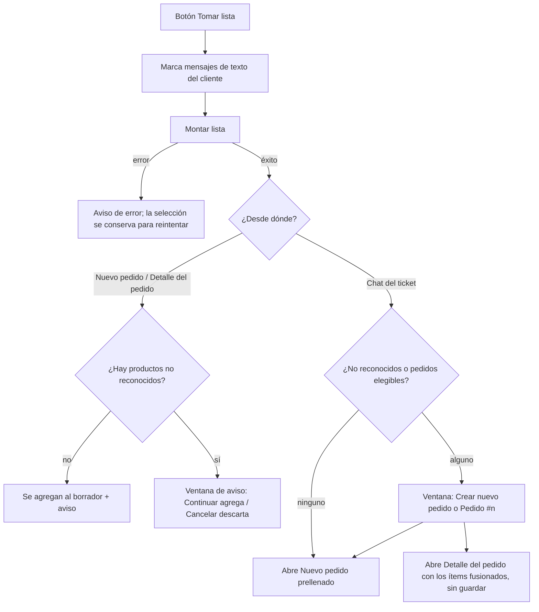

# IA — Tomar lista (IA)

> El personal marca en el chat los mensajes donde el cliente final dictó su pedido; una IA extrae productos y cantidades, el sistema los cruza con el catálogo del negocio y los deja como borrador de ítems, **siempre en $0 y sin guardar**, para que el encargado los revise, ponga precios y guarde. Lo usan el encargado y el administrador.

## 1. Negocio

**Propósito.** Ahorrar la transcripción a mano de listas largas que llegan por WhatsApp ("2 kg de tomate, una malla de cebolla…"). La IA solo propone: nunca crea ni modifica un pedido, nunca pone precios. El personal sigue siendo quien revisa y guarda con el flujo normal de pedidos.

**Alcance y límites.**
- *Incluye:* la extracción `POST /inbox/:ticketId/parse-messages`, la cadena de proveedores de IA con su descubrimiento de modelos y enfriamiento, el cruce con el catálogo, la marca "revisar" (`ai_unmatched`) y la fusión del borrador en los modales.
- *No incluye:* crear, editar o guardar el pedido y sus precios (ORD); el chat y la selección de mensajes como tal (INB); el catálogo de productos (CAT); el cierre del día que bloquea el guardado (CAJ); la fusión de pedidos que hace el formulario público (FRM).

**Dependencias.**
- *De qué depende:* proveedores externos de IA (Gemini, Groq, OpenRouter) con sus claves de entorno; INB (ruta y mensajes del chat); CAT (nombres de productos activos); ACC (`requireRole`).
- *Quién depende de él:* ORD (los modales `NuevoPedidoModal` y `DetallePedidoModal` reciben el borrador); INB (`TicketModal` aloja el botón); `OrderItem.ai_unmatched` lo conservan ORD y CAT al guardar.

**Permisos.** Fila "Tomar lista (IA)" de `01-funcional/actores-y-permisos.md`. Lo que esa tabla no dice:
- El botón "Tomar lista" está en el encabezado del chat de tres ventanas: el chat del ticket (`TicketModal`), "Nuevo pedido" desde un ticket (`NuevoPedidoModal`) y el detalle del pedido (`DetallePedidoModal`). No existe en "Chats WPP".
- El domiciliario no ve el botón y la API le responde 403.

**Estados / ciclo de vida.** No hay máquina de estados: es un cálculo puro, sin datos propios. El único rastro que queda en la base es la marca `ai_unmatched` de los ítems que el personal termine guardando.

**Flujo en pantalla.**

**Reglas.**

*Entrada*

- **RN-IA-01 — Quién puede.** Solo admin y encargado (y `dev`, que pasa todas las verificaciones) pueden pedir una extracción; el domiciliario recibe 403. La interfaz muestra el botón solo a esos tres roles. *(plataforma, código)*
- **RN-IA-02 — Solo mensajes de texto del cliente, del mismo ticket.** CUANDO llega una petición, el sistema DEBE exigir de 1 a 50 ids de mensaje (si no, 400 `VALIDATION_ERROR`); un ticket de otra organización da 404 `NOT_FOUND`. Todos los ids deben ser mensajes de **ese** ticket, y ninguno puede ser saliente (respuesta del personal) ni multimedia: si alguno falla, 400 `INVALID_MESSAGES` y no se llama a la IA. Si los mensajes elegidos no tienen texto, también 400 `INVALID_MESSAGES`. La interfaz solo pone casilla en los mensajes entrantes sin multimedia, pero la API no confía en eso. *Por qué:* un cliente desactualizado o una petición manipulada no deben extraer de un subconjunto silencioso ni de mensajes de otro chat. *(plataforma, código)*
- **RN-IA-03 — Qué se le manda a la IA.** Siempre se envían solo dos cosas: el texto de los mensajes elegidos, ordenados por hora de llegada y unidos con salto de línea, y los nombres de **todos** los productos activos del negocio (agotados incluidos) como pista. No se envían teléfono, nombre del cliente ni precios. El catálogo es una pista, no una restricción: el cruce real lo hace el sistema después (RN-IA-07). Los proveedores son externos y de nivel gratuito: ver PREG-051. Desde la política `v2` (2026-10-10) la política publicada informa que los productos y cantidades del pedido se procesan con IA (sin procesar nombre ni teléfono). El texto libre de un cliente podría traer por su cuenta un dato personal; el sistema no lo filtra. *(plataforma, código)*
- **RN-IA-04 — Límite de uso.** Siempre, como máximo 15 extracciones por minuto por usuario (la clave de límite es el usuario autenticado, `server.ts › keyGenerator`). *Por qué:* cada extracción puede encadenar hasta 8 llamadas de generación a proveedores externos sin ningún tope de gasto por organización (hallazgo de auditoría de seguridad). *(plataforma, código)*

*Resultado*

- **RN-IA-05 — Nunca escribe.** Nunca se crea, modifica ni guarda un pedido o ítem durante la extracción: la ruta solo lee el ticket, los mensajes y el catálogo, y devuelve un borrador. Guardar es siempre el botón normal del pedido (módulo de pedidos), con todas sus reglas, incluido el día congelado de `modulos/CAJ.md` (RN-CAJ-21). *(plataforma, código)*
- **RN-IA-06 — Precio siempre $0.** Siempre cada ítem del borrador sale con `price = 0`, coincida o no con el catálogo; el cruce no lee `price_per_unit`. El encargado escribe a mano el precio de cada línea. *Por qué:* un cliente real reportó que Tomar lista seguía prellenando el precio del catálogo cuando el formulario y "crear pedido" ya no lo hacían (commit d64551b). Un ítem de $0 es válido en la base (`02-tecnico/datos-y-migraciones.md`). *(plataforma, código)*
- **RN-IA-07 — Cruce con el catálogo.** CUANDO la IA devuelve un producto, el sistema DEBE buscarlo en el catálogo activo en este orden: igualdad exacta normalizada (sin tildes, minúsculas, plural ingenuo quitado) → contención en **un solo** producto → similitud de Levenshtein ≥ 0,72 con ventaja ≥ 0,08 sobre el segundo. Un nombre de más de 200 caracteres no se cruza. Detalle del algoritmo en `02-tecnico/integraciones.md` §2.3. Es una heurística de prototipo sin calibrar (PREG-043). *(plataforma, código)*
- **RN-IA-08 — Nombre y marca "revisar".** CUANDO hay coincidencia, el ítem DEBE llevar el **nombre del catálogo** (no la variante que escribió el cliente); si no, lleva el texto de la IA tal cual con `ai_unmatched = true` y aparece en `unmatchedNames`. La marca se guarda con el ítem (`OrderItem.ai_unmatched`), se muestra en rojo con "· revisar" y viaja de ida y vuelta al editar el pedido. Solo se apaga cuando el personal renombra la línea a un nombre que coincide exacto (sin tildes ni mayúsculas) con un producto del catálogo; renombrar cualquier línea a algo que no está en el catálogo la enciende. *(plataforma, código)*
- **RN-IA-09 — Cantidad en texto libre.** Siempre la cantidad es la que escribió el cliente ("2 kg", "una malla", "3"), hasta 100 caracteres, o vacía si no la dijo. El sistema no la interpreta ni la suma. *(plataforma, código)*
- **RN-IA-10 — Sin repetidos en una extracción.** CUANDO la IA devuelve el mismo producto más de una vez (el cliente lo mencionó en dos mensajes), el sistema DEBE dejar solo la primera aparición con su cantidad, comparando el nombre final sin tildes ni mayúsculas. También descarta nombres en blanco. *Por qué:* "quiero papa… y otra papa" producía dos líneas; si el cliente quería más, el encargado sube la cantidad a mano. *(plataforma, código)*

*Fusión en el borrador (interfaz)*

- **RN-IA-11 — No duplica lo que ya está en el pedido.** CUANDO el resultado se agrega a un borrador, la interfaz DEBE saltarse todo producto cuyo nombre (sin tildes ni mayúsculas) ya esté en el borrador o ya se haya agregado en el mismo lote. No suma cantidades. El aviso distingue tres casos: todo nuevo ("Lista montada exitosamente"), nada nuevo ("Ese producto / Esos productos ya estaba(n) en el pedido - no se agregó nada nuevo") y mezcla ("Lista montada - N productos nuevos (M ya estaban en el pedido)"). *Por qué:* volver a pasar por error mensajes ya procesados no debe parecer un éxito. *(plataforma, código)*
- **RN-IA-12 — Desde "Nuevo pedido" o "Detalle del pedido".** CUANDO la extracción no tiene productos no reconocidos, los ítems DEBEN agregarse directo al borrador con el aviso de RN-IA-11; si tiene alguno, se abre una ventana que los lista ("Estos productos no pude identificarlos: … Recuerda revisar todo."): "Continuar" agrega todo el lote y "Cancelar" lo descarta entero (hay que volver a extraer). En el detalle, el pedido queda con cambios sin guardar. *(plataforma, código)*
- **RN-IA-13 — Desde el chat del ticket.** El chat del ticket no tiene lista de ítems propia, así que el resultado siempre termina en otra ventana. Son **pedidos elegibles** los del ticket en la fecha que se está viendo, que no están en papelera, en estado nuevo, preparando o listo, no bloqueados y no eliminados por el cliente. CUANDO no hay productos no reconocidos ni pedidos elegibles, el sistema DEBE abrir "Nuevo pedido" prellenado (aviso "Lista montada exitosamente"). Si hay alguno de los dos, una ventana ofrece "Crear nuevo pedido" (marcado por defecto) o cada "Pedido #n (estado)" elegible; elegir un pedido abre su detalle con los ítems fusionados **una sola vez** al cargar (RN-IA-11), sin guardar. No se exige que el pedido venga del formulario: aquí el actor es el personal, que ya puede editar cualquier pedido del ticket (a diferencia de la fusión del formulario público). *(plataforma, código)*
- **RN-IA-14 — Solo en días abiertos (interfaz).** Siempre el botón "Tomar lista" está desactivado si la fecha que se ve es anterior a hoy o su día ya está cerrado; si la caja se cierra mientras alguien está seleccionando, la interfaz sale del modo selección. La API no lo verifica (no escribe nada); el guardado posterior sí choca con `DAY_CLOSED`. *(plataforma, código)*

*Proveedores de IA*

- **RN-IA-15 — Cadena de proveedores.** Siempre se intentan en orden Gemini → Groq → OpenRouter, saltando en silencio el que no tenga clave; Cerebras está desactivado en el código. Dentro de cada proveedor se prueban hasta 1 (Gemini), 3 (Groq) o 4 (OpenRouter) modelos candidatos descubiertos en vivo, con lista en memoria por 1 h, preferidos primero y timeouts por intento (tabla completa en `02-tecnico/integraciones.md` §2.1). El primero que responde bien gana. *Por qué:* fase de prototipo con solo niveles gratuitos; los modelos gratis se renombran o retiran sin aviso (un id fijo se rompió tres veces en un día), Gemini va primero por su mejor disciplina de JSON y Groq/OpenRouter se reactivaron como respaldo tras agotar el cupo diario de Gemini (commit f67b2b2). Pasar a un proveedor de pago es recortar el arreglo `PROVIDERS`. *(plataforma, código; porqué inferido de commits)*
- **RN-IA-16 — Enfriamiento de 90 s.** CUANDO un proveedor falla con HTTP ≥ 500 o sin status (red, timeout), el sistema DEBE saltarlo durante 90 s en las siguientes extracciones; un éxito lo borra. Un 400 o un 429 (cupo) **no** lo activa. El estado vive en la memoria del proceso. *Por qué:* Gemini tuvo 6 caídas "high demand" (503) en una semana y cada petición pagaba la espera completa antes de pasar a Groq (commit 7e02426). Ojo: JSON roto o fuera de esquema tampoco trae status y también enfría (PREG-050). *(plataforma, código)*
- **RN-IA-17 — Un modelo solo se descarta por error permanente.** Siempre un candidato se quita de la lista en memoria solo con 400 o 404; un 5xx o un timeout no. *Por qué:* descartar por un 503 pasajero dejaba por una hora al modelo preferido fuera y usaba un respaldo muerto (commit 59ac883). *(plataforma, código)*
- **RN-IA-18 — Respuesta validada.** Siempre la respuesta debe ser un objeto JSON `{items:[{product_name, quantity_label}]}`: se le quita un bloque de código markdown si lo trae, y se valida con máximo 200 ítems, nombre de 1 a 200 caracteres y cantidad hasta 100. Lo que no pasa cuenta como fallo de ese candidato y se sigue con el siguiente. El prompt es uno solo, en español, para todos los proveedores (`types.ts › buildExtractionPrompt`). *(plataforma, código)*
- **RN-IA-19 — Si todo falla.** CUANDO ningún proveedor tiene clave o todos fallan, el sistema DEBE responder 502 `AI_EXTRACTION_FAILED` ("No se pudo procesar el texto con IA - intenta de nuevo") y registrar el error en el log; el servidor no se cae. La interfaz muestra ese texto y **conserva** la selección para reintentar. *(plataforma, código)*
- **RN-IA-20 — Sin registro de uso ni costo.** Nunca se guarda en la base quién extrajo, cuántas veces ni con qué proveedor: no hay auditoría, conteo de tokens ni tope por organización; solo quedan líneas `[tomar-lista]` en el log del servidor. Ver PREG-048. *(plataforma, código)*

Nada de este módulo es configurable por negocio: no hay reglas *(cliente)*. Las claves de proveedores son de la plataforma.

**Criterios de aceptación.**

1. *Dado* un domiciliario, *cuando* pide una extracción, *entonces* recibe 403; admin y encargado sí pueden. (RN-IA-01; `inbox-parse-messages.test.ts › "role gate: admin and encargado allowed, domiciliario forbidden"`)
2. *Dado* un mensaje con multimedia entre los seleccionados, *cuando* se pide la extracción, *entonces* responde 400 `INVALID_MESSAGES` y no se llama a la IA. (RN-IA-02; `inbox-parse-messages.test.ts › "rejects if any selected message is media"`)
3. *Dado* un mensaje saliente del personal entre los seleccionados, *cuando* se pide la extracción, *entonces* responde 400 `INVALID_MESSAGES`. (RN-IA-02; `inbox-parse-messages.test.ts › "rejects if any selected message is outbound (staff reply)"`)
4. *Dado* un id de mensaje de otro ticket u otra organización, *cuando* se pide la extracción, *entonces* se rechaza y no se mezcla con el chat actual. (RN-IA-02; `inbox-parse-messages.test.ts › "rejects a message id belonging to another org/ticket"`)
5. *Dado* un mensaje "2 kg de tomate, cilantro" y un catálogo con Tomate, *cuando* se extrae, *entonces* el ítem de Tomate lleva el nombre del catálogo con `price = 0`, el desconocido lleva `ai_unmatched = true` y no se escribe nada en la base. (RN-IA-05, 06, 08; `inbox-parse-messages.test.ts › "happy path: matched item is resolved to the catalog NAME but never priced from it, unmatched item is flagged for review, never touches the DB"`)
6. *Dado* que la IA devuelve el mismo producto dos veces con distinta capitalización, *cuando* se arma el borrador, *entonces* queda una sola línea con la primera cantidad. (RN-IA-10; `inbox-parse-messages.test.ts › "dedupes duplicate mentions of the same product WITHIN one extraction (case-insensitive), keeping the first quantity_label"`)
7. *Dado* un nombre con tilde y mayúsculas distintas al del catálogo, *cuando* se cruza, *entonces* coincide; si dos productos lo contienen por igual, queda sin coincidencia. (RN-IA-07; `matchProduct.test.ts › "exact match, accent/case-insensitive"` y `› "ambiguous substring match (two catalog products both contain the term) -> unmatched"`)
8. *Dado* que Gemini falla, *cuando* se extrae, *entonces* se intenta Groq y luego OpenRouter hasta que uno responda. (RN-IA-15; `ai-providers.test.ts › "Gemini fails entirely (e.g. daily quota, confirmed live as a real failure mode) -> falls through to Groq"` y `› "Gemini and Groq both fail -> falls through to OpenRouter"`)
9. *Dado* un proveedor con un 503, *cuando* llegan nuevas extracciones dentro de los 90 s, *entonces* se salta ese proveedor; un 400 no activa el enfriamiento. (RN-IA-16; `ai-providers.test.ts › "a TRANSIENT failure (503) on Gemini falls through to Groq for this request but does NOT blacklist the model FOREVER - …"` y `› "a NON-transient failure (400, e.g. malformed JSON) does NOT trigger the cooldown - …"`)
10. *Dado* que todos los proveedores fallan, *cuando* se extrae, *entonces* responde 502 `AI_EXTRACTION_FAILED` y el servidor sigue en pie. (RN-IA-19; `inbox-parse-messages.test.ts › "all configured providers failing -> 502 AI_EXTRACTION_FAILED"`)

**Textos que ve el cliente final.** Ninguno: no se envía nada por WhatsApp. Los textos de la interfaz para el personal son "Tomar lista", "N seleccionado(s)", "Deseleccionar todo", "Cancelar", "Montar lista" / "Montando...", los avisos de RN-IA-11, RN-IA-12 y RN-IA-19, y la ventana "¿Dónde montamos estos productos?".

## 2. Técnico

**Mapa de código.**

| Parte | Dónde |
|---|---|
| API | `apps/api/src/routes/inbox.ts › POST /:ticketId/parse-messages` |
| Cadena y enfriamiento | `apps/api/src/services/ai/index.ts › PROVIDERS`, `› extractOrderItems`, `› looksLikeProviderDown`, `› COOLDOWN_MS` |
| Proveedores | `apps/api/src/services/ai/gemini.ts › extractWithGemini`, `groq.ts › extractWithGroq`, `openrouter.ts › extractWithOpenRouter`; desactivado: `cerebras.ts › extractWithCerebras` (único usuario de `openaiCompatible.ts › createOpenAiCompatibleExtractor`) |
| Descubrimiento de modelos | `apps/api/src/services/ai/modelDiscovery.ts › discoverCandidateModels`, `› dropFromCache`, `› isPermanentModelError` |
| Prompt y validación | `apps/api/src/services/ai/types.ts › buildExtractionPrompt`, `› extractedItemsSchema`, `› stripJsonFence` |
| Cruce | `apps/api/src/lib/matchProduct.ts › matchProductName`; `apps/api/src/lib/normalize.ts › normalizeSearch` |
| Claves | `apps/api/src/config.ts › envSchema` |
| Web estado y llamada | `apps/web/src/hooks/useTomarLista.ts › useTomarLista` (`isEligible`) |
| Web fusión | `apps/web/src/lib/tomarLista.ts › mergeExtractedItems`, `› mergeResultToast` |
| Web componentes | `apps/web/src/components/chat/TomarListaActionBar.tsx`, `TomarListaResultModal.tsx` |
| Web flujos | `TicketModal.tsx › handleProcesarTomarLista` (`eligibleOrders`); `NuevoPedidoModal.tsx › handleProcesarTomarLista` (prellenado en el `useState` inicial de `items`); `DetallePedidoModal.tsx › handleProcesarTomarLista`, efecto `prefillAppliedRef`; `apps/web/src/pages/MainPage.tsx › handleCreateFromTicket`, `› handleOpenOrderWithPrefill` |
| Web marca "revisar" | `apps/web/src/components/orders/ProductSearch.tsx › buildUpdatedItem` |
| Datos | Lee `Ticket`, `TicketMessage`, `Product` (`active`, `name`). El único campo propio es `OrderItem.ai_unmatched`, que escribe el guardado normal del pedido (`orders.ts › itemSchema`… ver módulo de pedidos). |

**Regla → se hace cumplir en → test.** Rutas abreviadas al nombre de archivo.

| Regla | Se hace cumplir en | Test |
|---|---|---|
| RN-IA-01 | `inbox.ts › POST /:ticketId/parse-messages` (`requireRole`); web `canTomarLista` en los tres modales | `apps/api/test/inbox-parse-messages.test.ts › "role gate: admin and encargado allowed, domiciliario forbidden"` |
| RN-IA-02 | `inbox.ts › POST /:ticketId/parse-messages`; web `useTomarLista.ts › isEligible` | `inbox-parse-messages.test.ts › "rejects if any selected message is media"`; `› "rejects if any selected message is outbound (staff reply)"`; `› "rejects a message id belonging to another org/ticket"` (límite de 50, ticket ajeno y texto vacío, *sin test*) |
| RN-IA-03 | `inbox.ts › POST /:ticketId/parse-messages`; `types.ts › buildExtractionPrompt` | *(sin test)* |
| RN-IA-04 | `inbox.ts › POST /:ticketId/parse-messages` (`config.rateLimit`); `server.ts › keyGenerator` | *(sin test)* |
| RN-IA-05 | `inbox.ts › POST /:ticketId/parse-messages` | `inbox-parse-messages.test.ts › "happy path: matched item is resolved to the catalog NAME but never priced from it, unmatched item is flagged for review, never touches the DB"` |
| RN-IA-06 | `inbox.ts › POST /:ticketId/parse-messages`; `matchProduct.ts › matchProductName` | mismo test "happy path…" |
| RN-IA-07 | `matchProduct.ts › matchProductName` | `apps/api/test/matchProduct.test.ts › "exact match, accent/case-insensitive"`; `› "exact match after singularizing a plural"`; `› "unambiguous substring match"`; `› "ambiguous substring match (two catalog products both contain the term) -> unmatched"`; `› "fuzzy match within threshold catches a typo"`; `› "two close fuzzy candidates within the margin -> unmatched, no coin-flip"`; `› "no match at all -> unmatched with the raw text"` (corte de 200 caracteres, *sin test*) |
| RN-IA-08 | `inbox.ts` (`ai_unmatched`, `unmatchedNames`); `ProductSearch.tsx › buildUpdatedItem` | "happy path…" (lado API); lado web *(sin test)* |
| RN-IA-09 | `types.ts › extractedItemsSchema` | *(sin test)* |
| RN-IA-10 | `inbox.ts › POST /:ticketId/parse-messages` (`seenNames`) | `inbox-parse-messages.test.ts › "dedupes duplicate mentions of the same product WITHIN one extraction (case-insensitive), keeping the first quantity_label"` |
| RN-IA-11 | `tomarLista.ts › mergeExtractedItems`, `› mergeResultToast` | *(sin test)* |
| RN-IA-12 | `NuevoPedidoModal.tsx`, `DetallePedidoModal.tsx › handleProcesarTomarLista`; `TomarListaResultModal.tsx` | *(sin test)* |
| RN-IA-13 | `TicketModal.tsx › handleProcesarTomarLista` (`eligibleOrders`); `DetallePedidoModal.tsx` (`prefillAppliedRef`) | *(sin test)* |
| RN-IA-14 | botón `disabled={isPastDay}` y efecto de salida en los tres modales | *(sin test)* |
| RN-IA-15 | `index.ts › extractOrderItems`; `modelDiscovery.ts › discoverCandidateModels` | `apps/api/test/ai-providers.test.ts › "no provider configured -> throws immediately without calling fetch"`; `› "setting CEREBRAS_API_KEY alone has no effect (not in the active chain)"`; `› "Gemini configured alone -> discovers its model list, calls a generateContent-capable candidate"`; `› "Gemini: its one candidate fails -> falls through to Groq without trying a 2nd Gemini model"`; `› "Groq: first discovered candidate fails -> tries the next one within Groq itself"`; `› "Gemini fails entirely (e.g. daily quota, confirmed live as a real failure mode) -> falls through to Groq"`; `› "Gemini and Groq both fail -> falls through to OpenRouter"` |
| RN-IA-16 | `index.ts › looksLikeProviderDown`, `› COOLDOWN_MS` | `ai-providers.test.ts › "a TRANSIENT failure (503) on Gemini falls through to Groq for this request but does NOT blacklist the model FOREVER - it is retried again once the provider-level cooldown expires"`; `› "a NON-transient failure (400, e.g. malformed JSON) does NOT trigger the cooldown - the very next request still tries the same provider first"` (429 y error sin status, *sin test*) |
| RN-IA-17 | `modelDiscovery.ts › isPermanentModelError`, `› dropFromCache` | mismo test "a TRANSIENT failure (503)…" |
| RN-IA-18 | `types.ts › extractedItemsSchema`, `› stripJsonFence` | `ai-providers.test.ts › "a provider returning JSON that fails the schema is treated as a failure, not a crash"`; `› "a provider wrapping its JSON in a markdown code fence still parses (confirmed live from a real free model)"` |
| RN-IA-19 | `index.ts › extractOrderItems`; `inbox.ts` (`catch` → 502) | `ai-providers.test.ts › "all configured providers fail -> throws"`; `inbox-parse-messages.test.ts › "all configured providers failing -> 502 AI_EXTRACTION_FAILED"` |
| RN-IA-20 | (ausencia) | *(sin test)* |

**Datos y eventos socket.** No emite eventos socket ni abre transacciones: solo lecturas. El estado del módulo es memoria del proceso: la lista de modelos por proveedor (1 h) y el enfriamiento por proveedor (90 s); ambos se pierden en cada despliegue y no se comparten entre contenedores. La selección de mensajes vive en el estado del componente y se pierde al cerrar la ventana.

**Códigos de error propios.**

| Código | HTTP | Cuándo |
|---|---|---|
| `VALIDATION_ERROR` | 400 | `messageIds` ausente, vacío, con más de 50 o con algo que no es UUID |
| `NOT_FOUND` | 404 | El ticket no existe en la organización |
| `INVALID_MESSAGES` | 400 | Un id no es de ese ticket (también un id repetido, porque el conteo no cuadra), un mensaje saliente o multimedia, o ninguno tiene texto |
| `AI_EXTRACTION_FAILED` | 502 | Ningún proveedor configurado o todos fallaron |

**Operación.**

| Variable | Proveedor | Estado |
|---|---|---|
| `GEMINI_API_KEY` | Gemini (Google AI Studio) | Activo, primero. Google pide método de pago en la cuenta para emitir la clave. |
| `GROQ_API_KEY` | Groq | Activo, segundo. Gratis sin tarjeta. |
| `OPENROUTER_API_KEY` | OpenRouter (solo modelos `:free` con precio 0) | Activo, tercero. Gratis sin tarjeta. |
| `CEREBRAS_API_KEY` | Cerebras | Se valida al arrancar pero no se usa. |

Todas son opcionales. Riesgos observados en vivo según comentarios y commits *(inferido)*:
- **Gemini, cupo diario:** el nivel gratis permitía 20 generaciones por día por modelo y proyecto (429 `GenerateRequestsPerDayPerProjectPerModel-FreeTier`, ago/2026). Con cupo agotado, cada extracción igual prueba Gemini primero (un 429 no enfría) y cae a Groq.
- **Gemini, saturación:** 503 "This model is currently experiencing high demand" en toda la familia "flash", varias veces por semana, tardando segundos en responder; por eso el timeout de 12 s, un solo candidato y el enfriamiento.
- **Rotación de modelos:** modelos retirados o renombrados (404 en Gemini 2.5, en el `llama` original de Groq y en el primer modelo gratis de OpenRouter); Cerebras 402 en todos sus modelos.
- **Calidad desigual:** un modelo de Groq (`qwen3.6`) fallaba con 400 "Failed to validate JSON" y otro (`allam`) devolvía JSON válido pero con ítems de menos (14 de 20); ambos excluidos por nombre. Un reporte real fue "de 20 productos solo procesó 7" (PREG-046).
- **Latencia:** con `thinkingBudget: 1` una extracción de 24 ítems en Gemini tomó unos 6 s; en Groq, unos 1,5 s para 20 ítems.

**Si tocas X, revisa Y.**
- **La regla "precio 0"** está aquí y en el formulario público y "crear pedido" manual; los tres deben coincidir (RN-IA-06).
- **`normalizeSearch`** tiene copia en `apps/api/src/lib/normalize.ts` y `apps/web/src/lib/normalize.ts`: la deduplicación del servidor (RN-IA-10) y la de la web (RN-IA-11) dependen de que normalicen igual.
- **La elegibilidad de mensajes** está duplicada entre `inbox.ts` (entrante y sin multimedia) y `useTomarLista.ts › isEligible` (no saliente y sin multimedia); hoy solo existen `in` y `out`, así que coinciden.
- **Los estados elegibles para fusionar** (`EDITABLE_STATUSES` local de `TicketModal.tsx`) copian el criterio de la fusión de `public.ts` sin el filtro de origen; si cambia uno, decide si cambia el otro.
- **Una ventana nueva que abra `TicketModal`** debe pasarle `onCreateFromTicket` y `onOpenOrder`, o el resultado de la IA se pierde (PREG-047).
- **Orden de proveedores y umbrales:** `ai-providers.test.ts` asume Gemini → Groq → OpenRouter y `matchProduct.test.ts` fija casos límite de `FUZZY_THRESHOLD` / `FUZZY_MARGIN`.
- **`ai_unmatched`** lo pasan de ida y vuelta `orders.ts`, `NuevoPedidoModal.tsx`, `DetallePedidoModal.tsx` y `ProductSearch.tsx`; un guardado que lo omita lo borra en silencio (el esquema lo pone en `false` por defecto).

## 3. Pendientes

IDs globales; resumen en `03-plan/preguntas-abiertas.md` y `03-plan/problemas-conocidos.md`.

- **PREG-043 — Cruce sin calibrar.** El propio archivo dice que es una "primera heurística" pendiente de ajustar con datos reales, y nadie la ha ajustado. Efectos concretos: el plural ingenuo convierte "tomates" en "tomat", que solo coincide por contención (el test "exact match after singularizing a plural" pasa por ese camino, no por igualdad); y la contención une productos distintos si el que pidió el cliente no está en el catálogo (por ejemplo "uvas" → "Uchuva" si no existe "Uva"), **sin** marca "revisar". `OrderItem.ai_unmatched` guardado podría servir para medir. ¿Se calibra?
- **PREG-044 — Resiliencia en memoria.** Enfriamiento y lista de modelos viven en el proceso: se pierden en cada despliegue y, con más de un contenedor, cada uno redescubre las caídas por su cuenta. Además, un 429 por cupo agotado no enfría, así que con el cupo diario de Gemini agotado cada extracción lo sigue intentando primero. ¿Es aceptable?
- **PREG-045 — Sin tope de tiempo total.** Cada intento tiene timeout, pero la suma no: 3 listas de modelos de 10 s + Gemini 12 s + 3 × 20 s de Groq + 4 × 20 s de OpenRouter ≈ 182 s *(cálculo con los números del código)*. El cliente web no tiene timeout; si un proxy corta antes, la respuesta no es JSON y el aviso mostraría un error de lectura en vez del texto de RN-IA-19, mientras el servidor sigue trabajando. ¿Se pone un presupuesto total?
- **PREG-046 — Extracción incompleta silenciosa.** Nada verifica que la IA haya devuelto todos los productos del texto (caso real "de 20 productos solo procesó 7"); la interfaz dice "Lista montada exitosamente" igual. ¿Se advierte cuando el número de ítems parece bajo, o basta con "Recuerda revisar todo"?
- **PREG-047 — Resultado perdido desde el cierre de caja.** `CierreCajaModal` abre `TicketModal` sin `onCreateFromTicket` ni `onOpenOrder`; el botón "Tomar lista" sigue activo (el día es hoy y aún no se cierra). Tras extraer, la ventana se cierra, aparece "Lista montada exitosamente" o se elige destino, y los ítems se pierden. ¿Se oculta el botón ahí o se conectan los manejadores?
- **PREG-048 — Costo y uso.** No hay medición de uso, tokens ni costo, ni tope por organización (RN-IA-20). `.env.example` remite a un "informe de costos" que no está en el repositorio. Si la clave de Gemini (que exige método de pago) sale del nivel gratis, el único freno es el límite de 15/min por usuario. ¿Se necesita un contador o tope antes de crecer a más negocios?
- **PREG-049 — Tomar lista en pedidos de solo lectura.** En `DetallePedidoModal` el botón solo mira el día; en un pedido en papelera, eliminado por el cliente o bloqueado (para el encargado) los ítems se fusionan en pantalla pero no aparece "Guardar". ¿Se desactiva el botón como el resto de controles?
- Relacionados ya registrados en `02-tecnico/integraciones.md`: **PREG-050** (JSON roto o fuera de esquema activa el enfriamiento) y **PREG-051** (texto de clientes a proveedores gratuitos frente a la Ley 1581; la política ya menciona el uso de IA desde la `v2`, queda lo de proveedores gratuitos fuera de Colombia).
- **DT-017 — `.env.example` desactualizado.** Dice que Groq y OpenRouter están "desactivados (comentados)" y que Gemini es el único activo; en el código los tres están activos. También cita el "informe de costos" inexistente.
- **DT-018 — Huecos de tests.** Sin tests de la fusión web (`mergeExtractedItems`, `mergeResultToast`), de los flujos de los modales, del límite de 50 ids, del ticket de otra organización, de mensajes sin texto, del corte de 200 caracteres del cruce ni del enfriamiento por error sin status.
- **DT-019 — Restos de proveedores desactivados.** `openaiCompatible.ts` solo lo usa `cerebras.ts`, que no está en la cadena; el comentario de `types.ts` aún dice que lo comparten "groq.ts, cerebras.ts".

Historia útil *(inferido de commits)*: nació el 29 ago 2026 con Groq → Gemini → Cerebras (8c28f5b); el mismo día se quitó Gemini por exigir tarjeta (3c6e4fd), se agregó OpenRouter (b94fc7b), se pasó a descubrimiento de modelos en vivo (872dce8), Gemini volvió como único proveedor tras comparar costos (e70cf92) y Groq/OpenRouter volvieron como respaldo al chocar con el cupo de 20/día (f67b2b2). Luego: ajustes por saturación de Gemini (da623d7, 1 sep), precio siempre 0 (d64551b, 9 sep) y enfriamiento de 90 s (7e02426, 20 sep).
