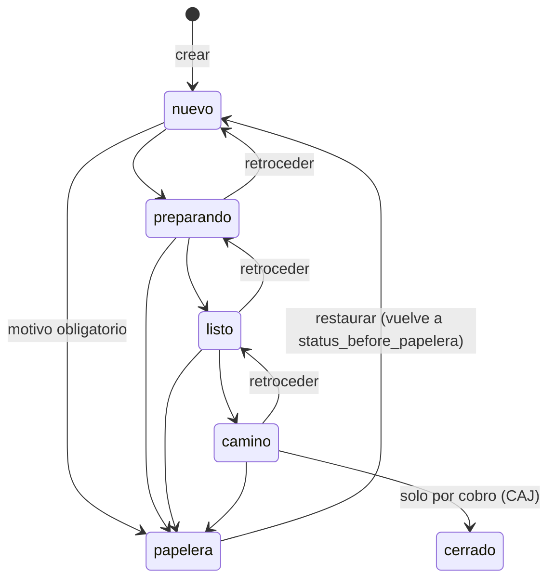

# ORD — Pedidos

> Ciclo de vida del pedido hecho por el personal: crear, editar, numerar, mover por el tablero, mandar a papelera y restaurar, con su historial y observaciones. Lo usan el encargado y el administrador; el domiciliario solo lo mira.

## 1. Negocio

**Propósito.** Que cada pedido del día tenga un número propio, un estado visible en el tablero y un rastro de quién cambió qué. El pedido se puede abrir incompleto (sin dirección, sin domiciliario, sin método de pago) y solo se exige completo al cobrarlo (`modulos/CAJ.md`). Lo que no vive aquí: el cobro, el crédito, el cierre y el congelamiento del día (**CAJ**), el pedido que arma el cliente en el formulario (**FRM**), "Tomar lista" (**IA**), la factura (**FAC**), los chats y tickets (**INB**, **WPP**).

**Permisos.** Filas "Ver tablero, tickets, pedidos…", "Crear/editar pedidos, mover estado, papelera, restaurar", "Observaciones en pedidos" y "Editar un pedido ya bloqueado" de `01-funcional/actores-y-permisos.md`. Lo que esa tabla no dice, verificado en `orders.ts`:
- Leer (`GET /`, `GET /:id`) lo puede cualquier rol autenticado; crear, editar, mover, restaurar y las tres rutas de observaciones exigen `admin` o `encargado` (`dev` pasa todo). El domiciliario recibe 403.
- La interfaz **difiere** de la API para el domiciliario: ver PREG-012.
- Editar un pedido bloqueado: solo admin/dev. Mover de estado y mandar a papelera **no** tienen esa excepción: un pedido bloqueado da `ORDER_LOCKED` también al admin.

**Estados y movimientos.**

La API acepta pasar de cualquier estado a cualquiera de `nuevo`, `preparando`, `listo`, `camino` o `papelera`, sin exigir orden; el orden y los saltos de una columna los impone la interfaz. `cerrado` solo se alcanza con el cobro. `entregado` es heredado: ya no se puede asignar, el pedido que lo tenga lo conserva y el tablero lo muestra en la columna "En camino" (su detalle sigue diciendo "Entregado").

**Reglas.**

*Numeración*

- **RN-ORD-01 — Un número por organización y día.** Siempre `Order.num` es único por `(org_id, num, fecha)`, de tres dígitos con ceros (`001`, `002`…). *(plataforma, código)*
- **RN-ORD-02 — Menor número libre, no máximo + 1.** CUANDO se crea un pedido, el sistema DEBE asignar el menor entero positivo que no esté usado ese día (rellena huecos). Cuenta todos los pedidos del día, también los de papelera: el número de un pedido a papelera no se reutiliza. *Por qué:* hoy un hueco solo aparece por casos raros, ya que el pedido pospuesto se renumera (RN-CAJ-16); se conserva la regla general porque cuesta lo mismo. *(plataforma, código; el porqué, inferido)*
- **RN-ORD-03 — Candado por día.** Siempre la lectura de números usados y el insert van dentro de una transacción con `pg_advisory_xact_lock` sobre `org_id:fecha`. El mismo candado lo toman la creación por formulario (FRM) y el pase a mañana del cierre (CAJ), porque comparten el espacio de números. El candado se libera solo al terminar la transacción. *Por qué:* sin él, dos creaciones simultáneas leían el mismo hueco y agotaban los reintentos (lo reprodujo una prueba de concurrencia). *(plataforma, código; porqué, inferido)*
- **RN-ORD-04 — Reintento solo como respaldo.** Si aun así choca el índice único (`P2002`), el sistema DEBE reintentar hasta 5 veces probando cada vez un candidato distinto; al quinto fallo propaga el error. *(plataforma, código)*

*Ítems*

- **RN-ORD-05 — El precio es el total de la línea.** Siempre `OrderItem.price` es el total de esa línea, no el precio por unidad; el total del pedido es la suma y no se guarda (`00-principios.md`, principio 3). `price` va de 0 a 9.999.999; $0 es válido (producto agotado, o pedido completamente agotado). *(plataforma, código)*
- **RN-ORD-06 — Cantidad en texto libre.** `quantity_label` es texto libre de hasta 100 caracteres ("una papa mediana", "10 Kilo"). Un pedido lleva de 1 a 100 ítems; sin ítems no se crea ni se guarda. *(plataforma, código)*
- **RN-ORD-07 — Banderas de origen que el personal no cambia.** `added_by_client` (el cliente agregó o cambió la línea desde el formulario) y `ai_unmatched` (la IA no la ligó a un producto del catálogo) viajan de ida y vuelta en cada guardado; la interfaz no tiene forma de apagarlas. *(plataforma, código)*
- **RN-ORD-08 — Guardar reemplaza todos los ítems.** CUANDO se guarda un pedido con la lista de ítems, el sistema DEBE borrar todas las líneas y volver a crearlas. Si no se envía `items`, no se tocan. *(plataforma, código)*
- **RN-ORD-09 — El historial de ítems compara por nombre.** CUANDO se reemplazan los ítems, el sistema DEBE registrar `producto_eliminado` por cada `product_name` que ya no está, `producto_agregado` por cada nombre nuevo y `producto_modificado` por cada nombre que sigue pero cambió de cantidad o de precio, con "Estado al …: <estado>" en las notas. Ver PREG-013. *(plataforma, código)*

*Crear y editar*

- **RN-ORD-10 — Datos mínimos al crear.** Solo el nombre del cliente y al menos un ítem son obligatorios. Sin dirección se guarda el texto "Pendiente de confirmar" (el mismo que pone el formulario y que el cobro rechaza). `channel` es `whatsapp` por defecto o `call`; `payment_method` es `sin_asignar` por defecto. *(plataforma, código)*
- **RN-ORD-11 — Teléfono tomado del ticket.** CUANDO el pedido se crea con `ticket_id`, el sistema DEBE ignorar el `customer_phone` enviado y usar el teléfono del ticket. Además guarda `client_contact_name` como foto del nombre que tenía el ticket (si no tenía, el nombre escrito). Un `ticket_id` o `employee_id` de otra organización da 400 `VALIDATION_ERROR` ("Ticket no encontrado" / "Domiciliario no encontrado"). *(plataforma, código)*
- **RN-ORD-12 — Cuándo se puede cambiar el teléfono.** CUANDO se edita un pedido, `customer_phone` solo se acepta si el pedido no tiene ticket o si su ticket no tiene teléfono real (`no_wpp_number`, o un BSUID con forma `XX.alfanumérico`); en cualquier otro caso se descarta en silencio. *Por qué:* un pedido sin teléfono no se podía cobrar nunca. *(plataforma, código)*
- **RN-ORD-13 — Día cerrado y pedido bloqueado.** Crear en un día con `DailyClose`, o editar/mover un pedido de ese día, responde 409 `DAY_CLOSED` (ni admin lo evita; regla de **CAJ**, RN-CAJ-21). Editar un pedido `locked` responde 409 `ORDER_LOCKED` salvo para admin/dev; la guarda se repite dentro del propio `UPDATE` para que un cobro simultáneo no se cuele. Mover de estado revisa `locked` antes que el día cerrado. *(plataforma, código)*
- **RN-ORD-14 — Cobro en casa se valida al guardar.** `amount_received` y `cod_choice` solo valen con `payment_method = 'cod'`, viajan juntos y cumplen las reglas de RN-CAJ-05; aquí se aplican al crear y al editar con el total vigente. *(plataforma, código)*
- **RN-ORD-15 — `client_modified` es permanente.** Siempre un guardado del personal deja `client_modified` como estaba; nunca lo apaga, igual que `added_by_client`. *Por qué:* el aviso de "el cliente tocó este pedido" debe verse mientras el pedido exista (commit 35f2e40). *(plataforma, código; porqué, inferido)*
- **RN-ORD-16 — Editar revoca las facturas enviadas.** CUANDO se guarda un pedido (`PATCH /:id`), el sistema DEBE marcar `revoked_at` en todos los `InvoiceLink` aún vigentes de ese pedido, porque el PDF es una foto y quedó desactualizado. Para volver a mandarla hay que "Enviar factura" de nuevo (**FAC**). Las observaciones y los cambios de estado no revocan. *(plataforma, código)* *(sin test en orders.test.ts)*
- **RN-ORD-17 — `fecha` por omisión.** Si no se envía `fecha`, crear y listar usan la fecha UTC del servidor. El cliente web siempre la envía. Ver PREG-015. *(plataforma, código)*

*Papelera y restaurar*

- **RN-ORD-18 — Papelera exige motivo.** CUANDO se pasa un pedido a `papelera`, el sistema DEBE exigir `reason` (1 a 500 caracteres, sin espacios sobrantes); sin él, 400 `REASON_REQUIRED`. Guarda `papelera_reason`, `papelera_by` y `status_before_papelera`, escribe historial `enviado_papelera` y crea una observación "Enviado a papelera: <motivo>" a nombre de quien lo hizo. *(plataforma, código)* *(sin test)*
- **RN-ORD-19 — La papelera no quita el pedido del tablero.** El pedido en papelera sigue dibujado, congelado y en rojo, en la columna de `status_before_papelera` ("Enviado a papelera por …"); no se arrastra ni se mueve. *(plataforma, código)*
- **RN-ORD-20 — Restaurar.** CUANDO se restaura, el sistema DEBE: si estaba en papelera, devolver el estado de `status_before_papelera` (o `nuevo` si falta) y limpiar motivo, autor y estado previo; y en cualquier caso apagar `client_deleted`. Si no está en papelera ni eliminado por el cliente, 400 `NOT_DELETED`. Deja historial `restaurado` (el motivo original queda en sus notas). Emite `order:updated` y, si salió de papelera, `order:moved`. Ver PREG-004. *(plataforma, código)* *(sin test)*
- **RN-ORD-21 — Eliminado por el cliente.** El cliente que borra su pedido desde el formulario no cambia su estado; queda `client_deleted`, se pinta en rojo y congelado, y el modal ofrece "Restaurar pedido" o "Mantener eliminado" (esto último solo cierra el aviso, sin llamar a la API). El borrado lo documenta **FRM**. *(plataforma, código)*

*Observaciones*

- **RN-ORD-22 — Siempre se pueden agregar.** Agregar, editar y borrar observaciones no pasa por `DAY_CLOSED` ni `ORDER_LOCKED`: sirven en pedidos cerrados y en días cerrados. *Por qué:* es la única forma de dejar constancia de lo que pasa después del cierre. *(plataforma, código)*
- **RN-ORD-23 — Solo el autor edita o borra.** Editar o borrar una observación que no es del propio usuario responde 403 `NOT_AUTHOR`, sin excepción para admin. Editar con el mismo texto es 400. Texto de 1 a 1000 caracteres. Cada alta, edición y borrado deja historial (`observacion`, `observacion_editada`, `observacion_borrada`). El motivo de papelera es una observación como cualquier otra. *(plataforma, código)*

*Historial*

- **RN-ORD-24 — Historial inmutable.** Siempre `OrderHistory` es solo-añadir: dos reglas de PostgreSQL (`DO INSTEAD NOTHING`) convierten UPDATE y DELETE en no-operaciones silenciosas (migración `20260628023857_add_order_history_immutability`). Un pedido con historial no se puede borrar. *(plataforma, código)*
- **RN-ORD-25 — Qué queda registrado.** Al crear: `create` más un `producto_agregado` por ítem y, si hay cobro en casa, "Pago en efectivo". Al editar: nombre, teléfono, dirección, método de pago, domiciliario, notas, ítems (RN-ORD-09) y "Pago en efectivo", cada uno con valor antes/después; si el pedido estaba bloqueado, la nota dice "Editado después de cerrado (estado: …)". El método de pago se escribe "Efectivo" para `cash` (la interfaz dice "Pagado en tienda"). El historial de creación se escribe fuera de la transacción del pedido. *(plataforma, código)*
- **RN-ORD-26 — Quién ve el historial.** `GET /:id` devuelve `history` solo a admin y dev; al encargado y al domiciliario no. Todos reciben dos banderas derivadas, `address_changed_by_client` y `payment_changed_by_client`: verdaderas si la última entrada de historial de "Dirección" / "Método de pago" tiene "formulario" en sus notas. Una edición del personal posterior las apaga. El navegador reemplaza el pedido en caché con lo que emite `order:updated`: editar y las tres rutas de observaciones incluyen las banderas; cambio de estado y restaurar no las incluyen (ver PREG-019). *(plataforma, código)*

*Consulta del día*

- **RN-ORD-27 — Qué devuelve `GET /orders?fecha=`.** Los pedidos de la organización cuya `fecha` coincide, más los que tienen en `notes` el marcador `pasado_manana:<fecha>` (los "fantasmas" que el cierre dejó en el día de origen, RN-CAJ-17), ordenados por `order_hour` ascendente. Nunca de otra organización. *(plataforma, código)*

*Tablero (`Swimlane`)*

- **RN-ORD-28 — Columnas.** El tablero tiene una fila por ticket del día con columnas Nuevo, Preparando, Listo, En camino y Cerrado (`STATUS_ORDER`). *(plataforma, código)*
- **RN-ORD-29 — Reglas de arrastre.** El pedido solo se arrastra dentro de la fila de su propio cliente. No se mueve ni se arrastra si: el día está cerrado, es fantasma, está `locked`, está en papelera o lo eliminó el cliente. Soltar en "Cerrado" no cambia el estado: abre el cobro directo (**CAJ**). Los botones ◀ ▶ de la tarjeta siguen las mismas condiciones. *(plataforma, código)*
- **RN-ORD-30 — Zona roja.** Solo al mirar el día de hoy: un ticket sin pedido entra en zona roja pasados **20 minutos** desde `created_at` del ticket; un ticket con algún pedido abierto (no pagado, no `cerrado`, no papelera, no eliminado por el cliente) entra de inmediato, sin esperar. El contador se refresca cada 30 s. Ver PREG-016. *(plataforma, código)*
- **RN-ORD-31 — Fantasma y "Pospuesto".** Una tarjeta cuyo `notes` trae el marcador de la fecha que se está viendo es **fantasma**: atenuada, no interactiva y con la etiqueta "Pospuesto" (y "(#viejo)" junto al número). La que llegó a su fecha actual desde un pase a mañana lleva la misma etiqueta pero es normal. Otras señales: campana roja si `client_modified`, y etiquetas "Formulario" / "Encargado" según `source`. *(plataforma, código)*

*Ventanas (`DetallePedidoModal`, `NuevoPedidoModal`)*

- **RN-ORD-32 — Solo lectura.** El detalle es de solo lectura si: está bloqueado y el usuario no es admin/dev, o el día está cerrado, o está en papelera, o lo eliminó el cliente. En solo lectura se deshabilitan los campos y desaparecen Guardar, Mover y Papelera; las observaciones siguen disponibles. "Mover pedido" y "Papelera" además se ocultan en cualquier pedido bloqueado, también para admin (la API los rechaza). *(plataforma, código)*
- **RN-ORD-33 — Día pasado.** `isPastDay` es verdadero si la fecha del pedido es anterior a hoy o si el día está cerrado. Entonces el chat embebido deshabilita enviar datos de la cuenta, enviar y bloquear el link del formulario y enviar catálogo (el link ya caducó). El formulario del pedido en sí no depende de `isPastDay`. *(plataforma, código)*
- **RN-ORD-34 — Pedido nuevo siempre desde un ticket.** `NuevoPedidoModal` exige `ticketId` ("El pedido debe crearse desde un ticket de WhatsApp"), el teléfono se muestra deshabilitado, la dirección es opcional, y el cobro en casa puede quedar sin elegir. Antes de enviar confirma la fila de producto que quedó a medio escribir. Ver PREG-014. *(plataforma, código)*
- **RN-ORD-35 — Teclado.** En ambas ventanas las flechas ↑↓ recorren nombre → dirección → pago/domiciliario → buscador del catálogo → productos → observación → historial → botones de acción; ←→ van entre pago y domiciliario y entre botones; Enter confirma una fila de producto (nombre → cantidad → precio → siguiente fila) y Escape cancela su edición. Guardar queda deshabilitado sin cambios o con un precio negativo. *(plataforma, código)* *(sin test)*

*Tiempo real*

- **RN-ORD-36 — Eventos.** CUANDO se crea un pedido, se emite `order:created` a la sala `org:<id>`; al editar, tocar observaciones o restaurar, `order:updated` con el pedido completo; al mover de estado, `order:moved` (`orderId`, `newStatus`) seguido de `order:updated`. El navegador reacciona recargando pedidos, tickets e informe del día; los eventos de cobro (`order:paid`) son de **CAJ**. *(plataforma, código)*
- **RN-ORD-37 — Caché del tablero tras cada cambio.** Crear, editar, mover y cobrar un pedido invalidan la consulta del tablero (`orders`) y también la de los chats (`ticket`; al crear, además `tickets`), para que reabrir un chat enseguida no muestre la lista vieja. Mover una tarjeta es optimista: la columna cambia al soltarla y se revierte si la API falla. *(plataforma, código)*
- **RN-ORD-38 — Tabla de historial y selector de fecha.** `HistoryTable` es la misma tabla en el detalle del pedido y en el informe (con columna "Pedido" solo en el informe): traduce los valores internos a texto (`cod` → "Cobro en casa", `cash` → "Pagado en tienda", `transfer` → "Transferencia", estados y canal), pinta en rojo "producto eliminado" y en verde "producto agregado", y muestra "Cliente" como autor cuando la nota contiene "formulario" (el `actor_id` es quien envió el link, no el cliente) y "Sistema" si no hay autor. Las horas van en `America/Bogota`. `DatePickerES` es el calendario en español que sustituye al nativo (el nativo muestra los textos en el idioma del navegador): botón "Hoy", ventana ajustada al ancho de pantalla; lo usan el tablero, el informe y la búsqueda de chats. *(plataforma, código)*

**Textos que ve el cliente final.** Ninguno: crear, editar, mover o restaurar un pedido no manda mensajes por WhatsApp. El cliente solo ve el estado de su pedido si abre su link de formulario (**FRM**).

## 2. Técnico

**Mapa de código.**

| Parte | Dónde |
|---|---|
| API | `apps/api/src/routes/orders.ts › POST /, GET /, GET /:id, PATCH /:id, PATCH /:id/status, PATCH /:id/restore, rutas /:id/observations` |
| Numeración | `apps/api/src/lib/orderNumbering.ts › createOrderWithRetryNum, acquireDayLock, dayLockKey` |
| Banderas del cliente | `apps/api/src/lib/clientChangedFlags.ts › clientChangedFlags` |
| Web | `apps/web/src/components/orders/Swimlane.tsx`, `modals/DetallePedidoModal.tsx`, `modals/NuevoPedidoModal.tsx`, `orders/ProductSearch.tsx`, `hooks/useOrders.ts`, `pages/MainPage.tsx` (sockets) |
| Datos | `Order`, `OrderItem`, `OrderObservation`, `OrderHistory`, `InvoiceLink` |

`orders.ts` también aloja `POST /:id/cobro`, `PATCH /:id/credito-pagado` y `PATCH /:id/cobro-retroactivo`, documentados en **CAJ**.

**Regla → dónde se hace cumplir → test.**

| Regla | Se hace cumplir en | Test |
|---|---|---|
| RN-ORD-01/02 | `orderNumbering.ts › createOrderWithRetryNum` + `@@unique([org_id, num, fecha])` | `orderNumbering.test.ts › "fills 1, 2, 3... on a fresh day with nothing carried in"`, `"multiple gaps (13 and 24 both carried in) fill 1-12, then 14-23, then 25 - never touching 13 or 24"` |
| RN-ORD-03/04 | `acquireDayLock`; bucle de `MAX_ATTEMPTS = 5` | `orderNumbering.test.ts › "concurrent order creation on the same day never produces a duplicate or crossed number"` |
| RN-ORD-05 ($0) | `orderItemSchema`; cobro | `orders.test.ts › "POST /orders/:id/cobro closes fine with a $0 item (agotado/out of stock) mixed in - $0 is a real, final price, never treated as \"still needs pricing\""` |
| RN-ORD-07/08 | `orderItemSchema`; `PATCH /:id` (`deleteMany` + `createMany`) | *(sin test directo)* |
| RN-ORD-09 | `PATCH /:id` (diff por `product_name`) | `orders.test.ts › "PATCH /orders/:id with a changed items list logs producto_agregado/producto_eliminado/producto_modificado in OrderHistory"` |
| RN-ORD-10 | `createOrderSchema`; `POST /` | `orders.test.ts › "creates an order with no address -> 201 with a placeholder - address is only required to close (cobro), not to open a pedido"`, `"creates an order as encargado -> 201, with sequential num"` |
| RN-ORD-11 | `POST /` (consulta de ticket y empleado por `org_id`) | *(sin test del teléfono forzado ni de `client_contact_name`)* |
| RN-ORD-12 | `PATCH /:id` (`ticketMissingRealPhone`) | `orders.test.ts › "a ticket-less order (channel \"call\") can have customer_phone set via PATCH - closes the previously-permanent cobro gap"` |
| RN-ORD-13 | `PATCH /:id`, `PATCH /:id/status`, `findDayClose`, `updateMany` con `locked: false` | `orders.test.ts › "encargado (non-admin) trying to change a real field on a locked order -> 409 ORDER_LOCKED"`, `"admin CANNOT edit a locked order once the whole day has been cerrado (caja cerrada) - DAY_CLOSED wins even for admin"`, `"admin CAN fully edit a locked order (day not closed) - not just observacion"` |
| RN-ORD-14 | `validateCodAmount` | `orders.test.ts › "cobro-en-casa: \"completo\" must equal the total exactly, not just be >= it"`, `"cobro-en-casa: amount_received and cod_choice must travel together - one without the other is rejected"` |
| RN-ORD-15 | `PATCH /:id` (no escribe `client_modified`) | *(sin test)* |
| RN-ORD-16 | `PATCH /:id` (`invoiceLink.updateMany`) | *(sin test en orders.test.ts)* |
| RN-ORD-18/19/20/21 | `PATCH /:id/status`, `PATCH /:id/restore`; `Swimlane › effectiveStatus` | *(sin test)* |
| RN-ORD-22/23 | rutas `/:id/observations` | `orders.test.ts › "appends observations in order instead of overwriting, each with its own author"`, `"a DIFFERENT staff member cannot edit someone else's observation -> 403 NOT_AUTHOR, text unchanged"`, `"encargado (non-admin) CAN add an observation on a locked order -> 201, logged to history with their own actor id"` (borrar: *sin test*) |
| RN-ORD-24 | reglas SQL de la migración | *(sin test directo)* |
| RN-ORD-25 | `POST /`, `PATCH /:id` | `orders.test.ts › "PATCH /orders/:id/status -> 200, creates an OrderHistory entry with correct value_before/value_after"`, `"cobro-en-casa: choosing/changing completo-vuelta is recorded in order history, same as any other field edit"` |
| RN-ORD-26 | `buildOrderSelect(includeHistory)`, `clientChangedFlags` | `orders.test.ts › "PATCH /orders/:id with a changed items list logs …"` (comprueba `history` para admin, ausente para encargado y `address_changed_by_client` booleano) |
| RN-ORD-27 | `GET /` | `orders.test.ts › "GET /orders?fecha=X only returns orders for the requesting user org (multi-tenant isolation)"`; el marcador: `cierre.test.ts › "moving a pending order to \"manana\" moves its fecha to tomorrow and PRESERVES original notes with the pasado_manana marker appended (B3 fix)"` (no prueba el fantasma en `GET`) |
| RN-ORD-28 a 35 | `Swimlane.tsx`, `DetallePedidoModal.tsx`, `NuevoPedidoModal.tsx`, `ProductSearch.tsx` | *(sin test; la web no tiene pruebas de estos componentes)* |
| Permisos de API | `requireRole('admin','encargado')` | `orders.test.ts › "forbids creating an order as domiciliario -> 403"` |
| RN-ORD-36 | `fastify.io.to('org:<id>').emit(…)` | *(sin test)* |
| RN-ORD-37 | web `hooks/useOrders.ts` (`useCreateOrder`, `usePatchOrder`, `useMoveOrder`, `useCobroOrder`) | *(sin test)* |
| RN-ORD-38 | web `ui/HistoryTable.tsx`, `ui/DatePickerES.tsx` | *(sin test)* |

`tickets.test.ts` (`"a returning customer (old created_at, fresh first_message_today_at) sorts by when they FIRST wrote TODAY…"`, `"a ticket that already wrote earlier today stays ahead of a newer arrival…"`) prueba el orden de `GET /tickets`, que determina el orden de las filas del tablero; el comportamiento pertenece a **INB**.

**Datos y eventos socket.** Lee y escribe `Order`, `OrderItem`, `OrderObservation`, `OrderHistory`; revoca `InvoiceLink`. Eventos: `order:created`, `order:updated`, `order:moved` (esta ruta); `order:paid` (CAJ). `PATCH /tickets/:id` (renombrar) emite además un `order:updated` parcial `{ id }` por pedido del ticket, por lo que el navegador debe recargar en vez de fusionar. El nombre del cliente y el `client_contact_name` son datos personales: se anonimizan al borrar los datos del cliente (**INB**).

**Transacciones y concurrencia.** Crear: transacción con candado por día (RN-ORD-03); el historial de creación se escribe después, en llamadas separadas. Editar: ítems, `updateMany` con guarda de `locked` e historial en una transacción; el historial de campos se calcula **antes** de la transacción con el pedido leído antes, así que dos ediciones simultáneas del mismo pedido pueden registrar diffs contra un estado ya viejo (PREG-017). Cambio de estado y restaurar: `update` por id sin guarda atómica de `locked`/día cerrado (un cobro simultáneo puede ganarle).

**Códigos de error propios.** `VALIDATION_ERROR` (400, con mensaje "Revisa: falta dirección, …" que nombra el campo), `REASON_REQUIRED` (400), `NOT_DELETED` (400), `NOT_AUTHOR` (403), `NOT_FOUND` (404), `ORDER_LOCKED` (409), `DAY_CLOSED` (409). `FORBIDDEN` (403) lo da el middleware de roles.

**Si tocas X, revisa Y.**
- Cambiar el formato de `num` o su relleno: `cierre.ts` (renumerado a mañana), `public.ts` (creación por formulario) y el marcador `pasado_manana:<fecha>:<num>` que lee `Swimlane`.
- Cambiar el marcador `pasado_manana:` en `notes`: `GET /orders`, `cierre.ts`, `Swimlane`, `DetallePedidoModal`.
- Cambiar los textos de historial "Dirección" / "Método de pago" o la palabra "formulario" en sus notas: `clientChangedFlags` (y `public.ts`, que escribe esas notas).
- Cambiar `STATUS_ORDER` o los estados aceptados: el `z.enum` de `PATCH /:id/status`, `effectiveStatus`, el informe del día (**DSH**) y el cierre (**CAJ**).
- Cambiar quién puede ver el historial: el detalle y `canManage` en `DetallePedidoModal`.
- Agregar un campo editable al pedido: `updateOrderSchema`, `trackFields` (para que quede en el historial) y el payload de guardado del modal.

## 3. Pendientes

IDs globales; resumen en `03-plan/preguntas-abiertas.md` y `03-plan/problemas-conocidos.md`. El texto completo vive aquí.

- **PREG-012 — El domiciliario ve botones que la API rechaza.** Verificado: `DetallePedidoModal` solo usa `canManage` para Papelera, Restaurar y el historial; Guardar, "Mover pedido" y "Guardar observación" salen para cualquier rol en un pedido abierto (`readOnly` no mira el rol), igual que ◀ ▶ y el arrastre en `Swimlane`, que no consulta el rol. La API responde 403 a todos. ¿Se ocultan para el domiciliario?
- **PREG-013 — Los ítems se identifican por `product_name`.** Dos líneas con el mismo nombre se confunden en el historial (no hay id de línea ni `product_id`), y renombrar una línea se registra como "eliminado + agregado". `ProductSearch` también sustituye la línea al re-confirmar un producto del catálogo con el mismo nombre. ¿Es intencional?
- **PREG-014 — Ninguna interfaz crea pedidos `channel = 'call'`.** `NuevoPedidoModal` exige `ticketId` y nunca envía `channel`; solo la API acepta `call`. El detalle sí muestra "Llamada" y permite editar el teléfono de un pedido sin ticket. ¿Se mantiene el canal `call` y su carril sin ticket, o es código heredado?
- **PREG-015 — Fecha por omisión en UTC.** `GET /` y `POST /` toman `new Date().toISOString()` (UTC) cuando no llega `fecha`; los principios fijan el día de negocio en Bogotá (UTC−5). Entre 19:00 y 23:59 de Bogotá, "hoy" por omisión sería el día siguiente. La web siempre envía `fecha`, así que hoy solo afecta a llamadas directas a la API. Además, una `fecha` con formato inválido no se valida (`z.string()`) y llega a Prisma.
- **PREG-004 — Restaurar y cambiar estado sin guardas de día/bloqueo.** `PATCH /:id/restore` no revisa `DAY_CLOSED` ni `locked`, por lo que un pedido en papelera de un día ya cerrado se puede restaurar. Y `PATCH /:id/status` acepta sacar un pedido de `papelera` con un estado normal sin limpiar `papelera_reason`, `papelera_by` ni `status_before_papelera` (la interfaz lo impide, la API no). ¿Debe restaurar respetar el día cerrado?
- **PREG-016 — La zona roja de un ticket sin pedido usa `created_at` del ticket.** El ticket es uno por teléfono para siempre, así que para un cliente recurrente que escribe hoy sin pedir, `minsSinceDate(created_at)` ya pasó los 20 minutos de inmediato; el orden de las filas, en cambio, usa `first_message_today_at` (`tickets.test.ts`). ¿La regla de 20 minutos debe contar desde el primer mensaje de hoy?
- **PREG-017 — Dos ediciones simultáneas del mismo pedido.** El diff del historial se calcula con una lectura previa y fuera de la transacción; la segunda edición gana en los datos, pero su historial puede describir un "antes" que ya no era el real. Lo mismo con cambios de estado concurrentes (sin guarda de versión).
- **PREG-018 — El marcador `pasado_manana:` vive en `notes`, que el personal edita.** `GET /orders` busca el texto con `contains`, así que un texto igual escrito a mano por el personal crearía un fantasma en el día que nombre. ¿Se protege o se guarda en su propio campo?
- **PREG-012 (parte 2) — Observaciones visibles al domiciliario.** El área de observaciones del modal no depende del rol, pero las tres rutas exigen admin/encargado (la matriz también dice que el domiciliario no las usa). Es la misma divergencia que PREG-012, aparte para no perderla.
- **PREG-019 — `order:updated` sin banderas en estado y restaurar.** `PATCH /:id/status` y `PATCH /:id/restore` emiten el pedido sin `address_changed_by_client` / `payment_changed_by_client`, a diferencia de editar y observaciones; si el navegador reemplaza el pedido completo, una etiqueta "cambió el cliente" visible podría desaparecer. Verificado solo en la API; no se probó el efecto en el navegador. ¿Deben incluirlas?
- **DT-007 — `quantity_value` y `quantity_unit` sin uso.** Existen en `OrderItem` y en `packages/shared/src/types/order.types.ts`, pero ni la API ni la web los leen ni escriben; la cantidad real es `quantity_label` (texto libre). Verificado por búsqueda en `apps/api/src`, `apps/web/src`.
- **DT-008 — Faltan pruebas de papelera, restaurar, borrar observación, revocación de facturas al editar, `client_contact_name`, teléfono forzado desde el ticket y fantasma en `GET /orders`.** Sin test de ninguna de las pantallas del tablero y los modales.
- **DT-009 — Comentario desactualizado en `orderNumbering.test.ts`.** Su cabecera dice que el pedido pospuesto "conserva su num original"; desde el commit a4bbc58 se renumera.

Relacionados: `modulos/CAJ.md` (cobro, cierre, congelamiento, renumerado), `modulos/FRM.md` (pedido del cliente, `client_deleted`), `modulos/IA.md` ("Tomar lista", `ai_unmatched`), `modulos/FAC.md` (facturas), `modulos/INB.md` y `modulos/WPP.md` (tickets y chat), `modulos/DSH.md` (informe del día).
